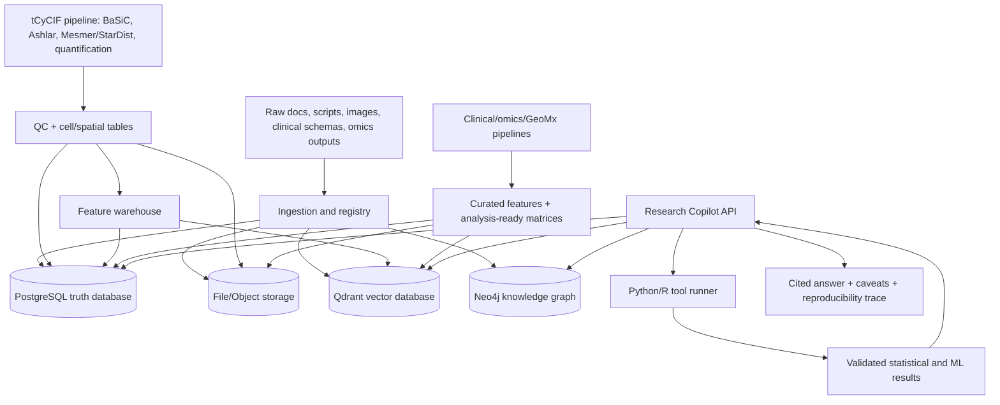

# 00 — Executive Summary

## Platform goal

Build a research-grade AI system for ovarian/cancer spatial biology that can integrate:

- tCyCIF/CycIF image-processing outputs
- segmentation masks and per-cell quantification
- spatial features and cell-cell interaction metrics
- GeoMx/spatial transcriptomics
- WES/WGS/RNA/scRNA/CosMx/Xenium-style outputs
- curated clinical metadata and outcomes
- protocols, SOPs, scripts, GitHub docs, project logs, publications
- public validation resources
- a controlled LLM research-copilot layer

The target is **one assistant interface**, not one giant model. Behind the interface should be multiple expert modules: image, spatial, clinical, omics, literature, knowledge graph, statistics, and ML.

## Correct mental model

A 600-patient well-annotated cancer cohort can be excellent for biomarker discovery, cohort analysis, survival modelling, spatial biology, and ML validation. It is not enough to train a foundation model from scratch. Use the cohort as structured evidence, not as raw material for a giant LLM.

## Architecture in one diagram



## First vertical slice

Start with documentation and scripts only, then add synthetic data, then one de-identified project.

Recommended first vertical slice:

```text
SPACE or EyeMT-style project
 + project docs
 + image-processing pipeline scripts
 + SPACEstat/Tribus/GeoMx/clinical curation docs
 + mature schema
 + vector search
 + synthetic sample/feature data
 + first five research questions
```

## First five research-copilot questions

1. What is the end-to-end tCyCIF image-processing pipeline?
2. Which scripts and outputs are used for segmentation, quantification, filtering, and spatial analysis?
3. Which projects combine tCyCIF, GeoMx, and genomics?
4. What caveats exist around ROI/community matching or sample QC?
5. Using synthetic/de-identified features, find samples similar to a given sample.

## Non-negotiable AI guardrails

The LLM may explain and synthesize. It must not invent:

- p-values
- hazard ratios
- survival results
- differential expression
- model metrics
- cohort counts
- marker thresholds
- genomic calls

Those must come from versioned tools and stored analysis runs.
