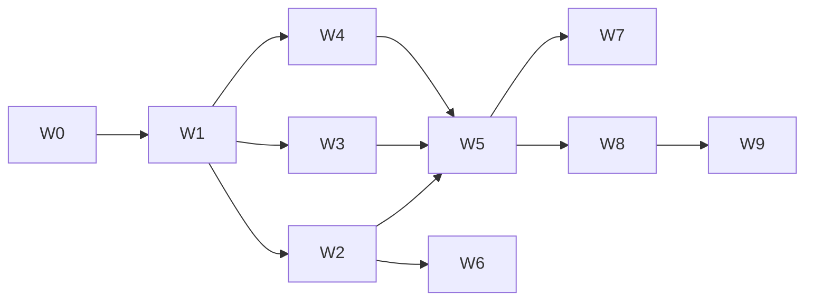

# 15 — Storage architecture master plan

**Scope:** OMEIA Lab Assistant Platform (`farkki_ai_platform_blueprint`)  
**Mandate:** No active Cloudflare R2. Production stack: **DataCloud WebDAV** (primary) → **P-drive mount** (secondary) → **Supabase Postgres** (metadata) → **Supabase Storage** (optional small files).

## Workstreams

| # | Workstream | Owner | Depends on | Deliverable |
|---|------------|-------|------------|-------------|
| W0 | Master plan | Agent | — | This document |
| W1 | R2 audit & deprecation | Agent | W0 | `docs/15_STORAGE_CLOUDFLARE_REMOVAL_AUDIT.md` |
| W2 | DataCloud connector | Agent + user creds | W1 | `configs/DATACLOUD_WEBDAV_SETUP.md`, `omeia/storage/datacloud_webdav.py` |
| W3 | P-drive connector | Agent + user mount | W1 | `configs/PDRIVE_SETUP.md`, `omeia/storage/pdrive_smb.py` |
| W4 | Supabase schema & registry docs | Agent | W1 | `sql/117_storage_architecture.sql`, `docs/19–20` |
| W5 | Connector design & ingestion | Agent | W2–W4 | `docs/16–17`, `omeia/storage/ingestion.py` |
| W6 | Folder validation & safety | Agent + user tree | W2 | `docs/18`, `docs/22` |
| W7 | Page mapping & workers | Agent | W4–W5 | `docs/21`, `docs/23` |
| W8 | UI & API wiring | Agent | W2–W3 | Data & Storage, Administration, `connector_status.py` |
| W9 | Verify | Agent | W8 | `pytest tests/test_lab_storage_api.py` |

## Dependency graph

## Auth & access flow (production)

1. **Frontend** calls API with Firebase ID token (when `PLATFORM_AUTH_DISABLED=false`).
2. **Backend** verifies token → checks `platform.allowed_email` / Supabase permissions.
3. **Connector** runs server-side (WebDAV or mount); response contains **logical paths only**.

See `docs/22_STORAGE_SAFETY_PERMISSIONS.md`.

## Deliverable checklist

- [x] `docs/15_STORAGE_MASTER_PLAN.md` (this file)
- [x] `docs/15_STORAGE_CLOUDFLARE_REMOVAL_AUDIT.md`
- [x] `configs/DATACLOUD_WEBDAV_SETUP.md`
- [x] `configs/PDRIVE_SETUP.md`
- [x] `configs/.env.example` (canonical env names; no R2)
- [x] `sql/117_storage_architecture.sql`
- [x] `docs/16_STORAGE_CONNECTOR_DESIGN.md`
- [x] `docs/17_STORAGE_INGESTION_WORKFLOW.md`
- [x] `docs/18_DATACLOUD_FOLDER_VALIDATION.md`
- [x] `docs/19_ASSET_REGISTRY_SCHEMA.md`
- [x] `docs/20_DOCUMENT_REGISTRY_SCHEMA.md`
- [x] `docs/21_PAGE_DOMAIN_MAPPING.md`
- [x] `docs/22_STORAGE_SAFETY_PERMISSIONS.md`
- [x] `docs/23_STORAGE_WORKER_CHECKLIST.md`
- [x] `docs/14_PRODUCTION_DECISIONS.md` (stack pointers)
- [x] Code: `datacloud_webdav.py`, `pdrive_smb.py`, `env.py`, `ingestion.py`, API routes
- [ ] User: `DATACLOUD_USERNAME`, `DATACLOUD_APP_PASSWORD`, `PDRIVE_MOUNT_PATH`, `SUPABASE_DB_PASSWORD`, `SUPABASE_ANON_KEY`

## NEEDS_USER_DECISION (global)

| Field | Why | Safe fallback |
|-------|-----|---------------|
| `DATACLOUD_USERNAME` / `DATACLOUD_APP_PASSWORD` | WebDAV auth | `configured: false`; local `database/` mirror |
| `PDRIVE_MOUNT_PATH` | Secondary imaging | `PDRIVE_ENABLED=false` |
| `SUPABASE_DB_PASSWORD` | Hosted Postgres | `POSTGRES_CONN` local Docker |
| `SUPABASE_ANON_KEY` | Client-side Supabase (if used) | Server uses service role + local DB in dev |
| `FIREBASE_SERVICE_ACCOUNT_PATH` | Production auth | `PLATFORM_AUTH_DISABLED=true` |

## Phase completion criteria

- **Phase 1:** No R2 in active UI or `STORAGE_PROVIDERS`; stub only for audit.
- **Phase 2:** PROPFIND list + scan + manifest + optional download via API.
- **Phase 3:** P-drive scan/manifest when mount exists.
- **Phase 4:** `storage_objects` table + registry docs aligned with `111`–`116`.
- **Phase 5:** Ingestion job records manifest rows in Postgres.
- **Phase 6:** Storage API tests green.
