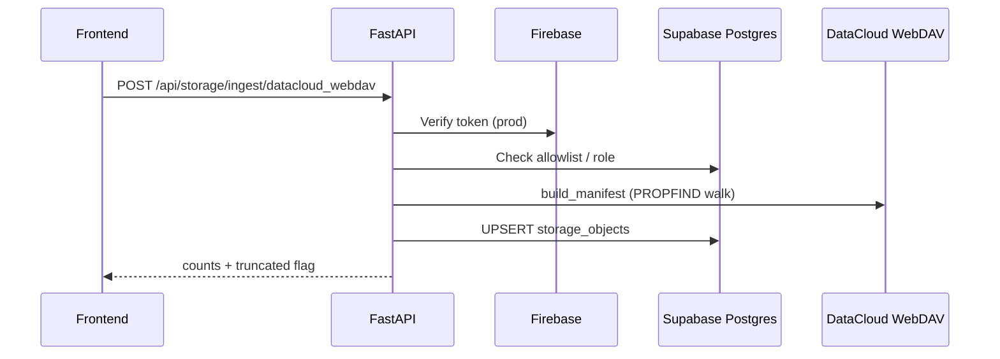

# 17 — Storage ingestion workflow

## Pipeline

## Steps

1. **Scan** — `scan_tree` or `build_manifest` on connector (non-destructive).
2. **Map** — Apply rules in `docs/21_PAGE_DOMAIN_MAPPING.md` (proposal only until reviewed).
3. **Persist metadata** — `platform.storage_objects` via `ingestion.upsert_manifest_rows`.
4. **Vault sync** (separate job) — `POST /api/vault/sync` from local inventory JSON → `raw_asset_vault`.
5. **Review** — Low-confidence rows → `platform.review_task`.

## Job types (`platform.ingestion_job`)

| `job_type` | Trigger |
|------------|---------|
| `storage_scan_datacloud` | Admin or worker cron |
| `storage_scan_pdrive` | When mount available |
| `vault_rebuild` | Local mirror walk |
| `vault_sync` | JSON → Postgres |

## Linking to page domains

After manifest persist, workers set `page_domain_id` / `page_section_id` on vault rows using path prefixes (see doc 21). Conflicts set `needs_user_decision = true` on `storage_objects`.

## NEEDS_USER_DECISION

- Mapping local `database/**` → DataCloud tree before auto-assigning domains.
- Any destructive reconcile (delete stale metadata) — human approval required.
