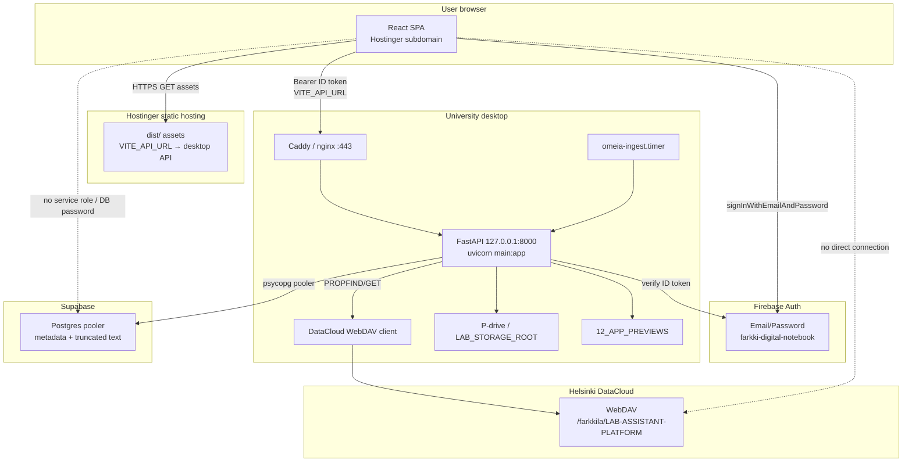

# 26 — Production deployment topology

**Status:** Reference architecture — **Hostinger React + university desktop FastAPI** (not Railway/Render).

**Related:** `docs/27_UNIVERSITY_DESKTOP_BACKEND.md` (install guide), `deploy/university-desktop/README.md`, `configs/DEPLOYMENT_ENV.md`.

---

## What runs where

| Layer | Host | Role | Secrets on host? |
|-------|------|------|------------------|
| **React SPA** | Hostinger (e.g. `app.example.fi`) | UI, Firebase client SDK, HTTPS API calls | **Public only:** `VITE_*` |
| **FastAPI API** | University Linux desktop (e.g. `api.example.fi` via reverse proxy) | Auth verify, WebDAV, ingestion, AI orchestration | **All server secrets** |
| **Postgres metadata** | Supabase (hosted) | Migrations, API, optional document sync | Backend `SUPABASE_*` only |
| **Auth** | Firebase (`farkki-digital-notebook`) | Email/Password + allowlist | Web: `VITE_FIREBASE_*`; Desktop: service account JSON |
| **Research files** | DataCloud WebDAV | Primary blob storage; backend proxies | `DATACLOUD_*` — **desktop only** |
| **Secondary files** | P-drive mount on desktop | Images / legacy paths | `PDRIVE_*`, `LAB_STORAGE_ROOT` |
| **Previews** | `12_APP_PREVIEWS` / local cache | Thumbnail stub; optional R2 doc-only elsewhere | `PREVIEW_CACHE_DIR` on desktop |

**Out of scope for MVP:** Cloudflare R2 as primary preview store (optional documentation only).

### Linux production vs macOS dev testing

| Environment | Host | Install entrypoint |
|-------------|------|-------------------|
| **Production API** | University **Linux** desktop | `deploy/university-desktop/install_desktop_backend.sh` → systemd, ufw, Caddy/nginx |
| **Local / parity testing** | **macOS** (or Linux without systemd) | Same repo; `run_api_dev.sh`, `configs/.env`, `PLATFORM_AUTH_DISABLED=true` |

Production traffic and TLS termination target the Linux path in `docs/27_UNIVERSITY_DESKTOP_BACKEND.md`. Use a Mac only to validate mounts, CORS with `localhost:5173`, and API behavior before cutting over the lab machine.

---

## Architecture diagram



---

## Example hostname layout

| URL | Serves | Notes |
|-----|--------|-------|
| `https://app.example.fi` | React `dist/` | Hostinger; Firebase authorized domain |
| `https://api.example.fi` | FastAPI via reverse proxy | TLS on desktop or tunnel endpoint |
| Supabase project URL | Hosted Postgres | Backend pooler only |
| DataCloud WebDAV | Files | Backend only; users never see app password |

---

## Request flow (authenticated API call)

1. User opens `https://app.example.fi` → Hostinger serves SPA.
2. Firebase Email/Password sign-in → ID token in browser.
3. React: `fetch(\`${VITE_API_URL}/api/...\`, { headers: { Authorization: \`Bearer ${token}\` } })`.
4. Desktop FastAPI: `require_firebase_user` when `PLATFORM_AUTH_DISABLED=false`.
5. Allowlist + Supabase permissions via `postgres_conn()`.
6. Files via DataCloud / P-drive — credentials never leave desktop `.env`.
7. Optional daily `scheduled_ingest.py` (timer) + manual admin sync.

---

## Environment variable matrix

### Hostinger (build-time — `react_frontend/.env.production`)

| Variable | Required prod |
|----------|---------------|
| `VITE_API_URL` | Yes — `https://<desktop-public-host>` |
| `VITE_FIREBASE_*` | Yes — see `configs/FIREBASE_WEB_SETUP.md` |

**Never on Hostinger:** `DATACLOUD_*`, `SUPABASE_SERVICE_ROLE_KEY`, `SUPABASE_DB_PASSWORD`, `FIREBASE_SERVICE_ACCOUNT_PATH`, `POSTGRES_CONN`, `PLATFORM_AUTH_DISABLED`.

### University desktop (`deploy/university-desktop/.env`)

Copy from `deploy/university-desktop/.env.desktop.example`. Full checklist: `configs/DEPLOYMENT_ENV.md`.

| Group | Variables |
|-------|-----------|
| Core | `APP_ENV=production`, `CORS_ORIGINS`, `LOG_LEVEL` |
| Auth | `PLATFORM_AUTH_DISABLED=false`, `FIREBASE_*`, `FIREBASE_SERVICE_ACCOUNT_PATH` |
| Database | `SUPABASE_*`, `SUPABASE_DB_PASSWORD` |
| Files | `DATACLOUD_*`, `PDRIVE_*`, `LAB_STORAGE_ROOT` |
| Sync | `SUPABASE_SYNC_ENABLED`, caps per `docs/25_SUPABASE_SYNC_POLICY.md` |
| Previews | `PREVIEW_CACHE_DIR`, `THUMBNAIL_*` |

---

## CORS

```bash
CORS_ORIGINS=https://app.example.fi
```

Must match the exact Hostinger origin. Restart `omeia-api.service` after changes.

---

## Hostinger static deploy

```bash
cd apps/web
# VITE_API_URL=https://api.example.fi in .env.production
npm ci && npm run build
```

Upload `dist/` contents to document root; SPA fallback via `.htaccess` (see prior Hostinger notes in `configs/DEPLOYMENT_ENV.md`).

---

## Desktop backend deploy (summary)

| Step | Command / file |
|------|----------------|
| Install | `deploy/university-desktop/install_desktop_backend.sh` |
| API service | `systemctl enable --now omeia-api.service` |
| TLS | `Caddyfile.example` or `nginx-omeia.conf.example` |
| Firewall | `ufw-notes.md` |
| Ingest timer | `systemctl enable --now omeia-ingest.timer` |

Health: `GET https://api.example.fi/health` and `GET /api/platform/connectors` (`auth_disabled: false` in prod).

---

## Security checklist

- [ ] No `DATACLOUD_*` or Supabase service role in frontend build
- [ ] `PLATFORM_AUTH_DISABLED=false` on desktop
- [ ] `CORS_ORIGINS` = Hostinger app URL only
- [ ] uvicorn bound to `127.0.0.1:8000`; only 443 public
- [ ] Firebase authorized domain includes app URL
- [ ] DataCloud uses **app password**, not university password

---

## Reference files

| File | Purpose |
|------|---------|
| `deploy/university-desktop/README.md` | Desktop setup steps |
| `docs/27_UNIVERSITY_DESKTOP_BACKEND.md` | Extended desktop guide |
| `configs/DEPLOYMENT_ENV.md` | Env checklist |
| `deploy/university-desktop/.env.desktop.example` | Secret template |

## NEEDS_USER_DECISION

- Public API hostname and TLS method (Caddy vs nginx vs university proxy)
- Hostinger app URL for CORS and Firebase
- Network path from internet to desktop (public IP, VPN, tunnel)
