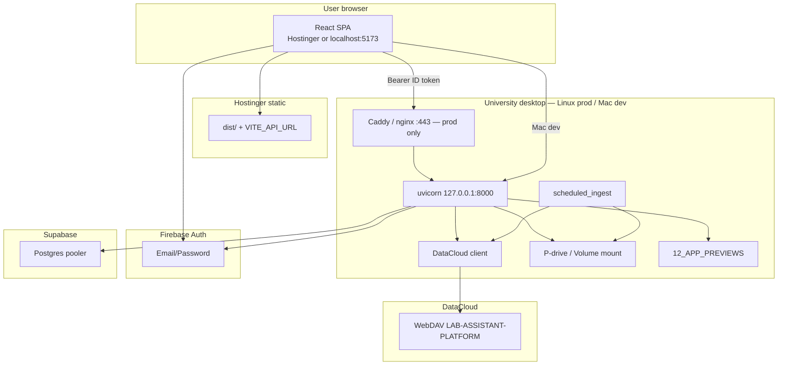

# 27 — macOS & Linux desktop backend

**Status:** Primary production guide for the corrected split stack. **Production:** Linux (systemd). **Dev/test:** macOS (or Linux) with the same FastAPI app and env templates.

**Related:** `deploy/university-desktop/README.md`, `configs/DEPLOYMENT_ENV.md`, `docs/26_PRODUCTION_DEPLOYMENT.md`.

---

## Platform matrix

| | **Linux (production)** | **macOS (dev/test)** |
|--|------------------------|----------------------|
| Process manager | `omeia-api.service`, `omeia-ingest.timer` | `./run_api_dev.sh` or `com.omeia.api.plist` (launchd) |
| API bind | `127.0.0.1:8000` → Caddy/nginx :443 | `127.0.0.1:8000` (default) |
| Env file | `/opt/omeia/deploy/university-desktop/.env` | `configs/.env` from `.env.desktop.example` |
| Auth default | `PLATFORM_AUTH_DISABLED=false` | `PLATFORM_AUTH_DISABLED=true` for local dev |
| CORS | `https://<hostinger-app>` | `http://localhost:5173` + Hostinger URL |
| Mounts | `/mnt/pdrive`, GVFS SMB | `/Volumes/...` |
| Firewall | `ufw` (443 yes, 8000 no) | localhost bind; `pf` optional |

Detect OS: `uname -s` → `Linux` or `Darwin`.

---

## Mandate (no secrets in React)

| Component | Host | Secrets |
|-----------|------|---------|
| React SPA | Hostinger | `VITE_API_URL`, `VITE_FIREBASE_*` only |
| FastAPI | University **Linux** desktop (prod) or **Mac** (dev) | All `DATACLOUD_*`, `SUPABASE_*`, Firebase Admin JSON |
| Postgres / vectors | Supabase free tier | Backend pooler password only |
| Auth | Firebase Email/Password | Web keys in Vite; service account on desktop (prod) |
| Primary blobs | DataCloud WebDAV | Desktop `.env` only |
| Secondary blobs | P-drive / volume mount | `PDRIVE_MOUNT_PATH` |
| Previews | `12_APP_PREVIEWS` / `PREVIEW_CACHE_DIR` | Path API; temp fallback uses OS temp dir |

**CRITICAL:** Never expose DataCloud credentials to React.

---

## Architecture

---

## Install sequence

### Linux (production)

1. `deploy/university-desktop/install_desktop_backend.sh` (installs systemd)
2. Env: `.env.desktop.example` → `/opt/omeia/deploy/university-desktop/.env`
3. `systemctl start omeia-api.service` + `omeia-ingest.timer`
4. TLS: `Caddyfile.example` or `nginx-omeia.conf.example`
5. Firewall: `ufw-notes.md`
6. Hostinger build: `VITE_API_URL=https://<public-api-host>`
7. `CORS_ORIGINS` + Firebase authorized domains = Hostinger URL
8. `PLATFORM_AUTH_DISABLED=false`

### macOS (dev/test)

1. `install_desktop_backend.sh` (venv + `configs/.env` + optional launchd plist)
2. Edit `configs/.env`: `CORS_ORIGINS=http://localhost:5173,...`, `PLATFORM_AUTH_DISABLED=true`
3. `./deploy/university-desktop/run_api_dev.sh`
4. React: `VITE_API_URL=http://127.0.0.1:8000` in local `.env`
5. Optional: `launchctl load ~/Library/LaunchAgents/com.omeia.api.plist`

---

## Firebase-protected API surface

When `PLATFORM_AUTH_DISABLED=false`, clients must send `Authorization: Bearer <Firebase ID token>` on:

- `/api/storage/*`
- `/api/vault/*`
- `/api/digitalize/*`
- `/api/supabase/*`
- Downloads: `/api/storage/datacloud/download`, `/api/storage/pdrive/download`, `/api/database/asset-url`, `/api/project-files/read`

Admin sync `POST /api/supabase/sync/documents` also requires platform admin role.

Mac dev with `PLATFORM_AUTH_DISABLED=true` skips verify for faster local iteration; production Linux must set `false`.

---

## Scheduled ingestion

| Trigger | Command | Safety |
|---------|---------|--------|
| `omeia-ingest.timer` (Linux) | `scheduled_ingest.sh` → `scripts/scheduled_ingest.py` | Read-only |
| cron / launchd (Mac) | same wrapper | Read-only |

Steps:

1. DataCloud manifest scan (if configured)
2. P-drive scan (if `PDRIVE_ENABLED`)
3. Supabase document sync (if `SUPABASE_SYNC_ENABLED`)
4. Thumbnail stub (`thumbnail_service`) — `pathlib.Path`, cross-platform temp cache

---

## Thumbnails

`app_skeleton/api/thumbnail_service.py` uses `Path.expanduser().resolve()` for all roots. Fallback preview dir: `{tempdir}/omeia-previews/...` (macOS and Linux). Files larger than `THUMBNAIL_SKIP_IMAGE_BYTES` get metadata-only records.

---

## AI inference

Groq/free tier or local models later — configure on desktop only (`GROQ_API_KEY` etc.), never in Vite.

---

## NEEDS_USER_DECISION

| Item | You choose |
|------|------------|
| Public API hostname | DNS or tunnel to **Linux** desktop |
| TLS | Caddy vs nginx vs university proxy |
| Hostinger URL | Exact origin for `CORS_ORIGINS` and Firebase |
| Mac role | Dev/test only vs rare Linux-like deploy on Mac |
