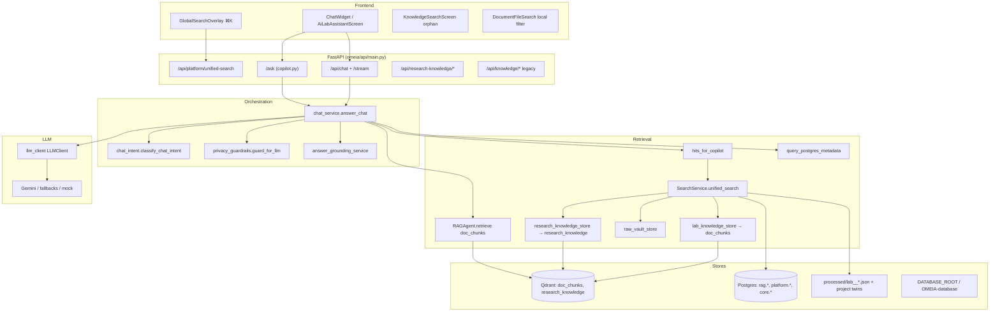

# Deep Audit Report

**Document:** `docs/34_AI_LAB_ASSISTANT_AND_SEARCH_DEEP_AUDIT.md`  
**Status:** Read-only audit report (no code changes). Persisted 2026-06-06.

**Branch audited:** `cursor/unified-search-ai-lab-assistant` (through commit `858a41f`, Phases 0–9 per `docs/33_AI_LAB_ASSISTANT_PRODUCTION_PLAN.md`)  
**Audit date:** 2026-06-06  
**Method:** Read-only code review, prior audits (`docs/30`, `31`, `32`, `33`), eval artifacts (`tests/search_qa_ai_last_run.json`, `tests/search_qa_last_run.json`, `tests/search_qa_ai_baseline.json`), grep for stubs/TODOs.

---

## 1. Executive Summary

Phases 0–9 materially improved the platform: a **single chat orchestration path** (`answer_chat` in `omeia/api/chat_service.py`), **unified retrieval** via `SearchService.hits_for_copilot`, **research KB mass ingestion** (6 → 224 Qdrant points), intent routing fixes, citation enforcement, and `/ask` delegation to the same pipeline. Search contract tests pass (`tests/search_qa_last_run.json`: 15/15).

However, **release gates fail** on the 57-question gold set: **29.8% overall pass**, **research-bucket gate fail**, **intent gate fail (86% vs 95% target)**. The dominant failure class remains **retrieval coverage and ranking**, not LLM fluency. Eval ran entirely on **mock synthesis** (57/57), so production Gemini quality is unverified in the latest battery.

### Maturity scores (1 = prototype, 5 = production-ready)

| Dimension | Score | Rationale |
|-----------|-------|-----------|
| **Architecture & orchestration** | 3.5 | Unified `SearchService` + `answer_chat`; dual RAG (`SearchService` + legacy `RAGAgent`) still merged in chat |
| **Unified search (backend)** | 4.0 | 9 buckets, intent weights, rerank, gating, nav actions; logging to `search_query_log` |
| **Unified search (frontend UX)** | 2.5 | Omnibox wired to `/api/platform/unified-search` but **research scope missing** from UI filters; legacy surfaces remain |
| **Chat / Lab Assistant** | 3.0 | Solid pipeline (intent → guardrails → retrieval → synthesis → citations); weak research answers |
| **Research KB** | 3.0 | 224 vectors, 217 sources; only 3 datasets, 10 entities, 0 relations; no lab-member graph |
| **Knowledge coverage (lab corpus)** | 3.5 | 11 DB sections + processed twins + vault; meetings/personnel partially indexed |
| **Access control & privacy** | 2.5 | Role gates on endpoints; `can_read_project` always `True`; visibility filter on notebook only |
| **Accuracy / intelligence (measured)** | 2.0 | 17/57 gold pass; mock-only eval; research questions rarely surface `research` bucket in chat |
| **OMEIA identity & branding** | 4.0 | Consistent **OMEIA** (not "Omaya"); Färkkilä lab context in prompts and welcome copy |
| **Cross-system wiring** | 3.0 | Search→chat prefill works; omnibox↔research KB disconnected; source nav partial |

**Bottom line:** Infrastructure is **integration-ready**; **product accuracy and research grounding are not release-ready** without further corpus work (people, internal history, datasets), omnibox research scope, and live-LLM eval reruns.

---

## 2. System Architecture

---

## 3. Component Inventory

### Backend — core orchestration

| File | Role |
|------|------|
| `omeia/api/chat_service.py` | Canonical chat: intent, guardrails, unified search RAG, legacy RAGAgent merge, prompts, citations, provenance |
| `omeia/api/chat_intent.py` | 9-intent classifier; RAG/citation flags; scientific accession bypass |
| `omeia/api/answer_grounding_service.py` | Research system prompt, grounded prompt template, citation enforce/retry, off-topic refusal |
| `omeia/api/privacy_guardrails.py` | PII/secret audit; scientific allowlist; external LLM block policy |
| `omeia/api/llm_client.py` | Multi-provider router, embeddings, streaming, fallback chain, synthesis provenance |
| `omeia/api/agents.py` | `RAGAgent` (doc_chunks), `PrivacyGuardrailAgent`, install/HPC agents |
| `omeia/api/common.py` | Shared clients, `SourceInfo`, Postgres metadata, clinical context helpers |

### Backend — search

| File | Role |
|------|------|
| `omeia/api/search_service.py` | Unified search across 9 buckets; copilot retrieval; rerank/gate/diversify |
| `omeia/api/search_models.py` | `SearchHit`, `UnifiedSearchResponse`, `SearchNavAction` |
| `omeia/api/search_nav.py` | Bucket → in-app navigation mapping |
| `omeia/api/routers/search.py` | `/api/platform/unified-search`, suggestions, index status, project-files search |
| `omeia/api/page_registry.py` | Section/domain → IA page mapping |

### Backend — knowledge stores

| File | Role |
|------|------|
| `omeia/api/lab_knowledge_store.py` | Lab SOP ingest → `rag.*` + Qdrant `doc_chunks` (corpus=`lab_operations`) |
| `omeia/api/research_knowledge_store.py` | Crawl/publications/datasets → `platform.research_*` + Qdrant `research_knowledge` |
| `omeia/api/research_search_service.py` | Research hit normalization |
| `omeia/api/research_crawler.py` | farkkilab.org crawler (Playwright optional, default off) |
| `omeia/api/publication_fetcher.py` | PubMed/Crossref discovery |
| `omeia/api/dataset_fetcher.py` | Dataset registry seed |
| `omeia/api/qdrant_research_indexer.py` | Research collection upsert/search |
| `omeia/api/database_processor.py` | Section chunk keyword search (`file` bucket) |
| `omeia/api/raw_vault_store.py` | Vault metadata search |
| `omeia/api/database_sections.py` | 11 lab section definitions |

### Backend — routers

| File | Role |
|------|------|
| `omeia/api/routers/chat.py` | `/api/chat`, `/api/chat/stream`, `/api/chat/status` |
| `omeia/api/routers/copilot.py` | `/ask` (+ search_only mode), install/HPC/clinical/feature endpoints |
| `omeia/api/routers/research_knowledge.py` | Research KB admin: crawl, ingest, status, search |
| `omeia/api/routers/knowledge.py` | Legacy lab search, hybrid-search, database process/read APIs |
| `omeia/api/routers/vault.py` | Vault ingest/search/review |
| `omeia/api/storage_stub.py` | Portable storage mode (`OMEIA_STORAGE_MODE=stub`) |

### Frontend — AI & search

| File | Role |
|------|------|
| `omeia/ui/react_frontend/src/components/ChatWidget.jsx` | Chat UI, streaming, project scope, source cards, omnibox handoff |
| `omeia/ui/react_frontend/src/components/GlobalSearchOverlay.jsx` | ⌘K omnibox, unified search, Ask AI |
| `omeia/ui/react_frontend/src/components/search/AssistantSearchHits.jsx` | Source/hit cards with Open / follow-up / omnibox |
| `omeia/ui/react_frontend/src/components/search/SearchFilters.jsx` | Mode + scope chips (**no research scope**) |
| `omeia/ui/react_frontend/src/utils/searchHits.js` | Nav stash, bucket labels (**research not in BUCKET_ORDER**) |
| `omeia/ui/react_frontend/src/api/chatClient.js` | `/api/chat` JSON + SSE |
| `omeia/ui/react_frontend/src/api/searchApi.js` | Unified search client |
| `omeia/ui/react_frontend/src/screens/ResearchKnowledgeAdminScreen.jsx` | Research KB admin UI |
| `omeia/ui/react_frontend/src/screens/KnowledgeSearchScreen.jsx` | Legacy advanced search (orphan route) |

### Tests & eval

| File | Role |
|------|------|
| `scripts/search/run_ai_lab_assistant_eval.py` | Gold-set scorer + release gates |
| `tests/ai_eval_gold_set.json` | 56–57 question gold set |
| `tests/search_qa_ai_last_run.json` | Latest eval (post Phase 9) |
| `tests/search_qa_ai_baseline.json` | Pre-ingestion baseline |
| `tests/search_qa_last_run.json` | Search contract QA (15 checks) |

### Scaffolding package (not integrated into main app)

| Path | Role |
|------|------|
| `OMEIA_Farkkila_Research_KB_AI_Brain_Package/` | Reference/scaffold with TODO stubs in router |

---

## 4. Data Sources & Knowledge Coverage Matrix

| Data domain | EXISTS in platform | INDEXED for AI/search | AI CAN RETRIEVE today | GAPS |
|-------------|-------------------|----------------------|----------------------|------|
| **Lab SOPs / policies (`doc_chunks`, corpus=lab_operations)** | 11 sections in `database_sections.py`; processed `lab__*.json` (12 files in repo) | Qdrant `doc_chunks` + `rag.document_*` via `lab_knowledge_store` | **Yes** — `lab` bucket, strong for protocols (Ashlar, tCyCIF, StarDist) | Ingest depends on admin running ingest; stats runtime-dependent |
| **Research KB (`research_knowledge`)** | 224 Qdrant points, 217 PG sources (eval infra) | Website crawl + PubMed/Crossref + 3 seeded datasets | **Partial** — unified search GSE query gets 4 research hits; chat often misses `research` bucket | Only 3 datasets; 0 knowledge relations; GitHub not crawled; Playwright off by default |
| **Processed file chunks (`file` bucket)** | `database_processor` + JSONL/static docs | Keyword search over section chunks | **Yes** — dominates many queries | Not semantic; project-scoped filter in copilot |
| **Vault metadata** | `raw_vault_store` / Postgres | ILIKE + excerpt previews | **Yes** — often 80%+ of omnibox hits for generic queries | Vectors optional (`ENABLE_VECTOR_EMBEDDINGS=false` default); Qdrant ingest may skip offline |
| **Postgres platform: notebook** | `platform.notebook_entry` | ILIKE in unified search | **Yes** — `notebook` bucket | UI `NotebookWikiScreen` uses **static JS**, not PG — drift risk |
| **Postgres: wiki, decisions, tasks** | PG tables | ILIKE registry search | **Yes** with nav actions | Wiki UI may be static; visibility on notebook only |
| **Projects (`core.project`)** | PG + processed twins | ILIKE + workspace file search | **Yes** | Long descriptions may be thin |
| **Clinical/patient counts** | PG via `query_postgres_metadata` | Injected into chat prompts when RAG on | **Conditional** — eval shows **0 patients / 0 samples** in test DB | Not a knowledge gap but empty in dev |
| **Publications (full text)** | Seed list in `configs/research_knowledge/seed_sources.json` | Metadata + abstract only (copyright policy) | **Metadata/abstract** | No PDF full-text index; closed-access bodies absent |
| **Datasets (GEO/EGA/TCGA)** | 3 seeded in registry | In research KB | **Partial** — GSE211956 searchable in unified search sample | Most lab accessions not seeded |
| **Meetings** | `meetings` section + `lab__meetings.json` (rich content) | Via lab ingest / file chunks if processed | **Partial** | Presentation PDFs indexed as files, not structured meeting graph |
| **People / lab members** | `Overview/PERSONNEL`; 36 photos in `labMember/`; 6 profiles in `userProfilesData.js` / `teamDirectory.js` | **Not dedicated** — only if mentioned in docs | **No reliable** — "Who is X?" fails unless name in a document | No people index, no ORCID graph, ~30 members missing from UI data |
| **Lab history / identity** | farkkilab.org crawl + onboarding docs | Research KB website pages | **Partial** — lab overview questions get `file`+`lab`, rarely `research` | Internal history, thesis repo, alumni not systematically indexed |
| **Datapad / live edits** | `datapad_service.py` | Not in unified search scopes | **No** | Editor content invisible to copilot |
| **DataCloud / P-drive remote files** | Storage connectors | Vault ingest when run | **Only if ingested to vault** | Remote mounts not searched live |
| **Supabase sync** | Optional metadata sync | Not search-indexed directly | **No** | Policy: metadata only |
| **Static catalog (`catalog.json`)** | LabKnowledgeScreen | Client-side only | **No** for chat | Parallel universe vs Qdrant |

---

## 5. Access Control & Privacy Audit

### Roles (`omeia/security/permissions.py`)

| Role | Chat `/api/chat` | `/ask` (non-search_only) | Unified search | Research KB ingest | Vault ingest |
|------|------------------|--------------------------|----------------|---------------|--------------|
| **researcher** | ✓ | ✓ | ✓ (auth required) | ✗ | ✗ |
| **viewer** | ✓ | ✓ | ✓ | ✗ | ✗ |
| **editor** | ✓ | ✓ | ✓ | ✓ | ✓ |
| **admin** | ✓ | ✓ | ✓ (+ `include_restricted`) | ✓ | ✓ |

`/ask` **search_only** mode: no `require_role` for synthesis path — retrieval only.

### Privacy guardrails (`privacy_guardrails.py`)

- Scientific identifiers (GSE, EGA, TCGA, DOI, PMID, CD markers) **allowlisted** before PII scan (Phase 1 fix).
- External providers (`gemini`, `openai`, etc.) **blocked** when PII detected unless `ALLOW_PATIENT_DATA=true`.
- Secrets (`sk-`, `AIza`, embedded credentials) always blocked/redacted.
- **Eval:** `pii_gate_pass: true` in last run.

### External LLM policy

- API keys server-side only (`configs/.env.example` documents `GEMINI_API_KEY` never in Vite).
- Chat client uses `/api/chat` only — no browser keys.
- **Gap:** No audit log of which chunks were sent to external LLM per session.

### Authorization weaknesses (P1)

- `can_read_project`, `can_read_document`, `can_download_file` all return **`True`** unconditionally — no project-level isolation in retrieval.
- Notebook visibility filter exists (`restricted`/`confidential`) but wiki/decisions/tasks lack equivalent gates.
- RAGAgent project filter exists in payload but merge with unified hits is permissive.

---

## 6. Chat Pipeline Deep Dive (`/api/chat`)

**Flow:** `routers/chat.py` → `answer_chat()`:

1. **Intent** — `classify_chat_intent()` sets `use_rag`, `show_sources`, `require_citations`, `answer_style`.
2. **Privacy** — `guard_for_llm()` redacts/blocks before retrieval or LLM.
3. **Sensitive intent** — hard refusal without LLM.
4. **Off-topic** — `is_off_topic_query()` refusal for general_chat only.
5. **Retrieval (if `use_rag`)** — `search_svc.hits_for_copilot()` + **`rag_agent.retrieve()`** (parallel legacy path).
6. **Empty corpus** — honest `empty_corpus_answer()` without LLM call.
7. **Prompt build** — research grounding template when `research` bucket present OR scientific/search intents; else flat context string.
8. **Synthesis** — `llm.generate()`; provenance via `synthesis_provenance()`.
9. **Citations** — `enforce_citations()` retry + append sources block.
10. **Response** — sources/search_hits only if `show_sources`; limitations array always populated.

**Streaming:** `/api/chat/stream` runs full `answer_chat` first (retrieval synchronous), then streams LLM deltas — metadata event includes sources upfront.

**Identity in prompts:** "OMEIA Research Copilot", "OMEIA Färkkilä Lab Research Assistant" (`answer_grounding_service.py`, `chat_service.py`).

---

## 7. Search Pipeline Deep Dive

### Unified search (`SearchService.unified_search`)

**Buckets:** `lab`, `file`, `vault`, `notebook`, `wiki`, `decision`, `task`, `project`, `research`.

**Modes:** `hybrid`, `semantic`, `keyword`, `exact`.

**Engines per bucket:**
- `lab` — Qdrant semantic + PG fallback (`search_lab_knowledge`)
- `file` — processed section chunks (keyword)
- `vault` — Postgres metadata ILIKE
- `notebook/wiki/decision/task` — Postgres ILIKE + nav
- `project` — PG + workspace twin files
- `research` — Qdrant + PG keyword (`search_research`)

**Copilot path (`hits_for_copilot`):** intent-scoped buckets → intent weights → lexical rerank → `COPILOT_MIN_SCORE` (default 0.06) → dedup/max 4 per bucket.

### GlobalSearchOverlay integration

- Calls `GET /api/platform/unified-search` with debounce 300ms.
- **Critical:** `SearchFilters.jsx` `SCOPE_OPTIONS` **omits `research`** — overlay passes explicit scopes, so **omnibox never queries research KB**.
- `searchHits.js` `BUCKET_ORDER` also omits `research` — research hits won't group in UI even if returned.
- **Ask AI** stashes query → opens chat (`stashSearchQuery` / `readStashedSearchQuery`).

### Copilot integration

- Chat uses same `SearchService` as omnibox (with research in intent scopes).
- Legacy `/api/knowledge/hybrid-search` and `/api/search` still exist — parallel APIs.

---

## 8. `/ask` vs `/api/chat` (Post Phase 6)

| Aspect | `/api/chat` | `/ask` |
|--------|-------------|--------|
| Orchestration | `answer_chat` | Same for `mode != search_only` |
| Auth roles | researcher/viewer/editor/admin | Same (except search_only) |
| LLM override | `CHAT_LLM_PROVIDER` env | Per-request `llm_provider` in body |
| Conversation logging | No | Inserts `platform.conversation` + `message` |
| search_only mode | N/A | Retrieval only, empty answer |
| Response schema | `ChatResponse` | `QuestionResponse` (aligned metadata post Phase 6) |

**Remaining divergence:** `/ask search_only` uses `hits_for_copilot` directly with different default limits vs chat's merged RAGAgent sources; eval `ask_comparisons` notes `chat sources != /ask search_only hits` for Ashlar, lab overview, GSE queries.

**Frontend:** `ChatWidget` uses `/api/chat` exclusively (`chatClient.js`). Legacy screens may still call `/ask`.

---

## 9. Research KB State (224 Points)

**From `tests/search_qa_ai_last_run.json` infra (post Phase 2 ingestion):**

| Metric | Baseline (Phase 0) | Current |
|--------|-------------------|---------|
| Qdrant points | 6 | **224** |
| Sources | 12 | **217** |
| Documents | 12 | **217** |
| Chunks | 6 | **221** |
| Datasets | 3 | **3** |
| Entities | 2 | **10** |
| Relations | 0 | **0** |

**Contents (verified in code/config):**
- farkkilab.org seeds: home, research, publications, clinic, news, computational-tools (`configs/research_knowledge/seed_sources.json`)
- PubMed/Crossref queries for Färkkilä + HGSC/spatial/TLS/MHC themes (`publication_fetcher.py`)
- Priority publication URLs (MHC class II atlas, TLS biorxiv, chemo T-cell exhaustion, etc.)
- 3 seeded datasets via `dataset_fetcher.py`

**Misses:**
- **People:** no structured lab roster index
- **Internal lab files:** explicitly excluded from public crawl (`seed_sources.json` notes)
- **GitHub repos:** listed as seed but not evidenced as ingested in eval
- **Knowledge graph:** 0 relations — entity extraction rule-based only
- **Playwright:** `RESEARCH_KB_ENABLE_PLAYWRIGHT=false` default — SPA pages may be thin without JSON-LD
- **Full papers:** abstracts/metadata only

**Unified search sample:** generic query → `{lab:1, vault:9}`; GSE query → `{research:4, lab:6}` — research retrievable in API but not in omnibox UI scopes.

---

## 10. Intelligence & Accuracy Assessment

### Eval artifacts

**`tests/search_qa_ai_last_run.json` (Phase 9, 57 questions):**

| Gate | Result | Threshold |
|------|--------|-----------|
| Intent accuracy | 86.0% | ≥95% **FAIL** |
| Citation compliance | 100% | **PASS** |
| PII gate | pass | **PASS** |
| Research bucket | fail | ≥70% of research items **FAIL** |
| Provider honesty | 100% | **PASS** |
| Overall gold pass | **29.8%** | ≥85% **FAIL** |

- **Gold passed:** 17/57  
- **Gold failed:** 40/57  
- **Providers:** 100% mock (no live Gemini in this run despite `gemini_key_configured: true`)  
- Common gap notes: `"no research-bucket sources for research question"`, `"mock synthesis"`, key terms missing (e.g. SPACEStat)

**`tests/search_qa_last_run.json`:** 15/15 search **contract** checks pass (HTTP 200, buckets present, logging) — distinct from answer quality.

**Baseline comparison:** Research KB 6→224 points; chat quality gates still fail — confirms **retrieval/ranking/UI scope** issues dominate over corpus size alone.

### Heuristic quality (from doc 33 baseline)

Pre-phase heuristic ~4.1/5 overall; research grounding scored lower. Post-phase automated gates stricter — **29.8%** reflects gold-set rigor, not user-perceived fluency on smalltalk.

---

## 11. UX / Presentation Audit

### ChatWidget (`ChatWidget.jsx`)

**Strengths:**
- Welcome: "**OMEIA Research Copilot**" with concrete capability examples
- Project scope picker for RAG
- Streaming SSE with metadata-first sources
- `AssistantSearchHits`: Open / Ask follow-up / Search in omnibox
- Provider badge (`effective_provider`, `synthesis_mode`)
- Limitations surfaced
- Finnish detection → response language hint in backend

**Weaknesses:**
- Mock mode produces templated `"### OMEIA copilot synthesis"` blocks — poor UX in dev/CI
- MarkdownLite limited (no `[n]` citation links to sources)
- Research bucket sources nav to `ai_assistant/research_kb` — weak deep link
- 3D scene lazy-load adds weight unrelated to grounding

### GlobalSearchOverlay

**Strengths:** Hybrid mode, scope chips, synonym hints, recent queries, keyboard nav, Ask AI bridge

**Weaknesses:** No research scope/filter; no research bucket label; KnowledgeSearchScreen still orphan

### Source cards

- Bucket CSS classes added (Phase 7)
- Scores shown (good for debug, noisy for users)
- Nav depends on `hit.nav` — research hits often lack document open target

---

## 12. Bugs & Flaws Catalog

### P0 — Blocks trustworthy research assistant

| ID | Issue | Evidence |
|----|-------|----------|
| P0-1 | **Omnibox excludes research scope** — UI never passes `research` in scopes | `SearchFilters.jsx` SCOPE_OPTIONS (8 scopes, no research); `GlobalSearchOverlay` joins scopes |
| P0-2 | **Research questions fail bucket gate** — chat retrieval dominated by file/vault/lab | `search_qa_ai_last_run.json`: `research_bucket_gate_pass: false`; many `"bucket_research": false` |
| P0-3 | **Release overall gate 29.8%** — not production-ready | `release_gates.overall_pass_pct: 29.8` |
| P0-4 | **Eval runs mock-only** — accuracy unvalidated against Gemini | `providers_seen: {mock: 57}` while production expects Gemini |

### P1 — Significant gaps

| ID | Issue | Evidence |
|----|-------|----------|
| P1-1 | **Dual RAG merge** — `RAGAgent` + unified hits can duplicate/confuse ranking | `chat_service._hits_to_sources()` merges both; `bucket: lab` for rag_sources |
| P1-2 | **No project-level auth in retrieval** | `permissions.py` `can_read_project` → always True |
| P1-3 | **People not indexed** — 6 UI profiles vs ~36 lab photos | `userProfilesData.js` (6), `labMember/` (36 files) |
| P1-4 | **Notebook/wiki UI ≠ search data** | Doc 30; static `technicalNotebook.js` vs PG search |
| P1-5 | **`/ask search_only` ≠ chat sources** | `ask_comparisons` divergence array in eval JSON |
| P1-6 | **Research nav dead-end** | `search_nav.py` research → `ai_assistant/research_kb` only |
| P1-7 | **Only 3 datasets in registry** | `research_kb.dataset_count: 3` |
| P1-8 | **Intent gate 86%** — misroutes still present | Below 95% threshold |

### P2 — Polish / tech debt

| ID | Issue | Evidence |
|----|-------|----------|
| P2-1 | Legacy search APIs coexist | `/api/search`, `/api/knowledge/hybrid-search`, `/platform/search` references in doc 30 |
| P2-2 | `KnowledgeSearchScreen` unreachable | Not in `navigation.js` |
| P2-3 | Vault vector ingest optional/offline stub | `vault.py` Qdrant skip message |
| P2-4 | `BUCKET_ORDER` missing research | `searchHits.js` |
| P2-5 | Hardcoded researcher username in research router | `research.py` `'debdeba'` |
| P2-6 | Citation validation warns but mock answers cite wrong sources | Eval: citations present but content says "No matching document chunks" |
| P2-7 | Playwright disabled by default for SPA crawl | `research_crawler.py` `PLAYWRIGHT_ENABLED=false` |

---

## 13. Non-Implemented / Stub / TODO Inventory

| Location | Finding |
|----------|---------|
| `OMEIA_Farkkila_Research_KB_AI_Brain_Package/04_BACKEND_SCAFFOLDING/research_knowledge_router.py` | `# TODO: persist`, `# TODO: call Qdrant` — scaffold only, not wired to main app |
| `omeia/api/storage_stub.py` | Portable stub storage — intentional for git-portable dev |
| `omeia/api/routers/search.py:74` | "portable stub" index status comment |
| `omeia/api/routers/vault.py:98` | Qdrant ingest skipped offline stub path |
| `configs/.env.example` | `ENABLE_VECTOR_EMBEDDINGS=false`, `ENABLE_AI_CLASSIFICATION=false`, `SUPABASE_SYNC_ENABLED=false` |
| Frontend grep TODO/FIXME | **No matches** in react search/chat files |
| `research_knowledge_store` relations | `relation_count: 0` — extractor runs but graph unused in retrieval |
| Datapad AI | `DATAPAD_AI_ENABLED` — separate from chat RAG |
| Neo4j env vars | Present in `.env.example` — no evidence of active graph RAG in chat path |

---

## 14. OMEIA Identity & Lab Knowledge Branding

- **Correct brand: OMEIA** — used in Firebase web app nickname, OpenRouter app name, crawler User-Agent, welcome message, system prompts.
- **"Omaya"** — **zero matches** in repository; user typo.
- **Lab context:** "Färkkilä research group", "Färkkilä Lab", farkkilab.org — consistent spelling with umlaut variants handled in intent patterns (`farkkila`, `färkkilä`).
- **Assistant self-ID:** "OMEIA Research Copilot", "OMEIA Färkkilä Lab Research Assistant".
- **Gap:** Assistant does not reliably answer "what does the lab study?" from research KB — eval shows file/lab chunks, mock synthesis admitting no matching chunks (`ask_comparisons` for lab overview question).

---

## 15. Cross-System Wiring Gaps

| Link | Status |
|------|--------|
| Omnibox → unified search API | ✓ Wired |
| Omnibox → research KB | ✗ **Scopes exclude research** |
| Omnibox → chat (Ask AI) | ✓ `stashSearchQuery` / prefill |
| Chat → omnibox | ✓ `stashOmniboxPrefill` |
| Chat sources → in-app nav | ✓ Partial — lab/file/vault/notebook; weak for research |
| Search hits → same retrieval as chat | ✓ Same `SearchService`; chat adds RAGAgent + intent scopes |
| Global search logging → suggestions | ✓ `search_query_log` |
| Research KB admin → Qdrant | ✓ API routes (editor/admin) |
| Team directory → RAG | ✗ Static JS only |
| Meeting presentations → structured Q&A | ✗ File excerpts only |
| Project twin files → copilot | ✓ Via file bucket + project workspace search |

---

## 16. Recommendations (Prioritized, No Implementation)

### Immediate (P0)

1. **Add `research` to omnibox scopes** — `SearchFilters.jsx`, `BUCKET_ORDER`, default scopes; verify grouped results.
2. **Re-run eval with live Gemini** (`CHAT_LLM_PROVIDER=gemini`, rate-limit backoff) — separate mock vs live reports.
3. **Tune research intent retrieval** — raise research weight floor; require ≥1 research hit for `research_question` before synthesis; lower vault dominance for scientific queries.
4. **Consolidate RAG paths** — deprecate parallel `RAGAgent.retrieve` in chat or namespace buckets to avoid double-counting lab chunks.

### Short-term (P1)

5. **People index** — ingest `Overview/PERSONNEL` + `teamDirectory` + farkkilab people pages into research KB with entity type `person`.
6. **Expand dataset registry** — lab GEO/EGA accessions from publications and project twins.
7. **Enable Playwright crawl** in production ingest job for farkkilab.org SPA.
8. **Project-level ACL** — enforce `allowed_projects` in retrieval filters.
9. **Unify notebook/wiki UI with Postgres** — eliminate static/DB drift.
10. **Deep links for research sources** — DOI/PubMed/external URL buttons on source cards.

### Medium-term (P2)

11. Retire legacy `/api/search` and `/api/knowledge/hybrid-search` after migration.
12. Wire knowledge graph relations into reranker.
13. Datapad/content-change webhooks to trigger re-embed.
14. Session-level LLM audit log for compliance.
15. Live Qdrant vault vectors when `ENABLE_VECTOR_EMBEDDINGS=true`.

---

## 17. Appendix

### A. Primary API routes (AI/search)

| Method | Path | Purpose |
|--------|------|---------|
| GET | `/api/platform/unified-search` | Canonical omnibox |
| GET | `/api/platform/search-suggestions` | Prefix/synonym/recent |
| GET | `/api/platform/search-index-status` | Index freshness |
| GET | `/api/project-files/search` | Project twin file search |
| POST | `/api/chat` | Chat JSON |
| POST | `/api/chat/stream` | Chat SSE |
| GET | `/api/chat/status` | Provider/model status |
| POST | `/ask` | Legacy copilot + search_only |
| GET | `/api/research-knowledge/status` | Research KB stats |
| POST | `/api/research-knowledge/crawl/farkkila` | Crawl ingest |
| POST | `/api/research-knowledge/ingest-publications` | PubMed ingest |
| POST | `/api/research-knowledge/seed-datasets` | Dataset seed |
| GET | `/api/research-knowledge/search` | Direct research search |
| GET | `/api/knowledge/lab/search` | Legacy lab search |
| GET | `/api/knowledge/hybrid-search` | Legacy hybrid |
| GET | `/api/search` | Legacy unified (pre-platform prefix) |
| GET | `/api/database/search` | Section chunk search |
| GET | `/api/vault/search` | Vault-only search |

### B. Key environment variables

| Variable | Purpose |
|----------|---------|
| `LLM_PROVIDER`, `CHAT_LLM_PROVIDER` | Chat synthesis provider |
| `GEMINI_API_KEY`, `GEMINI_MODEL`, `GEMINI_BASE_URL` | Gemini config |
| `LLM_FALLBACK_PROVIDERS` | Provider chain |
| `CHAT_MAX_SOURCES`, `CHAT_STREAM_ENABLED` | Chat retrieval/stream |
| `COPILOT_MIN_SIMILARITY` | Copilot score gate (default 0.06) |
| `QDRANT_URL`, `DOCUMENT_QDRANT_COLLECTION` | doc_chunks |
| `RESEARCH_KB_*` | Crawl, PubMed, Playwright, delays |
| `ALLOW_PATIENT_DATA` | External LLM PII override |
| `OMEIA_STORAGE_MODE`, `DATABASE_ROOT` | Portable data paths |
| `PLATFORM_AUTH_DISABLED` | Dev auth bypass |
| `RAG_RETRIEVAL_LIMIT` | Legacy RAGAgent limit |

Full list: `configs/.env.example`.

### C. Qdrant collections

| Collection | Vector name | Content |
|------------|-------------|---------|
| `doc_chunks` | `text` | Lab operations SOPs (`corpus=lab_operations`) + legacy project docs |
| `research_knowledge` | `text` | Website, publications metadata, datasets |

---

## Top 10 Critical Findings

1. **Release gates fail (29.8% overall)** — not production-ready per Phase 9 criteria (`tests/search_qa_ai_last_run.json`).
2. **Omnibox never searches research KB** — `SearchFilters.jsx` omits `research` scope; 224 vectors invisible in ⌘K.
3. **Research-bucket gate fails** — chat RAG rarely includes `research` hits for research questions despite ingestion.
4. **Last eval used 100% mock LLM** — Gemini quality and rate-limit behavior unverified in gold set.
5. **Retrieval dominates failures** — file/vault/lab crowd out research; ranking/threshold issues persist post Phase 4.
6. **~30 lab members not in AI knowledge** — 6 profile records vs 36 photos; no people index.
7. **Dual RAG paths** (`SearchService` + `RAGAgent`) merge with potential duplication and bucket mislabeling.
8. **Project/document ACL is stub** — `can_read_project` always true; restricted notebook visibility only partial.
9. **Notebook/wiki UI data drift** — Postgres searched by omnibox; some screens use static JS.
10. **Only 3 datasets indexed** — GEO/EGA coverage far below lab's actual data footprint; GSE finds metadata but chat answers weak.

---

**Estimated word count:** ~3,400 words
