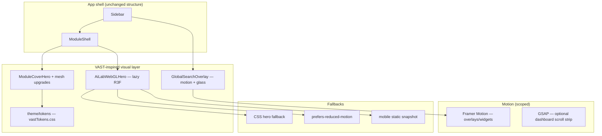

# VAST-Style UI Migration Report

**Document:** `docs/35_VAST_STYLE_UI_MIGRATION_REPORT.md`  
**Status:** Read-only migration analysis (no code changes)  
**Date:** 2026-06-06  
**Reference:** [VAST Data — AI 3D Website Animation (Dribbble #27282113)](https://dribbble.com/shots/27282113-VAST-Data-AI-3D-Website-Animation) by JK Mahbub  
**Baseline repo:** `apps/web`  
**Related audits:** `docs/34_AI_LAB_ASSISTANT_AND_SEARCH_DEEP_AUDIT.md`, `docs/33_AI_LAB_ASSISTANT_PRODUCTION_PLAN.md`

---

## 1. Reference Analysis

### 1.1 Fetch status

Direct fetch of the Dribbble shot URL returned a bot-protection page (“JavaScript is disabled / verify you're not a robot”). Secondary sources used:

| Source | What it contributed |
|--------|---------------------|
| [JK Mahbub Dribbble profile](https://dribbble.com/jkmahbub) | Confirms shot title, designer portfolio context (AI / Web3 / 3D landing pages) |
| [VAST Data website](https://www.vastdata.com/) | Brand positioning: “AI Operating System”, enterprise data platform, agentic AI |
| Adjacent JK Mahbub shots (*AI Voice Assistant 3D Website*, *Web3 Crypto AI Dashboard – 3D Website*) | Shared visual vocabulary across his AI infrastructure work |
| VAST promotional video descriptions | 3D animation, fluid transitions, immersive SFX, “data → intelligence” narrative |

**Recommendation:** Save 2–3 PNG exports from Dribbble (or request frames from the designer) into `docs/assets/vast-reference/` before Phase 1 implementation so token decisions are pixel-checked, not inferred.

### 1.2 Visual language (inferred from reference + VAST brand lane)

| Dimension | VAST / JK Mahbub reference pattern | Notes for OMEIA |
|-----------|-----------------------------------|-----------------|
| **Color** | Deep near-black base (`#050508`–`#0d0f14`), electric violet/indigo accents, cyan/teal highlights on data paths, subtle magenta glow on hero focal points | OMEIA already uses teal primary (`#2dd4bf` dark) and module accent hues; map VAST “infrastructure glow” to **OMEIA teal + indigo AI accent** (`#6366f1` on AI module), not VAST corporate purple wholesale |
| **Typography** | Oversized display headlines (60–96px marketing scale), tight tracking on eyebrows, geometric sans (often custom or Inter-like), monospace for metrics | OMEIA uses **Source Sans 3 + Source Serif 4** (`fonts.css`, `themeManager.css`) — keep research-grade serif for body; add a **display scale** only on hero/cover components |
| **Motion** | Scroll-scrubbed camera moves, parallax depth layers, staggered text reveals, looping ambient orbit on 3D nodes, pulse on “active” infrastructure | Achievable in **hero zones only**; full-page scroll cinema is marketing-only for a lab app |
| **3D elements** | Glowing node graph / data mesh, orbiting rings, particle streams along edges, reflective spheres, grid floor, depth fog | OMEIA has **CSS pseudo-3D** (`AiAssistant3DScene.jsx`) and **real WebGL** on login (`LoginOvarianScene.jsx`) + asset viewer (`ModelViewer3D.jsx`) — reference pushes toward **connected node topology**, not biology cells |
| **Layout** | Full-viewport hero, centered narrative column, floating glass panels over 3D canvas, sparse nav | OMEIA uses **sidebar + ModuleShell** — keep shell; apply VAST aesthetic to **cover heroes and AI surfaces**, not global layout replacement |
| **Hero patterns** | Eyebrow → massive H1 → subcopy → single CTA; 3D scene occupies 50–70% viewport | Maps to `ModuleCoverHero.jsx` and `AiAssistant3DScene` toolbar pattern |
| **Data / AI motifs** | Pipeline nodes, storage tiers, agent swarms, “unified data plane”, metric counters animating on scroll | Map to **search buckets**, **Qdrant index stats**, **copilot retrieval graph**, **research KB ingestion status** — real data, not decorative lorem |

### 1.3 Achievable in a real app vs. marketing-only

| Reference element | Product-feasible | Marketing-only / high risk |
|-------------------|------------------|----------------------------|
| Dark glass panels, gradient meshes, grid overlays | ✅ Already partially in `index.css` `.module-cover-hero__*` | — |
| CSS orbit / particle hero (no WebGL) | ✅ Current `AiAssistant3D.css` approach | — |
| Single-scene WebGL hero (AI Lab, login) | ✅ R3F already in bundle; lazy-load | — |
| Omnibox blur + spotlight | ✅ `UnifiedSearch.css` backdrop-filter | — |
| Scroll-triggered section reveals | ⚠️ Selective (dashboard cards, admin stats) | Full-page scroll hijacking on every screen |
| Scroll-scrubbed 3D camera tied to page length | ⚠️ One landing/overview strip only | Every module route |
| Cinematic page transitions between all nav items | ❌ Hurts wayfinding in dense lab UI | VAST-style site navigation |
| Continuous particle fields behind document tables | ❌ GPU + readability cost | Dribbble hero frames |
| Custom WebGL shaders on all cards | ❌ Maintenance burden for solo dev | — |
| Auto-playing video loops in shell | ❌ Bandwidth, a11y | Promo sites |

---

## 2. Current OMEIA Baseline

### 2.1 Stack

| Layer | Technology | Location |
|-------|------------|----------|
| Framework | React 19 | `package.json` |
| Bundler | Vite 8 | `vite.config.js` |
| Routing | React Router DOM 7 (in-app nav state, not URL SPA routes for modules) | `App.jsx`, `config/navigation.js` |
| Icons | lucide-react | Throughout |
| 3D | `three`, `@react-three/fiber`, `@react-three/drei` | `LoginOvarianScene.jsx`, `ModelViewer3D.jsx`; **not** used in `AiAssistant3DScene.jsx` |
| Editors / viz | Monaco, Mermaid, xlsx | Lazy chunks in `vite.config.js` |
| Analytics | Firebase (optional, env-mapped from `configs/.env`) | `config/firebase.js` |
| i18n | Custom locale bundles (`i18n/guiStrings/*`) | `LocaleContext.jsx` |
| Theming | `dark` / `light` / `academic` | `ThemeContext.jsx`, `theme/themeManager.css` |

**Not present:** GSAP, Framer Motion, Lenis, Lottie, react-spring.

### 2.2 App shell and main surfaces

```
App.jsx
├── Sidebar.jsx          — main nav, ⌘K search trigger, theme cycle
├── ModuleShell.jsx      — sub-nav, cover slot, content area
├── GlobalSearchOverlay   — lazy; unified omnibox (⌘K)
├── ChatWidget            — floating copilot (when enabled)
└── lazy screens (20+)
```

**Primary screens (by nav area):**

| Area | Screen files | Cover / hero |
|------|--------------|--------------|
| Overview | `LabKnowledgeScreen.jsx`, `OverviewDocumentsScreen.jsx`, `DashboardScreen.jsx` | `ModuleCoverHero.jsx` |
| Projects | `ProjectsScreen.jsx`, `NotebookWikiScreen.jsx`, `DecisionsScreen.jsx` | Module cover |
| Wet lab / CycIF | `WetLabScreen.jsx`, `CycifScreen.jsx` | Module cover |
| Compute | `BioinformaticsHubScreen.jsx`, `ToolingScreen.jsx` | Module cover |
| **AI** | `AiLabAssistantScreen.jsx` | `AiAssistant3DScene.jsx` (CSS 3D) |
| Storage | `DataStorageScreen.jsx` | Module cover |
| Admin | `AdministrationScreen.jsx`, `IngestionDashboard.jsx`, `ResearchKnowledgeAdminScreen.jsx` | Partial / minimal |

### 2.3 AI & search UX (current)

| Component | Role | Style today |
|-----------|------|-------------|
| `GlobalSearchOverlay.jsx` | ⌘K omnibox → `/api/platform/unified-search` | Glass backdrop, flat card, bucket groups |
| `ChatWidget.jsx` | Stream/mock chat, search hit cards | Lazy `AiAssistant3DScene`, `AiAssistantChat.css` |
| `AiLabAssistantScreen.jsx` | Full-page copilot + models + ingest tabs | Same 3D hero + embedded `ChatWidget` |
| `AssistantSearchHits.jsx` | Inline retrieval cards in chat | Unified search styling |
| `KnowledgeSearchScreen.jsx` | Legacy/orphan search surface | Overlaps omnibox (see doc 34) |

### 2.4 Theme / CSS architecture

| File | Responsibility |
|------|----------------|
| `theme/themeManager.css` | Design tokens (`--bg-app`, `--color-primary`, fonts) |
| `theme/consistency.css` | Cross-component normalization |
| `typography.css` | Research typography scale |
| `index.css` | Large shared layout including `.module-cover-hero` |
| `App.css` | Shell, focus rings, motion prefs |
| `components/AiAssistant3D.css` | Pseudo-3D hero (~1,150 lines, keyframes, reduced-motion) |
| `components/search/UnifiedSearch.css` | Omnibox overlay |

**Branding:** Copy consistently uses **OMEIA** and Färkkilä Lab context (`ChatWidget.jsx` welcome, module intros). Default theme is **academic** (warm paper light mode).

### 2.5 Existing 3D usage

| File | WebGL? | Purpose |
|------|--------|---------|
| `LoginOvarianScene.jsx` | ✅ R3F | Biology-themed login hero (cells, fibers) |
| `ModelViewer3D.jsx` | ✅ R3F | glTF/GLB asset preview in documents |
| `AiAssistant3DScene.jsx` | ❌ CSS only | Orbits, grid planes, Lucide icons — **name is aspirational** |

Vite already splits `three-vendor` chunk (~manualChunks in `vite.config.js`).

---

## 3. Gap Analysis

| Reference capability | OMEIA today | Gap severity | Solo-dev notes |
|---------------------|-------------|--------------|----------------|
| Unified dark “AI infrastructure” aesthetic | Mixed: academic default + module accents | **Medium** | Token pass, not rewrite |
| Real-time 3D node graph hero | CSS fake-3D on AI screen | **High** for visual parity | Reuse R3F patterns from login scene |
| Scroll-driven storytelling | Static heroes | **High** if copied literally | **Skip globally**; optional dashboard strip |
| Glassmorphism depth | Partial (search overlay, covers) | **Low** | Extend tokens `--surface-glass` in `App.css` |
| Micro-interactions (stagger, spring) | Basic CSS transitions | **Medium** | Framer Motion on overlays only |
| Cinematic typography | Serif research scale | **Medium** | Display utility classes |
| Data flow animations | Static `MetricCard` | **Medium** | Animate real API stats |
| Particle / fog atmosphere | CSS particles in `AiAssistant3D.css` | **Low** | Optional WebGL particles in one canvas |
| Section-to-section WebGL continuity | None | **N/A for app** | Non-goal |
| Performance budget | Lazy routes; 3D on login | **Risk if 3D everywhere** | Strict lazy + fallbacks |
| Mobile | Sidebar collapses; reduced-motion hooks exist | **Medium** | CSS fallback mandatory for WebGL heroes |
| a11y | `prefers-reduced-motion` in several CSS files | **Good base** | Extend to R3F scenes |

**Strategic gap:** OMEIA is a **multi-module lab operating system**, not a single-page marketing site. The reference is **directional for AI/search surfaces and cover heroes**, not a literal layout migration.

---

## 4. Migration Plan (Phased)

### Architecture target



### Phase 0 — Audit & guardrails (S · 2–3 days)

**Goal:** Freeze scope; avoid breaking research UX.

| Action | File targets |
|--------|--------------|
| Export Dribbble reference frames to `docs/assets/vast-reference/` | New folder |
| Document per-route 3D eligibility matrix | This doc §6 |
| Add `VAST_MIGRATION` feature flag in env | `configs/.env.example` → `VITE_ENABLE_WEBGL_HERO=false` |
| Verify reduced-motion coverage | `AiAssistant3D.css`, new R3F scenes |

**Effort:** S  
**Dependencies:** None

---

### Phase 1 — Design tokens & cover polish (S–M · 1 week)

**Goal:** VAST *feel* without WebGL — lowest risk, highest ROI.

| Action | File targets |
|--------|--------------|
| Add optional `vastTokens.css` extending `themeManager.css` | `src/theme/vastTokens.css`, import from `main.jsx` behind flag |
| Dark “AI mode” token overrides: deeper `--bg-app`, indigo secondary glow, display type scale | `themeManager.css` or new `[data-visual-lane="ai"]` on AI routes |
| Upgrade `ModuleCoverHero` mesh/grid animation (CSS only) | `index.css` (`.module-cover-hero__*`), `ModuleCoverHero.jsx` |
| Unify glass surfaces: `--surface-glass`, stronger blur on omnibox | `App.css`, `UnifiedSearch.css` |
| Align `ResearchKnowledge.css` admin cards with cover tokens | `screens/ResearchKnowledge.css` |

**Libraries:** None required (CSS only).

**Effort:** S–M

---

### Phase 2 — AI hero WebGL (M · 1.5–2 weeks)

**Goal:** Replace CSS-only `AiAssistant3DScene` visual column with lightweight R3F graph **behind** existing copy layout.

| Action | File targets |
|--------|--------------|
| Create `AiLabWebGLHero.jsx` — instanced nodes + edges, slow orbit, `<Canvas dpr={[1, 1.5]}>` | `src/components/ai/AiLabWebGLHero.jsx` |
| Keep `AiAssistant3DScene.jsx` as wrapper; swap visual column via flag | `AiAssistant3DScene.jsx` |
| Extract shared R3F utilities from login scene | `src/components/three/sceneUtils.js` |
| Lazy import hero only on AI routes | `AiLabAssistantScreen.jsx`, `ChatWidget.jsx` |
| CSS static fallback when `prefers-reduced-motion`, low GPU, or flag off | `AiAssistant3D.css` (existing markup) |

**Library choice:**

| Library | Verdict |
|---------|---------|
| **Three.js + R3F + drei** | ✅ Already installed; reuse `Float`, `Line`, `Instances`; matches login scene |
| **GSAP** | ⚠️ Defer to Phase 3; not needed for idle hero loop |
| **Framer Motion** | ⚠️ Phase 3 for UI chrome, not canvas |
| **react-spring/three** | ❌ Skip — adds dep; R3F `useFrame` sufficient for orbit |

**Effort:** M

---

### Phase 3 — Motion system & omnibox cinema (M · 1–1.5 weeks)

**Goal:** VAST-quality *interaction* motion on search + chat, not full-site scroll.

| Action | File targets |
|--------|--------------|
| Add **Framer Motion** for overlay enter/exit, bucket stagger, chat message fade | `GlobalSearchOverlay.jsx`, `ChatWidget.jsx`, `SearchBucketGroup.jsx` |
| Optional **GSAP ScrollTrigger** on `DashboardScreen.jsx` only (metrics row reveal) | `DashboardScreen.jsx` + small hook |
| Search input “spotlight” gradient following focus | `UnifiedSearch.css` |
| Copilot “thinking” pulse synced to retrieval state | `AiAssistantChat.css`, `ChatWidget.jsx` |

**Library justification:**

| Library | Why |
|---------|-----|
| **Framer Motion** | Declarative React animations; best fit for omnibox/chat; tree-shakeable; no imperative DOM |
| **GSAP** | Only if dashboard scroll strip is approved; industry standard for scroll-scrub; keep isolated dynamic import |

**Do not add Lenis** unless a dedicated marketing landing page is created — conflicts with nested scroll regions in document viewers.

**Effort:** M

---

### Phase 4 — Selective cinematic modules (L · 2–4 weeks)

**Goal:** Polish pass on high-visibility admin/research surfaces; optional overview “discovery strip”.

| Action | File targets |
|--------|--------------|
| Research KB admin: animated pipeline diagram (CSS/SVG, not WebGL) | `ResearchKnowledgeAdminScreen.jsx`, `ResearchKnowledge.css` |
| Overview dashboard: optional horizontal “lab data plane” scrollytelling section | `DashboardScreen.jsx` |
| Unified search: research bucket visual identity + scope chips animation | `SearchFilters.jsx`, `UnifiedSearch.css` |
| Deprecate or restyle orphan `KnowledgeSearchScreen.jsx` | Align with doc 34 recommendation |

**Effort:** L (optional; can ship after Phase 2)

---

### Effort summary

| Phase | Calendar (solo, part-time) | Effort |
|-------|---------------------------|--------|
| 0 | 2–3 days | S |
| 1 | ~1 week | S–M |
| 2 | 1.5–2 weeks | M |
| 3 | 1–1.5 weeks | M |
| 4 | 2–4 weeks | L |
| **Quick wins (0+1)** | **~1 week** | |
| **Full migration (0–4)** | **6–8 weeks** | |

---

## 5. OMEIA-Specific Mapping

**Principle:** Adopt VAST *motion, depth, and AI topology* language while keeping **OMEIA** name, Färkkilä lab semantics, and existing nav/search/copilot flows.

### 5.1 Brand preservation

| Keep | Adapt from reference |
|------|---------------------|
| Product name **OMEIA** | “VAST Data” headline style → “OMEIA AI Lab Assistant” display type |
| Färkkilä / ONCOSYS context in copy | Enterprise “data platform” → **lab research memory + spatial biology** |
| Teal primary (`#2dd4bf`) + academic light theme | Deeper dark lane for AI routes only; do not force dark globally |
| Source Sans / Source Serif stacks | Add `--font-display-size-*` utilities; keep serif for long-form docs |
| Module accent colors (`--cover-accent` per section) | Slightly boost glow saturation on `--ai` and `--compute` only |

### 5.2 Surface mapping

| OMEIA surface | Reference pattern to borrow | Concrete implementation |
|---------------|----------------------------|-------------------------|
| **Landing / Overview** (`DashboardScreen`, `ModuleCoverHero` on overview) | Hero mesh + metric counters + trust strip | Animate real stats from `/stats`, `/platform` health; CSS grid pulse; **no** full-viewport WebGL |
| **AI Lab Assistant** (`AiLabAssistantScreen`, `ChatWidget`) | 3D node graph + copilot glass panel | Phase 2 WebGL hero; chat panel as frosted sheet over dark gradient; status orbs for provider/index health |
| **Unified search omnibox** (`GlobalSearchOverlay`) | Command palette spotlight | Stronger blur, bucket-colored left rails, staggered hit reveal; “Ask OMEIA” CTA with Sparkles motif |
| **Research KB admin** (`ResearchKnowledgeAdminScreen`) | Infrastructure pipeline diagram | SVG/CSS flow: Crawl → Publications → Datasets → Qdrant; live counts from `getResearchKnowledgeStatus()` |
| **Login** (`LoginScreen`, `LoginOvarianScene`) | Cinematic 3D | **Keep biology scene** — on-brand for ovarian cancer lab; optional subtle data-grid overlay, not VAST nodes |
| **Document / project modules** | Minimal motion | Retain readability; only micro-hover on cards |

### 5.3 Flow preservation

| Flow | Must not break |
|------|----------------|
| ⌘K → search → navigate / Ask AI | `searchHits.js`, `stashOmniboxPrefill`, `onAskAi` |
| Chat → citations → open document | `AssistantSearchHits`, `navigateFromSearchHit` |
| Theme cycle dark/light/academic | `ThemeContext.jsx` |
| i18n | All new strings via `useGuiT` / locale files |
| Lazy loading | New 3D/motion chunks stay route-scoped |

---

## 6. Cost / Performance Guardrails

### 6.1 Cheap local dev path

```bash
cd apps/web
npm install
# Optional: disable WebGL hero during backend work
echo "VITE_ENABLE_WEBGL_HERO=false" >> .env.local
npm run dev
```

- API proxied to `127.0.0.1:8000` (`vite.config.js`) — no cloud deps for UI work.
- Use **CSS hero fallback** as default in dev unless explicitly testing WebGL.
- Run Lighthouse on `AiLabAssistantScreen` before/after Phase 2; target **LCP < 2.5s** on mid laptop.

### 6.2 Lazy-load 3D

| Rule | Implementation |
|------|----------------|
| Never import `@react-three/fiber` in `main.jsx` | Dynamic `lazy()` — already pattern in `ChatWidget.jsx` |
| Single Canvas per viewport | One hero canvas; no nested Canvases in chat list |
| `dpr={[1, 1.5]}` max | Cap retina cost |
| Suspend with skeleton | `SceneFallback` in `AiLabAssistantScreen.jsx` — extend |
| Code-split | Keep `three-vendor` chunk (existing Rollup config) |

### 6.3 Mobile fallbacks

| Condition | Behavior |
|-----------|----------|
| `max-width: 768px` | Hide WebGL column; show compact CSS hero (`ai3d-hero--compact`) |
| `prefers-reduced-motion: reduce` | Static hero; disable `useFrame` loops |
| WebGL context loss / low memory | Catch in Canvas `onCreated`; render CSS fallback |
| Touch devices | Disable OrbitControls on heroes (login scene already isolated) |

### 6.4 Security / config

| Rule | Rationale |
|------|-----------|
| **No API keys in frontend** | Firebase keys in `VITE_*` are public-by-design; never embed LLM keys |
| Feature flags via `VITE_*` only | `VITE_ENABLE_WEBGL_HERO`, `VITE_ENABLE_MOTION` |
| No external CDN shaders at runtime | Host assets in `public/` or bundle |
| CSP-friendly assets | Avoid inline eval in GSAP plugins |

### 6.5 Bundle budget (guidance)

| Chunk | Current | After migration (est.) |
|-------|---------|-------------------------|
| `three-vendor` | Already split | +0–30 KB gz (instancing helpers) |
| `framer-motion` (new) | — | ~35 KB gz if scoped imports |
| `gsap` (optional) | — | ~25 KB gz dynamic import only |

---

## 7. Quick Wins vs. Full Migration

### 7.1 One-week quick wins (Phase 0 + 1)

1. **Token tweak:** Deeper dark app background + AI indigo glow on `--module-cover-hero--ai` and `.ai3d-hero--module-ai`.
2. **Omnibox polish:** Increase backdrop blur, add focus ring animation, bucket color dots in `SearchBucketGroup.jsx`.
3. **AiAssistant3D.css:** Tune keyframe speeds, add subtle connection lines between nodes (pure CSS).
4. **Dashboard metrics:** Count-up animation on `MetricCard` via CSS `@property` or tiny hook (no new deps).
5. **Research KB admin:** Pipeline status strip using existing API fields (no WebGL).
6. **Reference board:** Save Dribbble PNGs + 5-line “do / don’t” in `docs/assets/vast-reference/README.md`.

**Outcome:** Noticeably more “AI platform” feel; zero new dependencies; no WebGL risk.

### 7.2 Four-to-eight-week full migration (Phases 0–4)

| Week | Deliverable |
|------|-------------|
| 1 | Phase 0–1 shipped |
| 2–3 | Phase 2 WebGL AI hero + fallbacks |
| 4 | Phase 3 Framer Motion on search/chat |
| 5–6 | Phase 4 research admin + dashboard strip |
| 7–8 | QA, mobile, reduced-motion, bundle audit, doc update |

**Outcome:** AI/search surfaces match reference tier; rest of lab app stays readable and on-brand.

---

## 8. Risks and Non-Goals

### 8.1 Risks

| Risk | Mitigation |
|------|------------|
| WebGL on every page tanks perf | Route allowlist: AI hero, login, model viewer only |
| Motion sickness / a11y regressions | `prefers-reduced-motion`; no auto parallax on content |
| Academic theme users dislike dark AI lane | Scope dark cinematic styling to `[data-module="ai"]` |
| Solo maintainer burnout on shaders | Use drei primitives; no custom GLSL in v1 |
| Visual upgrade hides search UX gaps | Ship UI in parallel with doc 34 retrieval fixes — pretty ≠ accurate |
| Framer Motion + StrictMode double mount | Test overlay animations; use `LazyMotion` |
| Dribbble ≠ production spec | Pixel-check saved PNGs before Phase 2 |

### 8.2 Explicit non-goals

- ❌ Rebrand to VAST Data colors/name — **OMEIA** stays
- ❌ Replace sidebar app shell with single-page marketing scroll site
- ❌ WebGL background on document tables, Monaco, or spreadsheet previews
- ❌ Scroll-jacking global `ModuleShell` content
- ❌ Mandatory dark mode
- ❌ Loading GSAP site-wide by default
- ❌ External 3D asset pipeline (Blender → glTF) for UI chrome — procedural nodes only in v1
- ❌ Blocking copilot on WebGL load — chat must work with CSS fallback immediately

---

## 9. File Target Checklist (implementation reference)

| Priority | Path |
|----------|------|
| P0 | `src/theme/themeManager.css`, `src/theme/vastTokens.css` (new) |
| P0 | `src/components/search/UnifiedSearch.css`, `GlobalSearchOverlay.jsx` |
| P1 | `src/components/AiAssistant3D.css`, `AiAssistant3DScene.jsx` |
| P1 | `src/components/ai/AiLabWebGLHero.jsx` (new) |
| P1 | `src/screens/AiLabAssistantScreen.jsx`, `ChatWidget.jsx` |
| P2 | `src/index.css` (`.module-cover-hero`) |
| P2 | `src/screens/DashboardScreen.jsx`, `MetricCard.jsx` |
| P2 | `src/screens/ResearchKnowledgeAdminScreen.jsx`, `ResearchKnowledge.css` |
| P3 | `vite.config.js` (optional `framer-motion` chunk) |
| P3 | `configs/.env.example` (`VITE_ENABLE_WEBGL_HERO`) |

---

## 10. Conclusion

OMEIA already has **70% of the non-WebGL VAST aesthetic** in `ModuleCoverHero`, `AiAssistant3D.css`, and the unified search overlay. The reference mainly adds **cinematic scale, scroll narrative, and real-time 3D node graphs** — patterns that should apply to **AI Lab Assistant, omnibox, and admin pipeline views**, not the entire Färkkilä lab workspace.

**Recommended path for a solo maintainer:** Ship **Phase 0–1 in one week** for immediate lift, then **Phase 2 WebGL hero** if AI surface polish is a priority. Defer Phase 4 unless marketing/demo needs justify the scope.

**Next artifact:** Save Dribbble reference PNGs to `docs/assets/vast-reference/` before writing `vastTokens.css`.

---

*Report generated from live inspection of `apps/web` and best-effort reference research. Dribbble shot content was not directly renderable due to bot protection.*
