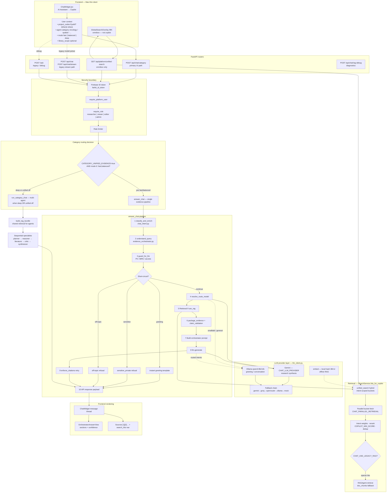
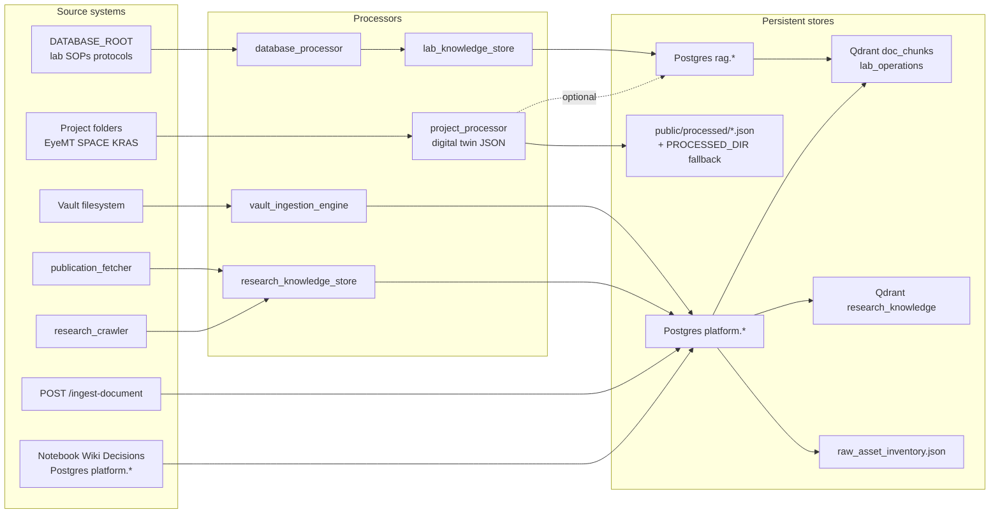
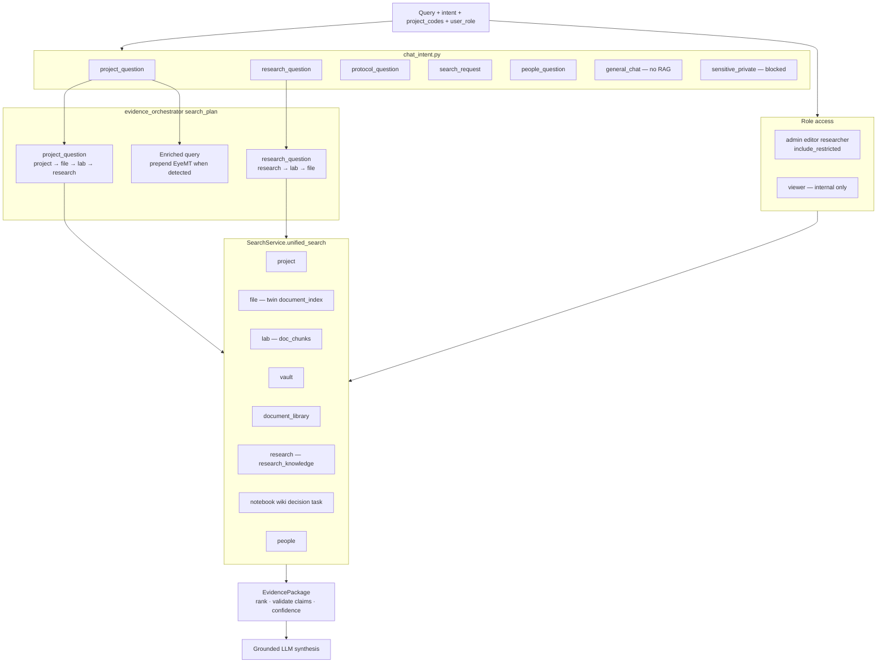
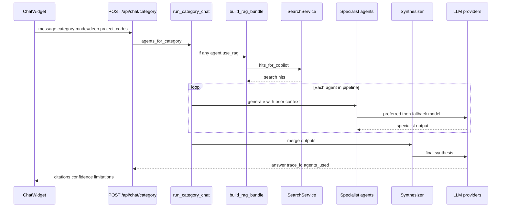
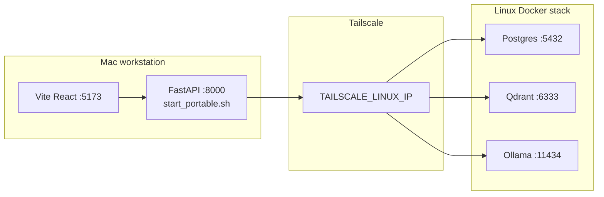

# OMEIA AI Lab Assistant — Architecture (Mermaid)

Corrected flowcharts for external review (GPT / Claude).  
**Mermaid rules applied:** arrows connect to **nodes**, not subgraph labels; no stray punctuation after `end`; dead-end nodes wired; routing labels match code.

**Code anchors:** `ChatWidget.jsx` → `POST /api/chat/category` → `answer_chat` (fast/balanced) or `run_category_chat` (deep); `GlobalSearchOverlay` → `GET /api/platform/unified-search` (separate from copilot RAG).

---

## 1. End-to-end copilot request (primary path)

**App notes**

| Topic | Behavior in code |
|--------|------------------|
| Primary UI path | `ChatWidget` default → `sendCategoryChat` → `/api/chat/category` |
| Unified evidence | `CATEGORY_UNIFIED_EVIDENCE=true` (default): fast/balanced skip multi-agent loop |
| Deep mode | `mode=deep` → `run_category_chat` even when unified is on |
| Omnibox | `GlobalSearchOverlay` → `/api/platform/unified-search` → same `SearchService`, **no LLM** |
| Deep vs pipeline | Deep agents synthesize directly; `I14` here means shared **response envelope** to the UI, not that deep runs steps 1–9 |

---

## 2. Knowledge ingestion and storage

---

## 3. Retrieval buckets and intent routing

---

## 4. Multi-agent deep mode (sequence)

---

## 5. Infrastructure topology

---

## Review brief (for external models)

**System:** OMEIA Färkkilä Lab AI Assistant — FastAPI + React copilot with RAG over Postgres, Qdrant, and JSON project twins.

**Intended invariants**

- Scientific claims grounded in retrieved evidence with citations when `use_rag`.
- PII/secrets blocked before external LLM (`guard_for_llm`).
- Admin/editor/researcher: broader retrieval (`include_restricted`); viewer: internal only.
- Project questions: hybrid project twins + publications + lab corpus.

**Known tensions (verify)**

1. Dual RAG: `SearchService` + legacy `RAGAgent` on `doc_chunks`; vector schema may differ.
2. Weak embeddings: hashed 384-d local vectors vs true semantic models.
3. Omnibox vs copilot: unified-search shares `SearchService` but not evidence orchestrator or LLM.
4. Unified path: UI shows category team; fast/balanced run `answer_chat` only.
5. Project ingest: twins in `public/processed/`; Qdrant coverage for `project_workspace` incomplete.
6. No session memory DB — context is per-request (+ project chips).
7. Streaming: `/api/chat/stream` completes retrieval before token stream.

**Questions for reviewer**

- Is intent → bucket → evidence → LLM sound?
- Failure modes in parallel retrieval (`CHAT_PARALLEL_RETRIEVAL`)?
- Security boundary adequate for admin data vs auth secrets?
- Should omnibox and copilot share one ranking pipeline?

---

*Generated for architecture review. Mermaid validated against node-to-node linking rules.*
