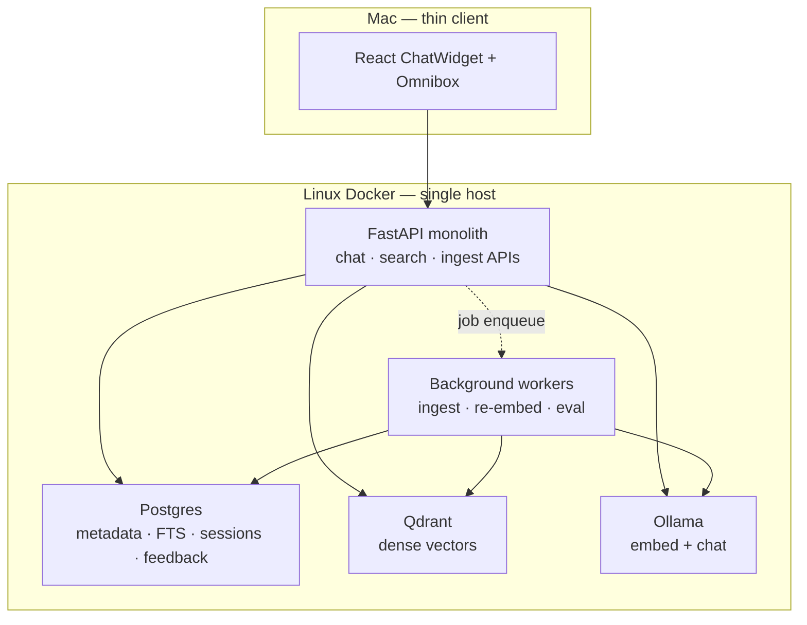
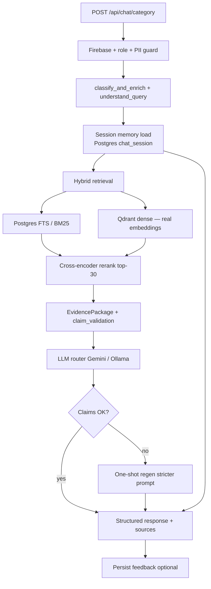

# OMEIA AI Lab Assistant — Enhancement Proposal Review

This document evaluates the **enhanced architecture proposal** (microservices, Kafka, cross-encoder reranking, self-learning, auto-correction) against the **current OMEIA codebase** and defines a **pragmatic adoption path** for the Färkkilä Lab’s real deployment: Mac thin client + Linux Docker (Postgres, Qdrant, Ollama) via `./start_portable.sh`.

**Related:** current-state diagrams in [`AI_LAB_ASSISTANT_ARCHITECTURE.md`](./AI_LAB_ASSISTANT_ARCHITECTURE.md).

---

## Executive summary

| Verdict | Detail |
|---------|--------|
| **Direction** | Correct — weak embeddings, split ingestion, and no feedback loop are real limits |
| **Full proposal as written** | **Over-scoped** for a single-lab platform today (Kafka, K8s HPA, nightly trainer fleet) |
| **Recommended approach** | **Evolve monolith → modular workers** on existing Linux Docker host; adopt must-haves in 3 phases before any Kubernetes split |

The proposal’s *goals* align with lab needs. The *implementation shape* should be downsized to match one Postgres + one Qdrant + one API process, with optional background workers on the same machine.

---

## Current state vs proposal (gap matrix)

| Capability | Proposal | OMEIA today | Gap severity |
|------------|----------|-------------|--------------|
| Intent routing | Small transformer / fasttext | Rule-based `chat_intent.py` + `evidence_orchestrator` | Low — rules work; ML intent is optional |
| Hybrid retrieval | BM25 + dense + cross-encoder | Lexical rerank + Qdrant + Postgres ILIKE; **384-d hash embed** | **High** |
| Project + research blend | Retrieval service | `project_question` hybrid + admin `include_restricted` (recent) | Medium — tuning not architecture |
| Claim / fact checking | Auto-correction microservice | `validate_claims_across_sources()` in orchestrator | Medium — no regen loop yet |
| Conversation memory | Redis / Postgres sessions | Per-request only (`project_codes` chips) | **High** |
| User feedback → learning | Feedback table + nightly trainer | None | **High** |
| Ingestion | Kafka event-driven | Scripts + `autonomous_processor` + manual API | Medium — async exists but not queued |
| Embeddings | ada-3 / Cohere / SOTA | `LLMClient.embed()` hashed bag-of-tokens | **Critical** |
| Security / PII | Pre-LLM screening | `guard_for_llm`, `sensitive_private` intent | Low — keep and extend |
| Scalability | K8s, Kafka, sharded Qdrant | Single API + remote Docker stack | Low urgency for lab scale |
| Observability | Prometheus, Grafana, OTel | `rag_diagnostics.py`, eval JSON in `tests/` | Medium |

**Already partially there (do not rebuild):**

- Evidence orchestrator (query understanding, search plan, structured sections)
- Claim validation scaffolding
- Role-based bucket access (`admin` / `editor` / `researcher`)
- Parallel bucket retrieval (`CHAT_PARALLEL_RETRIEVAL`)
- Category chat + unified evidence path
- Research KB + project twins + lab `doc_chunks`

---

## What to adopt vs defer

### Adopt now (high ROI, fits portable stack)

1. **Real embeddings** — `nomic-embed-text` or `mxbai-embed-large` on Linux Ollama; re-index `doc_chunks` + `research_knowledge`.
2. **Postgres full-text (BM25-like)** — `tsvector` on `rag.document_chunk` + `platform` research tables; merge with Qdrant in `SearchService.unified_search`.
3. **Cross-encoder rerank (light)** — local `ms-marco-MiniLM` or API rerank on top-30 hits only (not 200) to control latency on Mac→Linux link.
4. **Conversation memory** — Postgres `chat_session` + rolling summary per user (no Redis required initially).
5. **Feedback UI** — thumbs up/down + “missing source” → `platform.copilot_feedback`; drives eval set, not immediate training.
6. **Auto-correction v1** — extend orchestrator: if `claim_validations` has `conflicting` or `unsupported`, **one** regen with stricter prompt (no new microservice yet).
7. **Ingestion worker** — generalize `scripts/ops/autonomous_processor.sh` + job table (`platform.jobs` exists) instead of Kafka.

### Defer (lab scale / cost)

| Proposal item | Why defer |
|---------------|-----------|
| Kafka / RabbitMQ | Single Linux host; use Postgres job queue or file-based queue first |
| Kubernetes HPA | Docker Compose on workstation is enough for &lt;20 concurrent users |
| Sharded Qdrant cluster | Single Qdrant container until &gt;1M vectors or SLA pain |
| Nightly embedding fine-tune | Needs curated Q&A + GPU budget; start with reranker + eval gates |
| OpenAI ada-3 default | Conflicts with offline/local preference; use Ollama embeddings first |
| Separate Chat / Retrieval / LLM Router services | Split only after metrics prove API CPU bottleneck |

### Reject or keep external

- **In-session document editing** — correctly marked Won’t Have; stays in project browser / vault UI.
- Third-party consulting CTA — not part of OMEIA product scope.

---

## Pragmatic target architecture (lab-scale)

Monolith API remains; **logical** services as Python modules + optional background workers on Linux Docker.

This preserves `./start_portable.sh` while meeting most **Must Have** items without Kubernetes.

---

## Enhanced request path (target)

---

## Phased roadmap (OMEIA-specific milestones)

### Phase A — Retrieval quality (weeks 1–3) — *addresses accuracy & latency*

| Task | Deliverable |
|------|-------------|
| A1 | Ollama embedding model + env `TEXT_EMBEDDING_MODEL=nomic-embed-text` |
| A2 | Re-index script: `doc_chunks`, `research_knowledge`, project chunks |
| A3 | Postgres `tsvector` on chunk text; hybrid merge in `search_service.py` |
| A4 | Cross-encoder rerank hook (env-gated `RERANK_ENABLED`) |
| A5 | Metrics: log recall@k, p95 retrieval ms in `rag_diagnostics` / eval harness |

**Success:** EyeMT + publication questions hit correct buckets; p95 retrieval &lt; 800 ms over Tailscale.

### Phase B — Consistency & correction (weeks 4–5)

| Task | Deliverable |
|------|-------------|
| B1 | `platform.chat_session` + summary column; inject last N turns into prompt |
| B2 | Orchestrator regen when `conflicting` / `unsupported` claims |
| B3 | ChatWidget thumbs + `POST /api/chat/feedback` |
| B4 | Export feedback → `tests/evaluation_questions.csv` growth pipeline |

**Success:** Follow-up questions reuse project context; disputed answers trigger visible regen.

### Phase C — Ingestion & learning (weeks 6–8)

| Task | Deliverable |
|------|-------------|
| C1 | Job queue via Postgres `platform.jobs` (ingest, re-embed) |
| C2 | Near-real-time: new twin file → job within 5 min (`PROCESSOR_INTERVAL_SEC`) |
| C3 | Weekly eval job: `run_ai_lab_assistant_eval.py`; promote config only if metrics improve |
| C4 | Optional: LoRA / reranker fine-tune on feedback (GPU on LUMI or Linux) |

**Success:** New EyeMT doc searchable &lt; 15 min; eval score trend documented.

### Phase D — Scale & ops (only if needed)

- Split ingest worker container
- Qdrant replication
- Prometheus on Linux host
- Kubernetes — **only** if multi-lab or &gt;50 concurrent users

---

## Requirements traceability

| Requirement | Phase | Notes |
|-------------|-------|-------|
| Low-latency scalable ingest/retrieval | A, C | Real embeds + FTS + workers; not Kafka initially |
| High-accuracy answers | A, B | Hybrid + rerank + regen |
| Consistency across sessions | B | Postgres session memory |
| Auto-correction | B | Orchestrator regen, not separate service v1 |
| Self-learning | C | Feedback → eval → gated promotion |
| PII / role security | A–C | Existing guards; audit in Phase C |
| Containerised horizontal scale | D | Compose sufficient until proven otherwise |
| Near-real-time ingest (should) | C | Autonomous processor + jobs |
| Domain fine-tune (should) | C optional | After embedding baseline stable |
| Metrics (should) | A onward | Extend `rag_diagnostics` + Grafana optional |

---

## Evaluation metrics (from proposal — adapted)

| Metric | Baseline (capture now) | Target after Phase A–B |
|--------|------------------------|-------------------------|
| Retrieval p95 | Measure via `debug_rag_wiring.py` | &lt; 800 ms |
| End-to-end p95 | Category chat balanced | &lt; 5 s (Tailscale + Ollama) |
| Recall@10 on eval set | `tests/search_qa_*_last_run.json` | +15% vs baseline |
| User satisfactory rating | N/A | &gt; 80% after feedback UI |
| Auto-correction rate | N/A | Track regen %; aim &lt; 20% |

Run baseline **before** Phase A merges; store in `tests/baselines/`.

---

## Mapping proposal microservices → OMEIA modules

| Proposed service | OMEIA v1 home |
|------------------|---------------|
| API Gateway | FastAPI + Firebase (existing) |
| Chat Service | `chat_service.py` + `routers/chat.py` + `agent_categories.py` |
| Ingestion Service | `autonomous_processor` + `vault`/`lab_knowledge` ingest routers |
| Vector Indexer | `lab_knowledge_store.py`, `qdrant_research_indexer.py`, worker script |
| Retrieval Service | `search_service.py` (keep monolith module) |
| LLM Router | `llm_client.py` + `chat_conversation.resolve_route_model` |
| Auto-Correction | `evidence_orchestrator.py` regen loop |
| Self-Learning Trainer | `scripts/search/run_ai_lab_assistant_eval.py` + weekly cron |
| Message Queue | `platform.jobs` table |
| Object Storage | `DATABASE_ROOT`, vault paths, Supabase optional |

---

## Security checklist (unchanged priorities)

- [ ] `guard_for_llm` before any external Gemini call
- [ ] No Slack/Calendar tokens in frontend bundle
- [ ] `include_restricted` only for `admin` / `editor` / `researcher`
- [ ] Feedback table must not store raw patient identifiers
- [ ] Re-embed jobs skip `configs/secrets/` and auth paths

---

## Recommended next implementation PRs

1. **Embeddings upgrade** — Ollama `nomic-embed-text`, re-index CLI, env docs  
2. **Postgres FTS** — migration `sql/144_chunk_fulltext.sql` + hybrid merge  
3. **Session memory** — schema + `build_user_context` extension  
4. **Feedback API** — minimal thumbs + admin export  

### Implemented (Phase A + B core)

| Component | Path |
|-----------|------|
| SQL migration | `sql/144_copilot_enhancements.sql` |
| Ollama/hash embeddings | `app_skeleton/api/embedding_service.py` |
| Postgres FTS | `app_skeleton/api/chunk_fts.py` + `search_service.py` |
| Cross-encoder rerank | `app_skeleton/api/rerank_service.py` |
| Session memory | `app_skeleton/api/chat_session_store.py` |
| Feedback store | `app_skeleton/api/copilot_feedback_store.py` |
| Auto-regen | `chat_service._needs_evidence_regen` + one-shot regen |
| Re-index CLI | `scripts/ingest/reindex_vectors.py` |
| UI thumbs | `ChatWidget.jsx` + `POST /api/chat/feedback` |

**Deploy steps:** apply `sql/144_copilot_enhancements.sql`, set `EMBEDDING_PROVIDER=ollama` on Linux, `ollama pull nomic-embed-text`, run re-index, restart `./start_portable.sh`.

---

## Review questions for external auditors

1. Is phased monolith → workers sufficient for a single lab, or is Kafka justified earlier?
2. Is one-shot regen adequate for auto-correction vs a dedicated verifier model?
3. Which embedding model best balances Nordic/English lab text on local Ollama?
4. Should omnibox and copilot share identical hybrid+rereank path (today partially diverged)?

---

*Proposal source: external enhanced-architecture brief. This roadmap grounds it in OMEIA’s portable Mac/Linux deployment and existing evidence-orchestrator work.*
