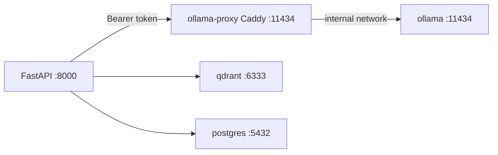

# Docker security and connection layer

OMEIA local stack uses hardened `docker-compose.yml` plus `app_skeleton/api/docker_service_client.py` for health checks, circuit breaking, and optional auto-start.

## Architecture



- **Ollama** has no host port — only `ollama-proxy` binds `127.0.0.1:11434`.
- **Postgres / Qdrant** bind `127.0.0.1` only.
- All services share the `omeia-internal` Docker network.

## One-time setup

```bash
# 1. Generate proxy bearer token (appends to configs/.env if missing)
scripts/llm/generate_ollama_token.sh

# 2. Start stack + pull models
docker compose up -d
scripts/llm/setup_ollama_local_llm.sh

# 3. Point LLM at Ollama in configs/.env
#    LLM_PROVIDER=ollama
#    OLLAMA_INTERNAL_TOKEN=<same token>
#    OLLAMA_BASE_URL=http://127.0.0.1:11434/v1

./start.sh
```

## Security controls

| Control | Implementation |
|--------|----------------|
| No public Ollama bind | `ollama` uses `expose` only; proxy on localhost |
| API key / bearer auth | Caddy `configs/caddy/Caddyfile` + `OLLAMA_INTERNAL_TOKEN` |
| Secrets not in git | Token in `configs/.env` only; documented in `.env.example` |
| Network isolation | `omeia-internal` bridge network |
| Read-only proxy | `ollama-proxy` `read_only: true` + tmpfs |
| Health checks | All compose services + API `/health` `docker_services` block |
| Audit logging | `docker_llm_audit` log lines from `llm_client` |
| Input sanitization | Control-char strip + 120k char cap before Ollama forward |

When `OLLAMA_INTERNAL_TOKEN` is empty (dev only), the proxy allows unauthenticated access and logs should warn — set a token for any shared machine.

## Connection layer env vars

| Variable | Default | Purpose |
|----------|---------|---------|
| `DOCKER_AUTO_START` | `true` | `docker compose up -d <service>` when unhealthy |
| `DOCKER_WATCH_UNHEALTHY` | `false` | Background restart watcher (dev only) |
| `DOCKER_CIRCUIT_FAILURE_THRESHOLD` | `5` | Open circuit after N probe failures |
| `DOCKER_CIRCUIT_RECOVERY_SEC` | `30` | Half-open probe delay |

## Health endpoint

`GET /health` includes `docker_services` with per-service circuit state and latency.

## Mac thin client (no Docker on Mac)

Docker Desktop uses significant RAM. Run the heavy stack on a **Linux workstation** and keep only the API + React UI on your Mac.

| Machine | Runs |
|---------|------|
| **Mac** | `./start.sh` (FastAPI + Vite) — `DOCKER_LOCAL=false` |
| **Linux workstation** | `scripts/docker/start_linux_docker_stack.sh` (Ollama, Postgres, Qdrant) |

### Mac `configs/.env`

```env
DOCKER_LOCAL=false
DOCKER_AUTO_START=false
LLM_PROVIDER=ollama
CHAT_LLM_PROVIDER=ollama
OLLAMA_MODEL=qwen2.5:3b
OLLAMA_BASE_URL=http://127.0.0.1:11434/v1
OLLAMA_INTERNAL_TOKEN=<same token as Linux>
LLM_FALLBACK_PROVIDERS=ollama,mock
POSTGRES_CONN=postgresql://farkki:farkki_dev_password@<linux-ip>:5432/farkki_ai
QDRANT_URL=http://<linux-ip>:6333
```

### SSH tunnel (recommended)

Avoid exposing Ollama on your LAN — forward from Linux to Mac localhost:

```bash
OLLAMA_SSH_HOST=user@linux-workstation ./scripts/llm/ollama_ssh_tunnel.sh
```

Then keep `OLLAMA_BASE_URL=http://127.0.0.1:11434/v1` on the Mac.

### Linux workstation one-time setup

```bash
git clone <repo> && cd OMEIA-AI
scripts/docker/start_linux_docker_stack.sh
```

On Linux, ensure `docker-compose.yml` ports are reachable from the Mac (bind `0.0.0.0` or use SSH tunnels for Postgres/Qdrant too).

You do **not** need Docker Desktop installed on the Mac. Quit it entirely to free memory.

## Troubleshooting

```bash
docker compose config          # validate compose (on Linux host)
scripts/dev/docker_bootstrap.sh    # manual bootstrap (local Docker only)
docker compose logs ollama-proxy
curl -H "Authorization: Bearer $OLLAMA_INTERNAL_TOKEN" http://127.0.0.1:11434/
```
