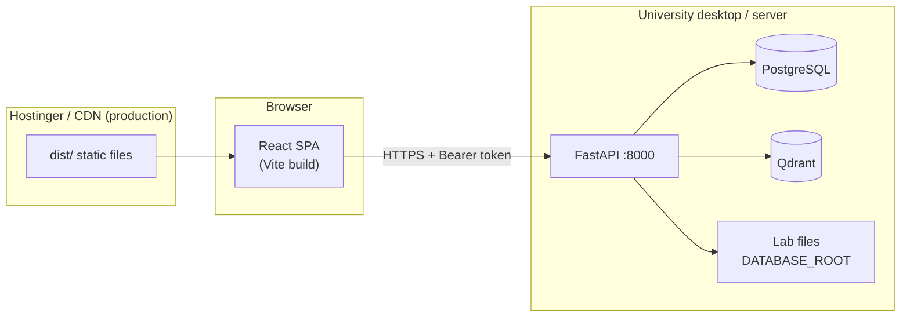

# Frontend / Backend Architecture Tutorial

This guide explains how **OMEIA-AI** is split into two applications, how to run them separately in development, and how to deploy them to different hosts in production.

---

## 1. Architecture at a glance



| Layer | Technology | Default port | Owns |
|-------|------------|--------------|------|
| **Frontend** | React 19 + Vite 8 | **5173** (dev) | UI, routing, Firebase client auth, static `dist/` |
| **Backend** | FastAPI + uvicorn | **8000** | REST API, Postgres, Qdrant, file vault, LLM proxies, secrets |
| **Infra** | Docker Compose | 5432, 6333, … | Postgres, Qdrant, Ollama (not the app itself) |

The frontend **never** holds database passwords, service-role keys, or LLM secrets. It only receives **public** `VITE_*` variables at build time.

---

## 2. Repository layout (who owns what)

```text
OMEIA-AI/
├── omeia/
│   ├── api/                    ← BACKEND (Python)
│   │   ├── main.py             FastAPI entry
│   │   ├── routers/            Route modules
│   │   └── requirements.txt
│   ├── security/               ← BACKEND (auth, CORS)
│   └── ui/
│       └── react_frontend/     ← FRONTEND (Node)
│           ├── src/
│           ├── public/
│           ├── package.json
│           └── vite.config.js
├── configs/
│   ├── .env                    Backend secrets (dev) — do not commit
│   ├── .env.backend.example    Backend-only template
│   └── DEPLOYMENT_ENV.md       Production checklist
├── scripts/
│   ├── start_backend.sh        API only
│   └── start_frontend.sh       Vite only
├── start.sh                    Convenience: backend + frontend together
└── deploy/university-desktop/  Production API install on Linux
```

**Coupling to be aware of (monorepo today):**

- Vite dev proxy forwards many paths to `:8000` (see `vite.config.js`).
- Processed JSON twins live in `react_frontend/public/processed/` (served as static files).
- `configs/.env` may still contain `VITE_*` keys for local convenience — prefer splitting (below).

---

## 3. Environment files (strict separation)

### Backend — `configs/.env`

Copy from `configs/.env.backend.example` (or `configs/.env.example` **without** any `VITE_*` lines).

| Variable | Purpose |
|----------|---------|
| `POSTGRES_CONN` | Database |
| `QDRANT_URL` | Vector search |
| `DATABASE_ROOT` / `PROJECTS_ROOT` | Lab file vault paths |
| `FIREBASE_SERVICE_ACCOUNT_PATH` | Token verification (server) |
| `SUPABASE_SERVICE_ROLE_KEY` | Backend sync only |
| `CORS_ORIGINS` | Allowed frontend origin(s) in production |
| `PLATFORM_AUTH_DISABLED` | `true` in local dev without Firebase |

**Never** put `VITE_*` in the backend `.env` on a production server.

### Frontend — `omeia/ui/react_frontend/.env.local` (dev)

Copy from `.env.local.example`:

```bash
VITE_API_URL=http://127.0.0.1:8000
# Optional Firebase client keys — see configs/FIREBASE_WEB_SETUP.md
```

### Frontend — `.env.production` (Hostinger build)

```bash
VITE_API_URL=https://api.yourdomain.example
VITE_FIREBASE_API_KEY=...
# other VITE_FIREBASE_* only
```

Build embeds these values into `dist/`. They are **public** in the browser bundle.

---

## 4. Development — three ways to run

### Option A — One command (both apps)

```bash
cd OMEIA-AI
cp configs/.env.example configs/.env    # edit POSTGRES_CONN, paths
./start.sh
```

- API: http://localhost:8000/health  
- UI: http://localhost:5173  

### Option B — Split terminals (recommended for architecture work)

**Terminal 1 — infrastructure (optional)**

```bash
docker compose -f docker-compose.yml up -d
```

**Terminal 2 — backend**

```bash
cd OMEIA-AI
cp configs/.env.backend.example configs/.env   # first time only
./scripts/dev/start_backend.sh
```

**Terminal 3 — frontend**

```bash
cd OMEIA-AI
./scripts/dev/start_frontend.sh
```

### Option C — Manual (full control)

```bash
# Backend
./deploy/university-desktop/run_api_dev.sh

# Frontend
cd omeia/ui/react_frontend
cp .env.local.example .env.local
npm ci && npm run dev
```

---

## 5. How the frontend talks to the backend

### Development

`src/api/client.js`:

- In **DEV**, base URL is `''` (same origin) so Vite proxies `/api`, `/health`, `/projects`, etc. to `http://127.0.0.1:8000`.
- Setting `VITE_API_URL=http://127.0.0.1:8000` in `.env.local` makes the client call the API host directly (CORS must allow `http://localhost:5173` — default `CORS_ORIGINS=*` in dev).

### Production

- Build with `VITE_API_URL=https://api.yourdomain.example`.
- Backend sets `CORS_ORIGINS=https://app.yourdomain.example`.
- Browser sends `Authorization: Bearer <Firebase ID token>` on protected routes.

### Health check

Sidebar “API Connected” uses `GET /health`. Verify manually:

```bash
curl -s http://127.0.0.1:8000/health | python3 -m json.tool
```

---

## 6. Production deployment (already split by design)

| Host | What runs | Docs |
|------|-----------|------|
| **Hostinger** (or any static host) | `npm run build` → upload `dist/` | `omeia/ui/react_frontend/README.md` |
| **University Linux desktop** | uvicorn + Caddy/nginx TLS | `deploy/university-desktop/README.md` |

Checklist: `configs/DEPLOYMENT_ENV.md`  
Topology: `docs/26_PRODUCTION_DEPLOYMENT.md`

```text
https://app.lab.example     →  static React (Hostinger)
https://api.lab.example     →  reverse proxy → 127.0.0.1:8000 (desktop)
```

---

## 7. API surface (backend contract)

Routes are mixed today (legacy). Common entry points:

| Path | Purpose |
|------|---------|
| `GET /health` | Liveness + DB status |
| `GET /projects`, `POST /api/projects/...` | Project portfolio |
| `GET /api/lab/sections` | Lab digital twins |
| `POST /api/search`, `GET /api/platform/unified-search` | Search |
| `POST /api/chat` | Copilot |
| `GET /database-static/*`, `GET /projects-static/*` | File vault (also proxied in dev) |

Future cleanup: normalize under `/api/v1/` (not required for split deployment today).

---

## 8. Static data the frontend loads without the API

Some screens read **processed JSON** directly:

```text
omeia/ui/react_frontend/public/processed/lab__*.json
omeia/ui/react_frontend/public/processed/{project}__*.json
```

Fetched as `/processed/{code}.json` from the Vite/static host. The backend also writes these during ingestion. For a **hard** repo split, move this to `GET /api/twins/{code}` only.

---

## 9. Checklist: clean physical split (two repos)

Use this when extracting frontend and backend into separate Git repositories.

### Frontend repo

- [ ] `package.json`, `src/`, `public/`, `vite.config.js`
- [ ] Remove `REPO_ROOT` traversal from `vite.config.js` (no reading `configs/.env`)
- [ ] Own CI: `npm ci && npm run build`
- [ ] Env: only `VITE_*` in CI secrets
- [ ] Point `VITE_API_URL` at production API

### Backend repo

- [ ] `omeia/api/`, `omeia/security/`, `scripts/`, `sql/`
- [ ] Stop writing into `react_frontend/public/processed/`
- [ ] Serve twins via API or object storage
- [ ] Own CI: pytest + uvicorn smoke test
- [ ] Docker image for API (optional; workers already have Dockerfiles under `docker/`)

### Shared contract

- [ ] OpenAPI export from FastAPI (`/openapi.json`) as the contract
- [ ] Versioned API prefix `/api/v1/`
- [ ] Document breaking changes in `docs/CHANGELOG_API.md`

---

## 10. Troubleshooting

| Symptom | Fix |
|---------|-----|
| Sidebar “API Unreachable” | Start backend; check `curl localhost:8000/health` |
| CORS error in browser | Set `CORS_ORIGINS` on backend to exact frontend URL |
| Empty lab sections | Run ingestion scripts; check `omeia/data/processed_projects/` |
| Firebase 401 | `PLATFORM_AUTH_DISABLED=true` in dev, or configure `VITE_FIREBASE_*` |
| Port 8000 in use | `lsof -ti tcp:8000 \| xargs kill` or change `OMEIA_BIND_PORT` |

---

## 11. Related docs

- `omeia/ui/react_frontend/README.md` — React dev & Hostinger build
- `configs/DEPLOYMENT_ENV.md` — env checklist
- `docs/26_PRODUCTION_DEPLOYMENT.md` — production topology
- `deploy/university-desktop/README.md` — desktop API install
- `docs/10_COMPLETE_SETUP_STEP_BY_STEP.md` — full stack + ingestion

---

## Quick reference

```bash
# Backend only
./scripts/dev/start_backend.sh

# Frontend only (backend must be up)
./scripts/dev/start_frontend.sh

# Both
./start.sh

# Production frontend build
cd omeia/ui/react_frontend
npm run build   # upload dist/
```
