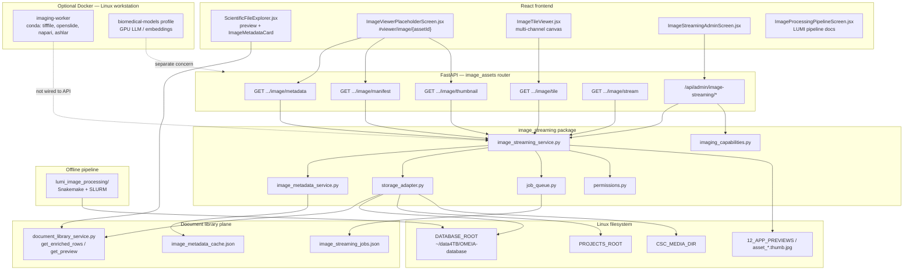
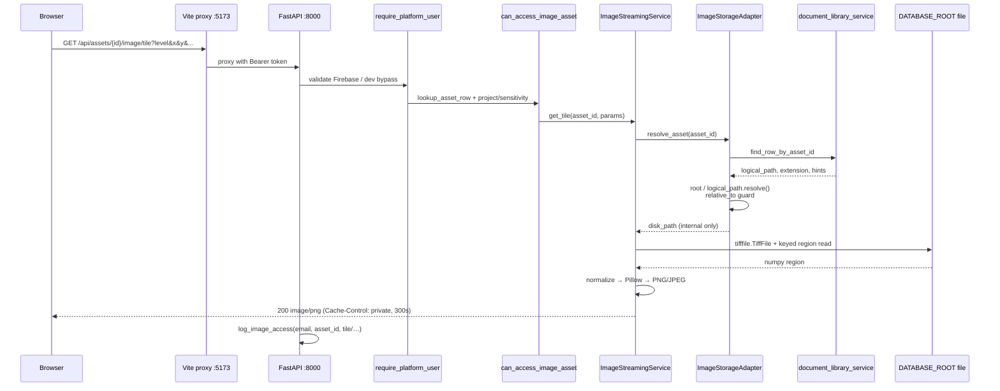
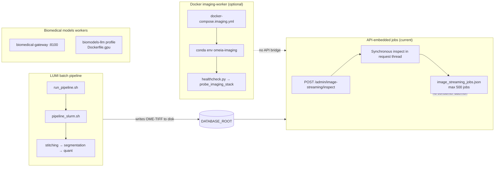
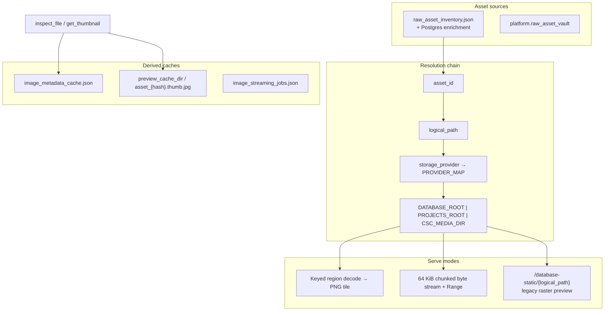

# Imaging Subsystem — Architecture Review

**Scope:** Image streaming, tile serving, pyramidal TIFF/OME-TIFF, worker architecture, Docker imaging stack, Linux workstation integration, GPU utilization, LUMI/CycIF processing pipelines, performance  
**Perspective:** Imaging Platform Architecture · Bioinformatics Infrastructure · Systems Engineering  
**Codebase:** OMEIA-AI / digital-notepad (`app_skeleton/`)  
**Date:** 2026-06-08  
**Related docs:** `docs/IMAGE_STREAMING_API.md`, `docs/IMAGING_PACKAGES_GUIDE.md`, `docs/LINUX_MEDIA_AND_DATA_PATHS.md`, `docs/IMAGE_SECURITY_NOTES.md`

---

## Table of contents

1. [Executive Summary](#1-executive-summary)
2. [Imaging Architecture Diagram](#2-imaging-architecture-diagram)
3. [Image Streaming Flow Diagram](#3-image-streaming-flow-diagram)
4. [Worker Architecture Diagram](#4-worker-architecture-diagram)
5. [Storage Flow Diagram](#5-storage-flow-diagram)
6. [GPU Utilization Review](#6-gpu-utilization-review)
7. [Performance Analysis](#7-performance-analysis)
8. [Scalability Analysis](#8-scalability-analysis)
9. [Security Analysis](#9-security-analysis)
10. [Failure Mode Analysis](#10-failure-mode-analysis)
11. [Production Risks](#11-production-risks)
12. [Production Readiness](#12-production-readiness)
13. [Recommended Improvements](#13-recommended-improvements)
14. [Files Requiring Changes](#14-files-requiring-changes)

---

## 1. Executive Summary

OMEIA implements a **two-plane imaging stack**:

| Plane | Role | Runtime |
|-------|------|---------|
| **Streaming API** | Authenticated TIFF/OME-TIFF metadata, thumbnails, pyramid tiles, byte-range stream | FastAPI on Linux API host (`image_assets.py` → `image_streaming_service.py`) |
| **Heavy imaging worker** | Conda stack (openslide, pyvips, napari, CycIF tools) for offline/HPC-style processing | Optional Docker `imaging-worker` on Linux workstation |
| **LUMI pipeline** | Illumination → stitching → segmentation (StarDist/Mesmer) → quantification | Shell/Snakemake under `app_skeleton/pipelines/lumi_image_processing/` |

### Strengths

- **Asset-ID-only streaming contract** — disk paths never returned from image APIs; `storage_adapter.py` resolves `asset_id` → `logical_path` → `DATABASE_ROOT`/`PROJECTS_ROOT` with `relative_to()` traversal guard
- **Authenticated tile/thumbnail/stream endpoints** with audit logging (`log_image_access`) and sensitivity gating (`can_access_image_asset`)
- **Frontend Napari-style viewer** — `ImageTileViewer.jsx` with multi-channel compositing, Z/T sliders, LRU tile cache (`useImageTileLoader.js`)
- **Tiered dependency model** — `requirements-imaging-core.txt` (tifffile, imagecodecs, Pillow) vs Docker workstation stack documented in `IMAGING_PACKAGES_GUIDE.md`
- **Linux-primary path resolution** — `paths.py` honors `DATABASE_ROOT` / `PROJECTS_ROOT`; `LINUX_MEDIA_AND_DATA_PATHS.md` explains Mac-thin-client vs Linux disk requirement
- **Admin readiness dashboard** — `ImageStreamingAdminScreen.jsx`, `/api/admin/image-streaming/readiness`, capabilities probe

### Critical gaps

- **Tile API previously loaded entire TIFF arrays** — fixed in this review to use keyed `page.asarray(key=…)` region reads; thumbnail generation still loads full page 0
- **No whole-slide support in streaming API** — `.svs`/`.ndpi` require `openslide` (Docker worker only); not wired to `/image/tile`
- **Imaging Docker worker is disconnected** — runs `healthcheck.py` capability report only; no RPC/queue integration with API
- **File-backed job queue** — `image_streaming_jobs.json`; admin inspect runs synchronously in HTTP request thread
- **No rate limiting** on tile/stream endpoints (documented as recommended in `IMAGE_SECURITY_NOTES.md`, not implemented)
- **GPU unused by streaming path** — GPU relevant only to LUMI segmentation (`stardist`, `mesmer`) and `docker-compose.biomodels.yml` LLM profile
- **`lookup_asset_row` scans enriched inventory** — O(n) per tile request unless inventory is cached in-process

### Verdict

The subsystem delivers a **credible dev-twin TIFF viewer** for lab inventory assets on Linux with correct auth and path hygiene. **Production microscopy viewing** at whole-slide scale requires pyvips/openslide integration, async inspect workers, tile CDN caching, rate limits, and automated metadata backfill for assets >50 MB.

**Estimated production readiness: 57%** (see §12).

---

## 2. Imaging Architecture Diagram

UI and backend mapping:

| UI area | Component | Backend |
|---------|-----------|---------|
| Document Library preview | `ScientificFileExplorer.jsx` | `document_library_service.get_preview()` → `is_streamable_image` |
| Microscopy viewer | `ImageViewerPlaceholderScreen.jsx`, `ImageTileViewer.jsx` | `/api/assets/{id}/image/*` |
| Image streaming admin | `ImageStreamingAdminScreen.jsx` | `/api/admin/image-streaming/*` |
| Image processing pipeline (info) | `ImageProcessingPipelineScreen.jsx` | Static content + LUMI scripts (not API-driven) |
| Biomedical models hub | `BioinformaticsHubScreen.jsx` | `docker-compose.biomodels.yml` (separate from TIFF streaming) |

---

## 3. Image Streaming Flow Diagram

End-to-end path for a tile request:

**Manifest-first flow (viewer init):**

1. `get_preview(asset_id)` returns `is_streamable_image`, `thumbnail_url`, `viewer_url`
2. Viewer loads `GET .../manifest` → `width`, `height`, `pyramid_levels`, `tile_size`, `z_slices`, `timepoints`
3. `useImageTileLoader` fetches tiles with auth headers; composites on canvas

---

## 4. Worker Architecture Diagram

OMEIA has **three distinct worker patterns** — only one is partially implemented for imaging:

| Worker | Trigger | Processes | Integrated with streaming API? |
|--------|---------|-----------|--------------------------------|
| `ImageJobQueue` | Admin POST inspect | TIFF header metadata | Partial — enqueue + immediate sync run |
| `imaging-worker` container | Manual `docker compose run` | Capability self-test | **No** — no tile/metadata RPC |
| LUMI `run_pipeline.sh` | CLI / SLURM | CycIF stitching, StarDist, Mesmer | **No** — separate filesystem outputs |
| Biomedical models | Docker profiles | LLM/embeddings/single-cell | **No** — different product surface |

**Gap:** `job_queue.process_pending()` exists but is **never called** from a background scheduler or lifespan hook.

---

## 5. Storage Flow Diagram

**Path configuration (Linux primary):**

| Env var | Default | Used by |
|---------|---------|---------|
| `DATABASE_ROOT` | `../OMEIA-database` or `REPO/database` | `storage_adapter`, static file mount |
| `PROJECTS_ROOT` | `DATABASE_ROOT/projects` | Project-scoped TIFF assets |
| `CSC_MEDIA_DIR` | `REPO/CSC` | CSC media provider |
| `LAB_STORAGE_ROOT` | optional SMB mount | Not used by image streaming adapter today |

`storage_adapter._infer_provider()` maps `local_database_mirror` → `database-static`, `projects/` prefix → `projects-static`.

---

## 6. GPU Utilization Review

### Streaming API — CPU only (by design)

| Component | GPU use | Evidence |
|-----------|---------|----------|
| `get_tile` | None | `tifffile` + `Pillow` on CPU |
| `get_thumbnail` | None | Full page read + resize |
| `get_stream` | None | Raw `open_read_stream` |
| `imaging_capabilities.probe_imaging_stack` | Detection only | `_probe_gpu()` via `nvidia-smi` / `torch.cuda` (added in remediation) |

### Docker imaging-worker — no GPU runtime

- `docker/imaging-worker/Dockerfile` uses `condaforge/mambaforge` — **no** `nvidia-container-runtime`, **no** `CUDA` env
- Intended for I/O-heavy decoding (openslide, pyvips), not GPU inference
- CycIF tools (`bioformats2raw`, `raw2ometiff`, `ashlar`) are CPU/JVM bound

### LUMI image processing pipeline — GPU optional

| Stage | Script | GPU |
|-------|--------|-----|
| Illumination / stitching | `imagej_basic_ashlar.py`, Ashlar | CPU |
| StarDist segmentation | `run_stardist.py`, `stardist.smk` | TensorFlow GPU if available |
| Mesmer segmentation | `mesmer.py`, `mesmer.smk` | TensorFlow GPU |
| Quantification / filtering | CPU numpy/skimage | CPU |

`scripts/check/check_gpu.sh` and `pipeline_slurm.sh` reference GPU partitions for HPC; local Linux workstation GPU is **not** probed at API startup.

### Biomedical models Docker — GPU profile separate

- `docker-compose.biomodels.yml` `--profile biomodels-llm` uses `Dockerfile.gpu`
- Unrelated to microscopy tile serving; shares Linux host GPU with segmentation jobs if both run

### Recommendation summary

- **TIFF streaming:** GPU adds little value until pyvips/GPU decode is integrated; CPU keyed reads are correct first step
- **Segmentation:** Document expected `nvidia-smi` + TensorFlow GPU visibility in LUMI `run_pipeline.sh --doctor`
- **Imaging worker:** Add optional `deploy.resources.reservations.devices` nvidia profile only if GPU-accelerated decode is added later

---

## 7. Performance Analysis

| Bottleneck | Severity | Location | Notes |
|------------|----------|----------|-------|
| Full-array TIFF load on tile | **High → Mitigated** | `image_streaming_service.get_tile` | Was `series.asarray()` / `page.asarray()`; now uses `page.asarray(key=slices)` with fallback |
| Full page load on thumbnail | Medium | `_generate_thumbnail` | Still `page.asarray()` for TIFF |
| O(n) asset lookup | Medium | `find_row_by_asset_id` | Linear scan of `get_enriched_rows()` per request |
| O(n) readiness stats | Medium | `readiness_stats()` | Scans all TIFF rows + full metadata cache |
| No server-side tile cache | Medium | `get_tile` | Every pan/zoom hits disk decode |
| Client tile cache capped at 180 | Low | `useImageTileLoader.js` | Reasonable for single viewer |
| Synchronous admin inspect | Medium | `admin_inspect` | Blocks HTTP thread for up to 100 assets |
| Per-tile min/max normalization | Low | `get_tile` | Computes per-tile histogram — correct for display, not for quantification |
| Compressed TIFF without imagecodecs | High (conditional) | tifffile decode | Returns 422/503 if codecs missing |
| Large file stub (≥50 MB) | Medium | `METADATA_ONLY_BYTES` | `tile_ready: false` until admin inspect |

**Pyramid level handling:** SubIFD chain used via `_get_pyramid_page()`; when `tif.series` exists, level still resolves through series page 0 SubIFDs (OME-TIFF common pattern).

**Frontend:** `ImageTileViewer` requests only visible tiles at computed pyramid level (`pyramidLevelForScale`); efficient client-side culling.

---

## 8. Scalability Analysis

| Dimension | Current limit | Scaling path |
|-----------|---------------|--------------|
| Concurrent tile requests | Single FastAPI process; no pool | Horizontal API replicas + shared read-only `DATABASE_ROOT` NFS |
| Asset inventory size | In-memory enriched rows per lookup | Asset-id index map refreshed on inventory reload |
| Metadata cache | Single JSON file `image_metadata_cache.json` | Move to Postgres `platform.image_asset_metadata` or Redis |
| Job queue | JSON file, 500 job cap | Redis/RQ or Celery worker on Linux |
| Whole-slide images (100k×100k) | Not viable on tifffile alone | openslide + pyvips sidecar or pre-tiled OME-Zarr |
| Multi-user tile storms | No rate limit | Per-user token bucket on `/image/tile` |
| Docker imaging worker | Manual one-shot | Kubernetes Job or systemd timer calling `process_pending` |

**Linux workstation model:** Mac thin client tunnels to single Linux host — all tile I/O concentrates on one machine; acceptable for small lab, SPOF at scale.

---

## 9. Security Analysis

| Control | Status | Implementation |
|---------|--------|----------------|
| Authentication | ✅ | `require_platform_user` on `image_assets` router via `main.py` `api_dependencies` |
| Authorization | ✅ | `can_access_image_asset` → `can_download_file` + restricted/confidential → admin/editor |
| Path traversal | ✅ | `disk_path.relative_to(root.resolve())` in `storage_adapter.resolve_asset` |
| Path leakage in responses | ✅ | `_public_response()` strips `disk_path`, `logical_path`, `provider` |
| Audit logging | ✅ | `log_image_access` on metadata/manifest/thumbnail/tile/stream |
| Tile size cap | ✅ | `MAX_TILE_EDGE=512`, `MAX_TILE_PIXELS=262144` |
| Range header validation | ✅ | 416 on invalid Range in `image_stream` |
| Rate limiting | ❌ | Documented in `IMAGE_SECURITY_NOTES.md` only |
| Admin inspect authorization | ✅ | `require_admin_user` |
| CORS / credentials | ✅ | Standard FastAPI middleware |
| Docker imaging mount | ✅ | `DATABASE_ROOT` mounted read-only in compose |
| Dev auth bypass risk | ⚠️ | `PLATFORM_AUTH_DISABLED` blocked in production via `validate_environment()` |

**Note:** Document library `get_preview` still returns `logical_path` to the frontend for non-streaming preview URLs — separate from image streaming contract.

---

## 10. Failure Mode Analysis

| Failure | Symptom | Root cause | Mitigation |
|---------|---------|------------|------------|
| Missing file on Linux disk | 404 image asset | `DATABASE_ROOT` not synced from Mac | `LINUX_MEDIA_AND_DATA_PATHS.md` rsync procedure |
| `tifffile` not installed | 503 tile/metadata | Core requirements not pip-installed | `requirements-imaging-core.txt` in Linux bootstrap |
| `imagecodecs` missing | 422 tile decode | Compressed TIFF pages | Install imagecodecs; readiness dashboard flags |
| Out-of-bounds tile x,y | 400 | Client bug or wrong pyramid level | Bounds check in `_read_tile_region` (added) |
| Corrupt TIFF | 422 | Decode exception | Logged warning; user sees degraded thumbnail |
| Large TIFF never inspected | `tile_ready: false` | Size ≥ 50 MB stub | Admin batch inspect or background worker |
| Thumbnail failure | 1×1 gray JPEG placeholder | Silent fallback in `get_thumbnail_bytes` | Could surface `streaming_status: degraded` |
| Job queue write race | Lost job updates | JSON file not locked | Move to DB or file lock |
| Wrong compose file on Linux | `no such service: imaging-worker` | Using root compose without profile | Use `docker-compose.imaging.yml` per guide |
| Apple Silicon Docker build | No ashlar/bioformats2raw | amd64-only conda packages | Build on x86 Linux workstation |
| GPU segmentation OOM | SLURM job fail | Batch size / model | `run_pipeline.sh --doctor`, reduce tile size |
| Auth enabled in tests | 401 in CI | `APP_ENV` not development | Run tests with `APP_ENV=development` |

---

## 11. Production Risks

| Risk | Likelihood | Severity | Mitigation |
|------|------------|----------|------------|
| Tile storm from multi-user viewer | Medium | High | Rate limits; CDN cache for immutable tiles |
| Multi-GB TIFF OOM on thumbnail | Medium | High | pyvips shrink-on-load; async thumbnail jobs |
| Inventory scan latency on every tile | Medium | Medium | `asset_id` hash index |
| Metadata cache JSON corruption | Low | Medium | Atomic writes; Postgres migration |
| Docker worker drift from API | High | Low | Version pin in readiness `packages` report |
| LUMI output not registered in inventory | Medium | Medium | Post-pipeline vault ingest hook |
| Mac client browsing without Linux data | High | High | UI banner when `resolve_asset` misses file |
| No whole-slide format support | High | Medium | openslide integration roadmap |
| Synchronous inspect timeout | Medium | Medium | Background worker + job status polling |
| Single-host Linux SPOF | Medium | High | Document HA path; read replicas for API only |

---

## 12. Production Readiness

**Score: 57%**

| Criterion | Weight | Score | Rationale |
|-----------|--------|-------|-----------|
| Core tile/metadata API | 20% | 75% | Endpoints complete; keyed reads added; bounds validation |
| Auth & path security | 15% | 85% | Strong asset-id model; missing rate limits |
| Frontend viewer | 15% | 70% | Full multi-channel viewer; hash routing works |
| Linux deployment | 15% | 65% | Documented paths; imaging pip deps manual; Docker optional |
| Worker/automation | 10% | 30% | JSON queue; no background processor |
| Whole-slide / OME-Zarr | 10% | 20% | tifffile-only; openslide in unused Docker image |
| GPU pipeline integration | 5% | 40% | LUMI has GPU scripts; not tied to platform health |
| Observability | 5% | 55% | Audit logs + readiness; no metrics/tracing |
| Test coverage | 5% | 60% | `test_image_streaming.py` — 11 pass with dev auth |

**Ready for:** internal lab preview of inventory TIFF/OME-TIFF on Linux with synced `DATABASE_ROOT`  
**Not ready for:** production whole-slide hosting, multi-tenant tile CDN, unattended inspect at scale

---

## 13. Recommended Improvements

### Phase 1 — Quick wins (this review implemented subset)

1. ✅ Keyed region tile reads instead of full `asarray()` — `image_streaming_service.py`
2. ✅ Tile bounds validation (400 on out-of-range x/y) — `_read_tile_region`
3. ✅ Pyramid page resolution via SubIFD chain — `_get_pyramid_page`
4. ✅ Manifest `z_slices` / `timepoints` from OME axes — `build_manifest`
5. ✅ GPU probe in `imaging_capabilities` for admin readiness
6. ✅ Docker `healthcheck` on `imaging-worker` compose services
7. ✅ Public `find_row_by_asset_id` for consistent lookup

### Phase 2 — Performance & reliability (2–4 weeks)

8. Server-side LRU tile cache keyed by `(asset_id, level, x, y, channel, z, t)`
9. pyvips `thumbnail` / `crop` path for thumbnails and large TIFFs
10. Background worker cron: `ImageJobQueue.process_pending` on Linux systemd timer
11. In-memory `asset_id → row` index refreshed on inventory reload
12. Auto-enqueue inspect for streamable assets > 50 MB on preview first open
13. Surface thumbnail failure as `streaming_status: degraded` instead of silent 1×1 JPEG

### Phase 3 — Format & platform breadth (4–8 weeks)

14. openslide bridge for `.svs`, `.ndpi`, `.vms` via Docker sidecar HTTP shim
15. OME-Zarr tile source (`zarr` + `fsspec`) for cloud-native assets
16. Rate limiting middleware on `/image/tile` and `/image/stream`
17. Postgres table for `image_metadata` replacing JSON cache
18. Post-LUMI hook: register stitched OME-TIFF in vault + trigger inspect

### Phase 4 — Production hardening

19. Prometheus metrics: tile latency, decode errors, cache hit rate
20. Immutable tile ETag + optional CDN in front of API
21. HA: read-only NFS `DATABASE_ROOT` + stateless API replicas
22. Integration tests with golden OME-TIFF fixtures (pyramidal, multi-channel, compressed)

---

## 14. Files Requiring Changes

### Priority 1 — streaming hot path

| File | Why |
|------|-----|
| `app_skeleton/api/image_streaming/image_streaming_service.py` | Tile/thumbnail decode, caching, pyvips path |
| `app_skeleton/api/image_streaming/storage_adapter.py` | Asset index cache; openslide provider |
| `app_skeleton/api/image_streaming/image_metadata_service.py` | Postgres backing; auto-inspect triggers |
| `app_skeleton/api/image_streaming/job_queue.py` | File locking or Redis migration |
| `app_skeleton/api/routers/image_assets.py` | Rate limits; async inspect job status endpoint |

### Priority 2 — inventory integration

| File | Why |
|------|-----|
| `app_skeleton/api/document_library_service.py` | Bulk streamable asset index; preview path consistency |
| `app_skeleton/api/document_extraction.py` | `_extract_image_metadata` overlap with streaming inspect |
| `app_skeleton/api/paths.py` | `LAB_STORAGE_ROOT` provider for image adapter |

### Priority 3 — Docker & Linux ops

| File | Why |
|------|-----|
| `docker-compose.imaging.yml` | Worker API bridge; optional GPU device reservation |
| `docker/imaging-worker/Dockerfile` | Sidecar FastAPI for openslide decode |
| `scripts/start_linux.sh` | Auto pip install `requirements-imaging-core.txt` |
| `scripts/imaging/sync_imaging_worker_to_linux.sh` | Already correct; keep in deploy loop |

### Priority 4 — frontend

| File | Why |
|------|-----|
| `app_skeleton/ui/react_frontend/src/features/imaging/components/ImageTileViewer.jsx` | Error UX; loading skeleton; tile retry |
| `app_skeleton/ui/react_frontend/src/shared/hooks/useImageTileLoader.js` | In-flight dedup exists; add abort on unmount race |
| `app_skeleton/ui/react_frontend/src/pages/ImageStreamingAdminScreen.jsx` | Show GPU probe; bulk inspect progress |

### Priority 5 — offline pipelines

| File | Why |
|------|-----|
| `app_skeleton/pipelines/lumi_image_processing/scripts/run_pipeline.sh` | Platform health hook; GPU doctor output |
| `app_skeleton/pipelines/lumi_image_processing/scripts/2-segmentation/stardist/run_stardist.py` | GPU fallback logging |

### Priority 6 — tests & docs

| File | Why |
|------|-----|
| `tests/test_image_streaming.py` | Golden pyramidal TIFF fixtures; auth fixture helper |
| `docs/IMAGE_STREAMING_API.md` | Document 400 bounds errors, 422 decode failures |

---

## Appendix A — Package tiers (verified)

| Tier | File | Packages |
|------|------|----------|
| Core | `requirements-imaging-core.txt` | tifffile, imagecodecs, numpy, Pillow |
| Extended | `requirements-imaging-extended.txt` | zarr, fsspec, dask, scikit-image, deeptile |
| Workstation | `requirements-imaging-workstation.txt` | pyvips, openslide-python, aicsimageio |
| Docker conda | `docker/imaging-worker/environment-core.yml` | Above + napari, pyqt |
| Docker CycIF amd64 | `environment-cycif-amd64.yml` | bioformats2raw, raw2ometiff, ashlar |

## Appendix B — API endpoint summary

| Method | Path | Auth |
|--------|------|------|
| GET | `/api/assets/{asset_id}/image/metadata` | platform user |
| GET | `/api/assets/{asset_id}/image/manifest` | platform user |
| GET | `/api/assets/{asset_id}/image/thumbnail` | platform user |
| GET | `/api/assets/{asset_id}/image/tile` | platform user |
| GET | `/api/assets/{asset_id}/image/stream` | platform user |
| GET | `/api/admin/image-streaming/readiness` | admin |
| GET | `/api/admin/image-streaming/capabilities` | admin |
| POST | `/api/admin/image-streaming/inspect` | admin |
| POST | `/api/admin/image-streaming/retry-failed` | admin |

## Appendix C — Remediation applied (2026-06-08)

| Change | File |
|--------|------|
| Keyed tile region reads + bounds + pyramid fix | `image_streaming_service.py` |
| Manifest Z/T axis counts | `image_streaming_service.py` |
| GPU probe in capabilities | `imaging_capabilities.py` |
| Docker healthcheck | `docker-compose.imaging.yml`, `docker-compose.yml` |
| Public asset row lookup | `document_library_service.py`, `storage_adapter.py` |
| Out-of-bounds tile test | `tests/test_image_streaming.py` |
