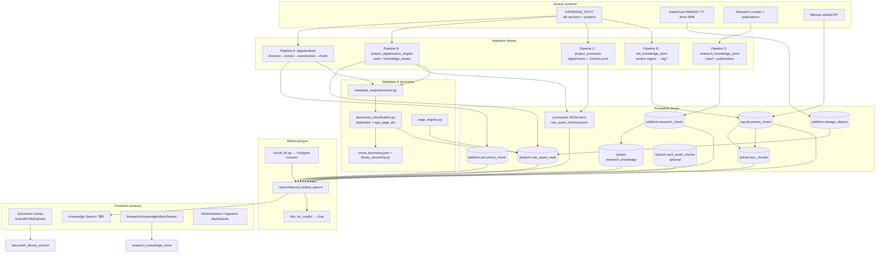
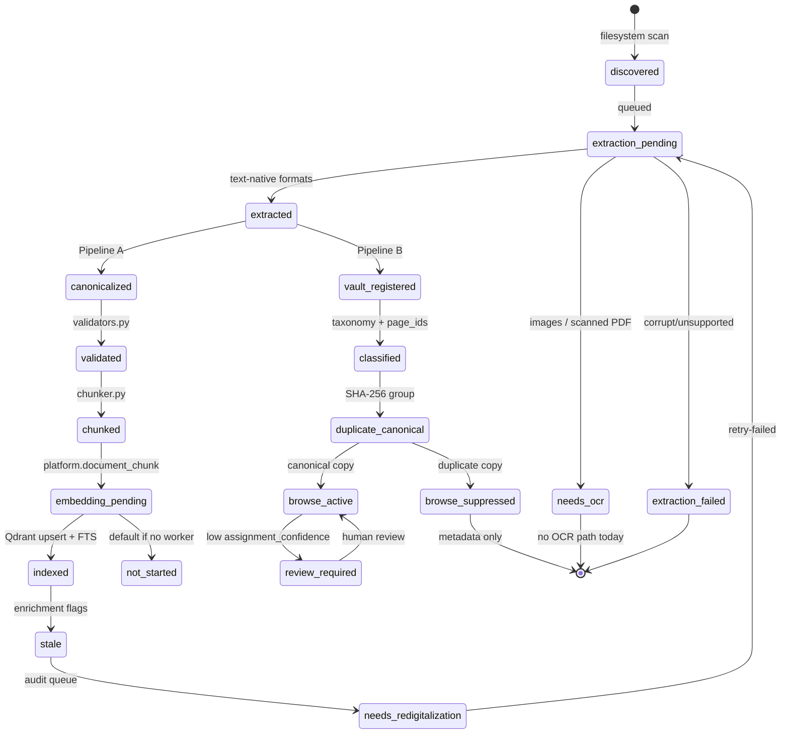
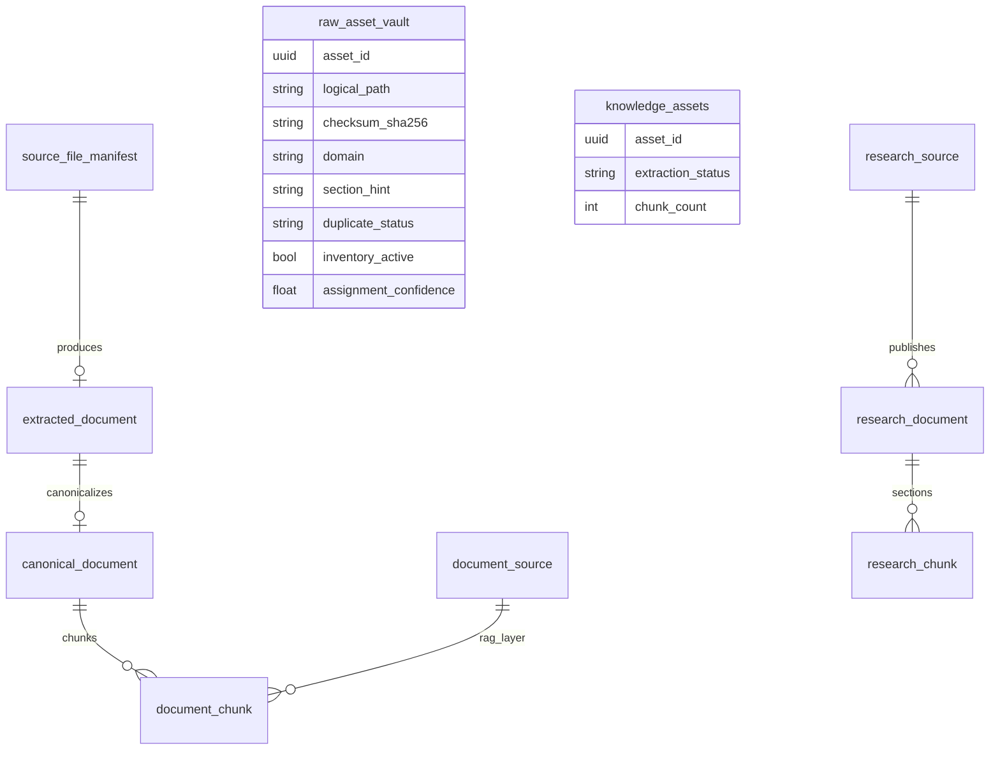
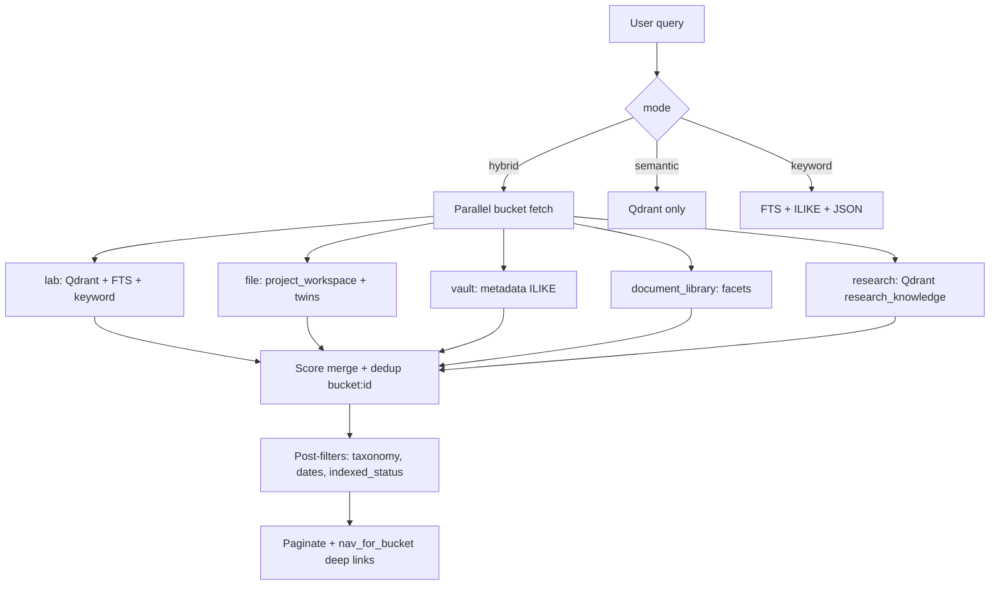
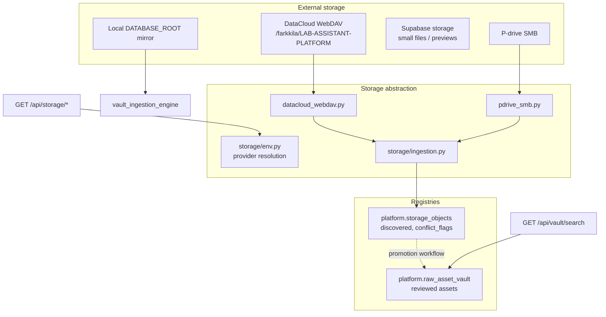
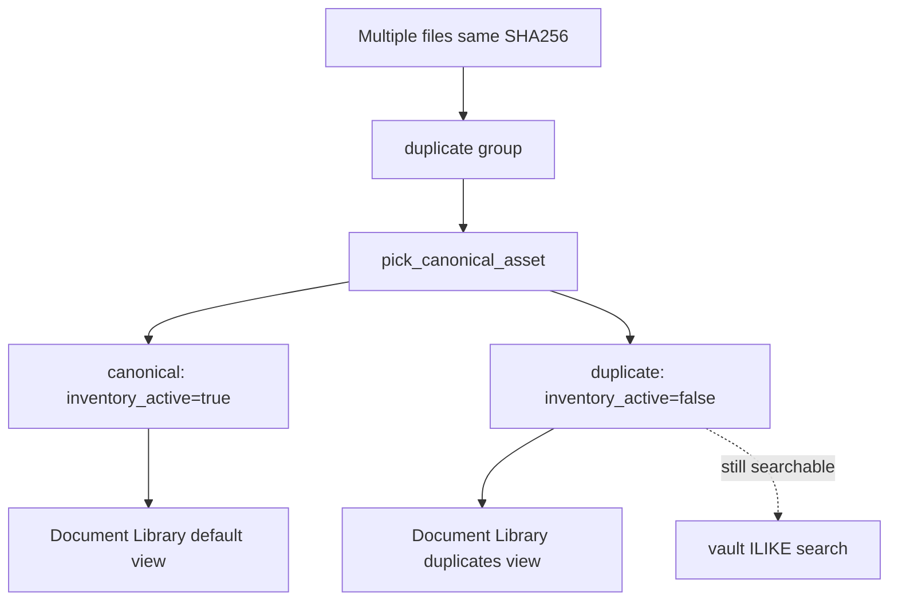
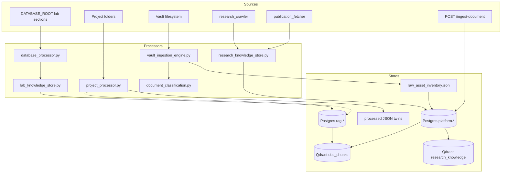

# Knowledge & Document Subsystem — Architecture Review

**Scope:** Document Library, Document Extraction, Vault, Storage, Research Knowledge, Knowledge Base, Digitalization, Metadata, Taxonomy  
**Perspective:** Knowledge Systems · Data · Information Retrieval · Scientific Data Engineering  
**Codebase:** OMEIA-AI / digital-notepad (`app_skeleton/`)  
**Date:** 2026-06-08

---

## Table of contents

1. [Executive Summary](#1-executive-summary)
2. [Knowledge Architecture Diagram](#2-knowledge-architecture-diagram)
3. [Ingestion Pipeline Diagram](#3-ingestion-pipeline-diagram)
4. [Document Lifecycle Diagram](#4-document-lifecycle-diagram)
5. [Metadata Architecture](#5-metadata-architecture)
6. [Taxonomy Review](#6-taxonomy-review)
7. [Searchability Review](#7-searchability-review)
8. [Storage Architecture Review](#8-storage-architecture-review)
9. [Data Quality Risks](#9-data-quality-risks)
10. [Duplication Risks](#10-duplication-risks)
11. [Scalability Risks](#11-scalability-risks)
12. [Security Risks](#12-security-risks)
13. [Production Readiness](#13-production-readiness)
14. [Missing Features](#14-missing-features)
15. [Technical Debt](#15-technical-debt)
16. [Recommended Improvements](#16-recommended-improvements)
17. [Files Needing Refactoring](#17-files-needing-refactoring)

---

## 1. Executive Summary

OMEIA implements a **multi-plane knowledge platform** — not a single ingestion/search pipeline. The same lab files can exist simultaneously in:

- **Vault registry** (`platform.raw_asset_vault`) — metadata + checksums
- **Digitalization pipeline** (`platform.document_chunk`) — canonical extract → chunk
- **RAG layer** (`rag.document_chunk` + Qdrant `doc_chunks`) — copilot retrieval
- **Research KB** (`platform.research_chunk` + Qdrant `research_knowledge`) — publications/crawl
- **On-disk twins** (`processed/*.json`, `{project}.chunks.jsonl`) — UI previews

### Strengths

- Rich domain modeling for a research lab (projects, wet-lab, orders, imaging, publications)
- Unified search merger (`SearchService`) across 10+ buckets with intent-aware copilot routing
- Vault-first design: blobs stay on disk; Postgres holds searchable metadata
- Duplicate canonicalization by SHA-256 (browse suppression, not deletion)
- Recent production hardening: hybrid FTS + vectors, project Qdrant indexing, session memory

### Critical gaps

- **No OCR engine** — scanned PDFs/images flagged `needs_ocr` but never transcribed
- **Three parallel chunk stores** with different sizes/overlaps (700 tokens vs 1800 chars vs 4200 chars)
- **Embedding dimension fragmentation** (`doc_chunks` @ 768 vs `research_knowledge` @ 384 until reconciled)
- **Vault search is metadata-only** — `vector_status` filter does not imply semantic vault search
- **JSON inventory ↔ Postgres drift** — fallback paths can serve stale data

### Verdict

Architecturally ambitious and **dev-twin ready**; **production retrieval quality** depends on reconciling indexes, enabling real embeddings, completing OCR, and collapsing duplicate pipelines.

---

## 2. Knowledge Architecture Diagram

UI areas map to these backend planes:

| UI area | Primary backend | Search bucket |
|---------|-----------------|---------------|
| Document Library | `document_library_service.py` + audit inventory | `document_library` |
| Document Extraction | `document_extraction.py`, `digitalization/` | (feeds vault + chunks) |
| Vault | `raw_vault_store.py`, `vault_ingestion_engine.py` | `vault`, `vault_review` |
| Storage | `app_skeleton/storage/*`, `storage_objects` | (ingest → vault) |
| Research Knowledge | `research_knowledge_store.py` | `research` |
| Knowledge Base | `lab_knowledge_store.py` + `rag.*` + copilot | `lab`, `file` |
| Digitalization | `digitalization/ingestion_job.py` | status in library UI |
| Metadata | `metadata_engine/enricher.py` | facets in Document Library |
| Taxonomy | `smart_taxonomy.json`, `library_taxonomy.py` | scope chips / filters |



### Key modules reference

| Role | Path |
|------|------|
| Unified search | `app_skeleton/api/search_service.py` |
| Search API | `app_skeleton/api/routers/search.py` |
| Document library | `app_skeleton/api/document_library_service.py` |
| Vault store | `app_skeleton/api/raw_vault_store.py` |
| Vault ingestion | `app_skeleton/api/vault_ingestion_engine.py` |
| Research KB | `app_skeleton/api/research_knowledge_store.py` |
| Lab knowledge / RAG | `app_skeleton/api/lab_knowledge_store.py` |
| FTS | `app_skeleton/api/chunk_fts.py` |
| Qdrant helpers | `app_skeleton/api/qdrant_vectors.py` |
| Copilot architecture | `docs/AI_LAB_ASSISTANT_ARCHITECTURE.md` |
| Search audit | `docs/31_SEARCH_UNIFIED_AUDIT_AND_SOURCE_BUNDLE.md` |

---

## 3. Ingestion Pipeline Diagram

OMEIA has **three parallel ingestion/digitalization tracks**:

1. **Pipeline A** — `app_skeleton/digitalization/` (scan → extract → canonicalize → validate → chunk → `platform.*`)
2. **Pipeline B** — `project_digitalization_engine.py` → vault + `knowledge_assets`
3. **Pipeline C** — `project_processor.py` / `database_processor.py` → digital twins + `.chunks.jsonl`
4. **Pipeline D** — `research_knowledge_store.py` → crawl/publications
5. **Pipeline E** — `lab_knowledge_store.py` → `rag.*`

```mermaid
flowchart LR
    subgraph DISCOVER["1. Discover"]
        M1["manifest.scan_local_directory"]
        M2["vault_ingestion_engine.scan"]
        M3["storage.ingestion scan"]
    end

    subgraph EXTRACT["2. Extract"]
        E1["document_extraction.py<br/>PDF/DOCX/XLSX/PPTX/CSV"]
        E2["digitalization/extractors.py"]
        E3["scientific_document_parser.py<br/>publications"]
        OCR{"OCR available?"}
        OCR -->|NO| FLAG["needs_ocr / metadata_only<br/>PIPELINE STOPS"]
    end

    subgraph ENRICH["3. Enrich"]
        N1["canonicalizer.py"]
        N2["metadata_engine/enricher.py"]
        N3["document_classification.py<br/>taxonomy + duplicates"]
        N4["validators.py"]
    end

    subgraph CHUNK["4. Chunk"]
        C1["digitalization/chunker.py<br/>700 tok / 100 overlap"]
        C2["document_extraction._chunk_text<br/>1800 char / 250 overlap"]
        C3["project_knowledge_extractor<br/>~4000 char paragraphs"]
        C4["scientific_document_parser<br/>4200 char sections"]
    end

    subgraph INDEX["5. Index"]
        I1["platform.document_chunk"]
        I2["rag.document_chunk"]
        I3["platform.research_chunk"]
        I4["Qdrant upsert"]
        I5["chunk_fts migration 144"]
        VQ["vectorization_job queue<br/>VECTORIZATION_ENABLED"]
    end

    DISCOVER --> EXTRACT
    E1 & E2 --> OCR
    EXTRACT --> ENRICH --> CHUNK --> INDEX
    I2 --> I4
    I3 --> I4
    I1 -.->|not auto-wired| I4
    PG_VAULT -.-> VQ -.-> QD_VAULT
```



### Pipeline A stages (`ingestion_job.run_digitalization()`)

| Stage | Module | Output table |
|-------|--------|--------------|
| Discover | `manifest.scan_local_directory()` | `platform.source_file_manifest` |
| Extract | `extractors.extract_file()` | `platform.extracted_document` |
| Canonicalize | `canonicalizer.canonicalize()` | `platform.canonical_document` |
| Validate | `validators.validate_canonical()` | — |
| Chunk | `chunker.chunk_document()` | `platform.document_chunk` |
| Audit | job runner | `platform.digitalization_job`, `digitalization_event_log` |

Early exit on `needs_ocr` or `extraction_failed` — no canonicalization/chunking.

### Chunking parameters (not unified)

| Track | File | Strategy | Defaults |
|-------|------|----------|----------|
| Digitalization pipeline | `digitalization/chunker.py` | Section-first, token windows | 700 tokens, 100 overlap |
| Digital twin / vault | `document_extraction.py` | Char windows | 1800 chars, 250 overlap |
| RAG config (declarative) | `configs/rag_config.yaml` | 700 tokens / 120 overlap | Not all wired in code |
| Legacy project ingest | `project_knowledge_extractor.py` | Paragraph merge | ~4000 chars |
| Research KB | `scientific_document_parser.py` | Section headings | 4200 chars, 650 overlap |
| Manual upload API | `routers/vault.py` | Sliding window | 3500 chars, 500 overlap |

### OCR support: partial (detection only)

| Signal | Location | Behavior |
|--------|----------|----------|
| `ENABLE_OCR` env | `project_digitalization_engine.py` | Echoed in report only — never invokes OCR |
| `needs_ocr` status | `digitalization/extractors.py`, `status.py` | Images → metadata only; pipeline stops |
| `ocr_needed` column | `sql/119_project_digitalization.sql` | PDF char_count < 20 |
| Low-confidence skip | `project_knowledge_extractor.py` | confidence < 98% → content cleared |

**No implementations** for Tesseract, Azure Document Intelligence, EasyOCR, or PaddleOCR.

### SQL schemas (key tables)

| Migration | Tables |
|-----------|--------|
| `sql/140_document_digitalization_pipeline.sql` | `source_file_manifest`, `digitalization_job`, `extracted_document`, `canonical_document`, `document_chunk`, `digitalization_event_log` |
| `sql/119_project_digitalization.sql` | `knowledge_assets`, `extracted_texts`, `digitalization_runs`, … |
| `sql/111_raw_asset_vault.sql` | `raw_asset_vault` |
| `sql/118_vault_ingestion_engine.sql` | `vault_scan_checkpoint` |
| `sql/040_rag_audit_security_schema.sql` | `rag.document_source`, `rag.document_chunk` |
| `sql/142_research_knowledge.sql` | `research_source`, `research_document`, `research_chunk` |
| `sql/144_copilot_enhancements.sql` | FTS on `rag.document_chunk` |

### HTTP APIs

**Digitalization** (`routers/digitalization.py`):

- `GET /api/digitalization/status`
- `POST /api/digitalization/scan`, `POST /api/digitalization/run`
- `GET /api/digitalization/documents`, `GET /api/digitalization/jobs/{job_id}`
- `GET /api/digitalization/chunks/{document_id}`

**Vault** (`routers/vault.py`):

- `POST /api/vault/ingest/scan`, `POST /api/vault/ingest/project/{project_id}`
- `POST /api/digitalize/scan`, `POST /api/digitalize/project/{project_name}`
- `POST /api/digitalize/retry-failed`, `GET /api/digitalize/search`
- `POST /ingest-document` (pre-extracted text → Qdrant)
- `GET /api/vault/dedupe-report`

---

## 4. Document Lifecycle Diagram



Statuses defined in `digitalization/status.py` and surfaced in `ScientificFileExplorer.jsx` as badges: Indexed, Metadata only, Needs redigitalization, Pending extraction, etc.

---

## 5. Metadata Architecture

### Layers (bottom → top)

| Layer | Module | Fields / purpose |
|-------|--------|------------------|
| File manifest | `digitalization/manifest.py`, vault scan | `checksum_sha256`, size, mtime, `logical_path` |
| Extraction record | `platform.extracted_document`, `extracted_texts` | char_count, `ocr_needed`, language_guess |
| Canonical document | `platform.canonical_document` | document_type, domain, entities JSON |
| Enriched inventory | `metadata_engine/enricher.py` | project path parsing, document_role, metadata_score/grade |
| Classification | `document_classification.py` | `standard_category`, `app_page_ids`, duplicate_status |
| Page routing | `page_registry.py` | `page_domain_id`, `page_section_id` for vault→UI |
| Display | `metadata_engine/display_titles.py` | human-readable titles for library UI |



### Gap

Two digitalization schemas coexist — legacy `knowledge_assets` (searchable) vs newer `canonical_document` (API list-only). Metadata enrichment runs on inventory JSON; Postgres sync may lag.

---

## 6. Taxonomy Review

### Three parallel taxonomies (can disagree on the same file)

1. **Smart library taxonomy** — `configs/document_library/smart_taxonomy.json`
   - Domain tabs (Overview, Wet-lab, Orders, …), scope chips, `assign_smart_chip()` at query time
   - Powers Document Library faceted filters + `TaxonomyConnectorMap.jsx`

2. **Standard document classification** — `document_classification.py`
   - `APP_PAGES` mirrors frontend nav; `infer_standard_category()` from path heuristics
   - Applied in `process_inventory_pipeline.py`

3. **Page registry** — `page_registry.py` + `search_nav.py`
   - Maps vault rows to UI domain/section for deep-linking search hits

### Assessment

| Aspect | Rating | Notes |
|--------|--------|-------|
| Coverage | Good | Lab-specific categories (billing, protocols, imaging, orders) |
| Consistency | Weak | Three classifiers; no single `taxonomy_id` FK |
| Maintainability | Medium | JSON config + Python heuristics; no ontology/versioning |
| Search integration | Good | Chips flow into `SearchService._build_search_filters()` |
| Project awareness | Good | `projects/{code}/...` path parsing preserved |

### Recommendation

Introduce a single `platform.taxonomy_assignment` table with provenance (`smart_chip`, `standard_category`, `manual_review`) and deprecate runtime-only chip assignment.

---

## 7. Searchability Review

**Entry point:** `GET /api/platform/unified-search` → `SearchService.unified_search()`  
**Copilot:** `hits_for_copilot()` with per-intent bucket weights, min-score gates, rerank, cache

| Bucket | Engine | Semantic? | Best for |
|--------|--------|-----------|----------|
| `document_library` | Faceted inventory + ILIKE | Partial | Finding files by status/taxonomy |
| `vault` | Postgres ILIKE on paths | No | Locating assets by name/path |
| `vault_review` | Review queue | No | Low-confidence assignments |
| `lab` | Qdrant `doc_chunks` + keyword + FTS | Yes | Protocols, lab ops, section docs |
| `file` | Processed twins + `project_workspace` Qdrant | Yes | Project-specific content |
| `research` | Qdrant `research_knowledge` + ILIKE | Yes | Publications, crawled lab web |
| `notebook/wiki/decision/task` | Postgres ILIKE | No | Operational notes |
| `people` | `people_index.py` | No | Lab member lookup |



### Qdrant collections

| Collection | Vector name | Corpus / use |
|------------|-------------|--------------|
| `doc_chunks` | `text` | `lab_operations`, `project_workspace` |
| `research_knowledge` | `text` | Public/internal research KB |
| `vault_asset_chunks` | (optional) | Vault text when `VECTORIZATION_ENABLED=true` |

### Searchability scorecard

| Criterion | Score | Issue |
|-----------|-------|-------|
| Keyword recall | B+ | FTS on `rag.document_chunk` (migration 144) |
| Semantic recall | B− | Ollama `nomic-embed-text` when configured; hash fallback weak |
| Cross-corpus | A− | Unified merger is strong architecturally |
| Vault content search | D | Path/metadata only unless vectorization enabled |
| Consistency | C | Legacy endpoints (`knowledge.py`, `research.py`) still exist |
| Copilot grounding | B | Thin index limits answer quality at scale |

### Legacy / parallel search endpoints (still exist)

- `app_skeleton/api/routers/knowledge.py` — lab/hybrid/unified aliases
- `app_skeleton/api/routers/research.py` — `/platform/search` (notebook/wiki/decisions)
- `app_skeleton/api/research_search_service.py` — research hit normalization

---

## 8. Storage Architecture Review



### Design principles (sound)

- Blobs never copied into Postgres; logical paths only in API responses
- `original_path` stripped in `_public_row()` before API
- Provider enum with deprecation of Cloudflare R2

### Valid providers

`datacloud_webdav`, `pdrive_smb`, `supabase_storage`, `supabase_postgres`, `local_database_mirror`, `local_dev`, `unknown`

### Storage data flow

```text
GET /api/storage/datacloud|pdrive/{list,scan,manifest}
  → connector.build_manifest()
  → POST /api/storage/ingest/{provider_id}
  → upsert_manifest_rows() → platform.storage_objects

GET /api/storage/roots → configured flags only (no host paths exposed)
```

### Gaps

- Production connectors unconfigured by default (`docs/14_PRODUCTION_DECISIONS.md`)
- DataCloud path mapping (`database/**` → `/farkkila/...`) unconfirmed in prod
- No unified "open file" stream across all providers in search results

### Related docs

- `docs/16_STORAGE_CONNECTOR_DESIGN.md`
- `docs/17_STORAGE_INGESTION_WORKFLOW.md`
- `docs/22_STORAGE_SAFETY_PERMISSIONS.md`
- `docs/25_SUPABASE_SYNC_POLICY.md`

---

## 9. Data Quality Risks

| Risk | Impact | Evidence |
|------|--------|----------|
| Scanned PDF silent loss | High | `ocr_needed` with no OCR; content cleared if confidence < 98% in legacy ingest |
| Chunk text divergence | High | Same file → different chunks in `platform.*` vs `rag.*` vs JSONL |
| Stale inventory fallback | Medium | `raw_vault_store.search_vault()` falls back to JSON |
| Low embedding quality | High | Hash fallback when Ollama auth/embed fails |
| Imaging metadata-only | Medium | OME-TIFF blocked from vectorization by design |
| Secret leakage in chunks | Low–Med | `secret_detector.py` in Pipeline A only |
| Supabase sync truncation | Medium | 50KB text cap per sync policy |
| Empty research KB | Medium | Warnings until crawl/ingest run |

---

## 10. Duplication Risks

**Implemented:** `document_classification.apply_duplicate_canonicalization()` — SHA-256 groups, canonical picker scores extraction richness + path depth.

| Behavior | Good | Gap |
|----------|------|-----|
| Browse suppression | Non-canonical → `inventory_active=false` | Vault/unified search vault bucket ignores duplicate flags |
| No blob deletion | Safe | Duplicate files remain on disk |
| Dedup report API | `GET /api/vault/dedupe-report` | JSON-only; may diverge from Postgres |
| Name collisions | `metadata_engine/duplicates.py` | Separate from checksum dedup |



Cleanup script: `scripts/document-library/delete_duplicate_files.py`

---

## 11. Scalability Risks

| Area | Risk | Threshold concern |
|------|------|-------------------|
| Full directory rescans | O(n) filesystem walks | 4800+ docs today; lab growth + imaging |
| Postgres ILIKE vault search | No full-text index on paths | Slow at 100k+ assets |
| Qdrant single-node | No sharding/replication story | Dev compose only |
| In-process TestClient eval | Not representative of prod load | Gold set eval battery |
| Background digitalization | >50 files → background job | No distributed worker queue |
| Chunk table growth | `rag.document_chunk` unpartitioned | Embedding reindex is O(chunks) |
| Multi-pipeline re-ingest | Re-running one pipeline doesn't invalidate others | Index bloat + inconsistency |

---

## 12. Security Risks

| Risk | Severity | Detail |
|------|----------|--------|
| `PLATFORM_AUTH_DISABLED=true` in dev | High if leaked to prod | Vault/ingest routes need `require_platform_user` |
| Static path exposure | Reduced | Recent hardening removed public static mounts |
| PII in notebook search | Medium | Visibility clauses added; research KB `access_levels` optional |
| Secret text in chunks | Medium | Partial redaction in Pipeline A only |
| Ollama proxy token | Medium | Caddy bearer gate; token in `.env` |
| `original_path` leakage | Low | Stripped in API layer |
| Clinical data on P-drive | High (organizational) | Classification hints only; no DLP enforcement |
| Crawled research content | Medium | Copyright/policy in runbooks |

---

## 13. Production Readiness

| Subsystem | Ready? | Blockers |
|-----------|--------|----------|
| Document Library UI | **Yes (dev)** | Needs live Postgres inventory sync |
| Vault registry | **Partial** | JSON fallback; connectors unconfigured |
| Storage connectors | **No** | DataCloud/P-drive credentials |
| Digitalization Pipeline A | **Partial** | No OCR; no auto-embed |
| RAG / Copilot | **Partial** | Thin index; dim alignment |
| Research KB | **Partial** | Empty until crawl; collection dim |
| Unified search API | **Yes** | Primary path; legacy endpoints remain |
| Vectorization worker | **Off** | `VECTORIZATION_ENABLED=false` |
| FTS hybrid | **Yes** | Requires migration 144 |
| OCR | **No** | Flags only |

**Overall: 55–65% production-ready** for a dev twin; **35–45%** for full lab corpus semantic search at scale.

---

## 14. Missing Features

1. **OCR pipeline** (Tesseract / Azure Doc Intelligence / PaddleOCR) wired to `needs_ocr`
2. **Single chunk authority** — one write path → `rag.document_chunk` + Qdrant
3. **Vault semantic search** — enable `vault_asset_chunks` by default when text extracted
4. **Automatic embed after digitalization** — close gap between `platform.document_chunk` and Qdrant
5. **Taxonomy governance UI** — manual override + audit trail
6. **Neo4j / knowledge graph** — entities extracted but not queryable as graph
7. **Incremental ingest** — watch filesystem vs full rescan
8. **Cross-bucket duplicate suppression** in unified search
9. **Document version lineage** — checksum changes don't link versions
10. **Bulk reindex orchestrator** — one command for all collections at unified dim

---

## 15. Technical Debt

| Debt | Location | Effort |
|------|----------|--------|
| Triple chunking implementations | `chunker.py`, `document_extraction.py`, `project_knowledge_extractor.py`, `scientific_document_parser.py` | High |
| Dual digitalization schemas | `sql/119` vs `sql/140` | High |
| JSON inventory as source of truth | `raw_asset_inventory.json` | Medium |
| Legacy search routers | `knowledge.py`, `research.py` | Medium |
| `ENABLE_OCR` stub | `project_digitalization_engine.py` | Low (until OCR built) |
| `rag_config.yaml` strategies not fully wired | config vs code | Medium |
| Frontend search fragmentation | `KnowledgeSearchScreen` vs `GlobalSearchOverlay` | Medium |
| Large quarantine audit artifacts | `reports/99_quarantine_review/` | Low (cleanup) |

---

## 16. Recommended Improvements

### Phase 1 — Index coherence (2–4 weeks)

1. Standardize on **`TEXT_EMBEDDING_DIM=768`** + `nomic-embed-text` everywhere
2. Delete/recreate `research_knowledge` at 768; re-crawl
3. Single reindex script: all chunk tables → Qdrant
4. Enforce `OLLAMA_INTERNAL_TOKEN` in all embed paths (eval + API)

### Phase 2 — Pipeline consolidation (4–8 weeks)

5. Pick **Pipeline A** as canonical; migrate B/C writes into `rag.*`
6. Unify chunking to `digitalization/chunker.py` params (700/100)
7. Post-chunk hook: auto-upsert Qdrant + FTS refresh
8. Deprecate `.chunks.jsonl` twins or generate from Postgres

### Phase 3 — Content completeness (8–12 weeks)

9. Implement OCR microservice; wire `needs_ocr` → retry queue
10. Enable `VECTORIZATION_ENABLED=true` for vault text assets
11. Single `taxonomy_assignment` table with manual review UI
12. Incremental vault scanner with checkpoint

### Phase 4 — Production hardening

13. Configure DataCloud + P-drive connectors
14. Remove JSON fallback in vault search (Postgres-only)
15. Apply duplicate suppression to vault search bucket
16. Load test unified search at 50k+ assets

---

## 17. Files Needing Refactoring

### Priority 1 — consolidation

| File | Why |
|------|-----|
| `app_skeleton/api/document_extraction.py` | God-module; chunk + extract + vault; split by concern |
| `app_skeleton/api/search_service.py` | 1000+ lines; extract bucket fetchers |
| `app_skeleton/api/raw_vault_store.py` | JSON/Postgres dual path |
| `app_skeleton/api/project_knowledge_extractor.py` | Legacy; merge into digitalization pipeline |
| `app_skeleton/digitalization/ingestion_job.py` | Add embed + Qdrant hook at end |

### Priority 2 — metadata/taxonomy

| File | Why |
|------|-----|
| `app_skeleton/api/document_classification.py` | Merge with `metadata_engine/duplicates.py` |
| `app_skeleton/api/library_taxonomy.py` | Single taxonomy service |
| `app_skeleton/api/metadata_engine/enricher.py` | Too many responsibilities |
| `scripts/digitalization/process_inventory_pipeline.py` | Orchestration should be API-driven |

### Priority 3 — search/retrieval

| File | Why |
|------|-----|
| `app_skeleton/api/lab_knowledge_store.py` | Align with `chunk_fts` + Qdrant dim |
| `app_skeleton/api/research_knowledge_store.py` | Dim alignment + access_levels enforcement |
| `app_skeleton/api/qdrant_research_indexer.py` | VECTOR_SIZE should follow `TEXT_EMBEDDING_DIM` |
| `app_skeleton/api/embedding_service.py` | Central embed contract |

### Priority 4 — storage/vault

| File | Why |
|------|-----|
| `app_skeleton/api/vault_ingestion_engine.py` | Split scan vs extract vs sync |
| `app_skeleton/storage/ingestion.py` | Unify promotion path to vault |
| `app_skeleton/api/routers/vault.py` | Large router; split ingest vs search vs review |

### Priority 5 — frontend

| File | Why |
|------|-----|
| `app_skeleton/ui/react_frontend/src/features/documents/components/ScientificFileExplorer.jsx` | 1200+ lines; extract metadata panel |
| `app_skeleton/ui/react_frontend/src/pages/KnowledgeSearchScreen.jsx` | Consolidate into `GlobalSearchOverlay` |
| `app_skeleton/ui/react_frontend/src/config/navigation.js` | Legacy sub redirects |

---

## Appendix A — UI menu → codebase map

| UI label | Start here |
|----------|------------|
| Document Library | `document_library_service.py`, `ScientificFileExplorer.jsx` |
| Document Extraction | `document_extraction.py`, `digitalization/extractors.py` |
| Vault | `raw_vault_store.py`, `vault_ingestion_engine.py` |
| Storage | `app_skeleton/storage/` |
| Research Knowledge | `research_knowledge_store.py`, `ResearchKnowledgeAdminScreen.jsx` |
| Knowledge Base | `lab_knowledge_store.py`, `search_service.py`, copilot path |
| Digitalization | `digitalization/ingestion_job.py`, `DigitalizationDashboard.jsx` |
| Metadata | `metadata_engine/enricher.py` |
| Taxonomy | `smart_taxonomy.json`, `library_taxonomy.py` |

---

## Appendix B — End-to-end ingestion map



---

## Appendix C — Related documentation

| Document | Topic |
|----------|-------|
| `docs/AI_LAB_ASSISTANT_ARCHITECTURE.md` | Copilot + retrieval flow |
| `docs/31_SEARCH_UNIFIED_AUDIT_AND_SOURCE_BUNDLE.md` | Search subsystem audit |
| `docs/14_PRODUCTION_DECISIONS.md` | Production connector gaps |
| `docs/16_STORAGE_CONNECTOR_DESIGN.md` | Storage abstraction |
| `docs/19_ASSET_REGISTRY_SCHEMA.md` | Vault schema |
| `docs/20_DOCUMENT_REGISTRY_SCHEMA.md` | Document registry |
| `docs/PORTABLE_MAC_TO_LINUX.md` | Deployment profiles |
| `configs/rag_config.yaml` | Declarative RAG settings |
| `configs/document_library/smart_taxonomy.json` | Library taxonomy |

---

*Generated from codebase review of OMEIA-AI knowledge and document subsystems.*
