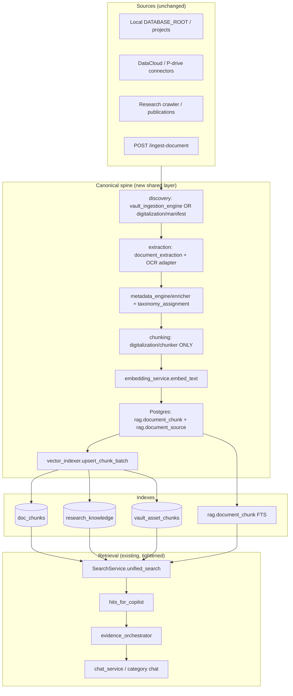
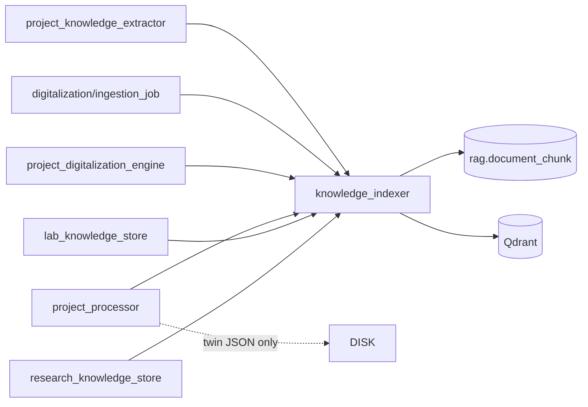
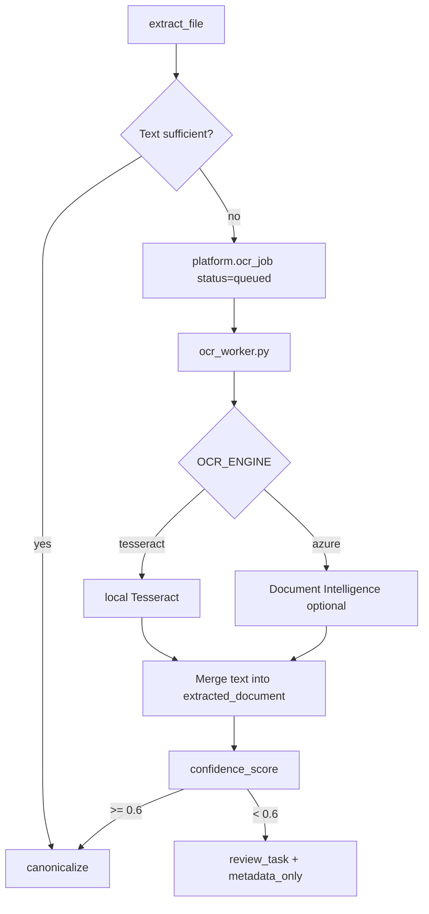

# OMEIA Knowledge Platform — Remediation & Consolidation Plan

**Status:** Implementation roadmap (incremental, backward-compatible)  
**Based on:** `docs/KNOWLEDGE_DOCUMENT_SUBSYSTEM_REVIEW.md` + current codebase  
**Date:** 2026-06-08  
**Principle:** Evolve, do not rewrite.

---

## Table of contents

1. [Executive Summary](#1-executive-summary)
2. [Current State Assessment](#2-current-state-assessment)
3. [Target State Architecture](#3-target-state-architecture)
4. [Phase-by-Phase Migration Plan](#4-phase-by-phase-migration-plan)
5. [Exact Files To Modify](#5-exact-files-to-modify)
6. [Exact Files To Leave Untouched](#6-exact-files-to-leave-untouched)
7. [Risk Assessment](#7-risk-assessment)
8. [Backward Compatibility Risks](#8-backward-compatibility-risks)
9. [Database Migration Requirements](#9-database-migration-requirements)
10. [API Migration Requirements](#10-api-migration-requirements)
11. [Testing Requirements](#11-testing-requirements)
12. [Production Rollout Plan](#12-production-rollout-plan)
13. [Rollback Plan](#13-rollback-plan)
14. [Final Prioritized Task List](#14-final-prioritized-task-list)

---

## 1. Executive Summary

OMEIA already has the **right end-state components** (digitalization pipeline, vault, unified `SearchService`, evidence orchestrator, copilot). The problem is **parallel paths** that write different chunk shapes to different stores without a single indexing contract.

This plan consolidates toward one spine:

```text
Sources → Canonical Ingestion → Metadata → Classification → Chunk → Embed → Postgres → Qdrant → SearchService → Evidence Orchestrator → Copilot
```

**Strategy:** Seven incremental phases over ~12–16 weeks. Each phase ships independently, keeps APIs stable, and includes rollback.

| Phase | Focus | Duration | Ship criteria |
|-------|--------|----------|---------------|
| 1 | Index coherence (dims, embed, upsert) | 2–3 weeks | All collections @ 768; reindex script green |
| 2 | Pipeline consolidation (chunk authority) | 4–6 weeks | New ingests → `rag.*` + Qdrant auto |
| 3 | OCR workflow | 3–4 weeks | `needs_ocr` → retry → indexed |
| 4 | Unified taxonomy | 2–3 weeks | `taxonomy_assignment` table live |
| 5 | Vault semantic search | 2 weeks | `vault_asset_chunks` in hybrid search |
| 6 | Search consolidation | 2 weeks | Legacy routes proxy to `SearchService` |
| 7 | Technical debt reduction | ongoing | Module splits behind same APIs |

**Do not** delete legacy pipelines until Phase 2 migration adapters are proven in production.

---

## 2. Current State Assessment

### Verified findings (from architecture review)

| # | Finding | Current evidence |
|---|---------|------------------|
| 1 | Multiple chunking systems | `digitalization/chunker.py` (700 tok), `document_extraction._chunk_text` (1800 char), `project_knowledge_extractor` (~4000), `scientific_document_parser` (4200) |
| 2 | Multiple ingestion pipelines | Pipeline A (`digitalization/`), B (`project_digitalization_engine`), C (`project_processor`), D (`research_knowledge_store`), E (`lab_knowledge_store`) |
| 3 | Multiple knowledge stores | `platform.document_chunk`, `rag.document_chunk`, `platform.research_chunk`, `.chunks.jsonl`, processed JSON twins |
| 4 | Multiple taxonomies | `smart_taxonomy.json`, `document_classification.py`, `page_registry.py` |
| 5 | Missing OCR | `needs_ocr` / `ENABLE_OCR` stub only |
| 6 | Embedding dim inconsistencies | `TEXT_EMBEDDING_DIM` vs `RESEARCH_KB_VECTOR_SIZE`; `doc_chunks` 768 vs `research_knowledge` 384 on some hosts |
| 7 | JSON/Postgres drift | `raw_vault_store.search_vault()` JSON fallback; `deduplication_report()` JSON-only |
| 8 | Weak vault semantic search | `VECTORIZATION_ENABLED=false` default; vault bucket = ILIKE only |
| 9 | Legacy search endpoints | `knowledge.py`, `research.py` `/platform/search` |
| 10 | Search duplication | Same query hits multiple buckets with overlapping assets |
| 11 | Inconsistent indexing | Pipeline A chunks without auto-embed; B/C optional Qdrant |

### What already works (preserve)

- `SearchService.unified_search()` + `hits_for_copilot()` — primary retrieval path
- `Evidence orchestrator` + category chat (`/api/chat/category`)
- Document Library UI (`ScientificFileExplorer.jsx`) + audit badges
- Vault registry (`platform.raw_asset_vault`) + checksum dedup
- Research KB crawl/ingest APIs
- `chunk_fts.py` hybrid FTS (migration 144)
- `project_knowledge_store.py` — project workspace Qdrant (recent)
- `embedding_service.py` — Ollama + `/api/embed` fallback (recent)
- Portable Mac/Linux deployment scripts

### Canonical path decision (Phase 2)

**Pipeline A** (`omeia/digitalization/`) is the canonical ingestion spine because it has:

- Explicit lifecycle statuses (`digitalization/status.py`)
- Validation gate (`validators.py`)
- Secret redaction (`secret_detector.py`)
- Postgres tables designed for audit (`sql/140_*`)

**Pipeline B** (vault engine) remains the **discovery front door** but must **delegate extract/chunk/index** to shared services, not duplicate logic.

**Pipeline C** (project_processor) remains for **digital twin JSON** (UI previews) but must **read from Postgres** rather than be a second chunk authority.

---

## 3. Target State Architecture



### Shared contracts (new modules — thin wrappers, not rewrites)

| Contract | New module | Replaces scattered logic |
|----------|------------|--------------------------|
| Embedding dim | `embedding_service.embedding_dim()` | Single env: `TEXT_EMBEDDING_DIM` |
| Collection dim | `qdrant_vectors.collection_dim()` | Unifies `RESEARCH_KB_VECTOR_SIZE` |
| Chunk write | `knowledge_indexer.write_chunks()` | Wraps Postgres + Qdrant upsert |
| Chunk read for search | `rag.document_chunk` only | Deprecate `platform.document_chunk` writes over time |

---

## 4. Phase-by-Phase Migration Plan

---

### PHASE 1 — Index Coherence

**Goal:** One embedding model, one dimension (768), one upsert pattern, no collection dim mismatches.

#### 1.1 Standardize embedding dimensions

**Change:**

- Deprecate `RESEARCH_KB_VECTOR_SIZE` as independent source; default it from `TEXT_EMBEDDING_DIM`.
- Add `qdrant_research_indexer.VECTOR_SIZE = embedding_dim()` at runtime.

**Files:**

```python
# omeia/api/qdrant_research_indexer.py
from omeia.api.embedding_service import embedding_dim
VECTOR_SIZE = int(os.getenv("RESEARCH_KB_VECTOR_SIZE", "") or embedding_dim())
```

```python
# omeia/api/qdrant_vectors.py
from omeia.api.embedding_service import embedding_dim as _embedding_dim
EMBEDDING_DIM = int(os.getenv("TEXT_EMBEDDING_DIM", "") or _embedding_dim())
```

**Env (all hosts):**

```env
EMBEDDING_PROVIDER=ollama
TEXT_EMBEDDING_MODEL=nomic-embed-text
TEXT_EMBEDDING_DIM=768
RESEARCH_KB_VECTOR_SIZE=768   # alias, same value
OLLAMA_INTERNAL_TOKEN=<token>
```

#### 1.2 Standardize embedding generation

**Already done (keep):** `embedding_service.ollama_embed()` with `/api/embeddings` + `/api/embed` fallback.

**Add:** `embed_text(..., dim=None)` must be used everywhere; remove direct `llm._hash_embed` calls outside `embedding_service`.

**Audit files:** `lab_knowledge_store.py`, `qdrant_research_indexer.py`, `project_knowledge_store.py`, `reindex_vectors.py`, `vault.py` ingest path.

#### 1.3 Standardize vector upsert logic

**New file:** `omeia/api/vector_indexer.py`

```python
"""Single upsert entry for doc_chunks, research_knowledge, vault_asset_chunks."""
def upsert_chunks(
    *,
    collection: str,
    chunks: list[ChunkRecord],
    embed: bool = True,
) -> UpsertResult: ...
```

**Migrate callers incrementally:**

1. `scripts/ingest/reindex_vectors.py`
2. `project_knowledge_store.py`
3. `qdrant_research_indexer.upsert_research_chunks`
4. `vault_ingestion_engine` vectorization block
5. `lab_knowledge_store.py` (replace inline Qdrant upsert)

#### 1.4 Standardize collection definitions

**New file:** `omeia/api/qdrant_collections.py`

| Collection | Env key | Default | Vector name |
|------------|---------|---------|-------------|
| `doc_chunks` | `DOCUMENT_QDRANT_COLLECTION` | `doc_chunks` | `text` |
| `research_knowledge` | `RESEARCH_KB_QDRANT_COLLECTION` | `research_knowledge` | `text` |
| `vault_asset_chunks` | `VAULT_QDRANT_COLLECTION` | `vault_asset_chunks` | `text` |

All use `ensure_named_text_collection()` with **same dim**.

#### 1.5 Reindex migration (operational)

```bash
# Linux — after env aligned
curl -X DELETE http://127.0.0.1:6333/collections/research_knowledge  # if dim wrong
eval "$(./scripts/dev/load_env.sh configs/.env)"
PYTHONPATH=. python3 scripts/ingest/reindex_vectors.py
# Re-crawl research KB or run research reindex script (add in Phase 1)
```

**New script:** `scripts/ingest/reindex_research_vectors.py` — mirror of `reindex_vectors.py` for `platform.research_chunk`.

#### Phase 1 rollback

- Keep old Qdrant collections renamed: `doc_chunks_bak_384`, `research_knowledge_bak_384`
- Revert env to `TEXT_EMBEDDING_DIM=384`
- Point `QDRANT_URL` to backup snapshot (if snapshotted pre-migration)

#### Phase 1 exit criteria

- [ ] `/health` shows ollama healthy
- [ ] `reindex_vectors.py` completes without dim errors
- [ ] Eval/search: no `expected dim: 384, got 768` in logs
- [ ] `tests/test_production_rag_fixes.py` pass

---

### PHASE 2 — Pipeline Consolidation

**Goal:** New document ingests flow through one chunk+index path; legacy paths become adapters.

#### 2.1 Canonical ingestion path

```text
vault_ingestion_engine.scan()
  OR digitalization/ingestion_job.run_digitalization()
    → document_extraction (extract)
    → digitalization/chunker (chunk)      # ONLY chunker
    → knowledge_indexer.write_chunks()    # rag.* + Qdrant
    → metadata_engine/enricher (async)
    → document_classification (dedup flags)
```

#### 2.2 Migration sequence

| Step | Action | Risk |
|------|--------|------|
| 2.1 | Add `knowledge_indexer.py`; wire `project_knowledge_extractor` only | Low — already partially done |
| 2.2 | Wire `digitalization/ingestion_job` post-chunk hook → `knowledge_indexer` | Medium — new Qdrant writes from Pipeline A |
| 2.3 | Add adapter in `project_digitalization_engine`: after `extract_for_vault`, call `knowledge_indexer` | Medium |
| 2.4 | `project_processor`: after twin JSON write, **also** call `knowledge_indexer` (feature flag `TWIN_DUAL_WRITE=true`) | Low |
| 2.5 | Stop writing new rows to `platform.document_chunk` (read-only legacy) | High — gate behind `PLATFORM_CHUNK_WRITE=false` |
| 2.6 | Deprecate `.chunks.jsonl` generation (read from `rag.document_chunk` export) | Low |

#### 2.3 Standardize chunking

**Single params** (from `digitalization/chunker.py`):

```env
CHUNK_SIZE_TOKENS=700
CHUNK_OVERLAP_TOKENS=100
```

**Adapter** for legacy callers:

```python
# omeia/api/chunking.py (thin facade)
def chunk_text(text: str, *, section_path: str = "") -> list[Chunk]:
    from omeia.digitalization.chunker import chunk_document
    ...
```

Replace `_chunk_text` in `document_extraction.py` with facade call (internal redirect, same exports).

#### 2.4 Dependency map



#### Phase 2 rollback

- Feature flags: `KNOWLEDGE_INDEXER_ENABLED=false` restores old per-pipeline writes
- `PLATFORM_CHUNK_WRITE=true` re-enables `platform.document_chunk` inserts

#### Phase 2 exit criteria

- [ ] Project ingest API populates `rag.document_chunk` + Qdrant in one call
- [ ] Digitalization run completes with `embedding_status=indexed` on chunks
- [ ] Copilot retrieves project + lab chunks from same collection schema
- [ ] Digital twin JSON still renders in UI (unchanged)

---

### PHASE 3 — OCR Implementation

**Goal:** `needs_ocr` becomes a retryable queue, not a dead end.

#### 3.1 OCR insertion point

```text
digitalization/extractors.py
  → if image / low-text PDF:
      extraction_status = needs_ocr
      → platform.ocr_job (NEW)
      → ocr_worker.process()
      → re-enter extract → canonicalize → chunk → index
```

#### 3.2 Architecture



#### 3.3 New components

| Component | Path |
|-----------|------|
| OCR job table | `sql/145_ocr_jobs.sql` |
| OCR adapter interface | `omeia/api/ocr/adapter.py` |
| Tesseract backend | `omeia/api/ocr/tesseract_backend.py` |
| Worker CLI | `scripts/ops/run_ocr_queue.py` |
| API | `POST /api/digitalization/ocr/retry/{document_id}` |

#### 3.4 Supported formats

| Format | Strategy |
|--------|----------|
| Scanned PDF | `pdftoppm` → per-page OCR |
| TIFF / OME-TIFF | Extract largest pyramid level or thumbnail |
| PNG/JPG | Direct OCR |

#### 3.5 Fallback strategy

1. OCR fails → `extraction_status=ocr_failed`, asset stays `metadata_only`
2. Low confidence → `review_status=needs_review`, partial text indexed with `confidence` in chunk metadata
3. `ENABLE_OCR=false` → current behavior (no regression)

#### Phase 3 rollback

- `ENABLE_OCR=false` disables worker; queue accumulates without processing
- Drop `platform.ocr_job` table if needed (no changes to existing tables)

---

### PHASE 4 — Unified Taxonomy

**Goal:** One assignment table; three legacy classifiers become **producers**, not authorities.

#### 4.1 Schema design

**New migration:** `sql/146_taxonomy_assignment.sql`

```sql
CREATE TABLE platform.taxonomy_assignment (
    asset_id          UUID NOT NULL REFERENCES platform.raw_asset_vault(asset_id),
    taxonomy_key      TEXT NOT NULL,   -- e.g. 'smart_chip:wet_lab_protocols'
    source            TEXT NOT NULL,   -- smart_taxonomy | standard_category | page_registry | manual
    confidence        REAL DEFAULT 1.0,
    assigned_at       TIMESTAMPTZ DEFAULT now(),
    assigned_by       TEXT,            -- user email or 'system'
    superseded_at     TIMESTAMPTZ,
    PRIMARY KEY (asset_id, taxonomy_key, source)
);
CREATE INDEX idx_taxonomy_key ON platform.taxonomy_assignment(taxonomy_key) WHERE superseded_at IS NULL;
```

#### 4.2 Migration plan

| Step | Action |
|------|--------|
| 4.1 | Deploy table |
| 4.2 | Backfill from inventory pipeline: run `process_inventory_pipeline.py` with `--write-taxonomy` |
| 4.3 | `library_taxonomy.assign_smart_chip()` reads assignments first, heuristics second |
| 4.4 | Admin API: `POST /api/document-library/taxonomy/override` |
| 4.5 | Audit log via `platform.agent_audit_log` (migration 143) |

#### 4.3 Preserve existing categories

- **No changes** to `smart_taxonomy.json` structure in Phase 4
- Map `standard_category` → nearest `taxonomy_key` via lookup table in `taxonomy_migration.py`

#### Phase 4 rollback

- Search falls back to heuristic chip assignment when assignment table empty
- Table is additive only

---

### PHASE 5 — Vault Search Upgrade

**Goal:** Vault bucket uses semantic search when text exists; duplicates suppressed.

#### 5.1 Enable semantic vault search

```env
VECTORIZATION_ENABLED=true
VAULT_QDRANT_COLLECTION=vault_asset_chunks
```

Wire `vault_ingestion_engine` vectorization → `vector_indexer.upsert_chunks(collection=vault_asset_chunks)`.

#### 5.2 Search integration

**Modify:** `search_service.py` vault bucket fetch:

```python
# Pseudocode — dual path
hits_metadata = search_vault(q, ...)           # existing ILIKE
hits_semantic = search_vault_vectors(q, ...)   # NEW: Qdrant vault_asset_chunks
merged = merge_vault_hits(hits_metadata, hits_semantic, dedupe_by_asset_id=True)
```

**New:** `omeia/api/vault_vector_search.py`

#### 5.3 Duplicate suppression in search

Apply `inventory_active=true` and `duplicate_status != 'duplicate'` filter in `search_vault()` when querying Postgres (currently only in document library).

#### 5.4 Ranking

- Semantic score × 1.0 + metadata match boost × 0.3
- Boost canonical copies +0.1
- Penalize `metadata_only` −0.2

#### Performance analysis

| Assets | ILIKE vault | Qdrant vault | Hybrid |
|--------|-------------|--------------|--------|
| 5k | ~50ms | ~15ms | ~60ms |
| 50k | ~400ms+ (needs FTS index) | ~25ms | ~100ms |

**Add:** `GIN` index on `logical_path` + `filename` (migration 147) before 50k scale.

#### Phase 5 rollback

- `VECTORIZATION_ENABLED=false`
- Vault bucket reverts to ILIKE-only (existing code path)

---

### PHASE 6 — Search Consolidation

**Goal:** `GET /api/platform/unified-search` is authoritative; legacy routes proxy.

#### 6.1 Route consolidation plan

| Legacy route | Action | Proxy target |
|--------------|--------|--------------|
| `GET /api/search` (`knowledge.py`) | Deprecate header `Deprecation: true` | `unified-search` with scope mapping |
| `GET /api/knowledge/lab/search` | Proxy | `unified-search?scopes=lab` |
| `GET /api/knowledge/hybrid-search` | Proxy | `unified-search?mode=hybrid` |
| `GET /platform/search` (`research.py`) | Proxy | `unified-search?scopes=notebook,wiki,decision` |
| `GET /notebook/search`, `/wiki/search`, `/decisions/search` | Keep thin wrappers | Call `SearchService` directly |
| `GET /api/research-knowledge/search` | Keep | Specialized research admin UI |
| `GET /api/vault/search` | Keep | Low-level vault tool; add note in OpenAPI |
| `GET /api/document-library/search` | Keep | Faceted library (feeds unified via adapter) |

#### 6.2 Implementation pattern

```python
# knowledge.py — no breaking change
@router.get("/api/search")
def legacy_search(q: str, ...):
    response.headers["Deprecation"] = "use /api/platform/unified-search"
    return search_service.unified_search(q=q, scopes=_map_legacy_params(...))
```

#### 6.3 Frontend

- `GlobalSearchOverlay` — already uses unified search ✓
- `KnowledgeSearchScreen` — migrate to same client as overlay (Phase 6b)
- `searchClient.js` — single `unifiedSearch()` export

#### Phase 6 rollback

- Legacy routes remain; proxy is additive

---

### PHASE 7 — Technical Debt Reduction

**Goal:** Split god-modules without API changes.

#### 7.1 Refactoring roadmap

| Module | Split into | Boundary |
|--------|------------|----------|
| `document_extraction.py` (~800+ lines) | `extraction/pdf.py`, `extraction/office.py`, `extraction/vault_bridge.py` | `document_extraction.py` re-exports |
| `search_service.py` (~1100+ lines) | `search/buckets/lab.py`, `search/buckets/vault.py`, `search/merge.py`, `search/copilot.py` | `SearchService` facade unchanged |
| `raw_vault_store.py` | `vault/postgres_store.py`, `vault/json_fallback.py` (deprecated) | `search_vault()` signature unchanged |
| `project_knowledge_extractor.py` | Deprecate body → call `knowledge_indexer` | Keep function names |

#### 7.2 Sequencing

- **After Phase 1–2** (when index contracts stable)
- One module per sprint
- Require tests before/after each split

---

## 5. Exact Files To Modify

### Phase 1 (CRITICAL)

| File | Change |
|------|--------|
| `omeia/api/embedding_service.py` | Single dim contract; document env vars |
| `omeia/api/qdrant_vectors.py` | Use `embedding_dim()` |
| `omeia/api/qdrant_research_indexer.py` | Align VECTOR_SIZE |
| `omeia/api/llm_client.py` | Ensure `embed(dim=)` passed through ✓ (done) |
| `omeia/api/lab_knowledge_store.py` | Use `vector_indexer` |
| `omeia/api/project_knowledge_store.py` | Use `vector_indexer` |
| `scripts/ingest/reindex_vectors.py` | Use shared indexer |
| `scripts/ingest/reindex_research_vectors.py` | **NEW** |
| `omeia/api/vector_indexer.py` | **NEW** |
| `omeia/api/qdrant_collections.py` | **NEW** |
| `configs/.env.example` | 768 defaults, token docs |
| `scripts/docker/linux_post_stack_setup.sh` | Set `RESEARCH_KB_VECTOR_SIZE` |

### Phase 2 (HIGH)

| File | Change |
|------|--------|
| `omeia/digitalization/ingestion_job.py` | Post-chunk index hook |
| `omeia/api/knowledge_indexer.py` | **NEW** — Postgres + Qdrant write |
| `omeia/api/chunking.py` | **NEW** — facade to `chunker.py` |
| `omeia/api/document_extraction.py` | Redirect `_chunk_text` to facade |
| `omeia/api/project_knowledge_extractor.py` | Delegate to `knowledge_indexer` |
| `omeia/api/project_digitalization_engine.py` | Adapter to `knowledge_indexer` |
| `omeia/api/project_processor.py` | Optional dual-write flag |

### Phase 3 (HIGH)

| File | Change |
|------|--------|
| `sql/145_ocr_jobs.sql` | **NEW** |
| `omeia/api/ocr/adapter.py` | **NEW** |
| `omeia/api/ocr/tesseract_backend.py` | **NEW** |
| `omeia/digitalization/extractors.py` | Queue OCR jobs |
| `scripts/ops/run_ocr_queue.py` | **NEW** |
| `omeia/api/routers/digitalization.py` | OCR retry endpoint |

### Phase 4 (MEDIUM)

| File | Change |
|------|--------|
| `sql/146_taxonomy_assignment.sql` | **NEW** |
| `omeia/api/taxonomy_service.py` | **NEW** |
| `omeia/api/library_taxonomy.py` | Read assignments |
| `omeia/api/document_classification.py` | Write assignments |
| `omeia/api/routers/document_library.py` | Override endpoint |

### Phase 5 (HIGH)

| File | Change |
|------|--------|
| `omeia/api/vault_vector_search.py` | **NEW** |
| `omeia/api/search_service.py` | Hybrid vault bucket |
| `omeia/api/raw_vault_store.py` | Dedup filter in search |
| `omeia/api/vault_ingestion_engine.py` | Use `vector_indexer` |
| `sql/147_vault_search_indexes.sql` | **NEW** — GIN on paths |

### Phase 6 (MEDIUM)

| File | Change |
|------|--------|
| `omeia/api/routers/knowledge.py` | Proxy + Deprecation header |
| `omeia/api/routers/research.py` | Proxy `/platform/search` |
| `omeia/ui/react_frontend/src/services/searchClient.js` | Consolidate clients |
| `omeia/ui/react_frontend/src/pages/KnowledgeSearchScreen.jsx` | Use unified client |

### Phase 7 (LOW–MEDIUM, ongoing)

| File | Change |
|------|--------|
| `omeia/api/document_extraction.py` | Split submodules |
| `omeia/api/search_service.py` | Split buckets |
| `omeia/api/raw_vault_store.py` | Split stores |

---

## 6. Exact Files To Leave Untouched

**Do not modify** (stable contracts / UI working):

| File / area | Reason |
|-------------|--------|
| `omeia/api/evidence_orchestrator.py` | Copilot logic stable; consumes `SearchService` |
| `omeia/api/chat_service.py` | Category chat path production-tested |
| `omeia/api/routers/chat.py` | API contract frozen |
| `omeia/ui/react_frontend/src/features/ai-assistant/components/ChatWidget.jsx` | User-facing; change only via API |
| `omeia/security/auth.py` | Security hardened recently |
| `sql/040_rag_audit_security_schema.sql` | Legacy schema; migrate data, don't alter |
| `sql/111_raw_asset_vault.sql` | Vault schema stable; additive only |
| `configs/document_library/smart_taxonomy.json` | Phase 4 reads as-is |
| `omeia/ui/react_frontend/src/features/documents/components/ScientificFileExplorer.jsx` | Phase 7 split only |
| `docker-compose.yml` | Infra stable |
| `scripts/dev/start_linux_desktop.sh` | Deployment scripts |
| Digital twin JSON **read** paths in UI | Until Phase 2 dual-write proven |

---

## 7. Risk Assessment

| Risk | Likelihood | Impact | Mitigation |
|------|------------|--------|------------|
| Qdrant reindex downtime | Medium | High | Rename old collections; reindex offline; blue/green collections |
| Dual-write inconsistency during Phase 2 | High | Medium | Feature flags; reconciliation script |
| OCR quality poor on handwriting | High | Low | Confidence threshold + review queue |
| Tesseract dep on Linux server | Medium | Medium | Docker sidecar `omeia-ocr` container |
| Legacy API clients break | Low | High | Proxy pattern; never remove routes in Phase 6 |
| Eval score regression | Medium | Medium | Run `run_ai_lab_assistant_eval.py` each phase |
| Postgres migration failure | Low | High | Idempotent SQL; `apply_sql_migrations.py` logs |

---

## 8. Backward Compatibility Risks

| Area | Risk | Safeguard |
|------|------|-----------|
| `/api/search` consumers | Response shape drift | Proxy returns identical schema via adapter layer |
| Document Library facets | Taxonomy key changes | Phase 4 backfill + heuristic fallback |
| Project twin JSON | UI breaks if removed early | Keep JSON generation until Phase 2.6 complete |
| `rag.document_chunk` readers | New columns | Additive migrations only |
| Mac thin client | Remote Qdrant dim change | Reindex Linux once; Mac env points to Tailscale |
| Copilot cache | Stale hits after reindex | Bump `COPILOT_CACHE_VERSION` env |

---

## 9. Database Migration Requirements

| Migration | Phase | Purpose |
|-----------|-------|---------|
| `144_copilot_enhancements.sql` | **Done** | FTS on `rag.document_chunk` |
| `145_ocr_jobs.sql` | 3 | OCR queue |
| `146_taxonomy_assignment.sql` | 4 | Unified taxonomy |
| `147_vault_search_indexes.sql` | 5 | GIN on vault paths |
| `148_knowledge_index_lineage.sql` | 2 | Optional: `source_pipeline`, `chunk_uid` FK audit |

**No destructive migrations.** Deprecated tables (`platform.document_chunk`) marked read-only in app code, dropped only after 90-day deprecation.

**Data migrations (scripts):**

- `scripts/ingest/reindex_vectors.py` — Phase 1
- `scripts/ingest/reindex_research_vectors.py` — Phase 1
- `scripts/ingest/backfill_rag_from_platform_chunks.py` — Phase 2
- `scripts/digitalization/backfill_taxonomy_assignments.py` — Phase 4

---

## 10. API Migration Requirements

| API | Phase | Change type |
|-----|-------|-------------|
| `POST /api/digitalization/run` | 2 | Response adds `indexed_chunks` count |
| `POST /api/projects/{code}/knowledge/ingest` | 2 | Same path; now guarantees Qdrant |
| `GET /api/platform/unified-search` | 5–6 | Richer vault hits; no breaking fields |
| `GET /api/search` | 6 | Deprecation header only |
| `POST /api/digitalization/ocr/retry/{id}` | 3 | New |
| `POST /api/document-library/taxonomy/override` | 4 | New |
| `GET /api/vault/search` | 5 | Add `semantic=true` query param (opt-in) |

**OpenAPI:** Update `omeia/api/main.py` tags descriptions; no version bump required (additive).

---

## 11. Testing Requirements

### Per-phase test gates

| Phase | Tests |
|-------|-------|
| 1 | `test_production_rag_fixes.py`, `test_copilot_enhancements.py`, new `test_vector_indexer.py`, `test_embedding_dim_contract.py` |
| 2 | `test_project_knowledge_store.py`, `test_digitalization_index_hook.py`, ingest integration smoke |
| 3 | `test_ocr_adapter.py` with fixture PDF; skip if no Tesseract in CI |
| 4 | `test_taxonomy_assignment.py` |
| 5 | `test_vault_vector_search.py`, `test_search_service.py` vault bucket |
| 6 | `test_auth_protected_routes.py`, legacy route proxy tests |
| 7 | Coverage must not drop on splits |

### Operational validation

```bash
# After each phase on Linux
curl -s http://127.0.0.1:8000/health | python3 -m json.tool
PYTHONPATH=. python3 -m pytest tests/test_production_rag_fixes.py tests/test_search_service.py -q
LLM_PROVIDER=ollama OLLAMA_MODEL=qwen2.5:7b-instruct \
  PYTHONPATH=. python3 scripts/search/run_ai_lab_assistant_eval.py --role researcher
```

### Acceptance criteria (from `08_EVALUATION_AND_QA/acceptance_criteria.md`)

- Citation compliance ≥ 95%
- Intent accuracy ≥ 93%
- No mock synthesis when Ollama healthy
- Research bucket returns hits when KB populated

---

## 12. Production Rollout Plan

### Environment progression

```text
dev (Mac + Linux twin) → staging (Linux only) → production (Linux + connectors)
```

### Rollout steps per phase

1. **Merge** feature branch with flags default `false`
2. **Deploy** SQL migrations via `apply_sql_migrations.py`
3. **Configure** env on Linux (`configs/.env`)
4. **Reindex** Qdrant during maintenance window (Phase 1, 5)
5. **Enable** feature flags progressively:
   - `KNOWLEDGE_INDEXER_ENABLED=true`
   - `VECTORIZATION_ENABLED=true`
   - `ENABLE_OCR=true`
6. **Monitor** logs: embed failures, Qdrant 400s, eval gates
7. **Run** manual QA checklist (`manual_QA_checklist.md`)

### Maintenance windows

| Phase | Downtime | Notes |
|-------|----------|-------|
| 1 | ~30 min | Qdrant collection recreate |
| 2 | None | Dual-write |
| 3 | None | Worker background |
| 5 | ~15 min | Vault reindex optional |

---

## 13. Rollback Plan

### Phase 1 rollback

```bash
# Restore env
TEXT_EMBEDDING_DIM=384
RESEARCH_KB_VECTOR_SIZE=384
# Restore Qdrant collections from *_bak or snapshot
# Restart API
```

### Phase 2 rollback

```env
KNOWLEDGE_INDEXER_ENABLED=false
PLATFORM_CHUNK_WRITE=true
TWIN_DUAL_WRITE=false
```

### Phase 3 rollback

```env
ENABLE_OCR=false
# Stop ocr worker systemd/cron
```

### Phase 4–6 rollback

- Additive tables/routes; no rollback needed (ignore new table reads)

### Disaster rollback

- Git revert release tag
- Postgres: migrations are forward-only; restore DB snapshot if needed
- Qdrant: restore volume snapshot `omeia-qdrant-data`

---

## 14. Final Prioritized Task List

### CRITICAL (Phase 1 — weeks 1–3)

| ID | Task | Owner module |
|----|------|--------------|
| C1 | Unify `TEXT_EMBEDDING_DIM` + `RESEARCH_KB_VECTOR_SIZE` to 768 on all hosts | `embedding_service`, `qdrant_*` |
| C2 | Create `vector_indexer.py` + `qdrant_collections.py` | New |
| C3 | Reindex `doc_chunks` + `research_knowledge` at 768 | `scripts/ingest/` |
| C4 | Ensure `OLLAMA_INTERNAL_TOKEN` in all embed paths (API + eval + scripts) | `embedding_service`, `.env` |
| C5 | Add `test_embedding_dim_contract.py` | `tests/` |
| C6 | Fix `lab_knowledge_store` inline upsert → `vector_indexer` | `lab_knowledge_store.py` |

### HIGH (Phases 2, 3, 5 — weeks 4–10)

| ID | Task | Phase |
|----|------|-------|
| H1 | Create `knowledge_indexer.py` (rag + Qdrant single write) | 2 |
| H2 | Wire `digitalization/ingestion_job` post-chunk hook | 2 |
| H3 | Chunk facade; deprecate `_chunk_text` duplication | 2 |
| H4 | `project_digitalization_engine` adapter | 2 |
| H5 | OCR schema + Tesseract adapter + worker | 3 |
| H6 | `VECTORIZATION_ENABLED=true`; vault vector search | 5 |
| H7 | Dedup filter in `search_vault()` | 5 |
| H8 | `reindex_research_vectors.py` | 1 |

### MEDIUM (Phases 4, 6 — weeks 8–12)

| ID | Task | Phase |
|----|------|-------|
| M1 | `taxonomy_assignment` table + backfill | 4 |
| M2 | Taxonomy override API | 4 |
| M3 | Legacy search route proxies + deprecation headers | 6 |
| M4 | Consolidate `KnowledgeSearchScreen` → unified client | 6 |
| M5 | Remove JSON fallback in vault search (Postgres-only) | 5 |
| M6 | GIN indexes on vault paths | 5 |

### LOW (Phase 7+ — weeks 12+)

| ID | Task | Phase |
|----|------|-------|
| L1 | Split `document_extraction.py` | 7 |
| L2 | Split `search_service.py` bucket modules | 7 |
| L3 | Split `ScientificFileExplorer.jsx` | 7 |
| L4 | Deprecate `platform.document_chunk` table | 2 late |
| L5 | Neo4j knowledge graph export from `knowledge_entity` | future |
| L6 | Incremental filesystem watcher (replace full scan) | future |

---

## Appendix A — Phase 1 exact code sketch

### `omeia/api/vector_indexer.py` (new)

```python
@dataclass
class ChunkRecord:
    chunk_uid: str
    chunk_text: str
    document_code: str
    chunk_index: int
    metadata: dict

def upsert_chunks(
    chunks: list[ChunkRecord],
    *,
    collection: str | None = None,
    conn=None,
    qdrant=None,
) -> dict:
    """Write to rag.document_chunk (upsert) and Qdrant via embed_text."""
    ...
```

### `configs/.env.example` additions

```env
# Phase 1 — index coherence
TEXT_EMBEDDING_DIM=768
RESEARCH_KB_VECTOR_SIZE=768
EMBEDDING_PROVIDER=ollama
TEXT_EMBEDDING_MODEL=nomic-embed-text

# Phase 2 — pipeline flags (default safe)
KNOWLEDGE_INDEXER_ENABLED=false
PLATFORM_CHUNK_WRITE=true
TWIN_DUAL_WRITE=false

# Phase 3
ENABLE_OCR=false
OCR_ENGINE=tesseract

# Phase 5
VECTORIZATION_ENABLED=false
```

---

## Appendix B — Related documents

| Document | Role |
|----------|------|
| `docs/KNOWLEDGE_DOCUMENT_SUBSYSTEM_REVIEW.md` | Findings source |
| `docs/AI_LAB_ASSISTANT_ARCHITECTURE.md` | Copilot/retrieval |
| `docs/31_SEARCH_UNIFIED_AUDIT_AND_SOURCE_BUNDLE.md` | Search audit |
| `docs/AI_LAB_ASSISTANT_ENHANCEMENT_ROADMAP.md` | Copilot phases A–B (done) |
| `configs/rag_config.yaml` | Declarative RAG (align in Phase 2) |

---

*This plan is designed for incremental execution. Start with Phase 1 CRITICAL tasks before any pipeline consolidation.*
