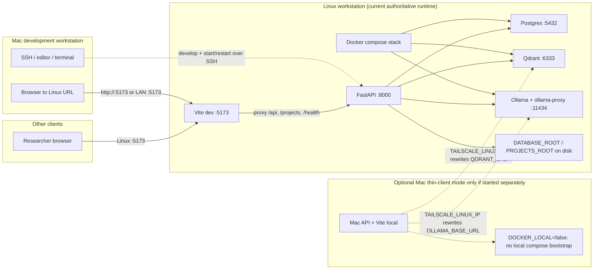
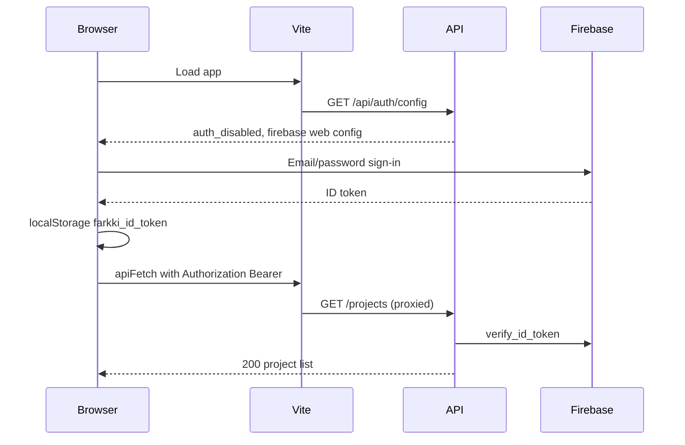
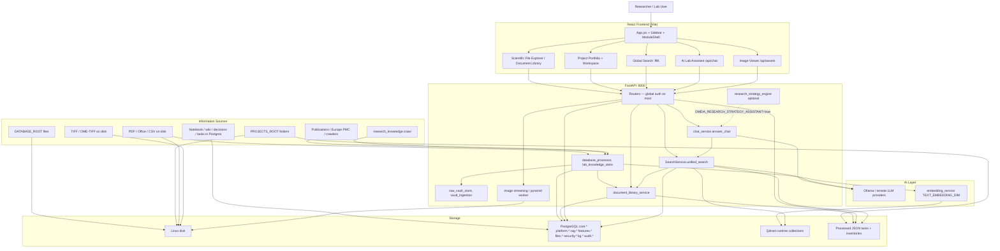
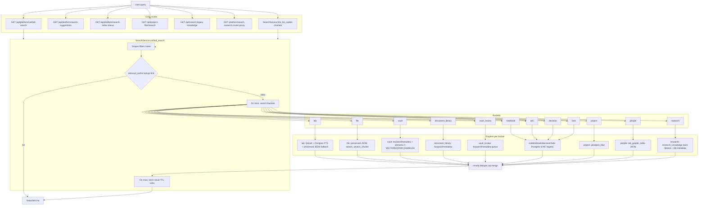
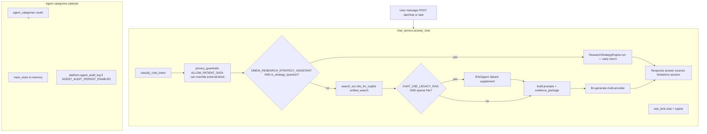
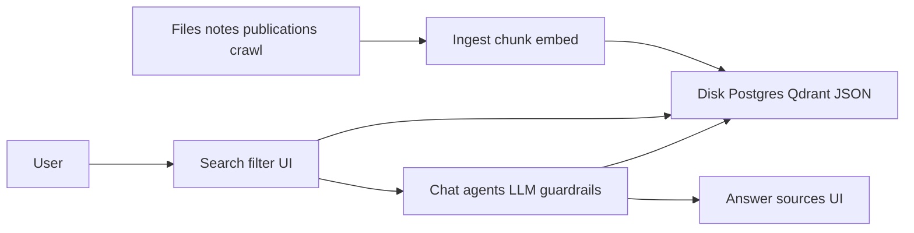

# OMEIA Information Flow Documentation

**Purpose:** Honest peripheral view of how information enters, is stored, indexed, retrieved, and shown in OMEIA — for researchers, lab operators, and developers.

**Scope:** System as built in this repository (not a roadmap). When behavior depends on environment flags, that is called out explicitly.

**Last verified against codebase:** commit `311d7e6`, date **2026-06-08**.

---

## How to read this document

| Section | What you get |
|---------|----------------|
| Deployment & startup | Where processes run (Linux vs Mac) and boot order |
| Auth | What must happen before `/projects` and other APIs return 200 |
| Diagrams 1–5 | End-to-end flow (high level) |
| Frontend flow | What the React app loads first vs in the background |
| Storage reference | Postgres / Qdrant / disk / JSON — actual names |
| Search & AI | Unified search, chat RAG, optional strategy engine |
| Runtime flags | Defaults that explain “works on my machine” vs production |
| Current gaps | What is **not** done, partial, or slow — no outdated bug IDs |

---

## Deployment topology

**Linux (authoritative lab host / current deployment):**

- The whole app runtime is on Linux: Docker services, FastAPI, Vite, Postgres, Qdrant, Ollama/LLM models, and `DATABASE_ROOT` / `PROJECTS_ROOT`
- Development is controlled from the Mac via SSH/editor/terminal, but processes are started and served on Linux
- One command: `./scripts/start_linux.sh` → `scripts/dev/start_linux_desktop.sh` → `start.sh`
- Default Docker stack (`docker-compose.yml`): **postgres** (`127.0.0.1:5432`), **qdrant** (`127.0.0.1:6333`), **ollama** (internal), **ollama-proxy** (`127.0.0.1:11434` with bearer auth)
- Optional biomedical model services: `docker-compose.biomodels.yml` + `/api/biomedical-models/*`
- API: `uvicorn omeia.api.main:app --host 0.0.0.0 --port 8000`
- Dev UI: Vite `0.0.0.0:5173` (proxies API paths to `:8000`)
- Typical URLs: `http://<tailscale-ip>:5173/`, campus LAN as configured

**Mac as development workstation / browser client (current expectation):**

- The Mac is the developer workstation: SSH session, editor, terminal, and browser
- The actual app runtime remains on Linux; the Mac opens the Linux URL, for example `http://<linux-tailscale-ip>:5173/`
- The Mac does **not** need local Docker, local Qdrant, local Ollama, local Postgres, or a local FastAPI/Vite process when developing against the Linux runtime
- If you open `localhost:5173` on the Mac, that means the Mac itself; use the Linux IP/Tailscale URL unless you intentionally set up a tunnel or local thin-client process

**Mac thin client (optional separate mode, not the current normal setup):**

- `scripts/dev/start_mac_thin_client.sh` → `start.sh` with `DOCKER_LOCAL=false`
- With `DOCKER_LOCAL=false`, the API **does not** auto-start local Docker (`docker_service_client` probes remote URLs only)
- When `TAILSCALE_LINUX_IP` is set, `OLLAMA_BASE_URL` and `QDRANT_URL` are rewritten to point at Linux
- This mode is **not** the same as the current Linux-hosted app; **Postgres** (`POSTGRES_CONN`) and **filesystem data** (`DATABASE_ROOT`, `PROJECTS_ROOT`) are **not** automatically remote - they stay local unless you configure connection strings and sync/mount data separately from Qdrant/Ollama routing

**Production-style UI (optional):**

- `OMEIA_FRONTEND_MODE=prod` builds static assets and serves them from the API on `:8000` (`OMEIA_SERVE_FRONTEND_STATIC=true`).

**Future hosting tip (planned, not current as-built behavior):**

- Keep the full runtime on a memory-rich Linux host: FastAPI, Vite/static frontend, Docker services, Postgres, Qdrant, Ollama/LLM models, and filesystem data
- Hostinger + Cloudflare should be treated as the public hosting/DNS/TLS/proxy layer until the deployment is explicitly migrated and verified
- Do not assume Hostinger or Cloudflare owns `DATABASE_ROOT`, `PROJECTS_ROOT`, Postgres, Qdrant, or Ollama unless those services are deliberately moved there and the env vars are updated

---

## Startup chain (import time + API lifespan)

### Import time (before FastAPI lifespan)

`validate_environment()` runs at **`omeia/api/main.py` import time** (line 11), **before** the FastAPI app object is fully wired and **before** `_app_lifespan` runs. It blocks unsafe production combinations (auth disabled outside dev, `CORS_ORIGINS=*`, missing Firebase in prod).

### Lifespan (`omeia/api/common.py` `_app_lifespan`)

Order on API boot:

1. `log_deployment_checklist()` — logs `DATABASE_ROOT`, `QDRANT_URL`, `PLATFORM_AUTH_DISABLED`, etc.
2. `init_firebase_if_configured()` — Admin SDK when `FIREBASE_SERVICE_ACCOUNT_PATH` / `GOOGLE_APPLICATION_CREDENTIALS` / JSON env is set
3. `docker_services.bootstrap()` + `start_background_watcher()` — auto-starts compose services when `DOCKER_LOCAL=true`; skipped/failed gracefully on Mac thin client
4. `scheduled_directory_scanner.start()` — periodic inventory scan of **configured** watch directories

**Scheduled directory scanner behavior:**

- `start()` **no-ops** if config file is missing, unreadable, or `enabled: false` in `configs/scheduled_scan_directories.json`
- Current committed config has `enabled: true` but watches **configured** paths only (`data/scheduled_watch/mock_*`), **not** all of `DATABASE_ROOT` / `PROJECTS_ROOT`
- Postgres sync during scan is gated by `SCHEDULED_SCAN_SYNC_POSTGRES` (default **`false`**)

**Env vars that most affect behavior:**

| Variable | Typical Linux | Notes |
|----------|---------------|--------|
| `DATABASE_ROOT` | `../OMEIA-database` | Raw lab files; sibling path common |
| `PROJECTS_ROOT` | `$DATABASE_ROOT/projects` | Per-project folders |
| `POSTGRES_CONN` | `postgresql://farkki:…@127.0.0.1:5432/farkki_ai` | All metadata |
| `QDRANT_URL` | `http://127.0.0.1:6333` | Vectors |
| `OLLAMA_BASE_URL` | `http://127.0.0.1:11434/v1` | LLM + embeddings |
| `PLATFORM_AUTH_DISABLED` | **`false` on Linux prod** | `true` only for local dev |
| `DOCKER_LOCAL` | `true` (Linux) / `false` (Mac remote) | Mac: no local compose bootstrap |
| `SCHEDULED_SCAN_SYNC_POSTGRES` | **`false`** | Inventory JSON refresh only unless enabled |
| `TEXT_EMBEDDING_DIM` | **384** code default; **768** in `configs/.env.example` | Must match Qdrant collection size |

---

## Authentication flow

**Client:** Firebase web SDK (`omeia/ui/react_frontend/src/config/firebase.js`) — **email/password only** (no Google Sign-In). Token key: **`farkki_id_token`** in `localStorage`, attached by `omeia/ui/react_frontend/src/services/client.js`.

**Server:** `require_platform_user` (`omeia/security/auth.py`):

- If `PLATFORM_AUTH_DISABLED=true` **and** `APP_ENV=development` → synthetic dev user
- Else → `Authorization: Bearer <Firebase ID token>`, verify via Admin SDK, check `platform.allowed_email` (approved) or platform admin
- If Admin SDK not initialized → **503** `Firebase not initialized on server`
- Missing token → **401** (logged as security warning — normal before sign-in)

### Endpoint-level auth (not router-wide blanket rules)

**`health.router`** (included without global auth in `main.py`):

| Path | Auth |
|------|------|
| `GET /metrics` | Public |
| `GET /health` | Public |
| `GET /api/processor/status` | Public |
| `GET /stats` | Public |
| `GET /api/platform/connectors` | Public |
| `POST /api/auth/register-request` | Public |
| `GET /api/auth/config` | Public |
| `POST /api/projects/{project_code}/knowledge/ingest` | `require_platform_user` (explicit Depends) |
| `GET /api/page-domains` | `require_platform_user` (explicit Depends) |
| `GET/POST /api/admin/allowed-emails` | `require_admin_user` |
| `GET /api/admin/registration-requests` | `require_admin_user` |
| `GET /api/admin/ingestion-jobs` | `require_admin_user` |
| `GET /api/admin/review-tasks` | `require_admin_user` |

**`lab_static.router`** (no router-level auth):

- Serves file responses at `/database-static/*` and `/projects-static/*`
- Optional auth via `REQUIRE_AUTH_STATIC=true` → `_static_auth_guard` calls `require_platform_user`
- Default: static files are **public** when `REQUIRE_AUTH_STATIC` is unset/false

**`secure_files`** at `/api/files/*`:

- Included separately in `main.py`
- Router has internal `dependencies=[Depends(require_platform_user)]` plus download permission checks

**Most other routers** in `main.py` use global `dependencies=[Depends(require_platform_user)]` — including `research`, `document_library`, `search`, `chat`, `copilot`, `vault`, `digitalization`, etc.

**Role gates beyond platform auth:** read endpoints typically need any approved platform user; **write/admin** operations additionally require `editor` or `admin` via `require_role()` on specific handlers (notebook/wiki mutations, datapad edits, digitalization ingest, some chat admin routes).

**What you see in Linux logs:**

- `GET /projects` **401** ×2 before login → expected
- `GET /projects` **200** ~100–200 ms after login → healthy
- `GET /api/auth/config` **200** in 2–6 ms → healthy

---

## Frontend information flow

Navigation is **state-based** (`navMain` / `navSub` in `App.jsx`), not React Router. Persisted: `farkki_nav_v2`, `farkki_selected_project`.

**Load sequence (after auth gate):**

1. **Projects catalog immediately** — `dbProjects = mergeProjectsWithCatalog(projectsCatalog)` from bundled `projectsCatalog.js` (no API wait)
2. `GET /health` — sidebar connectivity
3. When `authReady` and token/session exists → **background** `GET /projects` (14 s timeout); failures keep catalog
4. `ScreenCache` — visited screens stay mounted (`display: none` when inactive) to avoid Suspense replay on sidebar navigation
5. Lazy screens via `app/screenRegistry.js` inside `Suspense`

**Project portfolio merge:**

- **Frontend:** API rows merged with catalog by `project_code`; catalog fills gaps (`mergeProjectRecord`)
- **Backend:** `fetch_projects_unified()` reads `core.project` + `platform.project_extension` + members; merges `projects_catalog.json`; 45 s in-memory cache (`PROJECTS_UNIFIED_CACHE_TTL_SEC`)

**Document library UI:**

- `useDocumentLibrary` → `ScientificFileExplorer` → `DocumentResultList`
- Client requests `limit=5000` (API max); first open can take **6–10 s** on Linux (cold Postgres/facets); repeat calls ~200 ms
- On filter change: list stays visible (`isRefreshing`), full spinner only when `items.length === 0`
- Table rows use CSS `content-visibility: auto` (no React unmount on scroll)

---

## DIAGRAM 1 — ENTIRE OMEIA DATA FLOW

### Narrative (Diagram 1)

**Ingress:** Files under `DATABASE_ROOT` and `PROJECTS_ROOT` are ingested (`database_processor`, vault pipelines), and optionally vectorized. The **scheduled directory scanner** refreshes inventory JSON for **configured** watch folders only (`configs/scheduled_scan_directories.json`). External research uses `research_knowledge` crawlers/ingest.

**Operational content (notebook, wiki, decisions, tasks):** stored in **Postgres** (`platform.notebook_entry`, `platform.research_wiki`, `platform.decision_registry`, `platform.task`) — **not** in processed JSON twins.

**Processed JSON twins:** project portfolio/workspace search uses `omeia/data/processed_projects/` (+ `public/processed/`); lab section twins live under `omeia/data/02_processed_projects/lab_operations/...` with legacy fallback to `processed_projects/`.

**Storage:** Authoritative metadata in Postgres; semantic search in Qdrant when indexing flags are on; large binary assets on disk; denormalized inventories in JSON for document library and vault fallbacks.

**Retrieval:** `SearchService.unified_search()` (⌘K, legacy routes) and `hits_for_copilot()` (chat) share bucket logic. Chat uses unified search first; legacy Qdrant-only `RAGAgent` is **skipped** by default (`CHAT_USE_LEGACY_RAG=false`).

---

## DIAGRAM 2 — DATABASE & STORAGE

```mermaid
flowchart TB
    subgraph POSTGRES["PostgreSQL (selected operational subset)"]
        subgraph CORE["core.*"]
            P["project"]
            COH["cohort"]
            PAT["patient"]
            SPE["specimen"]
            SAM["sample"]
        end
        subgraph PLATFORM["platform.*"]
            PE["project_extension"]
            PM["project_member"]
            NE["notebook_entry"]
            RW["research_wiki"]
            DR["decision_registry"]
            TK["task"]
            RAV["raw_asset_vault"]
            RD["research_document / research_chunk"]
            RS["research_source"]
            SFM["source_file_manifest"]
            ED["extracted_document"]
            CD["canonical_document"]
            DC["document_chunk digitalization"]
            KA["knowledge_assets legacy"]
            ET["extracted_texts legacy"]
            AE["allowed_email"]
            AAL["agent_audit_log optional"]
        end
        subgraph RAG["rag.*"]
            DS["document_source"]
            DCH["document_chunk"]
            EJ["embedding_job"]
        end
        subgraph FEAT["features.*"]
            FD["feature_definition"]
            FV["feature_value"]
        end
        subgraph FILES["files.*"]
            FO["file_object"]
            DS2["dataset_snapshot"]
        end
        subgraph SEC["security.* kg.* audit.*"]
            UA["user_account / role"]
            KG["entity_registry / assertion"]
            AUD["event_log / tool_execution_log"]
        end
    end

    subgraph QDRANT["Qdrant"]
        subgraph RUNTIME["Runtime text collections when indexed"]
            DOC["doc_chunks"]
            RK["research_knowledge"]
            VAULT["vault_asset_chunks if VECTORIZATION_ENABLED"]
        end
        subgraph BLUEPRINT["Blueprint-only unless ingested"]
            SCR["script_chunks size 384"]
            LIT["literature_chunks size 384"]
            SMP["sample_summaries size 384"]
        end
        SPATIAL["spatial_feature_profiles dim 128 numeric features"]
    end

    subgraph DISK["Disk paths"]
        DR2["DATABASE_ROOT"]
        PR["PROJECTS_ROOT"]
        PROC["processed_projects/ + public/processed/"]
        LABPROC["02_processed_projects/lab_operations/"]
    end

    subgraph JSON_INV["JSON inventories"]
        INV["01_source_inventory/raw_asset_inventory.json"]
        CAT["00_registry/projects_catalog.json"]
        AUD2["reports/.../document_inventory.json fallback"]
    end

    DS --> DCH
    SFM --> ED --> CD --> DC
    KA --> ET
    RAV --> INV
    DR2 --> INV
    P --> PE
    NE & RW & DR & TK --> POSTGRES
    DCH -.->|when indexed| DOC
    RD -.-> RK
    FV -.-> SPATIAL
    PROC & LABPROC --> JSON_INV
```

### Corrections vs older versions of this doc

- Table names are **singular**: `core.project`, `core.cohort`, `core.patient`, `core.specimen`, `core.sample` — not `projects`, `cohorts`, etc.
- **Notebook/wiki/decision/task search** reads **Postgres** tables — not processed JSON twins.
- There are **two** chunk stores: `rag.document_chunk` (lab knowledge RAG) and `platform.document_chunk` (digitalization pipeline).
- **Digitalization (canonical):** `platform.source_file_manifest` → `platform.extracted_document` → `platform.canonical_document` → `platform.document_chunk`.
- **Legacy project digitalization:** `platform.knowledge_assets` + `platform.extracted_texts` — separate searchable path.
- Additional schemas exist: `files.*`, `security.*`, `kg.*`, `audit.*` (not every table shown).
- **Runtime** Qdrant text collections: `doc_chunks`, `research_knowledge`, `vault_asset_chunks` (when `VECTORIZATION_ENABLED`).
- **Blueprint** (`configs/qdrant_collections.yaml`) also defines `script_chunks`, `literature_chunks`, `sample_summaries` at size **384** — may exist without active ingest.
- **`spatial_feature_profiles`** is 128-dim **numeric** feature warehouse vectors (`FEATURE_VECTOR_DIM` default **128**), not language embeddings.
- **Embedding dimension drift risk:** code default `TEXT_EMBEDDING_DIM=384` (`embedding_service.py`); `configs/.env.example` sets `TEXT_EMBEDDING_DIM=768` and `RESEARCH_KB_VECTOR_SIZE=768`. Collections must match runtime dim — changing dim requires recreate/reindex.

---

## DIAGRAM 3 — SEARCH FUNCTIONALITY

### Search facts (honest)

| Topic | Truth in codebase |
|-------|-------------------|
| Document library in ⌘K / chat | **Yes** — bucket `document_library`; filters include `domain_tab`, `smart_chip`, `system_view`, `file_type`, etc. |
| Vault review in search | **Yes** — bucket `vault_review` (e.g. ingestion-help intent) |
| Notebook/wiki/decision/task | **Postgres ILIKE** on `platform.*` tables — not JSON twins |
| Chat default scopes | Intent-based via `INTENT_SCOPES` — e.g. `research_question` includes `document_library` |
| Caching | **Lookup-first** — `retrieval_cache.py`, `RETRIEVAL_CACHE_ENABLED` default **true**, TTL **120 s**; on hit returns immediately without re-querying buckets; not a mandatory stage between search and buckets |
| Document library screen | Separate API (`/api/document-library/*`) — not identical code path as ⌘K but same underlying inventory service |
| Cold performance | First `limit=5000` scoped query can take **seconds** on large inventories |

---

## DIAGRAM 4 — AI ANSWER GENERATION

### AI layer facts

- **Primary retrieval for chat:** `SearchService.hits_for_copilot()` → `unified_search()` (not a separate legacy-only path).
- **Research strategy assistant:** When `OMEIA_RESEARCH_STRATEGY_ASSISTANT=true` **and** `is_strategy_question()` matches, `ResearchStrategyEngine` returns **directly** — does **not** go through retrieval → prompt → LLM for that branch.
- **Legacy RAGAgent:** Only when `CHAT_USE_LEGACY_RAG=true` **and** unified hits are sparse (`< max(3, max_sources // 2)`). Default `CHAT_USE_LEGACY_RAG=false` means the legacy supplement is **skipped**.
- **Rate limiting:** Implemented on **`/api/chat`** and **`/ask`** (`rate_limit.py`, `X-RateLimit-*` headers).
- **Agent audit:** In-memory traces always; **persistent** `platform.agent_audit_log` only if `AGENT_AUDIT_PERSIST_ENABLED=true` (default **false**).
- **External LLM / PHI:** Privacy guardrails block external providers when PHI is detected; `ALLOW_PATIENT_DATA=true` can override that blocking.

---

## DIAGRAM 5 — SIMPLIFIED SYSTEM

---

## API surface (selected key routes)

Global `require_platform_user` on most routers unless noted. Write/admin handlers add `require_role(editor|admin)` or `require_admin_user`.

| Area | Router | Key paths |
|------|--------|-----------|
| Health / metrics / auth config | `health` | `/health`, `/metrics`, `/api/auth/config`, `/api/auth/register-request` (public); admin routes protected |
| Static file serve | `lab_static` | `/database-static/*`, `/projects-static/*` (optional `REQUIRE_AUTH_STATIC`) |
| Secure downloads | `secure_files` | `/api/files/*` (internal `require_platform_user`) |
| Projects / notebook / wiki | `research` | `/projects`, `/notebook`, `/wiki`, `/decisions`, `/tasks`, `/platform/search` (legacy proxy) |
| Document library | `document_library` | `/api/document-library/search`, `/stats`, `/facets`, `/taxonomy`, `/nav`, `/export`, `/preview/{id}` |
| Unified search | `search` | `/api/platform/unified-search`, `/api/platform/search-suggestions`, `/api/platform/search-index-status`, `/api/project-files/search` |
| Knowledge legacy | `knowledge` | `/api/search`, `/api/knowledge/hybrid-search` |
| Chat | `chat` | `/api/chat`, `/api/chat/stream`, `/api/chat/status`, `/api/chat/feedback`, `/api/chat/models`, `/api/chat/rag-debug` |
| Copilot legacy | `copilot` | `/ask`, `/install_guide`, … |
| Research KB | `research_knowledge` | `/api/research-knowledge/search`, crawl/ingest admin |
| Vault | `vault` | `/api/vault/search`, `/api/vault/rebuild`, legacy `/ingest-document`, `/gap-analysis` |
| Digitalization | `digitalization` | manifest/canonical pipeline, `/api/digitalize/search` |
| Storage | `storage` | lab storage browse/stats |
| Image assets | `image_assets` | pyramid streaming, admin rebuild |
| Biomedical models | `biomedical_models` | `/api/biomedical-models/*` (optional compose stack) |
| Agent categories | `agent_categories` | category orchestration + traces |
| Admin index / quality | `admin_index` | index health, quality eval (if enabled) |
| Datapad | `datapad` | inline editors (editor/admin writes) |

---

## Runtime flags — what is often “off” by default

| Flag | Default | If false / unset |
|------|---------|------------------|
| `KNOWLEDGE_INDEXER_ENABLED` | false | Qdrant `doc_chunks` may be empty vs processed JSON |
| `VECTORIZATION_ENABLED` | false | No `vault_asset_chunks` semantic search |
| `VAULT_JSON_FALLBACK` | true | Vault can answer from JSON if Postgres thin |
| `PROJECT_RBAC_ENABLED` | false | All projects returned (filter code exists) |
| `PLATFORM_AUTH_DISABLED` | false in prod | 401 without token |
| `REQUIRE_AUTH_STATIC` | false | `/database-static` and `/projects-static` are public |
| `AGENT_AUDIT_PERSIST_ENABLED` | false | Agent traces not in Postgres |
| `OMEIA_RESEARCH_STRATEGY_ASSISTANT` | false | Strategy engine branch bypassed |
| `OMEIA_CONTINUOUS_EVAL_ENABLED` | false | Quality eval timer inactive |
| `CHAT_USE_LEGACY_RAG` | false | Legacy RAGAgent supplement **skipped** |
| `RETRIEVAL_CACHE_ENABLED` | true | Unified search uncached |
| `SCHEDULED_SCAN_SYNC_POSTGRES` | false | Scanner updates inventory JSON only |
| `ALLOW_PATIENT_DATA` | false | External LLM blocked when PHI detected |

---

## Deep architectural audit (startup + performance)

**Audit scope:** light local checks from the Mac workspace, not a live Linux benchmark. Checked launcher syntax, FastAPI import, sync-health script, frontend production build, public asset size, startup/auth/readiness code, document-library flow, and agent router wiring.

**Checks run:**

- `bash -n scripts/start_linux.sh`, `bash -n scripts/dev/start_linux_desktop.sh`, `bash -n start.sh` - passed.
- `.venv/bin/python -c "import omeia.api.main; print('IMPORT_OK')"` - passed, but emitted a Qdrant compatibility warning when local Qdrant was unavailable.
- `python3 scripts/ops/check_linux_sync_health.py` - local data roots and processed twins readable; `csc_media_readable` failed in the Mac workspace because no CSC media samples were present.
- `npm run build` in `omeia/ui/react_frontend` - passed in about 2 s; Vite warned about a >700 kB chunk (`three-vendor`, about 973 kB minified). Build output was about 89 MB because `public/` is about 77 MB.

### High priority findings

1. **Public static extracted-document exposure** - `omeia/ui/react_frontend/public/database/docs/*.json` and `public/processed/*.json` are copied into `dist/` by Vite. Some files are multi-MB extracted document payloads. If a future Hostinger/Cloudflare deployment serves `dist/` publicly, those JSON files are public static content, bypassing Firebase and `/api/files/*`.

   **Fix:** remove extracted lab document payloads from frontend `public/`; serve previews/downloads through authenticated API routes (`secure_files` or document-library preview/export) with `REQUIRE_AUTH_STATIC=true` for originals. Add a CI/build guard that fails when `public/database/docs/*.json` or large full-text JSON appears in the frontend public folder. Purge any deployed static copy/CDN cache after removal.

2. **Production API base URL is unsafe for Hostinger/Cloudflare unless configured** - in production, `getApiUrl()` falls back to `http://${window.location.hostname}:8000` when `VITE_API_URL` is unset. Behind HTTPS Cloudflare/Hostinger this can become mixed content, a wrong host, or an exposed raw API port assumption.

   **Fix:** for hosted production, either serve frontend and API same-origin through Cloudflare/reverse proxy and make production `getApiUrl()` default to same-origin, or set `VITE_API_URL=https://api.<domain>` explicitly. Do not rely on browser hostname + port 8000 in public hosting.

3. **Readiness/liveness mismatch** - `/health` returns HTTP 200 and `"status": "ok"` even when `database_connected=false`; `start.sh` waits only for `/health` to answer. The launcher can report "API is ready" while Postgres/Qdrant/LLM are degraded.

   **Fix:** split `/live` from `/ready`. Keep `/live` cheap and always process-level. Make `/ready` fail with 503 until required dependencies (Postgres, Qdrant when indexing/search needs it, LLM when configured as required) pass. Change launchers and monitoring to wait on `/ready`.

4. **Direct `uvicorn` env-ordering hazard** - `main.py` imports auth and runs `validate_environment()` before `common.py` loads `configs/.env`; `auth.py` freezes `APP_ENV`, `AUTH_DISABLED`, and `AUTH_ALLOW_SKIP` at import time. Launchers load `.env` first, but direct `uvicorn omeia.api.main:app` can validate/auth against process defaults instead of `configs/.env`.

   **Fix:** centralize settings loading before importing auth/security modules. Make `validate_environment()` and auth config read from one settings object, not module-level constants. Also document that production must start through the launcher or a service file that exports the same env.

5. **Agent category run endpoint is broken** - `/api/agent-categories/{category_id}/run` calls `chat_category(req, user)`, but `chat_category` requires `req, request, response, user`. That path should raise an argument error instead of running the category.

   **Fix:** either delete the duplicate route and use `/api/chat/category`, or refactor shared category execution into a helper that both endpoints call while each FastAPI route receives its own `Request` and `Response`.

6. **Import-time service singletons make startup noisy and less deterministic** - `common.py` creates `QdrantClient`, `LLMClient`, `RAGAgent`, and other agent objects at import time. The import check succeeded, but Qdrant emitted a compatibility warning before FastAPI lifespan/Docker bootstrap had run.

   **Fix:** move external-service clients into lifespan/app state or lazy factories after env loading and Docker readiness. Keep import side effects minimal so tests, CLIs, and reloads do not contact services unexpectedly.

### Performance findings

7. **Redundant Docker/service bootstrap on Linux** - the Linux launcher runs `docker compose up -d`, then `start.sh` runs `scripts/dev/docker_bootstrap.sh`, then FastAPI lifespan runs `docker_services.bootstrap()` again. This is robust but can add repeated probes/waits and confusing logs.

   **Fix:** make one component the owner of Docker startup. Let the shell launcher start compose, and let API lifespan only read/report service status, or skip shell bootstrap and let the API bootstrap own it.

8. **Document-library cold load is still the largest user-facing latency risk** - the hook requests `limit=5000`, then fetches search + facets together. The result list maps all items and uses CSS `content-visibility`, not true React/window virtualization.

   **Fix:** lower initial page size (for example 100-250), add server-side cursor/offset paging, cache facet counts separately, and use a real virtual list for large result sets. Keep selected item preview lazy and avoid recomputing facets on every keystroke when only the page changes.

9. **Frontend production build is deployment-heavy** - `public/` is about 77 MB and `dist/` about 89 MB. Large items include extracted document JSON, processed twins, lab-member media, and a `three-vendor` chunk of about 973 kB minified.

   **Fix:** remove sensitive/large data from `public`, compress or resize large images, and keep 3D/Three dependencies behind isolated lazy routes. Review `manualChunks`/preloading so the login scene or 3D-heavy pages do not pressure first-load paths unnecessarily.

10. **No shared DB connection pool** - many endpoints call `psycopg.connect(...)` per request. That is simple, but on a hosted multi-user Linux deployment it adds connection overhead and can exhaust Postgres under bursts.

   **Fix:** introduce a FastAPI lifespan-managed `psycopg_pool.ConnectionPool`, pass it through services, and keep direct one-off connects only for CLI scripts.

### Scaling / operations findings

11. **In-memory caches and traces do not survive workers/restarts** - retrieval cache, allowlist cache, request metrics, and agent traces are process-local. Persistent agent audit is optional and off by default.

   **Fix:** for production, move shared cache/trace state to Postgres or Redis-like storage, or explicitly run one worker and document that traces/cache are volatile.

12. **Public/static auth policy is split across frontend and API** - `REQUIRE_AUTH_STATIC` protects API-served `/database-static/*`, but frontend `public/*` files are outside that guard. Static hosting must not be treated as equivalent to authenticated API serving.

   **Fix:** define a single data-serving policy: public marketing/static UI assets in `public/`; all lab files, extracted text, processed twins, inventories, previews, and downloads through authenticated API routes.

13. **Observability is still shallow for production tuning** - request metrics are in-memory and opt-in; no durable latency histogram exists for DB, Qdrant, LLM, document-library facets/search, or startup phases.

   **Fix:** add structured timing around startup bootstrap, DB queries, Qdrant search/upsert, LLM calls, document-library search/facets, and frontend API calls. Persist or export metrics so slow paths survive process restart.

14. **Scheduled scanner is safe but not production-complete** - it runs from configured mock watch dirs, delays startup scan by 90 s, writes JSON inventory, and only syncs Postgres when `SCHEDULED_SCAN_SYNC_POSTGRES=true`.

   **Fix:** configure real Linux watch dirs, add a visible status endpoint/dashboard for last scan errors, and decide whether inventory JSON or Postgres is the source of truth for each document-library view.

15. **Config drift remains a semantic-search risk** - Qdrant blueprint dimensions and env defaults disagree, and runtime collections differ from blueprint collections.

   **Fix:** add a startup migration/check that compares embedding dimension, model name, and collection vector size before search starts; fail readiness when dimensions are incompatible.

### One implementation prompt to fix the audit items

Use this prompt for the next implementation pass:

> Fix the OMEIA startup, security, and performance architecture issues documented in `docs/OMEIA_INFORMATION_FLOW.md` under "Deep architectural audit". Do not change behavior blindly. First add tests or smoke checks where practical. Remove extracted lab document payloads and processed full-text JSON from the frontend `public/` deployment surface; serve lab previews/downloads only through authenticated API routes and ensure static CDN/public hosting cannot expose lab data. Make production API base URL explicit/same-origin for Hostinger + Cloudflare. Split `/live` and `/ready`, make launchers wait on readiness, and stop returning `"status": "ok"` for degraded required dependencies. Centralize env/settings loading before auth and validation; avoid import-time auth constants. Fix `/api/agent-categories/{category_id}/run` by refactoring shared execution or removing the duplicate route. Move Qdrant/LLM/RAG singletons out of import time into lifespan/lazy factories. Remove redundant Docker bootstrap loops. Optimize document-library first load with real server pagination, cached facets, and virtualized rendering. Remove large/sensitive public assets from `dist`, compress public images, and isolate heavy 3D/vendor chunks. Add a lifespan-managed Postgres connection pool. Move production cache/trace/audit state out of process memory or document single-worker volatility. Add Qdrant dimension readiness checks and durable startup/search/LLM/document-library metrics.

---

## CURRENT GAPS (accurate as of 4f77105, 2026-06-08)

### What earlier versions of this doc got wrong

These are **implemented today** — not gaps:

- Document library in unified search and chat RAG (`document_library` bucket)
- Vault review bucket in search (`vault_review`)
- Advanced search filters (`domain_tab`, `smart_chip`, `system_view`, `file_type`, …)
- Rate limiting on chat and copilot
- Retrieval result caching (lookup-first on unified search; not full LLM answer caching)
- Scheduled directory scanner (inventory refresh for configured dirs; Postgres sync optional)
- Optional persistent agent audit logging

### Real integration & data gaps

1. **Frontend public lab-data exposure** — Extracted document JSON and processed JSON live under the React `public/` tree and are copied to `dist/`; this bypasses Firebase if hosted as public static files.

2. **Hostinger/Cloudflare API routing gap** — Production frontend defaults to `http://<browser-host>:8000` if `VITE_API_URL` is unset; hosted HTTPS deployments need explicit same-origin/reverse-proxy or API URL configuration.

3. **Readiness/liveness mismatch** — `/health` returns 200 + `"status": "ok"` even when dependency checks are degraded; launcher waits on liveness rather than readiness.

4. **Env/auth import ordering** — launchers load env correctly, but direct `uvicorn omeia.api.main:app` can evaluate `validate_environment()` and auth constants before `configs/.env` is loaded.

5. **Broken agent-category duplicate route** — `/api/agent-categories/{category_id}/run` calls `chat_category(req, user)` with the wrong function signature.

6. **Import-time service singletons** — Qdrant/LLM/RAG agents are created during import, before lifespan readiness and Docker bootstrap have completed.

7. **Redundant startup probes** — Linux startup can run compose/bootstrap checks in the launcher, `start.sh`, and API lifespan.

8. **Endpoint-level public surface clarity** — `health.router` mixes public and protected routes on the same router without global auth; operators must know which paths are open.

9. **`lab_static` + `REQUIRE_AUTH_STATIC` risk** — Default API static file serving is public; enabling auth is opt-in and easy to miss in deployment checklists.

10. **Scheduled scanner mock/config dependency** — Scanner only watches paths in `configs/scheduled_scan_directories.json` (currently `data/scheduled_watch/mock_*`); real lab folders must be configured explicitly.

11. **Qdrant dimension / config drift** — Code default `TEXT_EMBEDDING_DIM=384` vs `.env.example` **768**; mismatch breaks semantic search until collections are recreated and reindexed.

12. **Blueprint vs runtime collection drift** — `configs/qdrant_collections.yaml` lists `script_chunks`, `literature_chunks`, `sample_summaries` that may not be populated at runtime.

13. **Processed path split** — Project twins (`processed_projects/`) vs lab section twins (`02_processed_projects/lab_operations/`) with legacy fallback — easy to look in the wrong directory.

14. **Role / RBAC nuance** — Global Firebase auth on routers does not imply write access; editor/admin gates are per-handler and `PROJECT_RBAC_ENABLED` defaults false.

15. **No shared DB pool** — Many API paths create one-off `psycopg.connect(...)` connections; production should use a lifespan-managed pool.

16. **In-memory-only runtime state** — retrieval cache, allowlist cache, request metrics, and agent traces are process-local; multi-worker/restart behavior is volatile unless persisted.

17. **Dual project catalog** — Server `projects_catalog.json` and frontend `projectsCatalog.js` are separate generated artifacts; can drift until regenerated from master source.

18. **Indexing often disabled in dev** — `KNOWLEDGE_INDEXER_ENABLED` and `VECTORIZATION_ENABLED` default **false**, so semantic search quality depends on manual ingest/reindex.

19. **Feature warehouse is synthetic** — `feature_warehouse.py` seeds from `synthetic_data/*.csv`; Qdrant `spatial_feature_profiles` (128-dim) is demo-grade, not production clinical features.

20. **People index is static** — Search bucket `people` uses indexed JSON (`lab_people_index.json` path via people index module), not HR sync.

21. **Research knowledge crawl is operator-driven** — Endpoints exist; no guaranteed scheduled incremental crawl unless you configure jobs.

22. **Chat vs document-library UI** — Browsing uses `/api/document-library/*` with `limit=5000` client-side views; chat uses unified search buckets. Overlap is intentional but not identical UX metadata in every path.

23. **Performance: document library cold load** — First wet-lab (or large scope) open can take **~7–10 s** for stats/search/facets; warm requests ~200 ms. Not a functional bug; optimization opportunity.

24. **Optional Mac thin-client data locality** — This is not the current Mac-over-SSH development setup. If someone starts the separate Mac thin-client mode, remote LLM/Qdrant (`TAILSCALE_LINUX_IP`) does not imply remote `DATABASE_ROOT` or Postgres; file-backed features need sync/mounts. Current development should use the Linux-served URL.

25. **Production hardening checklist** — `validate_environment()` at import + `log_deployment_checklist()` warn on missing `DATABASE_ROOT`, Firebase in prod, etc.; blockers must be cleared for a true production profile.

### Not claimed as gaps (working on Linux when configured)

- Firebase Admin + allowlist → `/projects` 200
- Postgres project merge with catalog
- Portfolio UI: catalog-first + background sync (`4f77105`)
- Scroll stability in document table (`content-visibility`, no row unmount)
- Screen cache for sidebar navigation

---

## Suggested improvement order (no time estimates)

1. **Remove public lab-data from static frontend** — Move `public/database/docs` and sensitive/large processed JSON behind authenticated API routes; purge any deployed static/CDN copies.

2. **Hostinger + Cloudflare routing profile** — Decide same-origin reverse proxy vs `VITE_API_URL=https://api.<domain>`; avoid the `http://hostname:8000` production fallback.

3. **Readiness + env/auth startup hardening** — Split `/live` and `/ready`, make launchers wait on readiness, and centralize settings before auth/validation imports.

4. **Fix broken category route** — Repair or remove `/api/agent-categories/{category_id}/run`.

5. **Lazy service clients + single bootstrap owner** — Move Qdrant/LLM/RAG creation to lifespan/lazy factories and remove redundant Docker bootstrap loops.

6. **Postgres pooling** — Add a lifespan-managed `psycopg_pool.ConnectionPool` and migrate hot request paths to it.

7. **Document library cold-start** — Server-side pagination/cursoring, separate cached facets, and real virtualized rendering.

8. **Production env profile** — `PLATFORM_AUTH_DISABLED=false`, Firebase Admin path, `DATABASE_ROOT`, embedding dim aligned with Qdrant, enable indexing flags where needed.

9. **Public surface / static auth hardening** — Maintain an explicit allow-list for public health/auth config routes, keep admin handlers protected, and set `REQUIRE_AUTH_STATIC=true` where static originals remain API-served.

10. **Catalog single source of truth** — Regenerate server JSON + frontend `projectsCatalog.js` from one pipeline on each release.

11. **Enable vector pipelines** — `KNOWLEDGE_INDEXER_ENABLED`, `VECTORIZATION_ENABLED` with monitored ingest on Linux.

12. **Align Qdrant blueprint with runtime** — Either ingest blueprint collections or trim unused definitions; document active vs dormant collections.

13. **Configure real scheduled watch dirs** — Replace `mock_*` paths with production inbox/archive folders and decide whether `SCHEDULED_SCAN_SYNC_POSTGRES=true` is safe for that host.

14. **Legacy route labeling** — Keep `/api/search`, `/platform/search`, `/ask`, `/ingest-document`, and `/gap-analysis` documented as proxy/legacy paths until callers migrate.

15. **Feature warehouse** — Replace synthetic CSVs with real extraction only when domain pipeline exists.

16. **People / HR** — DB-backed people index if automatic sync is required.

17. **Research KB automation** — Scheduled crawl + incremental ingest policies.

---

## Related files (for developers)

| Topic | Path |
|-------|------|
| API entry + import-time validation | `omeia/api/main.py` |
| Lifespan / projects cache | `omeia/api/common.py` |
| Environment validation | `omeia/security/environment.py` |
| Unified search | `omeia/api/search_service.py` |
| Chat RAG | `omeia/api/chat_service.py` |
| Document library | `omeia/api/document_library_service.py` |
| Scheduled scanner | `omeia/api/scheduled_directory_scanner.py` |
| Processed path layout | `omeia/api/data_layout.py`, `omeia/api/paths.py` |
| Qdrant blueprint | `configs/qdrant_collections.yaml` |
| Auth | `omeia/security/auth.py` |
| Static + secure files | `omeia/api/routers/lab_static.py`, `omeia/security/secure_files.py` |
| Frontend shell | `omeia/ui/react_frontend/src/App.jsx` |
| Screen cache | `omeia/ui/react_frontend/src/shared/layout/ScreenCache.jsx` |
| Linux start | `scripts/dev/start_linux_desktop.sh`, `start.sh` |
| Env template | `configs/.env.example`, `configs/linux-workstation.env.template` |

---

*This document describes behavior observed in source code. It does not guarantee production deployment values on any specific host — always verify `configs/.env`, logs, and `GET /health` on that machine.*
