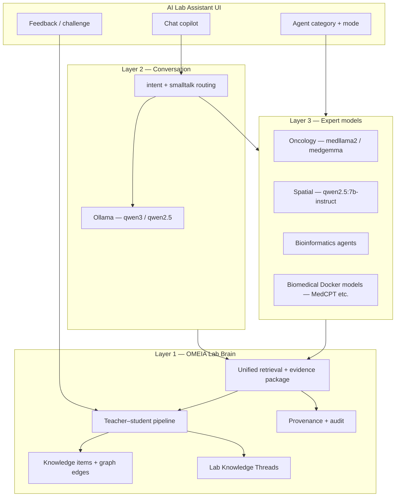

# OMEIA Three-Layer AI Strategy

**Status:** Planning document (June 2026)  
**Audience:** Färkkilä Lab platform developers and lab leads  
**Scope:** How OMEIA will evolve its AI stack in three layers — without copying external codebases.

---

## 1. Purpose

OMEIA is a **lab-native research platform** (spatial biology, HGSC, immunology, digital twin, vault, Research KB). This document defines a **three-layer AI architecture**:

| Layer | Role | Horizon |
|-------|------|---------|
| **Layer 1 — OMEIA Lab Brain** | Our own evolving intelligence: lab memory, provenance, teacher–student learning, long-term vision | Now → multi-year |
| **Layer 2 — Conversation** | Fast, friendly daily copilot (local Ollama first) | Now |
| **Layer 3 — Expert models** | Domain-specialist inference for bioscience and cancer | Now → expand |

We take **conceptual inspiration** from public cancer-research platform narratives (e.g. autonomous dossiers, public challenge/correct loops, cancer evidence convergence, paper-to-pipeline). We **do not port or fork** those codebases. OMEIA builds on what we already have: Postgres `platform.*`, Qdrant, Research KB, agent categories, spatial/imaging subsystems, and continuous-learning schema.

---

## 2. External inspiration (ideas only)

The following ideas are useful **design patterns**, not implementation sources. OMEIA will reinterpret them for a **translational spatial-immunology lab**, not a generic genomics CLI.

| Idea (concept) | What it means elsewhere | OMEIA interpretation |
|----------------|-------------------------|----------------------|
| **Autonomous research dossiers** | Multi-phase agent gathers identity, literature, DB evidence, synthesizes with citations | **Project Intelligence Briefs** — dossiers grounded in *our* vault, twin JSON, Research KB, and lab SOPs (EyeMT, SPACE, KRAS, etc.) |
| **Public research feed + challenge** | Threads where humans challenge claims and fork runs | **Lab Knowledge Threads** — internal (RBAC) threads on hypotheses, with challenge → re-retrieval → revised answer; audit in `platform.ai_responses` + feedback |
| **Cancer evidence convergence** | Tiered weighting across ClinVar, COSMIC, OncoKB, cBioPortal, CIViC, TCGA | **Evidence fusion layer** — connectors as *retrieval sources* into unified search, not a separate app; weights tuned for HGSC / TME / immunotherapy |
| **Mandatory citations + critic pass** | Uncited claims flagged speculative | **Already aligned** — `enforce_citations`, claim validation, evidence orchestrator; extend to Layer 1 learning pipeline |
| **Paper-to-pipeline** | PDF methods → executable YAML | **Protocol & pipeline linker** — digitalization pipeline extracts methods; links to existing scripts/notebooks in project registry |
| **Local-first LLM** | Ollama before cloud APIs | **Layer 2 default** — Linux workstation Ollama; cloud only for teacher tier or explicit opt-in |
| **Provenance ledger** | Every tool/API call traced | **OMEIA audit graph** — extend `platform.ai_responses`, source_ids, and ingestion audit; tie to vault asset lineage |

**Explicit non-goals:** Rebuilding OpenLab-style gene CLI, whole-cell Rust simulators, or standalone variant-VCF products unless the lab later requests them as scoped modules.

---

## 3. OMEIA differentiation

OMEIA’s moat is **lab context**, not a generic cancer chatbot:

- **Spatial & multiplex imaging** (tCyCIF, GeoMx, Visium, TLS/TME) — not only genomics portals  
- **Project digital twin** + document library + vault with RBAC  
- **Unified hybrid search** (`SearchService`) across project, lab, research, vault, people buckets  
- **Multi-agent categories** already defined (`config/env/agent_categories.json`)  
- **Teacher–student continuous learning** schema (`sql/150_continuous_learning.sql`) with `teacher | student | expert` roles  
- **Biomedical model sidecar** (`/api/biomedical-models/*`) for MedCPT-style embeddings separate from chat LLM  

Layer 1 is therefore **“the lab’s memory and judgment over time”**, not a replacement for Layer 2 chat or Layer 3 specialists.

---

## 4. Architecture overview



**Routing principle:** Conversation and greetings never pay the cost of expert RAG unless intent requires it. Research, oncology, spatial, and protocol questions escalate to Layer 3 + Layer 1 retrieval. Layer 1 records outcomes and improves retrieval weights over time.

---

## 5. Layer 1 — OMEIA Lab Brain (own AI, long vision)

### 5.1 Vision

Become the **authoritative, auditable intelligence layer** for the Färkkilä lab: what we know, what we cited, what we challenged, and what improved after feedback — without sending patient identifiers to external models.

### 5.2 Capabilities (OMEIA-native)

| Capability | Description | Inspiration echo |
|------------|-------------|------------------|
| **Project Intelligence Briefs** | Structured reports per project/question: evidence buckets, claims, confidence, citations | Autonomous dossiers |
| **Lab Knowledge Threads** | Persistent threads on a hypothesis; user challenge triggers re-retrieval and revised answer | ResearchBook challenge/fork |
| **Teacher–student loop** | External or senior model (`teacher`) produces grounded answers; local model (`student`) distills into retrievable knowledge items | N/A (OMEIA original) |
| **Evidence fusion** | Weighted merge of internal chunks + optional external cancer DB metadata (future connectors) | Cancer convergence scoring |
| **Learning-aware retrieval** | Boost verified knowledge items in Qdrant/Postgres search | N/A |
| **Provenance envelope** | Every answer links to `response_id`, sources, model role, pipeline status | Provenance ledger |

### 5.3 Current status

| Component | Status | Notes |
|-----------|--------|-------|
| Research KB + Qdrant `research_knowledge` | **Operational** | Needs re-index after infra rebuilds |
| Unified search + evidence orchestrator | **Operational** | `SearchService`, claim validation |
| Continuous learning schema | **Migrated, disabled** | `OMEIA_CONTINUOUS_LEARNING_ENABLED=false` |
| Learning API + pipeline services | **Scaffolded** | `omeia/api/learning_*.py`, `routers/learning.py` |
| Chat feedback hooks (UI) | **Partial** | Wired when flag enabled |
| Lab Knowledge Threads UI | **Not started** | Design in Phase 2 |
| External cancer DB connectors | **Not started** | Phase 3 — retrieval-only |
| Project Intelligence Briefs | **Partial** | Research Strategy Engine scaffold; flag off |
| Distilled “OMEIA student” model | **Future** | Requires learning data + eval gate |

### 5.4 Layer 1 roadmap

| Phase | Deliverable | Enable flag / migration |
|-------|-------------|-------------------------|
| **1A** | Turn on learning recording from chat; feedback → `platform.user_feedback` | `OMEIA_CONTINUOUS_LEARNING_ENABLED=true` |
| **1B** | Teacher ingest API (paste expert answer / import eval set) | Learning router |
| **1C** | Verified knowledge items feed back into search rank | `learning_retrieval_service` |
| **1D** | Lab Knowledge Threads (internal UI) | New UI + API |
| **1E** | Project Intelligence Brief export (PDF/Markdown) | Brief generator service |
| **1F** | Optional cancer DB connectors (CIViC, cBioPortal metadata) | Config-gated fetchers |

---

## 6. Layer 2 — Conversation (daily copilot)

### 6.1 Role

Low-latency, natural interaction: greetings, navigation help, light Q&A, session memory. **Default: local Ollama** on the Linux workstation (`100.80.231.55`).

### 6.2 Model policy

| Use case | Env / route | Model (Linux) |
|----------|-------------|---------------|
| Smalltalk / greetings | `CHAT_GREETING_MODEL` | `qwen3:8b` (fallback `qwen2.5:3b`) |
| General chat (no RAG) | `CHAT_CONVERSATION_MODEL` | `qwen3:14b` (fallback `qwen2.5:7b-instruct`) |
| Default env | `OLLAMA_MODEL` | `qwen2.5:3b` — dev/smoke |
| Summaries | `CHAT_SUMMARY_MODEL` | `qwen3:14b` |

Routing lives in `omeia/api/chat_conversation.py` → `resolve_route_model()`.

### 6.3 Current status

| Item | Status |
|------|--------|
| Intent-based Ollama routing | **Implemented** |
| `ensure_linux_ollama.sh` | **Added** — patches `mock` → `ollama` in `configs/.env` |
| Smalltalk pattern expansion | **Added** — “how are you doing”, etc. |
| Mock fallback when Ollama down | **Active** — shows “mock synthesis” banner |
| Session memory | **Env-gated** | `CHAT_SESSION_MEMORY=true` |
| UI model picker | **Catalog** | `config/env/ollama_research_models.json` |

### 6.4 Layer 2 roadmap

| Phase | Deliverable |
|-------|-------------|
| **2A** | Production default: `RUN_ON_LINUX.sh` always ensures Ollama + pulled conversation models |
| **2B** | `/api/chat/status` health card in UI (provider, model, Ollama reachability) |
| **2C** | Conversation-only path bypasses RAG for `general_chat` / `smalltalk` (latency) |
| **2D** | Benchmark greeting vs conversation models; document GPU RAM tiers |

---

## 7. Layer 3 — Expert models (bioscience & cancer)

### 7.1 Role

When the user selects **Oncology**, **Spatial**, **Wet lab**, **Bioinformatics**, or asks research-grade questions, OMEIA routes to **specialist models and agent teams** — not the lightweight conversation model.

### 7.2 Expert inventory (Ollama + agents)

From `config/env/ollama_research_models.json`:

| Model | Tier | OMEIA use case |
|-------|------|----------------|
| `medllama2:7b` | Cancer / oncology | HGSC, immunotherapy, oncology vocabulary |
| `medgemma:4b` | Medical general | Biomedical Q&A, precision oncology concepts |
| `meditron:7b` | Medical literature | Publications, clinical/scientific style |
| `qwen2.5:7b-instruct` | Spatial biology | Visium, GeoMx, TME, TLS synthesis |
| `llama3.1:8b` | Lab assistant | Protocol explanation, summarization |
| `mistral-nemo:12b` | Deep synthesis | Batch eval / long reports (GPU permitting) |

**Agent categories** (prompt + retrieval specialists, `agent_categories.json`):

- `cancer_oncology` — Oncology & Tumor Microenvironment  
- `spatial_multiplex` — Spatial & Multiplex Imaging  
- `wet_lab_cycif` — Wet Lab & CycIF  
- `bioinformatics_omics` — Bioinformatics & Omics  
- `literature_evidence` — Literature & Evidence Synthesis  

**Docker biomedical sidecar** (`docs/BIOMEDICAL_MODELS_DOCKER.md`): MedCPT embeddings and related models for search/rerank — complementary to chat experts.

### 7.3 Current status

| Item | Status |
|------|--------|
| Ollama research catalog + pull script | **Implemented** — `pull_ollama_research_models.sh` |
| Category → multi-agent orchestration | **Implemented** — deep mode full team |
| Category → **specific Ollama model** routing | **Gap** — experts are mostly prompt agents, same LLM |
| `medllama2` / `medgemma` in chat catalog | **Listed** — user can pick manually |
| Auto-route oncology intent → `medllama2` | **Not implemented** |
| Biomedical Docker service | **Optional** — separate from chat |

### 7.4 Layer 3 roadmap

| Phase | Deliverable |
|-------|-------------|
| **3A** | **Expert routing table** — map `agent_category` + intent → `(provider, model)` |
| **3B** | Oncology questions → `medllama2:7b`; spatial methods → `qwen2.5:7b-instruct` |
| **3C** | Pull + verify all expert models in `linux_post_stack_setup.sh` |
| **3D** | Expert eval suite (oncology + spatial question banks in `tests/`) |
| **3E** | Optional cloud teacher for deep mode only (Gemini) with PII guardrails |
| **3F** | Expand catalog: pathology/imaging vision models when GPU pipeline ready |

---

## 8. Cross-layer orchestration

### 8.1 Decision flow (target)

```text
User message
  → classify intent (chat_intent.py)
  → if smalltalk / light chat → Layer 2 only (template or Ollama)
  → if sensitive / PII + external cloud → block or force local
  → if research / oncology / spatial / protocol → Layer 3 model + Layer 1 RAG
  → package evidence + generate
  → if continuous learning on → record as student; await teacher/feedback
  → return answer + sources + synthesis_mode + model provenance
```

### 8.2 Configuration matrix (Linux workstation)

```bash
# Layer 2 — conversation
LLM_PROVIDER=ollama
CHAT_LLM_PROVIDER=ollama
OLLAMA_MODEL=qwen2.5:3b
CHAT_GREETING_MODEL=qwen3:8b
CHAT_CONVERSATION_MODEL=qwen3:14b

# Layer 3 — experts (routing table — planned)
OMEIA_EXPERT_ROUTING_ENABLED=true
OMEIA_ONCOLOGY_MODEL=medllama2:7b
OMEIA_SPATIAL_MODEL=qwen2.5:7b-instruct
OMEIA_LITERATURE_MODEL=meditron:7b

# Layer 1 — lab brain
OMEIA_CONTINUOUS_LEARNING_ENABLED=true
OMEIA_RESEARCH_STRATEGY_ASSISTANT=false   # enable after 1E validation
KNOWLEDGE_INDEXER_ENABLED=true
VECTORIZATION_ENABLED=true
```

### 8.3 Privacy rules (unchanged, reinforced)

- Patient identifiers → block external providers (`guard_for_llm`)  
- VCF/raw genomic identifiers → stay on lab storage; only derived summaries in prompts  
- Teacher cloud calls → opt-in, logged, never for raw clinical exports  

---

## 9. Implementation phases (summary)

| Phase | Focus | Layers | Effort |
|-------|-------|--------|--------|
| **0 — Stabilize** | Ollama live on Linux, re-index Qdrant, mock eliminated | L2 | Days |
| **1 — Lab Brain MVP** | Enable continuous learning + feedback + retrieval boost | L1 | 2–3 weeks |
| **2 — Expert routing** | Category/intent → specialist Ollama models | L3 | 1–2 weeks |
| **3 — Knowledge Threads** | Challenge/correct UI + re-run pipeline | L1 | 2–3 weeks |
| **4 — Intelligence Briefs** | Project dossiers from internal evidence | L1 + L3 | 3–4 weeks |
| **5 — External cancer evidence** | CIViC/cBioPortal as search connectors | L1 + L3 | 4+ weeks |
| **6 — OMEIA student** | Fine-tune or distill from teacher corpus | L1 | Research |

---

## 10. Success metrics

| Metric | Target |
|--------|--------|
| Casual chat uses live Ollama | 0% mock synthesis in normal ops |
| Oncology eval set | ≥80% citation-backed answers |
| Learning loop | >100 rated responses → measurable retrieval boost |
| Expert routing latency | <30s balanced mode on workstation GPU |
| Provenance | 100% research answers have `response_id` + sources when RAG used |

---

## 11. Related documents

- [AI Lab Assistant Architecture](./AI_LAB_ASSISTANT_ARCHITECTURE.md) — current copilot flow  
- [01 End-to-End Architecture](./01_END_TO_END_ARCHITECTURE.md) — platform layers 1–8  
- [03 Vector RAG Deep Dive](./03_VECTOR_RAG_DEEP_DIVE.md) — retrieval design  
- [BIOMEDICAL_MODELS_DOCKER](./BIOMEDICAL_MODELS_DOCKER.md) — Layer 3 embedding sidecar  
- [AI Lab Assistant Enhancement Roadmap](./AI_LAB_ASSISTANT_ENHANCEMENT_ROADMAP.md) — prior copilot work  

---

## 12. Next action (recommended)

1. **Linux:** Run `./RUN_ON_LINUX.sh` and `docker exec omeia-ollama ollama pull qwen2.5:3b` (+ expert models from catalog).  
2. **Enable Layer 1 recording:** Apply migration 150 if needed; set `OMEIA_CONTINUOUS_LEARNING_ENABLED=true`.  
3. **Implement Phase 3A:** Expert routing table in `chat_conversation.py` / new `expert_model_router.py`.  

This document will be updated as phases complete.
