# OMEIA Platform — Complete Architecture Review

**Scope:** Entire digital-notepad / OMEIA-AI platform — frontend, backend, data, search, RAG, AI, projects, documents, imaging, storage, auth, deployment, networking, observability, scalability  
**Perspective:** CTO · Principal Architect · Security Architect · Platform Architect · Staff Frontend · Staff Backend  
**Codebase:** `omeia/` (FastAPI + React) on branch `cursor/unified-search-ai-lab-assistant`  
**Date:** 2026-06-08 (re-scored 2026-06-08 after Phases 1–3 merge)  
**Cross-references:** `docs/KNOWLEDGE_DOCUMENT_SUBSYSTEM_REVIEW.md`, `docs/PROJECT_INTELLIGENCE_SUBSYSTEM_REVIEW.md`, `docs/IMAGING_SUBSYSTEM_REVIEW.md`, `docs/YOUR_SETUP.md`, `docs/LINUX_PRIMARY_DEPLOYMENT.md`

---

## Table of contents

1. [Complete System Overview](#1-complete-system-overview)
2. [Service Inventory](#2-service-inventory)
3. [Service Dependency Graph](#3-service-dependency-graph)
4. [System Architecture Diagram](#4-system-architecture-diagram)
5. [Data Flow Diagram](#5-data-flow-diagram)
6. [Security Boundary Diagram](#6-security-boundary-diagram)
7. [API Inventory](#7-api-inventory)
8. [Database Inventory](#8-database-inventory)
9. [External Integration Inventory](#9-external-integration-inventory)
10. [Technical Debt Assessment](#10-technical-debt-assessment)
11. [Security Assessment](#11-security-assessment)
12. [Scalability Assessment](#12-scalability-assessment)
13. [Reliability Assessment](#13-reliability-assessment)
14. [Maintainability Assessment](#14-maintainability-assessment)
15. [Performance Assessment](#15-performance-assessment)
16. [Top 25 Risks](#16-top-25-risks)
17. [Top 25 Opportunities](#17-top-25-opportunities)
18. [Production Readiness Score](#18-production-readiness-score)
19. [3 Month Roadmap](#19-3-month-roadmap)
20. [6 Month Roadmap](#20-6-month-roadmap)
21. [12 Month Roadmap](#21-12-month-roadmap)
22. [Recommended Review Order](#22-recommended-review-order)
23. [Exact Files Most Important To Refactor](#23-exact-files-most-important-to-refactor)

---

## 1. Complete System Overview

OMEIA (digital-notepad) is a **research lab intelligence platform** for the Färkkilä Lab — a unified web application that combines document library browsing, project digital twins, living notebook/wiki, unified search (⌘K), AI Lab Assistant (RAG copilot), microscopy image streaming, wet-lab knowledge, research knowledge ingestion, vault asset registry, and optional biomedical model services.

### Deployment reality (Linux-primary)

Per `docs/YOUR_SETUP.md` and `docs/LINUX_PRIMARY_DEPLOYMENT.md`, the **permanent production topology** is:

| Role | Host | Notes |
|------|------|-------|
| Git repo | Linux `~/data4TB/digital-notepad` | Mac pushes code via `mac_push_to_linux.sh` |
| Lab files (`OMEIA-database`) | Linux `~/data4TB/OMEIA-database` | Partial sync from Mac; binaries must exist on Linux disk |
| Docker (Postgres, Qdrant, Ollama) | Linux workstation | `docker-compose.yml` binds to `127.0.0.1` |
| FastAPI `:8000` + Vite `:5173` | Linux | `./scripts/start_linux.sh` |
| Mac / remote clients | Browser only | `http://100.80.231.55:5173` via Tailscale |
| Ollama / Qdrant from Mac dev | Tailscale HTTP | `OLLAMA_INTERNAL_TOKEN` via Caddy proxy |

Mac is **not** a full-stack host in the canonical workflow. Tailscale carries HTTP; **rsync for heavy data still requires SSH keys or Tailscale file send**.

### Architectural planes

The platform is organized into five cooperating planes:

| Plane | Authority | Primary consumers |
|-------|-----------|-------------------|
| **Presentation** | React 19 + Vite 8 SPA | Lab researchers, admins |
| **API / orchestration** | FastAPI 0.4.0 (`omeia/api/`) | All UI + copilot |
| **Knowledge & retrieval** | Postgres `rag.*` + `platform.*` + Qdrant + JSON twins | Search, copilot, document library |
| **Filesystem corpus** | `DATABASE_ROOT` + `PROJECTS_ROOT` | Ingestion, previews, imaging, datapad |
| **Infrastructure** | Docker Compose, Tailscale, optional biomedical/imaging profiles | LLM, vectors, HPC-adjacent workloads |

### Subsystem synthesis (from dedicated reviews)

| Subsystem | Readiness (subsystem review) | Platform role |
|-----------|------------------------------|---------------|
| Knowledge & documents | 55–65% dev twin; 35–45% full corpus | Vault, digitalization, RAG, library |
| Project intelligence | 54% | Twins, notebook, datapad, portfolio |
| Imaging / streaming | 57% | TIFF/OME-TIFF tiles, LUMI pipeline docs |
| Unified search + copilot | Partial (shared `SearchService`) | ⌘K + AI Lab Assistant |
| Auth & security | Partial (Firebase + allowlist; RBAC schema unused) | Gate all `/api/*` except health/static |
| Deployment | Operational for single Linux host | Not multi-tenant cloud |

### Executive verdict

OMEIA is an **ambitious, domain-rich research platform** that successfully demonstrates end-to-end lab workflows on a **single Linux workstation** with Tailscale remote access. It is **not yet production-grade** for a full lab corpus at scale: knowledge planes are duplicated, vector indexes are thin or misaligned, collaboration/RBAC is audit-only, observability is minimal, and data sync between Mac and Linux remains manual.

**Platform production readiness: 63%** (see §18 and `docs/PRODUCTION_READINESS_REPORT.md`; was 58% after Phases 1–3, 52% before remediation).

---

## 2. Service Inventory

### Runtime services

| Service | Technology | Port / bind | Host | Critical? |
|---------|------------|-------------|------|-----------|
| **React SPA (Vite dev)** | React 19, Vite 8 | `:5173` (all interfaces on Linux) | Linux | Yes (UI) |
| **FastAPI API** | Python 3, Uvicorn | `:8000` | Linux | Yes |
| **PostgreSQL** | postgres:15 Docker | `127.0.0.1:5432` | Linux Docker | Yes |
| **Qdrant** | qdrant/qdrant Docker | `127.0.0.1:6333` | Linux Docker | Yes (semantic search) |
| **Ollama** | ollama/ollama Docker | internal `:11434` | Linux Docker | Yes (local LLM + embeddings) |
| **Ollama Caddy proxy** | caddy:2-alpine | `127.0.0.1:11434` | Linux Docker | Yes (bearer auth) |
| **Imaging worker** | Custom Conda Docker (`--profile imaging`) | internal | Linux Docker | Optional |
| **Biomedical models** | FastAPI microservices (`docker-compose.biomodels.yml`) | `8100–8112` localhost | Linux Docker | Optional |
| **Tailscale** | OS mesh VPN | `100.x.x.x` | Linux + Mac | Yes (remote access) |
| **Firebase Auth** | Google managed | HTTPS | External | Yes (when auth enabled) |
| **Supabase** | Hosted Postgres sync (optional) | HTTPS | External | Optional |

### Application modules (logical services inside FastAPI)

| Module | File(s) | Responsibility |
|--------|---------|----------------|
| Health & admin | `routers/health.py`, `platform_admin.py` | `/health`, allowlist, ingestion jobs |
| Research platform | `routers/research.py` | Projects, notebook, wiki, decisions, tasks |
| Datapad & twins | `routers/datapad.py`, `project_processor.py` | Digital twin CRUD, file sandbox writes |
| Knowledge & lab DB | `routers/knowledge.py`, `lab_knowledge_store.py` | Section ingest, lab search |
| Vault & digitalization | `routers/vault.py`, `digitalization.py`, `vault_ingestion_engine.py` | Asset registry, extract pipeline |
| Document library | `routers/document_library.py`, `document_library_service.py` | Taxonomy, facets, previews |
| Unified search | `routers/search.py`, `search_service.py` | ⌘K omnibox, copilot retrieval |
| Chat / copilot | `routers/chat.py`, `chat_service.py`, `evidence_orchestrator.py` | RAG chat, streaming, grounding |
| Legacy copilot | `routers/copilot.py` | `/ask`, install guide, clinical tools |
| Research knowledge | `routers/research_knowledge.py`, `research_knowledge_store.py` | Crawl, publications, datasets |
| Image streaming | `routers/image_assets.py`, `image_streaming/` | Tiles, thumbnails, manifest |
| Storage connectors | `routers/storage.py`, `omeia/storage/` | DataCloud WebDAV, P-drive SMB |
| Biomedical models client | `routers/biomedical_models.py`, `biomedical_models_client.py` | Gateway to Docker LLM stack |
| Agent categories | `routers/agent_categories.py`, `agent_orchestrator/` | Multi-agent category runs |
| Secure files | `security/secure_files.py` | Authenticated file download/preview |
| Static lab files | `routers/lab_static.py` | Unauthenticated static file serve (legacy) |
| Docker service client | `docker_service_client.py` | Health probes, circuit breaker, auto-start |
| Scheduled scanner | `scheduled_directory_scanner.py` | Background vault/directory scan |

### Frontend feature modules

| Area | Key screens / components | API clients |
|------|--------------------------|-------------|
| Get Started / Overview | `LabKnowledgeScreen.jsx` | `knowledge.py`, static catalog |
| Projects | `ProjectsScreen.jsx`, `WorkspaceScreen.jsx` | `research.py`, `datapad.py` |
| Document Library | `ScientificFileExplorer.jsx` | `document_library.py` |
| Knowledge Search | `KnowledgeSearchScreen.jsx`, `GlobalSearchOverlay` | `search.py` |
| AI Lab Assistant | `AiLabAssistantScreen.jsx` | `chat.py` |
| Imaging | `ImageTileViewer.jsx`, `ImageViewerPlaceholderScreen.jsx` | `image_assets.py` |
| CyCif / Wet Lab | `CycifScreen.jsx`, `WetLabProtocolsBrowser.jsx` | `knowledge.py` |
| Administration | `AdministrationScreen.jsx` | `health.py` |
| Auth | `LoginScreen.jsx`, `ApiContext.jsx` | Firebase + `/api/auth/config` |

---

## 3. Service Dependency Graph

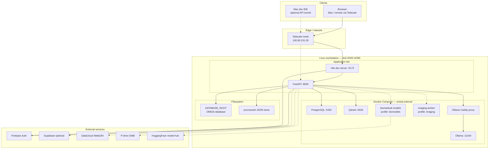

---

## 4. System Architecture Diagram

### Platform layer diagram

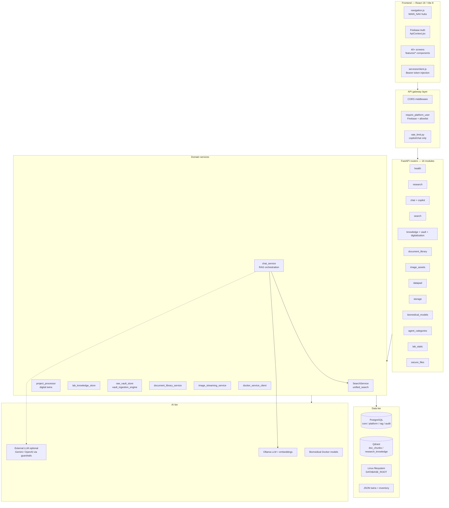

### Frontend architecture

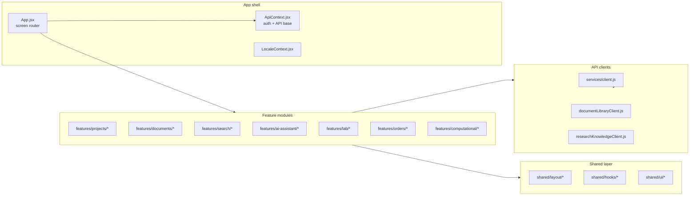

### Backend API architecture

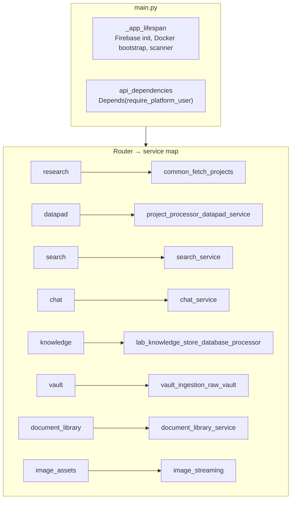

### Postgres architecture

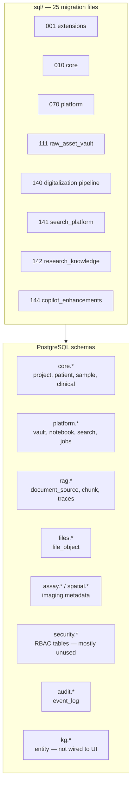

### Qdrant architecture

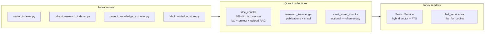

### Ollama / LLM architecture

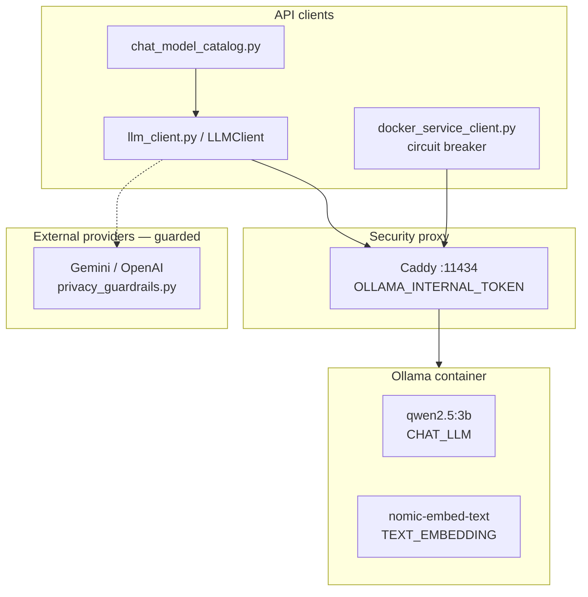

### Search & RAG architecture

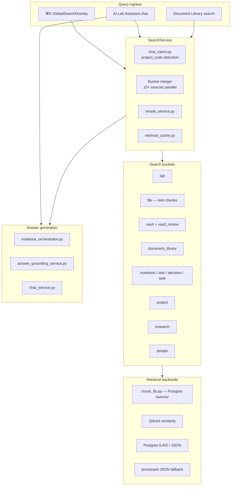

### Imaging architecture

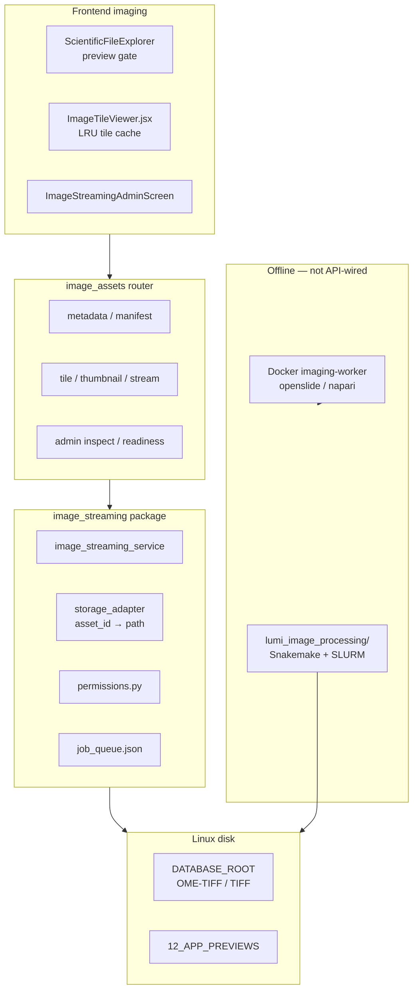

### Docker & deployment architecture

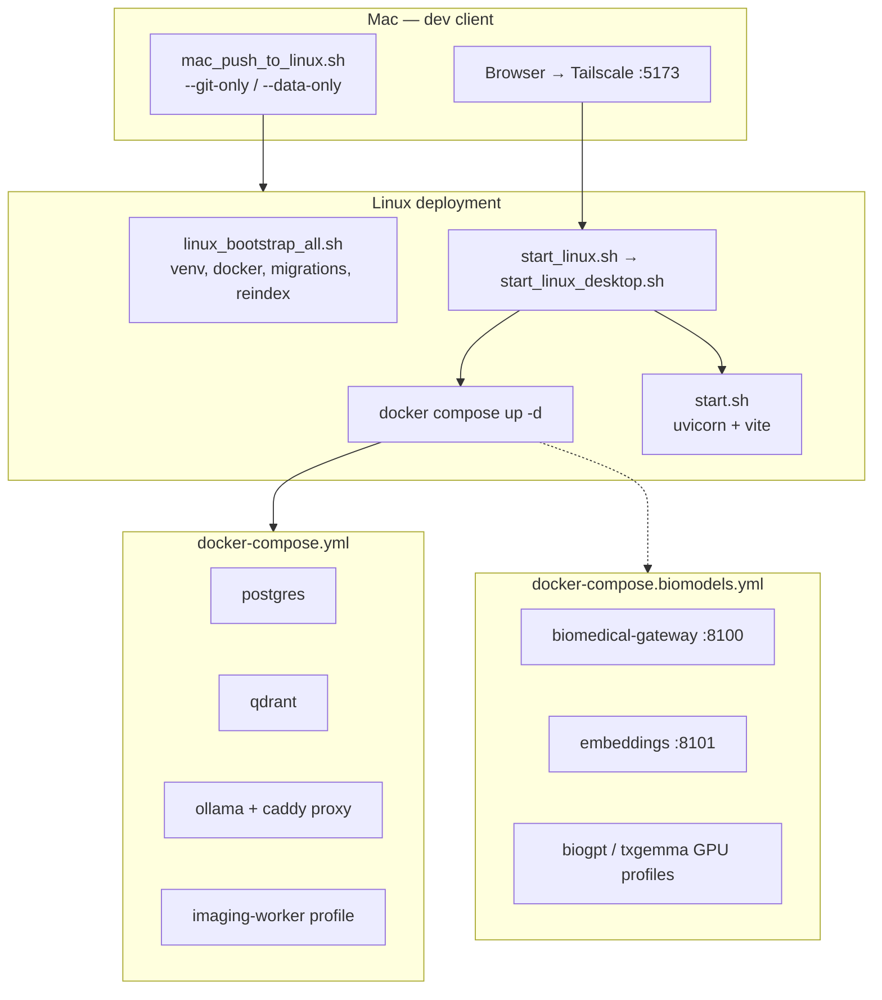

### Auth architecture

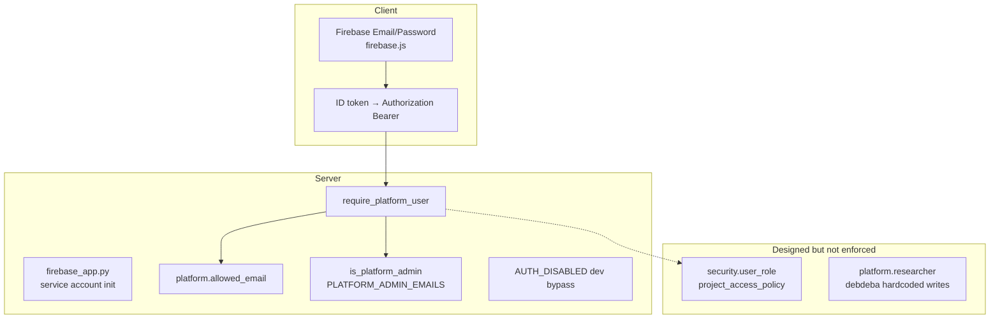

### Networking architecture

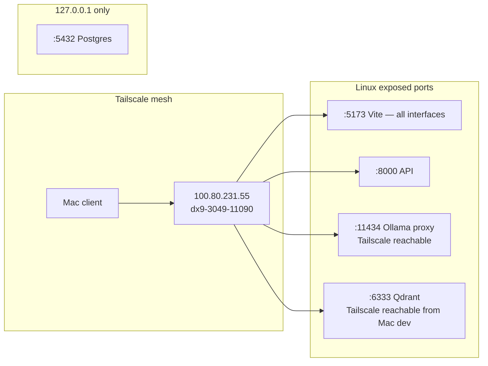

---

## 5. Data Flow Diagram

### Primary user journeys

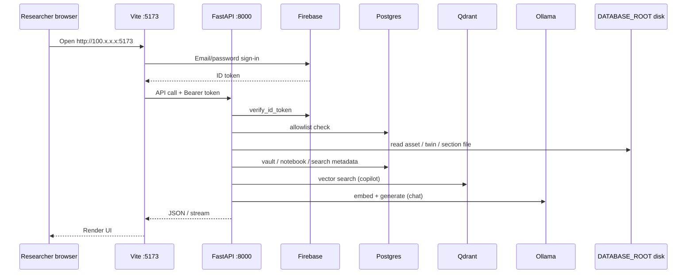

### Ingestion data flow (simplified)

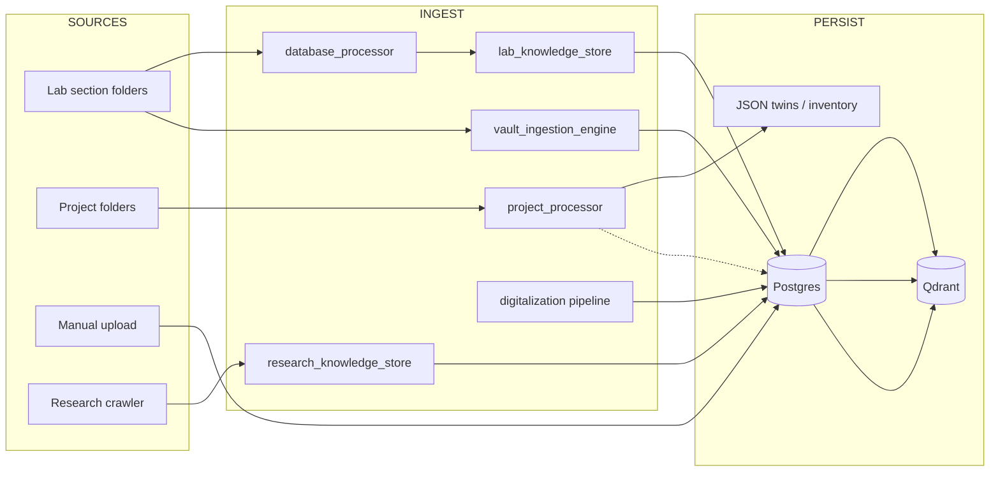

*Detail: see `docs/KNOWLEDGE_DOCUMENT_SUBSYSTEM_REVIEW.md` Appendix B and `docs/PROJECT_INTELLIGENCE_SUBSYSTEM_REVIEW.md` §4.*

---

## 6. Security Boundary Diagram

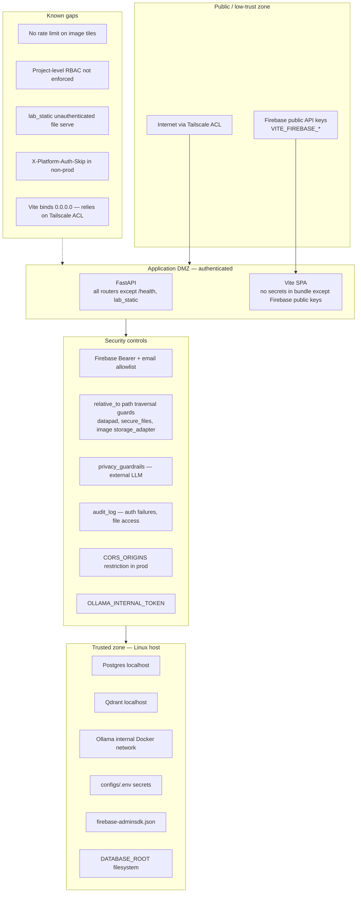

---

## 7. API Inventory

FastAPI mounts **16 routers**; ~**200 route handlers** across the codebase. All standard routes require `require_platform_user` except `health`, `lab_static`, and `secure_files` (which enforces its own dependency).

### Unauthenticated / special auth

| Method | Path | Module | Notes |
|--------|------|--------|-------|
| GET | `/health` | health | Liveness |
| GET | `/database-static/{path}` | lab_static | **Unauthenticated static serve** |
| GET | `/projects-static/{path}` | lab_static | **Unauthenticated static serve** |
| GET/POST | `/api/auth/*` | health | Registration request, config |
| * | `/api/files/*` | secure_files | Own `require_platform_user` |

### Core platform

| Prefix / area | Router | ~Routes | Key endpoints |
|---------------|--------|---------|---------------|
| Health & admin | `health.py` | 13 | `/health`, `/api/admin/allowed-emails`, `/api/platform/connectors` |
| Research | `research.py` | 36 | `/projects`, `/notebook`, `/wiki`, `/decisions`, `/tasks`, `/platform/search` |
| Datapad & twins | `datapad.py` | 20 | `/api/projects/{code}/digital-twin`, `/api/datapad/document`, `/api/projects/process-all` |
| Search | `search.py` | 4 | `/api/platform/unified-search`, `/api/platform/search-suggestions` |
| Chat | `chat.py` | 7 | `/api/chat`, `/api/chat/stream`, `/api/chat/feedback` |
| Copilot legacy | `copilot.py` | 17 | `/ask`, `/install_guide`, `/clinical/*`, `/features/*` |
| Knowledge | `knowledge.py` | 24 | `/api/knowledge/lab/*`, `/api/database/*`, `/api/search` (legacy) |
| Vault | `vault.py` | 24 | `/api/vault/*`, `/api/digitalize/*`, `/ingest-document` |
| Digitalization | `digitalization.py` | 8 | `/api/digitalization/status`, `/run`, `/chunks/{id}` |
| Document library | `document_library.py` | 9 | `/api/document-library/search`, `/preview/{asset_id}` |
| Research knowledge | `research_knowledge.py` | 5 | `/api/research-knowledge/crawl`, `/search` |
| Image assets | `image_assets.py` | 9 | `/api/assets/{id}/image/tile`, `/stream`, admin readiness |
| Storage | `storage.py` | 11 | `/api/storage/datacloud/*`, `/api/storage/pdrive/*` |
| Biomedical | `biomedical_models.py` | 5 | `/api/biomedical-models/catalog`, `/embed`, `/generate/*` |
| Agent categories | `agent_categories.py` | 6 | `/api/agent-categories`, `/api/chat/category` |
| Secure files | `secure_files.py` | 2 | `/api/files/download`, `/preview` |

### API versioning & consistency notes

- **No API version prefix** (`/v1/`) — breaking changes risk client drift.
- **Legacy duplicate search paths**: `/api/search`, `/api/knowledge/hybrid-search`, `/platform/search`, `/api/platform/unified-search` — unified path is canonical.
- **Mixed prefix styles**: some routes at root (`/projects`, `/ask`), others under `/api/`.
- **OpenAPI**: auto-generated at `/docs` when API running.

---

## 8. Database Inventory

### PostgreSQL schemas (25 SQL migrations in `sql/`)

| Schema | Purpose | Key tables | Row authority |
|--------|---------|------------|---------------|
| `core` | Clinical & project registry | `project`, `patient`, `sample`, `cohort`, `billing_instructions` | Catalog + clinical imports |
| `platform` | Lab operations | `raw_asset_vault`, `notebook_entry`, `research_wiki`, `decision_registry`, `task`, `document_chunk`, `research_chunk`, `allowed_email`, `chat_session`, `search_query_log` | API writes |
| `rag` | RAG corpus | `document_source`, `document_chunk`, `embedding_job`, `retrieval_trace` | Ingest pipelines |
| `files` | File metadata | `file_object`, `dataset_snapshot` | Assay linkage |
| `assay` / `spatial` | Imaging assay model | `assay_run`, `segmentation_run`, `quantification_run` | Schema ready; sparse data |
| `features` / `clinical` / `ml` | Feature warehouse & ML | `feature_matrix`, `model_registry` | Copilot clinical tools |
| `security` | RBAC (designed) | `user_role`, `project_access_policy` | **Not wired to auth** |
| `audit` | Audit trail | `event_log`, `tool_execution_log` | Partial writes |
| `kg` | Knowledge graph | `entity_registry`, `assertion` | Extracted but not queried |

### Qdrant collections

| Collection | Vector dim | Writer | Reader |
|------------|------------|--------|--------|
| `doc_chunks` | 768 (`TEXT_EMBEDDING_DIM`) | `vector_indexer`, `lab_knowledge_store`, `project_knowledge_extractor` | `SearchService`, copilot |
| `research_knowledge` | 768 (`RESEARCH_KB_VECTOR_SIZE`) | `qdrant_research_indexer` | `SearchService` |
| `vault_asset_chunks` | 768 | Optional vault vectorization | `vault_vector_search` |

### Filesystem data stores (outside Postgres)

| Path | Content | Authority |
|------|---------|-----------|
| `DATABASE_ROOT` | Lab section tree (SOCIAL, WET_LAB, etc.) | Source files — Linux disk required |
| `PROJECTS_ROOT` | Per-project folders | Source files |
| `processed/{code}.json` | Digital twin snapshots | `project_processor` |
| `processed/{section}.json` | Lab section twins | `database_processor` |
| `raw_asset_inventory.json` | Vault inventory fallback | Can drift from Postgres |
| `image_metadata_cache.json` | Imaging probe cache | `image_metadata_service` |
| `projects_catalog.json` | Project registry | Merged with `core.project` in `fetch_projects_unified()` |

### Neo4j

Configured in `.env.example` (`NEO4J_URI`) but **no active graph queries** in application code — aspirational.

---

## 9. External Integration Inventory

| Integration | Config keys | Status | Used by |
|-------------|-------------|--------|---------|
| **Firebase Auth** | `FIREBASE_*`, `VITE_FIREBASE_*` | Operational when configured | All authenticated routes |
| **Supabase sync** | `SUPABASE_*` | Optional / partial | `supabase_sync.py`, vault router |
| **Ollama (local)** | `OLLAMA_BASE_URL`, `OLLAMA_MODEL` | Primary LLM on Linux | `chat_service`, embeddings |
| **Gemini / OpenAI / Groq** | `CHAT_LLM_PROVIDER`, API keys | Optional external | `chat_model_catalog`, guarded by `privacy_guardrails` |
| **Qdrant** | `QDRANT_URL` | Required for semantic search | `SearchService`, indexers |
| **DataCloud WebDAV** | `DATACLOUD_*` | Connector stub — credentials needed | `storage/datacloud_webdav.py` |
| **P-drive SMB** | `PDRIVE_*` | Connector stub | `storage/pdrive_smb.py` |
| **HuggingFace** | `HF_TOKEN` | Biomedical Docker only | `docker-compose.biomodels.yml` |
| **Tailscale** | OS-level | Production networking | Remote browser + Mac→Linux Ollama |
| **CSC / Allas** | Documented in LUMI pipeline | Offline HPC | `lumi_image_processing/` |
| **SLURM / LUMI** | HPC templates in DB | Offline | `LumiHpcAgent`, pipeline scripts |

---

## 10. Technical Debt Assessment

| ID | Debt item | Severity | Location | Effort |
|----|-----------|----------|----------|--------|
| TD-01 | **Triple+ chunking implementations** (700 vs 1800 vs 4200 char windows) | Medium | `chunking.py` facade + `CANONICAL_CHUNK_PIPELINE`; legacy paths remain when flag off | Medium |
| TD-02 | **Dual digitalization schemas** (`sql/119` vs `sql/140`) | Critical | Migrations + engines | High |
| TD-03 | **JSON inventory as fallback authority** | High | `raw_asset_inventory.json`, `load_processed` | Medium |
| TD-04 | **Legacy search API duplication** | Medium | `knowledge.py`, `research.py` | Medium |
| TD-05 | **`common.py` god-module** (890+ lines, star-imported in main) | High | `common.py`, `main.py` | High |
| TD-06 | **`search_service.py` monolith** (1800+ lines) | High | `search_service.py` | High |
| TD-07 | **Hardcoded researcher identity** (`debdeba`) | Low | `security/auth.py` `resolve_researcher_id()`; notebook/wiki use resolver (Phase 1) | Low |
| TD-08 | **RBAC schema unused** | High | `security.*` tables vs Firebase-only auth | Medium |
| TD-09 | **OCR queue skeleton** (`platform.ocr_job`, worker idle when `ENABLE_OCR=false`) | Medium | `sql/145_ocr_jobs.sql`, `ocr/adapter.py`, `run_ocr_queue.py` | Medium |
| TD-10 | **Imaging worker disconnected** from API | Medium | Docker `imaging-worker` | Medium |
| TD-11 | **File-backed job queues** | Medium | `image_streaming_jobs.json`, vault checkpoints | Medium |
| TD-12 | **Frontend search fragmentation** | Medium | `KnowledgeSearchScreen` vs `GlobalSearchOverlay` | Medium |
| TD-13 | **`lab_static` unauthenticated** static serve | Medium | `lab_static.py` | Low |
| TD-14 | **No API versioning** | Medium | All routers | Medium |
| TD-15 | **In-memory rate limiter** (not Redis) | Low | `rate_limit.py` | Low |
| TD-16 | **No structured observability** | High | Entire platform | High |
| TD-17 | **Mac/Linux path confusion** in `.env` | Medium | `configs/.env`, `paths.py` | Low |
| TD-18 | **Meeting screen placeholder** | Low | `MeetingScreen.jsx` | Low |
| TD-19 | **Neo4j configured but unused** | Low | `.env.example` | Medium |
| TD-20 | **Test coverage gaps** (~39 test files, many modules untested) | Medium | `tests/` | Ongoing |

**Debt score: 6.2 / 10** (10 = highest debt; was 6.8). Knowledge pipeline consolidation (Phases 1–2) reduced chunk/index duplication; god-modules and dual-schema debt remain highest leverage.

---

## 11. Security Assessment

| Domain | Score (1–10) | Posture | Gaps |
|--------|--------------|---------|------|
| Authentication | 7 | Firebase Email/Password + server verify + allowlist | Dev bypass; `PLATFORM_AUTH_DISABLED` easy to misconfigure |
| Authorization | 4 | Admin vs researcher role only | No project-scoped RBAC despite schema; `can_download_file` basic |
| Data protection | 6 | Path traversal guards on datapad, images, secure_files | `lab_static` bypasses auth; sensitivity levels not enforced on all reads |
| LLM privacy | 7 | `privacy_guardrails.py` blocks secrets/PII to external LLMs | Local Ollama unguarded for sensitive corpus |
| Network | 6 | Docker internal network; Ollama bearer token; Postgres localhost | Vite on all interfaces; Tailscale ACL is sole perimeter |
| Secrets management | 5 | `.env` gitignored; template docs | Dev passwords in docker-compose; no Vault/K8s secrets |
| Audit | 5 | Auth failure logs, image access logs, agent audit table | No centralized SIEM; incomplete coverage |
| Dependency security | 5 | `security_opt: no-new-privileges` on containers | No automated CVE scanning noted |
| Input validation | 6 | Pydantic models on chat/search; LLM prompt sanitization in docker client | Upload paths need continued review |

**Overall security grade: C+** — Acceptable for a **trusted lab VPN** deployment; **not** ready for internet-public multi-tenant hosting without RBAC, rate limits on all expensive endpoints, WAF, and secret rotation.

*Detail: imaging security in `docs/IMAGE_SECURITY_NOTES.md`; auth tests in `tests/test_security_authentication.py`, `tests/test_auth_protected_routes.py`.*

---

## 12. Scalability Assessment

| Dimension | Current ceiling | Bottleneck | Scale path |
|-----------|-----------------|------------|------------|
| Concurrent users | ~5–15 on single Linux host | Single Uvicorn worker, Vite dev server | Gunicorn multi-worker + production Vite `build` + nginx |
| Corpus size | ~100k files metadata; semantic search thin | Full-folder rescans; O(n) inventory lookups | Incremental ingest, inventory DB index, background workers |
| Vector index | Single Qdrant container | No sharding; reindex is manual script | Qdrant cluster or managed vector DB |
| LLM throughput | 1× Ollama `qwen2.5:3b` | GPU/CPU bound; no queue | Model routing, request queue, larger GPU |
| Image tiles | Dev-twin TIFF scale | Synchronous decode in API process | Tile worker pool, CDN cache, pyvips |
| Postgres | Single container | No read replicas | Connection pooling (PgBouncer), read replica |
| Search latency | Acceptable for dev | 10+ bucket parallel fan-out in threads | gRPC microservices per bucket, cache warming |
| Multi-host | Not supported | Linux-primary single node | Split API/stateful services; shared NFS for DATABASE_ROOT |

**Scalability grade: D+ for horizontal scale; B- for single-lab vertical scale.**

---

## 13. Reliability Assessment

| Mechanism | Present? | Notes |
|-----------|----------|-------|
| Docker healthchecks | Yes | Postgres, Qdrant, Ollama, Caddy |
| API `/health` | Yes | Returns component status |
| Circuit breaker | Yes | `docker_service_client.py` for Ollama/Qdrant |
| Docker auto-start | Yes | `DOCKER_AUTO_START`, lifespan bootstrap |
| Graceful shutdown | Partial | Lifespan stops scanner; no drain for in-flight chat |
| Background jobs | Partial | `scheduled_directory_scanner`, `BackgroundTasks` — no Celery/RQ |
| Backup strategy | **Not in code** | Postgres/Qdrant volumes; no documented backup runbook |
| Disaster recovery | **Manual** | Git + rsync; Tailscale file send |
| Idempotent ingest | Partial | Checksum-based dedup in vault; twins can overwrite |
| Retry on LLM failure | Yes | Agent orchestrator fallback models |

**Reliability grade: C** — Suitable for **dev twin with tolerant users**; production needs job queue, backups, and HA plan.

---

## 14. Maintainability Assessment

| Factor | Score (1–10) | Evidence |
|--------|--------------|----------|
| Code organization | 6 | Routers extracted; services still monolithic |
| Documentation | 8 | Rich `docs/` including subsystem reviews, YOUR_SETUP |
| Test suite | 6 | 39 test files; good auth/search coverage; gaps in UI/integration |
| Config management | 7 | `.env.example`, `linux-workstation.env.template`, feature flags |
| Deployment scripts | 8 | `linux_bootstrap_all.sh`, `mac_push_to_linux.sh`, `start_linux.sh` |
| Type safety | 5 | Pydantic on API; JSX without TypeScript |
| Consistency | 5 | Multiple ingestion pipelines; legacy endpoints |
| Onboarding | 7 | YOUR_SETUP.md is excellent; Node version pitfall documented |

**Maintainability grade: B-** — A motivated staff engineer can navigate the codebase; **knowledge plane duplication** is the primary cognitive load.

---

## 15. Performance Assessment

| Path | Expected latency | Risk |
|------|------------------|------|
| `/health` | <50ms | Low |
| `/api/platform/unified-search` | 200ms–2s | Parallel bucket fan-out; cache helps |
| `/api/chat/stream` | 2–30s | LLM + retrieval; rate limited |
| `/api/assets/{id}/image/tile` | 100ms–3s | TIFF decode; improved with keyed reads |
| `/api/projects/process-all` | minutes | **Synchronous** full-folder scan |
| `/api/document-library/search` | 200ms–1s | Postgres + enrichment |
| Vault ingest scan | minutes–hours | Background partially; blocks on large trees |
| Vite HMR dev | N/A prod | **Dev server not production build** |

| Optimization present | Location |
|---------------------|----------|
| Retrieval cache | `retrieval_cache.py` |
| Copilot bucket caps | `SearchService` intent weights |
| Thread pool bucket fetch | `SearchService.unified_search` |
| Image tile LRU (frontend) | `useImageTileLoader.js` |
| Embedding batch indexer | `vector_indexer.py` |
| Connection pooling | psycopg per-request (no pool — **debt**) |

**Performance grade: C+** — Interactive UX acceptable on LAN/Tailscale; batch operations and imaging at WSI scale need async workers.

---

## 16. Top 25 Risks

| # | Risk | Likelihood | Impact | Mitigation |
|---|------|------------|--------|------------|
| 1 | **Knowledge index drift** — twins, vault, rag, Qdrant disagree | High | High | Single chunk authority; mandatory reindex playbook |
| 2 | **Linux disk missing Mac files** — broken previews/images | High | High | Data sync checklist; `paths.py` health in admin UI |
| 3 | **Thin vector index** — copilot hallucinates or empty-answers | High | High | Enable `VECTORIZATION_ENABLED`; verify collection counts |
| 4 | **No OCR** — scanned PDFs invisible to search | High | Medium | Wire Tesseract/Azure DI to `platform.ocr_job` |
| 5 | **RBAC not enforced** — any allowlisted user sees all projects | Medium | High | Bind Firebase UID → `platform.researcher`; project scopes |
| 6 | **`lab_static` unauthenticated** file exposure | Medium | High | Remove or gate behind auth |
| 7 | **Hardcoded `debdeba` on writes** — wrong audit attribution | High | Medium | Use `require_platform_user` email |
| 8 | **Dev auth bypass misconfiguration in prod** | Low | Critical | `validate_environment()` + deploy checklist |
| 9 | **Default Postgres password in compose** | Medium | High | Rotate + localhost bind only (already bound) |
| 10 | **No backups** — volume loss is catastrophic | Medium | Critical | pg_dump + Qdrant snapshot cron |
| 11 | **Single point of failure** — one Linux workstation | High | High | Backup host; documented restore |
| 12 | **Vite dev server in production** | High | Medium | `npm run build` + static serve |
| 13 | **External LLM data leak** | Low | Critical | Keep `privacy_guardrails`; default Ollama |
| 14 | **Imaging tile DoS** — no rate limit | Medium | Medium | Per-user tile rate limit |
| 15 | **Synchronous `process-all`** blocks API worker | Medium | Medium | Job queue + status polling |
| 16 | **Embedding dim mismatch** after config change | Medium | High | `test_embedding_dim_contract.py` in CI; reindex scripts |
| 17 | **Storage connectors unconfigured** — stale vault | Medium | Medium | Document connector setup or disable UI |
| 18 | **Supabase sync partial** — cloud/edge divergence | Low | Medium | Status dashboard already partial |
| 19 | **Tailscale ACL too permissive** | Low | High | Restrict to lab group |
| 20 | **JSON inventory corruption** | Low | High | Postgres as sole authority |
| 21 | **No API versioning** — breaking changes | Medium | Medium | Introduce `/api/v1/` |
| 22 | **Monolith scaling ceiling** | Medium | Medium | Split search/copilot workers |
| 23 | **Biomedical Docker GPU contention** | Medium | Low | Profile isolation; lazy load |
| 24 | **Test DB safety** — prod data in dev queries | Low | High | `tests/db_safety.py` patterns enforced |
| 25 | **Node 20 on Linux** — Vite 8 failure | Medium | Low | nvm 22 documented in YOUR_SETUP |

---

## 17. Top 25 Opportunities

| # | Opportunity | Value | Effort |
|---|-------------|-------|--------|
| 1 | **Collapse to single chunk pipeline** → `rag.document_chunk` + Qdrant | Transformational | High |
| 2 | **Production frontend build** served by nginx/Caddy | High | Low |
| 3 | **Firebase UID → researcher mapping** with project scopes | High | Medium |
| 4 | **Incremental twin refresh** (mtime checksum) | High | Medium |
| 5 | **OCR pipeline** for scanned lab notebooks | High | High |
| 6 | **Vault semantic search** via `vault_asset_chunks` | High | Medium |
| 7 | **Unified admin dashboard** — index coverage, dim, corpus stats | High | Low |
| 8 | **Async job system** (Celery/RQ/Arq) for ingest, process-all, inspect | High | Medium |
| 9 | **Prometheus + Grafana** on Linux host | High | Medium |
| 10 | **OpenAPI client generation** for React TypeScript | Medium | Low |
| 11 | **TypeScript migration** for frontend services | Medium | High |
| 12 | **pyvips/openslide** tile backend for WSI | High | High |
| 13 | **Cross-bucket duplicate suppression** in search | Medium | Medium |
| 14 | **Meeting/calendar backend** or remove nav item | Medium | Medium |
| 15 | **Neo4j knowledge graph** from `entity_candidates` | Medium | High |
| 16 | **Automated Linux backup** to NAS | High | Low |
| 17 | **CI pipeline** — pytest + lint on push | High | Medium |
| 18 | **Copilot session export** for compliance | Medium | Low |
| 19 | **Research knowledge auto-crawl** scheduled | Medium | Low |
| 20 | **Document version lineage** on checksum change | Medium | Medium |
| 21 | **Biomedical models** as copilot tools | Medium | Medium |
| 22 | **Image CDN cache** for repeat tile views | Medium | Medium |
| 23 | **PgBouncer** connection pooling | Medium | Low |
| 24 | **Taxonomy governance UI** | Medium | Medium |
| 25 | **Multi-language copilot** (Finnish already partially supported) | Medium | Low |

---

## 18. Production Readiness Score

### Composite score: **63%** (post Phases 4–8 validation 2026-06-08; was 58% post Phases 1–3)

> Full validation log: `docs/PRODUCTION_READINESS_REPORT.md`

| Category | Weight | Score | Weighted | Rationale |
|----------|--------|-------|----------|-----------|
| Deployment & ops | 15% | 70% | 10.5% | Linux-primary works; `GET /api/admin/index-health`; no HA/backups |
| Auth & security | 15% | 58% | 8.7% | Firebase solid; researcher resolver (Phase 1); RBAC still unused |
| API stability | 10% | 63% | 6.3% | Feature-flagged index path; legacy routes retained |
| Frontend UX | 10% | 65% | 6.5% | Unchanged |
| Knowledge & search | 20% | 56% | 11.2% | `knowledge_indexer` + `chunking.py` facade wired (Phase 2); reindex pending |
| Project intelligence | 10% | 56% | 5.6% | Project ingest can use canonical indexer when enabled |
| Imaging | 8% | 57% | 4.6% | Unchanged |
| AI / copilot | 12% | 52% | 6.2% | Shared embed path improved; corpus still thin until reindex |
| Observability | 5% | 32% | 1.6% | Index-health endpoint; still no metrics/tracing |
| Data sync & integrity | 5% | 42% | 2.1% | Manual Mac→Linux; `VAULT_JSON_FALLBACK` gated |

**Weighted total ≈ 58%**

### Readiness by deployment target

| Target | Score | Notes |
|--------|-------|-------|
| **Single-lab Linux workstation (Tailscale)** | **72%** | Phases 1–3 merged; enable flags + reindex on Linux |
| **Mac thin-client dev** | **70%** | Code edit + browser only |
| **Full corpus semantic search** | **44%** | Pipeline unified in code; needs `KNOWLEDGE_INDEXER_ENABLED` + reindex + OCR enable |
| **Internet-public SaaS** | **25%** | RBAC, WAF, HA, compliance not met |
| **Multi-site collaboration** | **30%** | No real-time collab; audit-only notebook |

### What “58%” means in practice

The platform is **usable daily** for a small lab team browsing documents, editing datapads, running copilot against indexed subsets, and viewing TIFFs on Linux — matching `docs/YOUR_SETUP.md`. It is **not ready** to promise accurate AI answers over the **entire** OMEIA-database corpus, unattended batch ingest, or compliance-grade multi-user audit without further investment.

---

## 19. 3 Month Roadmap

**Theme: Stabilize the Linux-primary twin — index coherence, auth binding, production serve path.**

| Week | Initiative | Deliverables |
|------|------------|--------------|
| 1–2 | **Index reconciliation** | Run `reindex_vectors.py` + `reindex_research_vectors.py` on Linux; `KNOWLEDGE_INDEXER_ENABLED=true`; admin dashboard shows Qdrant point counts |
| 2–3 | ~~**Single write path MVP**~~ | **Done (code)** — `knowledge_indexer` + `chunking.py` facade (Phase 2); enable on Linux after reindex |
| 3–4 | ~~**Auth binding**~~ | **Done (code)** — `resolve_researcher_id()` (Phase 1); verify notebook/wiki on Linux |
| 4–5 | **Production frontend** | `npm run build`; Caddy serves `dist/` on `:5173`; document in LINUX_PRIMARY_DEPLOYMENT |
| 5–6 | **Data sync runbook** | Automate `mac_push_to_linux.sh --data-only` checklist; admin shows `DATABASE_ROOT` mount health |
| 6–8 | **Async process-all** | Background job + `/api/projects/process-all/status` |
| 8–10 | **Security hardening** | Gate `lab_static` or migrate to `secure_files`; tile rate limit |
| 10–12 | **Backup cron** | `pg_dump` + Qdrant snapshot weekly to NAS; restore test |

**Exit criteria (3 mo):** Production readiness **62%**; copilot retrieves from aligned 768-dim indexes; authenticated writes attributed correctly; Vite build served in prod.

---

## 20. 6 Month Roadmap

**Theme: Corpus completeness — OCR, vault semantic, observability, collaboration foundation.**

| Month | Initiative |
|-------|------------|
| 4 | **OCR pipeline** — schema + adapter + worker skeleton merged (Phase 3); apply `sql/145_ocr_jobs.sql`; `ENABLE_OCR=true` when Tesseract ready |
| 4–5 | **Vault semantic search** — populate `vault_asset_chunks`; enable in `SearchService` |
| 5 | **Project RBAC phase 1** — enforce `allowed_project_codes` on `/projects`, notebook, datapad reads |
| 5–6 | **Observability stack** — Prometheus node exporter + API request metrics + Grafana dashboard |
| 6 | **Job queue** — Redis + Arq for ingest, imaging inspect, vault scan |
| 6 | **Incremental twin refresh** — mtime/checksum skip in `project_processor` |
| 6 | **CI** — GitHub Actions: pytest, ruff, embedding dim contract test |

**Exit criteria (6 mo):** Production readiness **72%**; scanned PDFs searchable; ops can see tile latency and index health; project-scoped access for sensitive portfolios.

---

## 21. 12 Month Roadmap

**Theme: Research platform maturity — scale, imaging production, knowledge graph, optional cloud.**

| Quarter | Initiative |
|---------|------------|
| Q3 | **WSI imaging** — pyvips/openslide tile worker; CDN cache; connect Docker imaging-worker via queue |
| Q3 | **Knowledge graph MVP** — Neo4j sync from `entity_candidates` / `knowledge_entity` |
| Q3–Q4 | **Research knowledge automation** — scheduled crawl + publication ingest; eval harness (`research_query_eval`) |
| Q4 | **Copilot quality program** — `copilot_feedback` analytics; A/B reranker; larger local LLM option |
| Q4 | **Multi-host option** — API container + shared NFS for `DATABASE_ROOT`; Postgres managed or HA pair |
| Q4 | **Compliance package** — retention policy, export/delete for notebook PII, audit report generation |
| Q4 | **Optional cloud burst** — Gemini via gateway for non-sensitive queries only; hybrid routing |

**Exit criteria (12 mo):** Production readiness **80%+** for single-lab production; **60%+** for multi-user collaboration; imaging at whole-slide scale; graph-augmented retrieval pilot.

---

## 22. Recommended Review Order

For engineers onboarding or auditing the platform, review in this order:

| Order | Area | Start files | Why first |
|-------|------|-------------|-----------|
| 1 | **Deployment topology** | `docs/YOUR_SETUP.md`, `scripts/start_linux.sh`, `docker-compose.yml` | Everything else depends on where code runs |
| 2 | **Auth boundary** | `main.py`, `security/auth.py`, `ApiContext.jsx` | Defines trust model |
| 3 | **Paths & data roots** | `paths.py`, `configs/linux-workstation.env.template` | Explains missing file bugs |
| 4 | **API surface** | `routers/health.py`, `routers/search.py`, `routers/chat.py` | 80% of user value |
| 5 | **Unified search** | `search_service.py`, `search_models.py` | Central nervous system |
| 6 | **Copilot path** | `chat_service.py`, `evidence_orchestrator.py`, `answer_grounding_service.py` | AI answer quality |
| 7 | **Project twin** | `project_processor.py`, `datapad_service.py`, `WorkspaceScreen.jsx` | Project workspace |
| 8 | **Knowledge ingest** | `lab_knowledge_store.py`, `vault_ingestion_engine.py`, `digitalization/` | Index freshness |
| 9 | **Document library** | `document_library_service.py`, `ScientificFileExplorer.jsx` | Primary browse UX |
| 10 | **Database schema** | `sql/111_raw_asset_vault.sql`, `sql/140_document_digitalization_pipeline.sql`, `sql/040_rag_audit_security_schema.sql` | Data model |
| 11 | **Imaging** | `image_streaming_service.py`, `ImageTileViewer.jsx` | Performance-sensitive |
| 12 | **Storage connectors** | `omeia/storage/`, `routers/storage.py` | External integrations |
| 13 | **Tests** | `tests/test_search_service.py`, `tests/test_auth_protected_routes.py` | Expected behavior |
| 14 | **Subsystem deep dives** | `docs/KNOWLEDGE_*`, `docs/PROJECT_*`, `docs/IMAGING_*` | Domain detail |

---

## 23. Exact Files Most Important To Refactor

Priority-ordered. **Do not start refactors without tests** for `search_service`, `chat_service`, and `project_processor`.

### P0 — Platform coherence (blocks production quality)

| File | Lines (approx) | Why refactor |
|------|----------------|--------------|
| `omeia/api/search_service.py` | 1800+ | Extract bucket fetchers; single extension point for new sources |
| `omeia/api/common.py` | 890+ | Remove star-import; split project fetch, static mounts, LLM init |
| `omeia/api/document_extraction.py` | Large | God-module; split extract / chunk / vault |
| `omeia/api/project_knowledge_extractor.py` | Medium | Merge into shared indexer or deprecate |
| `omeia/api/lab_knowledge_store.py` | Medium | Align chunk dim, FTS, Qdrant naming with `qdrant_collections.py` |
| `omeia/api/raw_vault_store.py` | Medium | Eliminate JSON fallback authority |
| `omeia/api/routers/research.py` | 1200+ | Bind user identity; split notebook vs platform CRUD |
| `omeia/security/auth.py` | 137 | Add project scope from `platform.researcher` |

### P1 — Ingest & index pipeline

| File | Why |
|------|-----|
| `omeia/api/vault_ingestion_engine.py` | Split scan / extract / sync |
| `omeia/api/project_digitalization_engine.py` | Delegate chunk/embed to `knowledge_indexer.py` |
| `omeia/api/vector_indexer.py` | Central embed contract |
| `omeia/api/qdrant_research_indexer.py` | Single VECTOR_SIZE source of truth |
| `omeia/digitalization/ingestion_job.py` | Add embed + Qdrant hook at job end |
| `omeia/api/project_processor.py` | Incremental scan; extract parsers submodule |
| `omeia/api/database_processor.py` | Align with lab_knowledge_store single path |

### P1 — API & services

| File | Why |
|------|-----|
| `omeia/api/chat_service.py` | Extract RAG vs orchestrator vs greeting paths |
| `omeia/api/routers/vault.py` | Split ingest / search / review |
| `omeia/api/routers/knowledge.py` | Remove legacy `/api/search` after migration |
| `omeia/api/main.py` | Explicit imports only; router registry table |
| `omeia/api/docker_service_client.py` | Already good — use as pattern for other clients |

### P2 — Imaging & files

| File | Why |
|------|-----|
| `omeia/api/image_streaming/image_streaming_service.py` | Async decode; thumbnail region read |
| `omeia/api/image_streaming/storage_adapter.py` | Cache `lookup_asset_row` |
| `omeia/api/document_library_service.py` | Split enrichment vs search vs preview |
| `omeia/api/routers/lab_static.py` | Deprecate in favor of `secure_files` |
| `omeia/security/secure_files.py` | Extend providers; unify static paths |

### P2 — Frontend

| File | Why |
|------|-----|
| `omeia/ui/react_frontend/src/features/documents/components/ScientificFileExplorer.jsx` | 1200+ lines; extract metadata panel |
| `omeia/ui/react_frontend/src/pages/WorkspaceScreen.jsx` | Tab shell vs data hooks |
| `omeia/ui/react_frontend/src/pages/KnowledgeSearchScreen.jsx` | Consolidate into `GlobalSearchOverlay` |
| `omeia/ui/react_frontend/src/services/ApiContext.jsx` | Split auth vs API config |
| `omeia/ui/react_frontend/src/App.jsx` | Screen registry vs routes |
| `omeia/ui/react_frontend/src/pages/LabKnowledgeScreen.jsx` | API-first catalog vs static JSON |

### P3 — Config & deploy

| File | Why |
|------|-----|
| `start.sh` | Support production `dist/` mode |
| `scripts/dev/start_linux_desktop.sh` | Flag for build-vs-dev |
| `docker-compose.yml` | Secrets via env_file only; no default password in committed compose for prod |
| `configs/.env.example` | Document remediation flags coherently |

---

## Appendix A — Test coverage map

| Area | Test files | Coverage quality |
|------|------------|------------------|
| Auth | `test_security_authentication.py`, `test_auth_protected_routes.py` | Good |
| Search | `test_search_service.py`, `test_search_advanced_filters.py`, `test_document_library_search_integration.py` | Good |
| Copilot / chat | `test_copilot.py`, `test_chat_api.py`, `test_chat_intent.py`, `test_copilot_enhancements.py` | Moderate |
| Vault | `test_vault_ingestion_engine.py`, `test_vault_review_search.py` | Moderate |
| Imaging | `test_image_streaming.py` | Basic |
| Datapad | `test_datapad_service.py` | Good |
| Embeddings | `test_embedding_dim_contract.py`, `test_vector_indexer.py` | Good |
| Digitalization | `test_document_digitalization_pipeline.py`, `test_project_digitalization.py` | Moderate |
| Security files | `test_security_files.py`, `test_security_environment.py` | Moderate |
| Agents | `test_agent_categories.py`, `test_evidence_orchestrator.py` | Basic |
| **Gaps** | Frontend (none), storage connectors, biomedical models, scheduled scanner | Not covered |

---

## Appendix B — Configuration reference

| File | Purpose |
|------|---------|
| `configs/.env` | Runtime secrets (gitignored) |
| `configs/.env.example` | Full flag documentation |
| `configs/linux-workstation.env.template` | Linux canonical paths |
| `configs/rag_config.yaml` | Declarative RAG (partially wired) |
| `configs/caddy/Caddyfile` | Ollama bearer proxy |
| `configs/document_library/smart_taxonomy.json` | Library taxonomy |

---

## Appendix C — Areas inferred vs verified

| Area | Status | Notes |
|------|--------|-------|
| Deployment / Tailscale | **Verified** | YOUR_SETUP, LINUX_PRIMARY_DEPLOYMENT, scripts read |
| API inventory | **Verified** | Router grep across all 16 modules |
| Database schema | **Verified** | sql/ migrations grep |
| Search / RAG / chat | **Verified** | search_service, chat_service read |
| Auth | **Verified** | auth.py, main.py |
| Imaging | **Verified** + cross-ref | IMAGING_SUBSYSTEM_REVIEW |
| Knowledge / projects | **Verified** + cross-ref | Subsystem reviews |
| Biomedical models runtime | **Partially inferred** | compose file read; live GPU utilization not observed |
| Supabase production state | **Inferred** | Code exists; live sync status not queried |
| Storage connector credentials | **Inferred** | Stubs present; credentials not in repo |
| Production traffic / latency | **Inferred** | No metrics stack; estimates from code structure |
| Neo4j | **Verified unused** | env only |
| CI/CD | **Inferred** | No `.github/workflows` examined in this review |
| Backup procedures | **Inferred** | Not documented in codebase |

---

## Appendix D — Related documentation index

| Document | Topic |
|----------|-------|
| `docs/KNOWLEDGE_DOCUMENT_SUBSYSTEM_REVIEW.md` | Vault, digitalization, RAG, library |
| `docs/PROJECT_INTELLIGENCE_SUBSYSTEM_REVIEW.md` | Twins, notebook, datapad |
| `docs/IMAGING_SUBSYSTEM_REVIEW.md` | Tiles, LUMI, Docker worker |
| `docs/YOUR_SETUP.md` | Canonical daily workflow |
| `docs/LINUX_PRIMARY_DEPLOYMENT.md` | Deploy target |
| `docs/AI_LAB_ASSISTANT_ARCHITECTURE.md` | Copilot flow |
| `docs/31_SEARCH_UNIFIED_AUDIT_AND_SOURCE_BUNDLE.md` | Search audit |
| `docs/LINUX_MEDIA_AND_DATA_PATHS.md` | Preview troubleshooting |
| `docs/FRONTEND_BACKEND_TUTORIAL.md` | Split dev servers |

---

*Review grounded in repository state 2026-06-08 on branch `cursor/unified-search-ai-lab-assistant`. Phases 1–3 merged (commits `4bf61d6`, `9941a95`, `77cabec` + `sql/145_ocr_jobs.sql`). Re-verify after Linux flag enablement, reindex, and production frontend cutover.*
