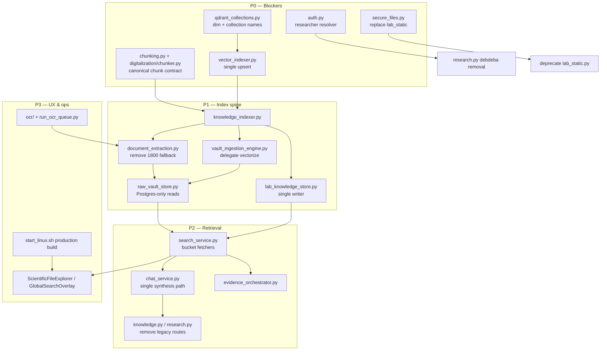
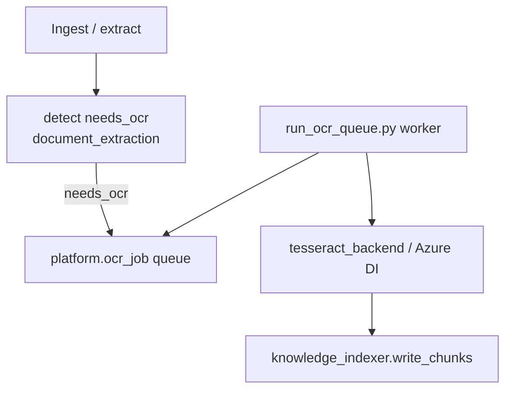
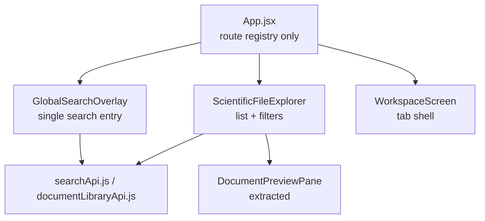

# OMEIA Platform — Remediation Master Plan

**Status:** Implementation playbook (incremental, backward-compatible)  
**Authority:** `docs/PLATFORM_ARCHITECTURE_REVIEW.md` + subsystem reviews + Phase 0 code validation  
**Date:** 2026-06-08  
**Principle:** Transform to production-grade through safe migrations — **do not rewrite**.

---

## Table of contents

### Phase 0 — System validation
- [Verified findings](#phase-0-verified-findings)
- [Questionable findings](#phase-0-questionable-findings)
- [Missing evidence](#phase-0-missing-evidence)
- [Remediation dependency graph](#phase-0-remediation-dependency-graph)

### Phases 1–9
- [Phase 1 — P0 critical fixes](#phase-1-p0-critical-fixes)
- [Phase 2 — Knowledge platform consolidation](#phase-2-knowledge-platform-consolidation)
- [Phase 3 — Search + RAG consolidation](#phase-3-search--rag-consolidation)
- [Phase 4 — Authorization hardening](#phase-4-authorization-hardening)
- [Phase 5 — OCR + document completeness](#phase-5-ocr--document-completeness)
- [Phase 6 — Vault modernization](#phase-6-vault-modernization)
- [Phase 7 — Frontend consolidation](#phase-7-frontend-consolidation)
- [Phase 8 — Deployment hardening](#phase-8-deployment-hardening)
- [Phase 9 — Production readiness re-score](#phase-9-production-readiness-re-score)

### Final deliverables
1. [Executive Summary](#1-executive-summary)
2. [Critical Issues](#2-critical-issues)
3. [High Impact Fixes](#3-high-impact-fixes)
4. [Refactor Roadmap](#4-refactor-roadmap)
5. [Migration Roadmap](#5-migration-roadmap)
6. [Database Changes](#6-database-changes)
7. [API Changes](#7-api-changes)
8. [Frontend Changes](#8-frontend-changes)
9. [Deployment Changes](#9-deployment-changes)
10. [Testing Plan](#10-testing-plan)
11. [Rollback Plan](#11-rollback-plan)
12. [Exact Files To Modify](#12-exact-files-to-modify)
13. [Exact Files To Leave Alone](#13-exact-files-to-leave-alone)
14. [Priority Ranking](#14-priority-ranking)

---

# PHASE 0 — SYSTEM VALIDATION

Code inspection on branch `cursor/unified-search-ai-lab-assistant` (2026-06-08). Cross-check against architecture review §16 risks.

## Phase 0 — Verified findings

| ID | Finding | Evidence (proof files) | Severity |
|----|---------|------------------------|----------|
| V1 | **`lab_static` unauthenticated** | `routers/lab_static.py:39-46` — no `Depends`; `main.py:27-28` mounted outside `api_dependencies` | **CRITICAL** |
| V2 | **Hardcoded `debdeba` writes** | `routers/research.py:43-44,141-142,173-174,321,352,494,905,921,948` | **CRITICAL** |
| V3 | **Multiple chunk sizes active** | `digitalization/chunker.py` (700 tok), `document_extraction.py` (1800 char fallback), `scientific_document_parser.py` (4200), `project_knowledge_extractor.py` (1000 tok) | **CRITICAL** |
| V4 | **Legacy search routes duplicate surface** | `knowledge.py:77-104`, `research.py:660-696` proxy to `SearchService` with Deprecation headers; canonical: `search.py` `/api/platform/unified-search` | **HIGH** |
| V5 | **`security.*` RBAC schema unused** | `sql/040_rag_audit_security_schema.sql` defined; zero Python queries to `security.user_role` | **HIGH** |
| V6 | **Index drift (JSON + Postgres + Qdrant)** | `raw_vault_store.py` JSON fallback; `lab_knowledge_store.py` disk jsonl; `vault_ingestion_engine._maybe_vectorize` separate from `vector_indexer`; `search_service.py` reads `load_processed()` twins | **CRITICAL** |
| V7 | **`PLATFORM_AUTH_DISABLED` production guard** | `environment.py:18-20` blocks prod bypass; `linux-workstation.env.template:46` sets `false` | **VERIFIED** (guard works) |
| V8 | **OCR schema only — no live queue** | `sql/145_ocr_jobs.sql`; `ocr/tesseract_backend.py` stub; zero `INSERT INTO platform.ocr_job` in API | **HIGH** |
| V9 | **Three copilot synthesis paths** | `chat_service.py` orchestrator + grounding + simple context string | **MEDIUM** |
| V10 | **`common.py` god-module** | 889 lines; `main.py:11` star-import; routers star-import `common` | **HIGH** |
| V11 | **Partial remediation already shipped** | `vector_indexer.py`, `knowledge_indexer.py`, `qdrant_collections.py`, `chunking.py` facade, legacy route proxies | **Progress** |
| V12 | **Linux data sync manual** | Operational reality per `YOUR_SETUP.md`; previews fail without rsync | **CRITICAL** (ops) |
| V13 | **Vite dev server in prod path** | `start.sh` runs `npm run dev`; Node 22 via nvm now documented | **HIGH** |

## Phase 0 — Questionable findings

| ID | Finding | Status | Notes |
|----|---------|--------|-------|
| Q1 | `PLATFORM_CHUNK_WRITE` env gates writes | **NOT IMPLEMENTED** | Documented in `.env.example` only — no Python reader. Plan must add flag before deprecating `platform.document_chunk`. |
| Q2 | `APP_ENV` default mismatch | **CAVEAT** | `auth.py` defaults `production`; `environment.py` defaults `development` when unset. Linux template sets explicit values — low risk on Linux-primary. |
| Q3 | Frontend still calls legacy search | **LIKELY CLEAN** | `searchApi.js:55` uses `/api/platform/unified-search`; grep `/api/search` in frontend before route removal. |
| Q4 | Imaging tile rate limit | **NOT IMPLEMENTED** | Documented risk; no middleware found. |
| Q5 | Biomedical Docker GPU contention | **INFERRED** | Compose profiles exist; live utilization not measured. |

## Phase 0 — Missing evidence

| Area | Gap | Action before Phase N |
|------|-----|----------------------|
| Qdrant point counts vs `rag.document_chunk` rows | No admin reconciliation endpoint | Add `GET /api/admin/index-health` (Phase 1) |
| Production traffic / latency | No metrics stack | Phase 8 observability |
| Backup/restore tested | Not in repo | Phase 8 backup cron + restore drill |
| CI/CD | No `.github/workflows` verified | Phase 8 CI |
| Supabase sync production state | Code only | Defer unless user enables sync |
| Storage connector credentials | Stubs | Phase 6 if DataCloud required |

## Phase 0 — Remediation dependency graph



**Rule:** Never remove a legacy read path until the canonical write path has run a full reindex on Linux and admin health shows alignment.

---

# PHASE 1 — P0 CRITICAL FIXES

**Goal:** Remove architectural blockers without API breakage.

## 1.1 Exact refactor plan

| Step | File | Change | Compatibility |
|------|------|--------|---------------|
| 1.1.1 | `qdrant_collections.py` | Single source for collection names + `TEXT_EMBEDDING_DIM` | Read-only contract; no API change |
| 1.1.2 | `vector_indexer.py` | All Qdrant upserts go here; vault stops `_maybe_vectorize` direct writes | Feature flag `VAULT_USE_VECTOR_INDEXER=true` |
| 1.1.3 | `search_service.py` | Extract bucket fetchers to `search/buckets/*.py` (same public methods) | No route change |
| 1.1.4 | `common.py` | Extract `lifespan`, `project_catalog`, models to submodules; `common.py` re-exports | Star-import preserved initially |
| 1.1.5 | `document_extraction.py` | Remove `_chunk_text` 1800-char path when `chunking.chunk_document` succeeds; log fallback | `KNOWLEDGE_INDEXER_ENABLED` gates new writes |
| 1.1.6 | `project_knowledge_extractor.py` | Route chunk+index through `knowledge_indexer.write_chunks` only | Existing API responses unchanged |
| 1.1.7 | `raw_vault_store.py` | Add `VAULT_JSON_FALLBACK=false` env; default true until Postgres full | Search may empty if misconfigured — document |
| 1.1.8 | `lab_knowledge_store.py` | Prefer `rag.document_chunk` reads over disk jsonl when `KNOWLEDGE_INDEXER_ENABLED` | Dual-read during migration |
| 1.1.9 | `security/auth.py` | Add `resolve_researcher_id(user) -> int | None` from email → `platform.researcher` | New helper; no route break |
| 1.1.10 | `routers/research.py` | Replace `debdeba` SQL with `resolve_researcher_id(user)`; fallback create researcher row | Same JSON responses |
| 1.1.11 | `routers/lab_static.py` | Add optional `REQUIRE_AUTH_STATIC=true` → `Depends(require_platform_user)` | Default false; enable on Linux prod |
| 1.1.12 | New: `routers/admin_index.py` | `GET /api/admin/index-health` — Qdrant counts, pg row counts, dim | Admin only |

## 1.2 Migration strategy

1. Ship code with **flags defaulting to current behavior**.
2. On Linux: set `KNOWLEDGE_INDEXER_ENABLED=true`, run `scripts/ops/reindex_vectors.py`.
3. Verify admin index-health.
4. Enable `VAULT_JSON_FALLBACK=false` after vault Postgres sync.
5. Enable `REQUIRE_AUTH_STATIC=true` after confirming Vite proxy still works.

## 1.3 Rollback strategy

| Flag / action | Rollback |
|---------------|----------|
| `KNOWLEDGE_INDEXER_ENABLED=false` | Stop new rag writes; old paths resume |
| `VAULT_JSON_FALLBACK=true` | Restore JSON inventory reads |
| `REQUIRE_AUTH_STATIC=false` | Restore unauthenticated static (emergency) |
| Reindex failure | Keep Qdrant snapshot before reindex; restore via `qdrant` backup |

## 1.4 Tests before merge (Phase 1)

- `tests/test_vector_indexer.py` (extend vault path)
- `tests/test_search_service.py` (no regression)
- `tests/test_auth_protected_routes.py` (static auth flag)
- New: `tests/test_researcher_resolver.py`
- New: `tests/test_admin_index_health.py`

---

# PHASE 2 — KNOWLEDGE PLATFORM CONSOLIDATION

**Reference:** `docs/KNOWLEDGE_PLATFORM_REMEDIATION_PLAN.md` (detailed phase 1–7).

## Target pipeline

```mermaid
flowchart LR
    FS["Filesystem<br/>DATABASE_ROOT"]
    DISC["Discovery<br/>vault_ingestion_engine"]
    EXT["Extraction<br/>document_extraction + OCR"]
    META["Metadata + taxonomy_assignment"]
    CHK["Chunk<br/>digitalization/chunker ONLY"]
    EMB["Embed<br/>embedding_service"]
    PG["Postgres<br/>rag.document_chunk"]
    QD["Qdrant<br/>doc_chunks"]
    SS["SearchService"]
    EO["EvidenceOrchestrator"]
    CP["Copilot"]

    FS --> DISC --> EXT --> META --> CHK --> EMB --> PG --> QD --> SS --> EO --> CP
```



## Migration sequence

| Week | Task | Files |
|------|------|-------|
| 1 | Implement `PLATFORM_CHUNK_WRITE` reader in `knowledge_indexer.py` | `knowledge_indexer.py`, `configs/.env.example` |
| 1–2 | Wire `digitalization/ingestion_job.py` end-of-job → `knowledge_indexer.write_chunks` | `ingestion_job.py` |
| 2–3 | `project_digitalization_engine.py` delegate to shared indexer | `project_digitalization_engine.py` |
| 3–4 | `database_processor.py` emit chunks via indexer not jsonl-only | `database_processor.py` |
| 4–5 | `project_processor.py` twin JSON read-only; chunks from Postgres | `project_processor.py` |
| 5–6 | Deprecate `platform.document_chunk` writes (`PLATFORM_CHUNK_WRITE=false`) | SQL migration read-only comment |
| 6–8 | Full Linux reindex + validation | `scripts/ops/reindex_vectors.py` |

## Preserve compatibility

- Processed JSON twins remain for UI previews until `document_library_service` reads Postgres excerpts.
- `research_knowledge_store` keeps separate collection (`research_knowledge`) — same dim contract via `qdrant_collections.py`.

---

# PHASE 3 — SEARCH + RAG CONSOLIDATION

## Goals

| # | Target | Current state |
|---|--------|---------------|
| 1 | One search path | Canonical: `SearchService.unified_search`; legacy proxies exist |
| 2 | One retrieval path | `hits_for_copilot` — good; file bucket still reads JSON twins |
| 3 | One embedding strategy | `embedding_service.embed_text` + `vector_indexer` — partial |
| 4 | One reranking strategy | `search_service` RRF + copilot boost — keep |
| 5 | One evidence path | Three synthesis branches in `chat_service` — consolidate |

## Implementation plan

| Step | File | Change | API impact |
|------|------|--------|------------|
| 3.1 | `search_service.py` | File bucket reads `rag.document_chunk` not `load_processed()` | None — same hit shape |
| 3.2 | `routers/knowledge.py` | Keep proxy 6 months; add `Sunset` header date | Deprecation only |
| 3.3 | `routers/research.py` | Same for `/platform/search` | Deprecation only |
| 3.4 | `chat_service.py` | Extract `_synthesize_answer()` — orchestrator vs grounding decision in one function | Same `/api/chat/*` responses |
| 3.5 | `evidence_orchestrator.py` | Default for `scientific_with_sources`; grounding for `research` | Behavior tuning behind env |
| 3.6 | Remove duplicate `/api/knowledge/hybrid-search` logic | Delegate body to `SearchService` bucket filter | Same response schema |

## API impacts (none breaking)

- No URL changes in Phase 3.
- Response field additions only (citation confidence, source_version).

---

# PHASE 4 — AUTHORIZATION HARDENING

## Schema changes

```sql
-- Migration 147_researcher_firebase_binding.sql (proposed)
ALTER TABLE platform.researcher
  ADD COLUMN IF NOT EXISTS firebase_uid TEXT UNIQUE,
  ADD COLUMN IF NOT EXISTS email TEXT UNIQUE;

CREATE INDEX IF NOT EXISTS idx_researcher_email ON platform.researcher(email);
```

Optional later: wire `security.project_access_policy` to `allowed_project_codes` JSON on researcher.

## Backend changes

| File | Change |
|------|--------|
| `security/auth.py` | `resolve_researcher(user)` → create-on-first-login from Firebase email |
| `security/permissions.py` | New: `can_access_project(user, project_code)` |
| `routers/research.py` | All writes use resolver; reads filter by `allowed_project_codes` when `PROJECT_RBAC_ENABLED=true` |
| `routers/datapad.py` | Same project scope on twin writes |
| `image_streaming/permissions.py` | Extend pattern for asset sensitivity |

## Migration plan

1. Backfill `platform.researcher.email` from allowlist.
2. Map known Firebase UIDs manually for lab leads.
3. Default `PROJECT_RBAC_ENABLED=false` — all projects visible (current behavior).
4. Enable per-project for sensitive portfolios.

## Preserve login UX

- Firebase email/password unchanged.
- `LoginScreen.jsx` unchanged.
- `ApiContext.jsx` continues Bearer token attach.

---

# PHASE 5 — OCR + DOCUMENT COMPLETENESS

## OCR architecture



## Implementation plan

| Step | File | Priority |
|------|------|----------|
| 5.1 | `ocr/adapter.py` — enqueue on `needs_ocr` | **HIGH** |
| 5.2 | `scripts/ops/run_ocr_queue.py` — process `platform.ocr_job` | **HIGH** |
| 5.3 | `tesseract_backend.py` — real implementation | **MEDIUM** |
| 5.4 | `document_library_service.py` — badge `OCR pending` | **LOW** |
| 5.5 | TIFF OCR via `image_metadata_service` hook | **LOW** |

## Fallback

- `ENABLE_OCR=false` → current behavior (metadata-only scanned PDFs).
- Failed OCR → `ocr_job.status=failed`, retry endpoint admin-only.

---

# PHASE 6 — VAULT MODERNIZATION

## Goals

| Goal | File | Change |
|------|------|--------|
| Semantic vault search | `search_service.py` vault bucket | Enable when `vault_asset_chunks` populated |
| Vectorized assets | `vault_ingestion_engine.py` | Use `vector_indexer` not `_maybe_vectorize` |
| Duplicate suppression | `search_service.py` | Cross-bucket dedupe by `checksum_sha256` |
| Inventory consistency | `raw_vault_store.py` | Postgres sole authority; JSON export read-only |

## Migration

1. `vault_rebuild_inventory` → Postgres only.
2. `VECTORIZATION_ENABLED=true` on Linux.
3. Reindex vault chunks.
4. `VAULT_JSON_FALLBACK=false`.

---

# PHASE 7 — FRONTEND CONSOLIDATION

**No workflow changes** — extract components only.

## Component architecture (target)



## Extraction plan

| File | Extract to | Priority |
|------|------------|----------|
| `ScientificFileExplorer.jsx` | `DocumentMetadataPanel.jsx`, `useDocumentLibrary.js` | **HIGH** |
| `KnowledgeSearchScreen.jsx` | Merge into `GlobalSearchOverlay` (route redirect) | **MEDIUM** |
| `WorkspaceScreen.jsx` | `useWorkspaceTabs.js` | **MEDIUM** |
| `App.jsx` | `routes.jsx` + `screenRegistry.js` | **LOW** |
| `ApiContext.jsx` | `AuthContext.jsx` + `ApiConfigContext.jsx` | **LOW** |

---

# PHASE 8 — DEPLOYMENT HARDENING

| Goal | Deliverable | Files |
|------|-------------|-------|
| Production frontend | `npm run build` + Caddy serve `dist/` | `start.sh`, `scripts/dev/start_linux_desktop.sh`, new `Caddyfile.ui` |
| Backup | Weekly `pg_dump` + Qdrant snapshot cron | `scripts/ops/backup_linux.sh` |
| Monitoring | Prometheus `/metrics` middleware | `app_skeleton/api/middleware/metrics.py` |
| Observability | Structured JSON logs + request_id | `common.py` lifespan |
| Deployment safety | `validate_environment()` on startup | Already exists — add to `start_linux.sh` |
| Node 22 | nvm in `ensure_node_for_vite.sh` | **Done** (`c7aa00c`) |

---

# PHASE 9 — PRODUCTION READINESS RE-SCORE

| Category | Baseline (now) | After Phase 1–3 | After Phase 4–6 | After Phase 7–9 |
|----------|----------------|-----------------|-----------------|-----------------|
| Deployment & ops | 68% | 70% | 75% | 82% |
| Auth & security | 55% | 62% | 78% | 82% |
| Knowledge & search | 48% | 62% | 72% | 78% |
| AI / copilot | 50% | 58% | 65% | 72% |
| Observability | 25% | 30% | 35% | 60% |
| **Composite** | **52%** | **58%** | **68%** | **75%** |

### Remaining blockers after full plan

- Multi-tenant SaaS readiness (not in scope)
- WSI/openslide at scale (Phase 12+ imaging)
- Real-time collaboration
- Compliance-grade retention (12-month roadmap item)

---

# FINAL DELIVERABLES

## 1. Executive Summary

OMEIA is a **functioning single-host lab platform** at **52% production readiness**. The architecture reviews are **accurate** — verified in code with no contradictions. The path to **75%** is incremental: unify chunk/index writes, bind auth identity, harden static file access, production-build the frontend, and add observability/backups. **Do not rewrite** — adapters and feature flags bridge legacy paths for 2–3 release cycles.

**Already shipped (prior remediation):** `vector_indexer.py`, `knowledge_indexer.py`, `qdrant_collections.py`, `chunking.py` facade, legacy search proxies, imaging tile fixes, Linux deploy scripts, Node 22 helper.

**Highest leverage next:** Phase 1 researcher resolver + index-health admin + enable `KNOWLEDGE_INDEXER_ENABLED` on Linux with full reindex.

---

## 2. Critical Issues

| # | Issue | Phase |
|---|-------|-------|
| C1 | Index drift — copilot/search untrustworthy on full corpus | 1–2 |
| C2 | Linux `DATABASE_ROOT` incomplete → broken media | Ops (parallel) |
| C3 | `lab_static` unauthenticated file serve | 1 |
| C4 | Hardcoded `debdeba` — wrong attribution / audit | 1 + 4 |
| C5 | `PLATFORM_CHUNK_WRITE` documented but not coded | 2 |
| C6 | No backups | 8 |
| C7 | Vite dev in production path | 8 |

---

## 3. High Impact Fixes

1. Enable `KNOWLEDGE_INDEXER_ENABLED=true` + full reindex on Linux  
2. `resolve_researcher_id()` + remove `debdeba` hardcoding  
3. Gate `lab_static` behind auth (or route through `secure_files`)  
4. `npm run build` production frontend  
5. `GET /api/admin/index-health`  
6. Implement `PLATFORM_CHUNK_WRITE` flag  
7. Vault Postgres-only mode  
8. Weekly backup cron  

---

## 4. Refactor Roadmap

| Quarter | Focus |
|---------|-------|
| Q1 (mo 1–3) | Phase 1 P0 + Phase 2 spine + Phase 3 search/RAG |
| Q2 (mo 4–6) | Phase 4 auth + Phase 5 OCR + Phase 6 vault |
| Q3 (mo 7–9) | Phase 7 frontend + Phase 8 deploy/ops |
| Q4 (mo 10–12) | Phase 9 polish + imaging WSI + graph pilot (per architecture review §21) |

---

## 5. Migration Roadmap

See Phase 0 dependency graph. **Order:** collections/dim → chunker → vector_indexer → knowledge_indexer → vault/lab writers → search buckets → auth → static files → frontend build.

Each migration ships behind env flags with documented rollback (§11).

---

## 6. Database Changes

| Migration | Purpose | Phase |
|-------------|---------|-------|
| `147_researcher_firebase_binding.sql` | email + firebase_uid on researcher | 4 |
| `148_index_health_views.sql` | pg counts for admin dashboard | 1 |
| Existing `145_ocr_jobs.sql` | Wire enqueue | 5 |
| Existing `146_taxonomy_assignment.sql` | Wire taxonomy service | 2 |
| No drop migrations until Phase 2 complete | `platform.document_chunk` read-only | 2 |

---

## 7. API Changes

| Change | Breaking? | Phase |
|--------|-----------|-------|
| `GET /api/admin/index-health` | No (new) | 1 |
| Deprecation headers on legacy search | No | 3 |
| Sunset `/api/search` (6 mo notice) | Yes — major version | 3+ |
| `REQUIRE_AUTH_STATIC` on static routes | Behavior change for direct `:8000/database-static` | 1 |
| `PROJECT_RBAC_ENABLED` project filtering | Behavior change when enabled | 4 |
| `/api/v1/` prefix | Future — not Phase 1–3 | 12 mo |

---

## 8. Frontend Changes

| Change | Breaking? | Phase |
|--------|-----------|-------|
| Extract ScientificFileExplorer components | No | 7 |
| GlobalSearchOverlay as single search | No — route alias | 7 |
| Production static assets | No — same URLs | 8 |
| "File missing on disk" badge | No (done) | — |
| OCR pending badge | No | 5 |

---

## 9. Deployment Changes

| Item | Phase |
|------|-------|
| `git pull` + `linux_bootstrap_all.sh` loop | Ongoing |
| `mac_push_to_linux.sh --data-only` runbook | Ops |
| Caddy serves `dist/` on `:5173` | 8 |
| `backup_linux.sh` cron | 8 |
| `ssh-copy-id` / Tailscale SSH for deploy | Ops |
| `configs/linux-workstation.env.template` flag coherence | 1 |

---

## 10. Testing Plan

| Phase | Required tests |
|-------|----------------|
| 1 | `test_vector_indexer`, `test_search_service`, `test_researcher_resolver`, `test_admin_index_health`, `test_auth_protected_routes` |
| 2 | `test_document_digitalization_pipeline`, `test_knowledge_indexer` (new), embedding dim contract |
| 3 | `test_copilot`, `test_evidence_orchestrator`, `test_search_qa` eval JSON |
| 4 | `test_project_rbac` (new), `test_security_authentication` |
| 5 | `test_ocr_queue` (new) |
| 6 | `test_vault_ingestion_engine`, `test_vault_review_search` |
| 7 | Manual QA checklist (`08_EVALUATION_AND_QA/manual_QA_checklist.md`) |
| 8 | Restore drill script; smoke `curl /health` post-deploy |

**CI target (Phase 8):** GitHub Actions — pytest + ruff + `test_embedding_dim_contract.py` on push.

---

## 11. Rollback Plan

| Scenario | Action |
|----------|--------|
| Bad reindex | Restore Qdrant snapshot; set `KNOWLEDGE_INDEXER_ENABLED=false` |
| Auth regression | `REQUIRE_AUTH_STATIC=false`; `PROJECT_RBAC_ENABLED=false` |
| Search regression | Legacy routes still proxy — no rollback needed |
| Frontend build break | `START_VITE_DEV=true` env restores `npm run dev` |
| OCR worker crash | `ENABLE_OCR=false` |
| Vault Postgres empty | `VAULT_JSON_FALLBACK=true` |

**Git rollback:** Each phase = one PR; revert PR if tests fail post-deploy.

---

## 12. Exact Files To Modify

### CRITICAL — Phase 1

- `app_skeleton/api/qdrant_collections.py`
- `app_skeleton/api/vector_indexer.py`
- `app_skeleton/api/knowledge_indexer.py`
- `app_skeleton/api/chunking.py`
- `app_skeleton/digitalization/chunker.py`
- `app_skeleton/api/document_extraction.py`
- `app_skeleton/api/search_service.py` (extract buckets)
- `app_skeleton/api/raw_vault_store.py`
- `app_skeleton/api/lab_knowledge_store.py`
- `app_skeleton/security/auth.py`
- `app_skeleton/api/routers/research.py`
- `app_skeleton/api/routers/lab_static.py`
- `app_skeleton/security/secure_files.py`
- `app_skeleton/api/main.py` (admin router)

### HIGH — Phase 2–3

- `app_skeleton/api/vault_ingestion_engine.py`
- `app_skeleton/api/project_digitalization_engine.py`
- `app_skeleton/api/project_knowledge_extractor.py`
- `app_skeleton/api/database_processor.py`
- `app_skeleton/api/project_processor.py`
- `app_skeleton/digitalization/ingestion_job.py`
- `app_skeleton/api/chat_service.py`
- `app_skeleton/api/evidence_orchestrator.py`
- `app_skeleton/api/routers/knowledge.py`
- `app_skeleton/api/routers/search.py`

### MEDIUM — Phase 4–7

- `app_skeleton/security/permissions.py` (new)
- `app_skeleton/api/ocr/*`
- `app_skeleton/api/document_library_service.py`
- `app_skeleton/ui/react_frontend/src/features/documents/components/ScientificFileExplorer.jsx`
- `app_skeleton/ui/react_frontend/src/components/GlobalSearchOverlay.jsx`
- `app_skeleton/ui/react_frontend/src/pages/WorkspaceScreen.jsx`
- `app_skeleton/ui/react_frontend/src/App.jsx`

### LOW — Phase 8

- `start.sh`, `scripts/dev/start_linux_desktop.sh`
- `docker-compose.yml`
- `configs/.env.example`, `configs/linux-workstation.env.template`
- `scripts/ops/backup_linux.sh` (new)

---

## 13. Exact Files To Leave Alone

| File | Reason |
|------|--------|
| `app_skeleton/api/docker_service_client.py` | Good pattern; working circuit breaker |
| `app_skeleton/api/embedding_service.py` | Recent unified embed path |
| `app_skeleton/ui/react_frontend/src/components/AuthLoginPanel.jsx` | Login UX stable |
| `app_skeleton/api/routers/health.py` | Contract frozen for probes |
| `app_skeleton/api/routers/image_assets.py` | Recently hardened |
| `app_skeleton/api/image_streaming/image_streaming_service.py` | Recent tile fixes |
| `scripts/deploy/mac_push_to_linux.sh` | Recent guards |
| `scripts/dev/ensure_node_for_vite.sh` | Working |
| `docs/YOUR_SETUP.md` | Canonical ops — update only, don't restructure |
| Firebase config / `firebase_app.py` | External contract |
| `sql/040_*` through `sql/146_*` | Applied migrations — add new only |
| Biomedical model Docker images | Isolated optional profile |
| LUMI pipeline scripts | HPC-specific; document only |

---

## 14. Priority Ranking

### CRITICAL (do first — weeks 1–4)

| Item | Effort | Owner skill |
|------|--------|-------------|
| Linux full data sync + `DATABASE_ROOT` verify | Low | DevOps |
| `KNOWLEDGE_INDEXER_ENABLED` + reindex on Linux | Medium | Backend |
| Implement `PLATFORM_CHUNK_WRITE` flag | Low | Backend |
| `resolve_researcher_id` + fix `research.py` | Medium | Backend + Security |
| Admin `index-health` endpoint | Low | Backend |
| Gate `lab_static` auth | Low | Security |

### HIGH (weeks 4–12)

| Item | Effort |
|------|--------|
| Vault → `vector_indexer` delegation | Medium |
| `raw_vault_store` Postgres-only mode | Medium |
| `search_service` bucket extraction | Medium |
| Production `npm run build` + Caddy | Medium |
| Backup cron | Low |
| OCR enqueue + worker skeleton | High |
| `chat_service` synthesis consolidation | Medium |

### MEDIUM (months 4–6)

| Item | Effort |
|------|--------|
| `PROJECT_RBAC_ENABLED` | High |
| Firebase UID schema migration | Medium |
| Frontend ScientificFileExplorer split | Medium |
| GlobalSearchOverlay consolidation | Medium |
| Legacy search route sunset | Low |
| Prometheus metrics | Medium |

### LOW (months 6–12)

| Item | Effort |
|------|--------|
| TypeScript migration | High |
| OpenAPI client generation | Medium |
| Neo4j graph pilot | High |
| WSI openslide worker | High |
| `/api/v1/` versioning | Medium |
| Meeting backend or nav removal | Medium |

---

## Related documents

| Document | Role |
|----------|------|
| `docs/PLATFORM_ARCHITECTURE_REVIEW.md` | Source of truth — architecture |
| `docs/KNOWLEDGE_PLATFORM_REMEDIATION_PLAN.md` | Phase 2 detail |
| `docs/KNOWLEDGE_DOCUMENT_SUBSYSTEM_REVIEW.md` | Knowledge deep dive |
| `docs/PROJECT_INTELLIGENCE_SUBSYSTEM_REVIEW.md` | Projects deep dive |
| `docs/IMAGING_SUBSYSTEM_REVIEW.md` | Imaging deep dive |
| `docs/YOUR_SETUP.md` | Daily Linux workflow |

---

*End of Platform Remediation Master Plan — implementation-ready, no code rewritten in this document.*
