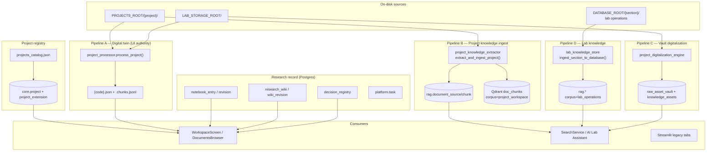

# Project Intelligence Subsystem — Architecture Review

**Scope:** Projects, digital twins, notebook/wiki/decisions, datapad, research workspace, portfolio, project processing, lab knowledge, knowledge extraction, collaboration, project & research lifecycles  
**Perspective:** Research Platform Architecture  
**Codebase:** OMEIA-AI / `app_skeleton/`  
**Date:** 2026-06-08  
**Context docs verified against code:** `docs/KNOWLEDGE_DOCUMENT_SUBSYSTEM_REVIEW.md`, `docs/KNOWLEDGE_PLATFORM_REMEDIATION_PLAN.md`

---

## Table of contents

1. [Executive Summary](#1-executive-summary)
2. [Project Architecture Diagram](#2-project-architecture-diagram)
3. [Digital Twin Architecture](#3-digital-twin-architecture)
4. [Data Flow Diagram](#4-data-flow-diagram)
5. [Project Lifecycle Analysis](#5-project-lifecycle-analysis)
6. [Knowledge Consistency Review](#6-knowledge-consistency-review)
7. [Collaboration Review](#7-collaboration-review)
8. [Scalability Review](#8-scalability-review)
9. [Security Review](#9-security-review)
10. [Technical Debt](#10-technical-debt)
11. [Missing Capabilities](#11-missing-capabilities)
12. [Production Risks](#12-production-risks)
13. [Production Readiness Score](#13-production-readiness-score)
14. [Refactoring Recommendations](#14-refactoring-recommendations)
15. [Files Requiring Changes](#15-files-requiring-changes)

---

## 1. Executive Summary

OMEIA's **project intelligence subsystem** is a hybrid of three planes that are intentionally separate but not yet fully reconciled:

| Plane | Authority | Primary consumers |
|-------|-----------|-------------------|
| **Registry** | `projects_catalog.json` + `core.project` / `platform.project_extension` | Portfolio UI, copilot project scoping |
| **Digital twin** | `project_processor.py` → `{code}.json` on disk | Workspace tabs, document browser, datapad |
| **Searchable knowledge** | `project_knowledge_extractor.py`, `project_digitalization_engine.py`, `lab_knowledge_store.py` → Postgres `rag.*` + Qdrant | AI Lab Assistant, unified search |

### Strengths

- **Unified research workspace** — `WorkspaceScreen.jsx` binds portfolio metadata, digital twin file index, log/timeline, notebook, decisions, and datapad editing in one shell.
- **Rich twin extraction** — `process_project()` derives personnel, cohorts, modalities, timeline, protocols, dissemination, and a section-scoped content library from on-disk folders without mutating originals.
- **Notebook system of record** — Postgres tables (`notebook_entry`, `notebook_revision`, `decision_registry`, `research_wiki`) with automatic audit trails via `auto_log_notebook_entry()`.
- **Safe datapad writes** — `datapad_service.py` enforces path sandboxing, etag conflict detection, and backup-before-overwrite.
- **Mac thin client / Linux full stack** — Documented in `docs/MAC_STARTUP.md`; API + React on Mac, Ollama/Qdrant/Postgres/Docker on Linux workstation via SSH tunnels.

### Critical gaps

- **Three authorities for project knowledge** — Twin JSON (`.json` + `.chunks.jsonl`), `project_knowledge_extractor` → `rag.*`, and `project_digitalization_engine` → vault/knowledge_assets can diverge.
- **Catalog ↔ DB ↔ twin drift** — `fetch_projects_unified()` merges sources but `project_catalog_coverage()` still flags many catalog entries as `missing_source_mapping` or `empty_twin`.
- **Hardcoded mutation identity** — Notebook/wiki/task/decision writes default to researcher `debdeba` instead of the authenticated Firebase user.
- **Collaboration is audit-only** — No multi-user editing, notifications, or project-scoped RBAC on notebook/wiki routes; `MeetingScreen` is a placeholder.
- **Lab Knowledge UI is static-first** — `LabKnowledgeScreen.jsx` loads `/database/catalog.json`; canonical search is API-backed but the primary browse path does not require ingest freshness.

### Verdict

The subsystem is **functionally rich for a single-lab dev twin** and demonstrates strong domain modeling for spatial biology portfolios. **Production-grade project intelligence** requires collapsing chunk authority, binding mutations to authenticated researchers, enforcing project-level authorization on read paths, and making twin refresh incremental rather than full-folder rescans.

**Estimated production readiness: 54%** (see §13).

---

## 2. Project Architecture Diagram

Navigation maps to implementation (`app_skeleton/ui/react_frontend/src/config/navigation.js`):

| UI area | Screen / component | Backend |
|---------|-------------------|---------|
| Project portfolio | `ProjectsScreen.jsx` | `GET /projects` → `fetch_projects_unified()` |
| Research workspace | `WorkspaceScreen.jsx` | Twin + datapad + notebook/decisions panels |
| Living notebook | `NotebookWikiScreen.jsx`, `NotebookWikiPanel.jsx` | `research.py` `/notebook`, `/wiki` |
| Research decisions | `DecisionsScreen.jsx`, `DecisionsPanel.jsx` | `research.py` `/decisions` |
| Lab knowledge (ops) | `LabKnowledgeScreen.jsx` | `knowledge.py` `/api/knowledge/lab/*`, static catalog |
| Project processing | `ProjectsScreen` "Process all" | `POST /api/projects/process-all` |

```mermaid
flowchart TB
    subgraph UI["React frontend"]
        PS["ProjectsScreen.jsx<br/>portfolio + process-all"]
        WS["WorkspaceScreen.jsx<br/>9 workspace tabs"]
        NW["NotebookWikiScreen / Panel"]
        DP["DataPadEditor.jsx<br/>WorkspaceSectionDataPad"]
        DTP["DigitalTwinPanel.jsx"]
        LK["LabKnowledgeScreen.jsx"]
        TP["TaskpadContext.jsx"]
    end

    subgraph API["FastAPI routers"]
        R["research.py<br/>/projects /notebook /wiki /decisions /tasks"]
        DP_R["datapad.py<br/>digital-twin, project-files, datapad"]
        K["knowledge.py<br/>/api/knowledge/lab/* /api/database/*"]
        H["health.py<br/>/api/projects/{code}/knowledge/ingest"]
        V["vault.py + digitalization.py<br/>vault ingest / digitalize"]
    end

    subgraph CORE["Core services"]
        FPU["common.py<br/>fetch_projects_unified()"]
        PP["project_processor.py<br/>process_project / get_digital_twin"]
        DPS["datapad_service.py"]
        LKS["lab_knowledge_store.py"]
        PKE["project_knowledge_extractor.py"]
        PDE["project_digitalization_engine.py"]
        DBP["database_processor.py"]
    end

    subgraph STORES["Persistent stores"]
        CAT["projects_catalog.json<br/>00_registry/"]
        PG_CORE[(core.project)]
        PG_EXT[(platform.project_extension<br/>project_member)]
        PG_NB[(notebook_entry / wiki / decisions / task)]
        TWIN["PROCESSED_DIR/{code}.json<br/>PUBLIC_PROCESSED_DIR/"]
        DISK["PROJECTS_ROOT / LAB_STORAGE_ROOT"]
        RAG[(rag.document_source / chunk)]
        QD[(Qdrant doc_chunks)]
        VAULT[(platform.raw_asset_vault<br/>knowledge_assets)]
    end

    PS --> R
    PS --> DP_R
    WS --> DP_R
    WS --> R
    WS --> TP
    NW --> R
    DP --> DP_R
    DTP --> DP_R
    LK --> K

    R --> FPU
    FPU --> CAT
    FPU --> PG_CORE
    FPU --> PG_EXT
    DP_R --> PP
    DP_R --> DPS
    H --> PKE
    K --> LKS
    K --> DBP
    V --> PDE

    PP --> DISK
    PP --> TWIN
    PKE --> DISK
    PKE --> RAG
    PKE --> QD
    LKS --> RAG
    LKS --> QD
    PDE --> DISK
    PDE --> VAULT
    DBP --> DISK
    R --> PG_NB
```



### Path resolution (Mac vs Linux)

`app_skeleton/api/paths.py` resolves roots from environment — never hardcoded:

- `DATABASE_ROOT` — external `OMEIA-database` or repo `database/`
- `PROJECTS_ROOT` — `DATABASE_ROOT/projects` or repo `projects/`
- `LAB_STORAGE_ROOT` — mounted SMB/notebook root (Linux); often unset on Mac thin client
- `PROCESSED_DIR` / `PUBLIC_PROCESSED_DIR` — twin JSON for API + static frontend fallback

On **Mac**, the thin client runs `./scripts/network/mac_connect_linux.sh` tunnels so local API hits remote Postgres/Qdrant/Ollama. **Project folders** may exist only on the Linux workstation or external drive; twins built on Mac without mounted `PROJECTS_ROOT` will be empty.

---

## 3. Digital Twin Architecture

A **digital twin** is a structured JSON snapshot of a project's on-disk folder — not a live database entity.

```mermaid
flowchart LR
    subgraph DISCOVERY["Folder discovery"]
        CAT_E["projects_catalog.json<br/>folder_path hints"]
        FPF["find_project_folder()<br/>fuzzy index match"]
        CCR["resolve_content_root()<br/>strip wrapper dirs"]
    end

    subgraph SCAN["Scan & extract"]
        INV["_scan_all_assets()"]
        EXT["_extract_project_documents()<br/>document_extraction.py"]
        PARSE["Regex parsers:<br/>timeline, cohorts, personnel,<br/>modalities, protocols"]
    end

    subgraph TWIN_JSON["Twin artifact"]
        ID["identity"]
        CL["content_library<br/>LIFECYCLE_RULES sections"]
        DI["document_index"]
        VC["vector_chunks"]
        TL["timeline / meetings"]
        MET["metrics"]
    end

    subgraph SERVE["Serving layer"]
        CACHE["load_processed()<br/>PROCESSED_DIR/{code}.json"]
        API["GET /api/projects/{code}/digital-twin<br/>?refresh=true"]
        PUB["sync_public_processed()<br/>→ public/processed/"]
        CHUNKS["{code}.chunks.jsonl"]
    end

    CAT_E --> FPF
    FPF --> CCR
    CCR --> INV
    INV --> EXT
    EXT --> PARSE
    PARSE --> TWIN_JSON
    TWIN_JSON --> CACHE
    CACHE --> API
    API --> PUB
    TWIN_JSON --> CHUNKS
```



### Key files

| Role | Path |
|------|------|
| Twin builder | `app_skeleton/api/project_processor.py` — `process_project()`, `get_digital_twin()`, `save_processed()` |
| Lifecycle → workspace tab mapping | `LIFECYCLE_RULES` in `project_processor.py` (management → plan, methods → methods, etc.) |
| API | `app_skeleton/api/routers/datapad.py` — `GET/PUT /api/projects/{code}/digital-twin` |
| Frontend hook | `app_skeleton/ui/react_frontend/src/shared/hooks/useDigitalTwin.js` |
| Static fallback | `app_skeleton/ui/react_frontend/public/processed/{code}.json` |
| Normalization | `app_skeleton/ui/react_frontend/src/lib/digitalTwinUtils.js` |

### Twin refresh semantics

`get_digital_twin(project_code, refresh=False)`:

1. Returns cached `load_processed()` when present and `refresh=False`.
2. On `refresh=True`, re-runs `process_project()` but **refuses to shrink** asset counts (protects against transient mount failures).
3. Always writes `{code}.json` + `{code}.chunks.jsonl` and syncs to `PUBLIC_PROCESSED_DIR`.

`ensure_project_readme()` creates `README.md` at content root when missing, then refreshes twin.

### UI integration

- `ProjectDocumentsBrowser.jsx` — maps twin `content_library` sections to workspace tabs via `projectDocumentCategories.js`
- `DigitalTwinPanel.jsx` — editable twin sections (overview, timeline, protocols, etc.) saved via `PUT /digital-twin`
- `ProjectLogPanel.jsx` — timeline/log view from twin
- `ProjectFolderBrowser.jsx` — raw folder browse + "Scan project folder" trigger

---

## 4. Data Flow Diagram

End-to-end flows from disk to UI and retrieval:



### Datapad edit flow

1. User selects file in `ProjectDocumentsBrowser` → `DataPadEditor` / `WorkspaceSectionDataPad`
2. `GET /api/datapad/document` — read with etag
3. `PUT /api/datapad/document` — write with etag check; backup to `99_ARCHIVE/.datapad_backups/`
4. Optional AI: `POST /api/datapad/suggest-headings`, `/proofread`, `/apply-patches`
5. Audit: `platform.datapad_edit_log` (`sql/120_datapad_edits.sql`)

Writes go to **disk**, not twin JSON — twin refresh is manual ("Scan project folder") unless user triggers `refresh=true`.

---

## 5. Project Lifecycle Analysis

### 5.1 Project registry lifecycle

| Stage | Mechanism | Code |
|-------|-----------|------|
| Seed / catalog | Static JSON | `app_skeleton/data/00_registry/projects_catalog.json` |
| DB registration | `POST /projects` | `research.py` — inserts `core.project`, `platform.project_extension`, `project_member` |
| Portfolio display | Merge catalog + DB | `fetch_projects_unified()` in `common.py` |
| Metadata update | `PUT /projects/{code}` | Updates `project_extension`; auto notebook log |
| Status | `status` field | active / completed / discontinued / archived (`ProjectsScreen.jsx`) |

Catalog-only projects receive synthetic `project_id: cat-{index}` when Postgres is unavailable or project missing from DB.

### 5.2 On-disk project lifecycle (folder → twin)

| Stage | Trigger | Output |
|-------|---------|--------|
| Folder mapped | Catalog `folder_path` or fuzzy `find_project_folder()` | Content root resolved |
| Initial scan | Open workspace / `refresh=false` twin fetch | Cached twin or live `process_project()` |
| Full rescan | "Scan project folder" / `refresh=true` | Updated `{code}.json` |
| Batch processing | `POST /api/projects/process-all` | All catalog codes processed + `sync_public_processed()` |
| README bootstrap | `POST /api/projects/{code}/ensure-readme` | Creates `README.md`, rescans twin |

`LIFECYCLE_RULES` classify folder paths into research phases aligned with workspace tabs:

```
management → plan | methods → methods | data_figures → data |
meetings → log | writing → writing | archive → archive
```

### 5.3 Research lifecycle (notebook system of record)

| Activity | Storage | Auto-trail |
|----------|---------|------------|
| Experiment / meeting notes | `platform.notebook_entry` | revision row + `platform.auto_log` |
| Protocol wiki (SOP) | `platform.research_wiki` | `wiki_revision` chain |
| Formal decisions | `platform.decision_registry` | notebook entry `decision_note` |
| Tasks | `platform.task` | notebook entry on create/update |
| Document ingest | `vault.py` `/ingest-document` | notebook entry |
| Pipeline runs | `platform.pipeline_run` | optional `notebook_entry_id` FK |

Research lifecycle is **append-mostly** with revision rollback for notebook and wiki (`/rollback` endpoints in `research.py`).

### 5.4 Knowledge indexing lifecycle (search plane)

| Trigger | Endpoint / script | Target store |
|---------|-------------------|--------------|
| Per-project ingest | `POST /api/projects/{code}/knowledge/ingest` | `rag.*` + Qdrant (if enabled) |
| Lab section ingest | `POST /api/knowledge/lab/ingest/{section_id}` | `rag.*` corpus `lab_operations` |
| Vault digitalize | `POST /api/digitalize/project/{name}` | `knowledge_assets` + vault |
| Autonomous daemon | `scripts/ops/autonomous_processor.py` | OS-level scheduled reprocessing |

**Gap:** Twin refresh and knowledge ingest are **not coupled** — editing via datapad does not re-index Qdrant automatically.

---

## 6. Knowledge Consistency Review

Verified against code and cross-referenced with `KNOWLEDGE_DOCUMENT_SUBSYSTEM_REVIEW.md`:

| Issue | Evidence | Impact on project intelligence |
|-------|----------|--------------------------------|
| **Twin vs rag drift** | `project_processor` chunks in JSON; `project_knowledge_extractor` writes separate `rag.document_chunk` with different chunk sizes (~4000 chars vs `document_extraction` defaults) | Copilot may cite chunks that differ from workspace preview text |
| **Twin vs vault drift** | `project_digitalization_engine` indexes same folders into `knowledge_assets` independently | Search hits may not match twin `document_index` |
| **Catalog vs twin** | `project_catalog_coverage()` in `common.py` | Portfolio shows projects with zero assets |
| **Catalog vs DB** | `merge_with_catalog()` fills gaps from JSON when DB fields empty | Inconsistent PI/lead between sources |
| **Static lab catalog** | `LabKnowledgeScreen` uses `/database/catalog.json` | Stale until `database_processor` + frontend rebuild |
| **Public processed mirror** | `sync_public_processed()` copies twins to `public/processed/` | Frontend may show older twin if API unreachable |
| **Author identity** | `debdeba` hardcoded in `research.py` for notebook/wiki/task mutations | Audit trail does not reflect actual user |
| **Embedding optional** | `KNOWLEDGE_INDEXER_ENABLED` default false; Qdrant upsert catches exceptions | Project knowledge ingest may be Postgres-only |

### Corpus separation (intentional, partially enforced)

`lab_knowledge_store.py` documents:

- `corpus=lab_operations` → lab database sections (not project folders)
- `corpus=project_workspace` → project folders via `project_knowledge_extractor` / `project_knowledge_store.py`

`SearchService` merges buckets but project-scoped copilot filtering depends on `project_code` payload fields being present and consistent.

---

## 7. Collaboration Review

### What exists

| Feature | Implementation | Maturity |
|---------|----------------|----------|
| Project membership | `platform.project_member` + `collaborators[]` on extension | Schema ready; UI shows roster from twin/catalog |
| Task assignment | `platform.task` CRUD in `research.py` | Functional; always assigns/logging as `debdeba` |
| Notebook sharing | `visibility_level` column on `notebook_entry` | Column exists; **not enforced** on `GET /notebook` |
| Decision register | Per-project `decision_registry` | Functional with search |
| Audit trail | `platform.auto_log`, `datapad_edit_log`, notebook revisions | Strong for compliance narrative |
| Taskpad workers | `TaskpadContext.jsx` + `taskpadRegistry.js` (localStorage) | **Single-browser** scratch notes, not shared |
| Meeting booking | `MeetingScreen.jsx` | Placeholder UI only |

### What is missing

- Real-time or async multi-user editing (no WebSocket, no CRDT, no lock tokens beyond datapad etag)
- Notifications (task due, decision logged, twin stale)
- Project-scoped read authorization on `/notebook`, `/wiki`, `/decisions` (global list for authenticated users)
- Integration between `project_member` and Firebase user roles
- Comment threads on twin sections or documents
- External collaborator guest access

### Collaboration architecture assessment

The system implements a **lab notebook compliance model** (who did what, when, with rollback) rather than a **team collaboration platform**. This is appropriate for regulated research but insufficient for multi-site concurrent work without further RBAC and identity binding.

---

## 8. Scalability Review

| Dimension | Current behavior | Risk |
|-----------|------------------|------|
| **Full-folder twin scan** | `process_project()` walks entire tree, extracts text synchronously in API request | Timeouts on large projects; blocks uvicorn worker |
| **Process-all** | Sequential loop over entire catalog in `POST /api/projects/process-all` | O(n projects × folder size); no job queue |
| **Twin JSON size** | Caps via `DEFAULT_MAX_DOCS_IN_JSON` / `DEFAULT_MAX_CHUNKS_IN_JSON` in extraction | Truncated index vs full disk |
| **Postgres notebook** | ILIKE search, no dedicated FTS index on notebook | Slow at 10k+ entries |
| **Qdrant project vectors** | Per-chunk upsert in `project_knowledge_store.upsert_chunks_to_qdrant()` | Acceptable; batching exists in extractor |
| **Mac client** | All API calls tunnel to single Linux host | Single point of failure; latency on every search |
| **Static public twins** | Duplicated JSON in `public/processed/` | Build/deploy size grows with project count |

**Horizontal scaling blockers:** Disk-bound project roots (`PROJECTS_ROOT`, `LAB_STORAGE_ROOT`) are not abstracted behind a storage service; twins are filesystem-local.

---

## 9. Security Review

| Control | Status | Notes |
|---------|--------|-------|
| API authentication | `require_platform_user` on all routers via `main.py` | Firebase Bearer; dev bypass via `PLATFORM_AUTH_DISABLED` |
| Role gates | `require_role(["editor","admin"])` on writes | Viewer role exists in `permissions.py` but many reads are unscoped |
| Project-level ACL | `can_read_project()` / `can_write_project()` in `permissions.py` | **Not applied** to `/notebook`, `/wiki`, `/decisions`, `/tasks` list endpoints |
| Path traversal | `safe_relative_path()` in datapad and project-files routes | Good |
| Disk write scope | Datapad resolves under project roots only | Good |
| Secrets in responses | `storage_roots_public_summary()` omits host paths | Good for connectors |
| Hardcoded researcher | `debdeba` author on mutations | Audit integrity risk |
| Wiki GET | `GET /wiki` — no `Depends(require_platform_user)` at route level | Protected by router-level dependency in `main.py` ✓ |
| Notebook rollback | `POST /notebook/{id}/rollback` — no explicit `require_role` in signature | Inherits router auth only |
| File serve | `GET /api/project-files/serve`, `/api/projects/{code}/asset` | Authenticated but no per-project ACL check |

### Mac thin client considerations

- Tunnels expose Postgres/Qdrant on `localhost` — acceptable on developer machine; must not bind `0.0.0.0` on shared networks.
- `PROJECTS_ROOT` on Mac may point to a partial mirror — risk of **empty twins** mistaken for data loss.

---

## 10. Technical Debt

| ID | Debt | Location |
|----|------|----------|
| TD-01 | Monolithic `project_processor.py` (~2100 lines) | Hard to test individual parsers |
| TD-02 | `common.py` as god-module (imports entire platform) | Routers `from common import *` |
| TD-03 | Hardcoded `debdeba` researcher ID | `research.py` (10+ sites) |
| TD-04 | Dual frontend paths for twins (API + static `public/processed`) | `useDigitalTwin.js`, `digitalTwinUtils.js` |
| TD-05 | Legacy Streamlit UI duplicates React flows | `streamlit_app.py` still maintained |
| TD-06 | `GET /api/database/*` parallels `/api/knowledge/lab/*` | `knowledge.py` — deprecated aliases |
| TD-07 | Notebook search uses ILIKE not tsvector | `research.py` `/notebook/search` |
| TD-08 | `extract_and_ingest_project` 5MB file skip | `project_knowledge_extractor.py` |
| TD-09 | Taskpad state in localStorage only | `taskpadRegistry.js` |
| TD-10 | `MeetingScreen` stub | No backend |
| TD-11 | Project create still uses seed usernames | `ingest_real_projects.py` pattern copied in API |
| TD-12 | `process-all` lacks background job / progress | Synchronous in request thread |

---

## 11. Missing Capabilities

| Capability | Priority | Rationale |
|------------|----------|-----------|
| Incremental twin indexer (mtime-based) | P0 | Avoid full rescan; scale to 100+ GB projects |
| Unified project ingest job (twin → rag → Qdrant) | P0 | Single button should refresh all planes |
| Firebase user → `platform.researcher` mapping | P0 | Correct attribution |
| Project-scoped RBAC on notebook/wiki/decisions | P1 | Multi-user lab |
| Notebook FTS / semantic search in workspace | P1 | ResearchAssistPanel grounding |
| Stale twin indicator + scheduled refresh | P1 | Trust in UI |
| Meeting / calendar backend | P2 | Nav promises booking |
| Real-time collaboration or file locks | P2 | Concurrent datapad edits |
| Project lifecycle state machine (formal transitions) | P2 | Beyond `status` string |
| Cross-project portfolio analytics | P2 | Cohort counts exist in twin but not aggregated API |
| OCR retry for scanned PDFs in project folders | P1 | Inherited from knowledge subsystem |
| Offline Mac workspace (cached twins only) | P3 | Thin client without tunnel |

---

## 12. Production Risks

| Risk | Likelihood | Severity | Mitigation |
|------|------------|----------|------------|
| Empty twin on Mac (unmounted `PROJECTS_ROOT`) | High | High | Mount check in health endpoint; UI banner |
| Twin/knowledge divergence after datapad save | High | Medium | Post-save hook to queue re-index |
| `process-all` HTTP timeout | Medium | High | Background job + status polling (`/api/processor/status` exists) |
| Wrong author in compliance audit | High | High | Map Firebase UID → researcher |
| Qdrant schema mismatch (named vs flat vectors) | Medium | High | Per remediation plan Phase 1 |
| Catalog project with no folder | Medium | Medium | `project_catalog_coverage()` already flags — surface in UI |
| Concurrent datapad 409 conflicts | Low | Low | Already handled; UX could improve |
| Linux tunnel down → mock LLM / empty search | Medium | High | `mac_test_linux.sh` gate; dashboard connector status |
| Accidental public twin exposure | Low | Medium | Twins in `public/processed/` may contain internal paths in metadata — review `normalize_twin()` redaction |

---

## 13. Production Readiness Score

| Area | Weight | Score | Notes |
|------|--------|-------|-------|
| Portfolio & registry merge | 10% | 70% | Works; drift detection partial |
| Digital twin build & serve | 15% | 65% | Rich extraction; sync scan bottleneck |
| Research workspace UX | 10% | 75% | Cohesive tabs; depends on twin |
| Datapad safety | 10% | 80% | Strong write contract |
| Notebook / wiki / decisions | 15% | 60% | Schema solid; identity/RBAC weak |
| Project knowledge search | 15% | 45% | Optional vectors; parallel pipelines |
| Lab knowledge integration | 10% | 50% | Static catalog vs API index split |
| Collaboration | 5% | 35% | Audit-only |
| Security & authz | 10% | 55% | Auth on; project ACL missing |

### **Overall: 54%**

**Interpretation:** Suitable for **single-lab pilot** with trusted editors and Linux-hosted data. Not ready for **multi-user production** without identity binding, incremental indexing, and knowledge plane consolidation (aligns with `KNOWLEDGE_PLATFORM_REMEDIATION_PLAN.md` Phases 1–2).

---

## 14. Refactoring Recommendations

Ordered by impact; incremental, not rewrite.

### Phase 1 — Trust & identity (2 weeks)

1. Add `resolve_researcher_id(firebase_user)` helper; replace all `debdeba` lookups in `research.py`.
2. Apply `can_read_project()` / `can_write_project()` to notebook, wiki, decisions, tasks, and project file routes.
3. Surface `project_catalog_coverage()` in `ProjectsScreen` metrics rail (needs confirmation badge).

### Phase 2 — Index coherence (3–4 weeks)

4. After datapad `PUT`, enqueue lightweight twin section refresh (not full tree).
5. Make `POST /api/projects/{code}/knowledge/ingest` read from latest twin `document_index` checksums — skip unchanged files.
6. Deprecate duplicate chunking in `project_knowledge_extractor.chunk_text()` — delegate to `digitalization/chunker.py` per remediation plan.

### Phase 3 — Operations (2–3 weeks)

7. Move `process-all` to background worker (reuse `autonomous_processor.py` / `processor_status.py` pattern).
8. Add `GET /api/projects/{code}/twin-status` — mtime, asset count, last ingest, stale flag.
9. Consolidate twin serving: prefer API-only; drop static `public/processed` from runtime path (keep build-time fallback optional).

### Phase 4 — Collaboration (3+ weeks)

10. Enforce `visibility_level` on notebook reads.
11. Wire `project_member` to Firebase allowlist roles.
12. Persist Taskpad to Postgres or per-project markdown under controlled path.

### Phase 5 — Lab knowledge UX (2 weeks)

13. `LabKnowledgeScreen` should call `GET /api/lab/section/{id}` first; static catalog as offline fallback only.
14. Display `GET /api/knowledge/lab/stats` ingest freshness in module shell.

---

## 15. Files Requiring Changes

Prioritized by remediation phase:

### P0 — Identity, authz, consistency

| File | Change |
|------|--------|
| `app_skeleton/api/routers/research.py` | Firebase user → researcher; project ACL on reads |
| `app_skeleton/security/permissions.py` | Wire `can_read_project` into route helpers |
| `app_skeleton/api/common.py` | `fetch_projects_unified()` — expose coverage flags |
| `app_skeleton/ui/react_frontend/src/pages/ProjectsScreen.jsx` | Needs-confirmation badges |
| `app_skeleton/api/project_knowledge_extractor.py` | Shared chunker; checksum skip |
| `app_skeleton/api/datapad_service.py` | Post-save re-index hook (optional flag) |

### P1 — Twin operations & jobs

| File | Change |
|------|--------|
| `app_skeleton/api/project_processor.py` | Incremental scan; split parsers module |
| `app_skeleton/api/routers/datapad.py` | Async `process-all`; twin-status endpoint |
| `scripts/ops/autonomous_processor.py` | Schedule twin + ingest pipeline |
| `app_skeleton/ui/react_frontend/src/shared/hooks/useDigitalTwin.js` | Stale indicator UX |
| `app_skeleton/ui/react_frontend/src/features/projects/components/DigitalTwinPanel.jsx` | Scan progress / error surfacing |

### P1 — Knowledge plane alignment

| File | Change |
|------|--------|
| `app_skeleton/api/project_knowledge_store.py` | Single upsert contract with `vector_indexer` |
| `app_skeleton/api/project_digitalization_engine.py` | Delegate chunk/embed to shared services |
| `app_skeleton/api/lab_knowledge_store.py` | Align Qdrant vector naming with `qdrant_collections.py` |
| `app_skeleton/api/routers/knowledge.py` | Remove deprecated `/api/database/search` proxy (after migration) |

### P2 — UI & collaboration

| File | Change |
|------|--------|
| `app_skeleton/ui/react_frontend/src/pages/LabKnowledgeScreen.jsx` | API-first catalog |
| `app_skeleton/ui/react_frontend/src/pages/WorkspaceScreen.jsx` | Ingest freshness banner |
| `app_skeleton/ui/react_frontend/src/contexts/TaskpadContext.jsx` | Server-backed persistence option |
| `app_skeleton/ui/react_frontend/src/pages/MeetingScreen.jsx` | Backend or remove from nav |
| `app_skeleton/ui/react_frontend/src/features/projects/components/portfolio/ResearchAssistPanel.jsx` | Ground on `search_project_knowledge()` |

### P2 — Schema & SQL

| File | Change |
|------|--------|
| `sql/080_spatial_rop_schema.sql` | FTS indexes on notebook/wiki (new migration) |
| `sql/090_digital_notebook_core_schema.sql` | (reference only) |
| `sql/120_datapad_edits.sql` | (reference only) |
| New migration | `platform.researcher.firebase_uid` mapping table |

### Configuration & deployment

| File | Change |
|------|--------|
| `configs/.env.example` | Document Mac `PROJECTS_ROOT` vs Linux `LAB_STORAGE_ROOT` |
| `docs/MAC_STARTUP.md` | Add project folder mount prerequisites |
| `app_skeleton/api/paths.py` | Health helper for root mount visibility |

---

## Appendix — Quick reference: primary API surface

| Method | Path | Module |
|--------|------|--------|
| GET | `/projects` | `research.py` |
| PUT | `/projects/{code}` | `research.py` |
| GET/PUT | `/api/projects/{code}/digital-twin` | `datapad.py` |
| POST | `/api/projects/process-all` | `datapad.py` |
| POST | `/api/projects/{code}/ensure-readme` | `datapad.py` |
| GET/PUT | `/api/datapad/document` | `datapad.py` |
| GET/POST/PUT | `/notebook`, `/notebook/{id}/revisions` | `research.py` |
| GET/POST/PUT | `/wiki`, `/wiki/{id}/revisions` | `research.py` |
| GET/POST | `/decisions` | `research.py` |
| GET/POST/PUT | `/tasks` | `research.py` |
| POST | `/api/projects/{code}/knowledge/ingest` | `health.py` |
| POST | `/api/knowledge/lab/ingest-all` | `knowledge.py` |
| GET | `/api/knowledge/lab/search` | `knowledge.py` |
| POST | `/api/digitalize/project/{name}` | `vault.py` / `digitalization.py` |

---

*Review grounded in repository state 2026-06-08. Re-verify after remediation Phase 1–2 land.*
