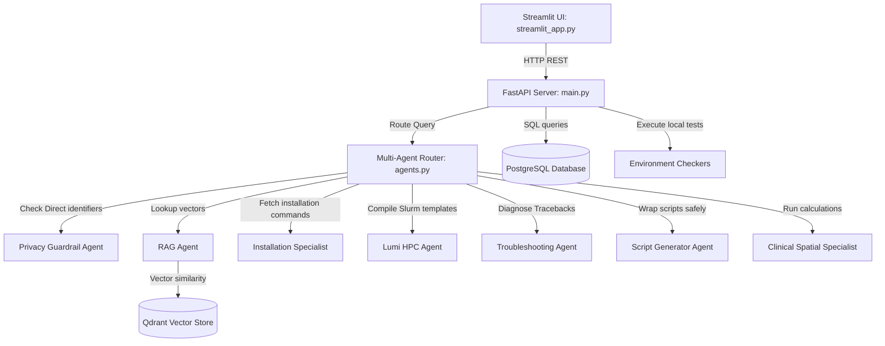

# Farkki-AI Clinical-Spatial Research Copilot: Developer Manual

This document provides architectural documentation for developers to extend and maintain the modular AI agent platform.

## 🏗️ Architecture Layout



## 🛠️ Modifying & Extending Agents

All specialist agent implementations reside inside [omeia/api/agents.py](file:///home/debdeba/Documents/scripts/farkki_ai_platform_blueprint/omeia/api/agents.py). 

### 1. Adding a new Installation Recipe
To add a new tool or OS installation step, edit the `RECIPES` dictionary inside `InstallationSpecialist`:
```python
"new_tool": {
    "linux": {
        "commands": "conda create -n new_tool_env python=3.10 -y && pip install new_tool",
        "verification": "new_tool --version",
        "expected": "new_tool output logs",
        "fix": "Ensure packages channels match."
    }
}
```

### 2. Modifying Slurm Templates
To adjust cluster execution structures, update the `SLURM_TEMPLATE` property within the `LumiHpcAgent` class in `agents.py`.

### 3. Adding Environment Checkers
Place new checker scripts (shell or Python) in the `scripts/` directory. Make them executable, and register the script endpoint mapping within the `/run_checker` route in [omeia/api/main.py](file:///home/debdeba/Documents/scripts/farkki_ai_platform_blueprint/omeia/api/main.py).

## 🩺 Automated Testing
Run automated unit tests covering RAG context loading, installation steps, log parsing, and the 14 researcher test questions:
```bash
python -m unittest tests/test_copilot.py
```
