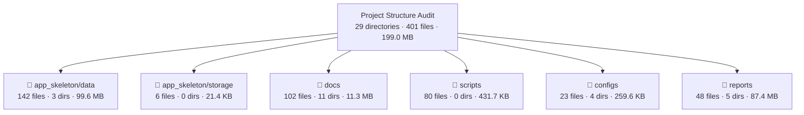
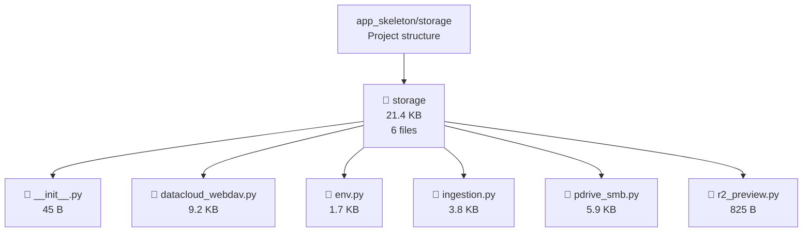

# Project Structure Analysis

**Generated:** 2026-06-07T02:31:54+03:00
**Project Root:** `/Users/debashishdeb/Downloads/OMEIA-AI`
**Python:** `3.13.2`
**Platform:** `macOS-26.5-arm64-arm-64bit-Mach-O`

## Executive Summary

- **Directories analyzed:** 29
- **Files analyzed:** 401
- **Total file size:** 199.0 MB
- **File types detected:** 16
- **Symlinks detected:** 0
- **Warnings / errors:** 10

## Scan Settings

- **Max depth:** 10
- **Include hidden:** False
- **Follow symlinks:** False
- **SHA-256 hashing:** False
- **Line counting:** False
- **Mermaid node limit:** 350

## Directories Requested

- ✓ `app_skeleton/data` → `/Users/debashishdeb/Downloads/OMEIA-AI/app_skeleton/data`
- ✓ `app_skeleton/storage` → `/Users/debashishdeb/Downloads/OMEIA-AI/app_skeleton/storage`
- ✓ `docs` → `/Users/debashishdeb/Downloads/OMEIA-AI/docs`
- ✓ `scripts` → `/Users/debashishdeb/Downloads/OMEIA-AI/scripts`
- ✓ `configs` → `/Users/debashishdeb/Downloads/OMEIA-AI/configs`
- ✓ `reports` → `/Users/debashishdeb/Downloads/OMEIA-AI/reports`

## Overview Diagram



## File Type Distribution

| Extension | Count | Percentage |
|---|---:|---:|
| `.json` | 111 | 27.7% |
| `.md` | 88 | 21.9% |
| `.py` | 50 | 12.5% |
| `.jsonl` | 47 | 11.7% |
| `.sh` | 36 | 9.0% |
| `.csv` | 18 | 4.5% |
| `.pdf` | 17 | 4.2% |
| `.xlsx` | 13 | 3.2% |
| `.docx` | 10 | 2.5% |
| `.yml` | 3 | 0.7% |
| `.yaml` | 3 | 0.7% |
| `.log` | 1 | 0.2% |
| `.rtf` | 1 | 0.2% |
| `.txt` | 1 | 0.2% |
| `.png` | 1 | 0.2% |
| `no_ext` | 1 | 0.2% |

## Largest Files (Top 50)

| Rank | Name | Size | Extension | Path |
|---:|---|---:|---|---|
| 1 | raw_asset_inventory.json | 47.0 MB | `.json` | `app_skeleton/data/raw_asset_inventory.json` |
| 2 | document_inventory.json | 47.0 MB | `.json` | `reports/document_library_audit/first_pass/document_inventory.json` |
| 3 | metadata_enriched_inventory.json | 22.1 MB | `.json` | `reports/document_library_audit/metadata_v2/metadata_enriched_inventory.json` |
| 4 | lab__wet_lab_files.json | 6.4 MB | `.json` | `app_skeleton/data/processed_projects/lab__wet_lab_files.json` |
| 5 | lab__wet_lab_files.chunks.jsonl | 5.3 MB | `.jsonl` | `app_skeleton/data/processed_projects/lab__wet_lab_files.chunks.jsonl` |
| 6 | display_title_mapping_top_class.csv | 3.7 MB | `.csv` | `reports/document_library_audit/metadata_v2/display_title_mapping_top_class.csv` |
| 7 | HERAfreeze minus80 Manual english-ult-manual-328398h01.pdf | 3.4 MB | `.pdf` | `docs/ORDERS & RELATED INFORMATION/Order_confirmations_manuals/HERAfreeze minus80 Manual english-ult-manual-328398h01.pdf` |
| 8 | raw_asset_inventory.csv | 3.0 MB | `.csv` | `app_skeleton/data/raw_asset_inventory.csv` |
| 9 | NKI.json | 2.9 MB | `.json` | `app_skeleton/data/processed_projects/NKI.json` |
| 10 | document_inventory.csv | 2.8 MB | `.csv` | `reports/document_library_audit/first_pass/document_inventory.csv` |
| 11 | NKI.chunks.jsonl | 2.6 MB | `.jsonl` | `app_skeleton/data/processed_projects/NKI.chunks.jsonl` |
| 12 | metadata_enriched_inventory.csv | 2.4 MB | `.csv` | `reports/document_library_audit/metadata_v2/metadata_enriched_inventory.csv` |
| 13 | classification_report_by_page.md | 2.2 MB | `.md` | `reports/document_library_audit/classification_report_by_page.md` |
| 14 | CellCycle.json | 2.2 MB | `.json` | `app_skeleton/data/processed_projects/CellCycle.json` |
| 15 | Fanconi.json | 2.2 MB | `.json` | `app_skeleton/data/processed_projects/Fanconi.json` |
| 16 | project_metadata_overlay.csv | 2.0 MB | `.csv` | `reports/document_library_audit/metadata_v2/project_metadata_overlay.csv` |
| 17 | iPDC_1.0.json | 2.0 MB | `.json` | `app_skeleton/data/processed_projects/iPDC_1.0.json` |
| 18 | lab__overview_documents.json | 1.6 MB | `.json` | `app_skeleton/data/processed_projects/lab__overview_documents.json` |
| 19 | iPDC_1.0.chunks.jsonl | 1.5 MB | `.jsonl` | `app_skeleton/data/processed_projects/iPDC_1.0.chunks.jsonl` |
| 20 | lab__overview_documents.chunks.jsonl | 1.4 MB | `.jsonl` | `app_skeleton/data/processed_projects/lab__overview_documents.chunks.jsonl` |
| 21 | display_title_mapping.csv | 1.4 MB | `.csv` | `reports/document_library_audit/metadata_v2/display_title_mapping.csv` |
| 22 | CellCycle.chunks.jsonl | 1.2 MB | `.jsonl` | `app_skeleton/data/processed_projects/CellCycle.chunks.jsonl` |
| 23 | TLS.json | 1.1 MB | `.json` | `app_skeleton/data/processed_projects/TLS.json` |
| 24 | Sequencing.json | 1.1 MB | `.json` | `app_skeleton/data/processed_projects/Sequencing.json` |
| 25 | Fanconi.chunks.jsonl | 1.0 MB | `.jsonl` | `app_skeleton/data/processed_projects/Fanconi.chunks.jsonl` |
| 26 | iPDC_2.0.json | 1.0 MB | `.json` | `app_skeleton/data/processed_projects/iPDC_2.0.json` |
| 27 | lab__overview_research_materials.json | 1004.0 KB | `.json` | `app_skeleton/data/processed_projects/lab__overview_research_materials.json` |
| 28 | Credit card purchase invoicing information.docx | 984.1 KB | `.docx` | `docs/ORDERS & RELATED INFORMATION/Credit card purchase invoicing information.docx` |
| 29 | Tribus.json | 957.9 KB | `.json` | `app_skeleton/data/processed_projects/Tribus.json` |
| 30 | Sequencing.chunks.jsonl | 945.8 KB | `.jsonl` | `app_skeleton/data/processed_projects/Sequencing.chunks.jsonl` |
| 31 | digitalized_data_inventory.csv | 944.7 KB | `.csv` | `reports/document_library_audit/second_pass/digitalized_data_inventory.csv` |
| 32 | metadata_enriched_inventory_top_class.csv | 926.4 KB | `.csv` | `reports/document_library_audit/metadata_v2/metadata_enriched_inventory_top_class.csv` |
| 33 | TLS.chunks.jsonl | 919.6 KB | `.jsonl` | `app_skeleton/data/processed_projects/TLS.chunks.jsonl` |
| 34 | lab__overview_research_materials.chunks.jsonl | 824.7 KB | `.jsonl` | `app_skeleton/data/processed_projects/lab__overview_research_materials.chunks.jsonl` |
| 35 | iPDC_2.0.chunks.jsonl | 781.6 KB | `.jsonl` | `app_skeleton/data/processed_projects/iPDC_2.0.chunks.jsonl` |
| 36 | SPACE.json | 759.2 KB | `.json` | `app_skeleton/data/processed_projects/SPACE.json` |
| 37 | Tribus.chunks.jsonl | 748.4 KB | `.jsonl` | `app_skeleton/data/processed_projects/Tribus.chunks.jsonl` |
| 38 | EyeMT.json | 677.2 KB | `.json` | `app_skeleton/data/processed_projects/EyeMT.json` |
| 39 | suggested_renames_for_later_review.csv | 632.7 KB | `.csv` | `reports/document_library_audit/metadata_v2/suggested_renames_for_later_review.csv` |
| 40 | lab__orders_archive.json | 614.2 KB | `.json` | `app_skeleton/data/processed_projects/lab__orders_archive.json` |
| 41 | SPACE.chunks.jsonl | 545.0 KB | `.jsonl` | `app_skeleton/data/processed_projects/SPACE.chunks.jsonl` |
| 42 | EyeMT.chunks.jsonl | 535.9 KB | `.jsonl` | `app_skeleton/data/processed_projects/EyeMT.chunks.jsonl` |
| 43 | lab__orders_archive.chunks.jsonl | 502.5 KB | `.jsonl` | `app_skeleton/data/processed_projects/lab__orders_archive.chunks.jsonl` |
| 44 | Auria.json | 491.2 KB | `.json` | `app_skeleton/data/processed_projects/Auria.json` |
| 45 | CIN2.json | 473.8 KB | `.json` | `app_skeleton/data/processed_projects/CIN2.json` |
| 46 | 31_SEARCH_UNIFIED_AUDIT_AND_SOURCE_BUNDLE.md | 464.9 KB | `.md` | `docs/31_SEARCH_UNIFIED_AUDIT_AND_SOURCE_BUNDLE.md` |
| 47 | Gas ordering instructions at the Faculty of Medicine.pdf | 434.6 KB | `.pdf` | `docs/ORDERS & RELATED INFORMATION/Gas_ordering_instructions_Woikoski/Gas ordering instructions at the Faculty of Medicine.pdf` |
| 48 | Kaasuntilausohje Lääketieteellisessä tiedekunnassa.pdf | 429.0 KB | `.pdf` | `docs/ORDERS & RELATED INFORMATION/Gas_ordering_instructions_Woikoski/Kaasuntilausohje Lääketieteellisessä tiedekunnassa.pdf` |
| 49 | non_project_clean_taxonomy.csv | 406.6 KB | `.csv` | `reports/document_library_audit/metadata_v2/non_project_clean_taxonomy.csv` |
| 50 | BioNordika QuoteTA2022-0505-KL HY Anastasiya Chernenko (Färkkilä & Vähärautio labs).pdf | 406.2 KB | `.pdf` | `docs/ORDERS & RELATED INFORMATION/OFFERS_QUOTES/BioNordika QuoteTA2022-0505-KL HY Anastasiya Chernenko (Färkkilä & Vähärautio labs).pdf` |

## Directory Size Summary

| Directory | Files | Size |
|---|---:|---:|
| `app_skeleton/data` | 6 | 50.2 MB |
| `reports/document_library_audit/first_pass` | 14 | 49.8 MB |
| `app_skeleton/data/processed_projects` | 94 | 49.3 MB |
| `reports/document_library_audit/metadata_v2` | 21 | 34.1 MB |
| `docs/ORDERS & RELATED INFORMATION/Order_confirmations_manuals` | 2 | 3.6 MB |
| `reports/document_library_audit` | 2 | 2.4 MB |
| `docs/ORDERS & RELATED INFORMATION/ORDERS_Excels_Year_by_Year` | 6 | 1.7 MB |
| `docs/ORDERS & RELATED INFORMATION/Gas_ordering_instructions_Woikoski` | 3 | 1.2 MB |
| `docs/ORDERS & RELATED INFORMATION` | 3 | 1.2 MB |
| `docs` | 61 | 1.1 MB |
| `reports/document_library_audit/second_pass` | 10 | 1.1 MB |
| `docs/ORDERS & RELATED INFORMATION/OFFERS_QUOTES` | 7 | 1.0 MB |
| `docs/ORDERS & RELATED INFORMATION/Lab_coats_Färkkilä_lab` | 4 | 489.8 KB |
| `scripts` | 80 | 431.7 KB |
| `docs/ORDERS & RELATED INFORMATION/OFFERS_QUOTES/QUOTES Färkkilä lab` | 3 | 333.5 KB |
| `docs/ORDERS & RELATED INFORMATION/Archive` | 5 | 277.4 KB |
| `docs/ORDERS & RELATED INFORMATION/Välinehuolto` | 4 | 234.2 KB |
| `configs/document_library` | 5 | 204.9 KB |
| `docs/ORDERS & RELATED INFORMATION/Archive/Computers_orders` | 2 | 124.0 KB |
| `app_skeleton/data/logs` | 1 | 85.4 KB |
| `docs/ORDERS & RELATED INFORMATION/Sensire_minus80oC_Revco_sensor_1538B` | 2 | 80.7 KB |
| `configs` | 13 | 44.8 KB |
| `app_skeleton/data/ingestion_reports` | 41 | 24.2 KB |
| `app_skeleton/storage` | 6 | 21.4 KB |
| `configs/research_knowledge` | 3 | 7.2 KB |
| `reports/document_library_audit/final_corrected` | 1 | 4.8 KB |
| `configs/secrets` | 1 | 2.4 KB |
| `configs/caddy` | 1 | 427 B |

## Mermaid Diagrams by Directory

### app_skeleton/data


### app_skeleton/storage



### docs

```mermaid
graph TD
    n0["docs<br/>Project structure"]
    n1["📁 docs<br/>11.3 MB<br/>102 files"]
    n0 --> n1
    n2["📁 ORDERS & RELATED INFORMATION<br/>10.2 MB<br/>41 files"]
    n1 --> n2
    n3["📁 Archive<br/>401.4 KB<br/>7 files"]
    n2 --> n3
    n4["📁 Computers_orders<br/>124.0 KB<br/>2 files"]
    n3 --> n4
    n5["📕 Bill Anniinas computer 2 6 2020.pdf<br/>4.6 KB"]
    n4 --> n5
    n6["📄 Tietokonetilaus for Anniina 31 3 2020.rtf<br/>119.4 KB"]
    n4 --> n6
    n7["📊 Anni_Virtanen_HUS_LAB_account_2019_purchases.xlsx<br/>7.0 KB"]
    n3 --> n7
    n8["📊 FICAN_SOUTH_Färkkilä_lab.xlsx<br/>27.4 KB"]
    n3 --> n8
    n9["📊 FiCAN_South_money_from_2019_AF_lab_debt_to_AV_lab.xlsx<br/>6.8 KB"]
    n3 --> n9
    n10["📕 ONCOSYS COMMON EQUIPMENT 2019_UUD_VAHVISTUS_1060102408_20190627032435.pdf<br/>206.3 KB"]
    n3 --> n10
    n11["📊 Orders_for_Kauppi_lab_TERVA_collaboration.xlsx<br/>29.8 KB"]
    n3 --> n11
    n12["📁 Gas_ordering_instructions_Woikoski<br/>1.2 MB<br/>3 files"]
    n2 --> n12
    n13["📕 Gas ordering instructions at the Faculty of Medicine.pdf<br/>434.6 KB"]
    n12 --> n13
    n14["📕 Kaasuntilausohje Lääketieteellisessä tiedekunnassa.pdf<br/>429.0 KB"]
    n12 --> n14
    n15["📕 Woikoski_liite_3_hintaliite_laak_erik_teol.pdf<br/>361.7 KB"]
    n12 --> n15
    n16["📁 Lab_coats_Färkkilä_lab<br/>489.8 KB<br/>4 files"]
    n2 --> n16
    n17["📘 Infektiosäkki(1).docx<br/>141.7 KB"]
    n16 --> n17
    n18["📘 Infektiosäkki.docx<br/>331.3 KB"]
    n16 --> n18
    n19["📘 Lab coats Färkkila lab asiakasnumero.docx<br/>6.8 KB"]
    n16 --> n19
    n20["📊 Työvaatekoonti LAB COATS Lindström Sept2019.xlsx<br/>10.0 KB"]
    n16 --> n20
    n21["📁 OFFERS_QUOTES<br/>1.3 MB<br/>10 files"]
    n2 --> n21
    n22["📁 QUOTES Färkkilä lab<br/>333.5 KB<br/>3 files"]
    n21 --> n22
    n23["📕  Quote BioNordikaTA2021-0431HL HY Anastasiya Chernenko (Färkkilä & Vähärautio labs).pdf<br/>163.5 KB"]
    n22 --> n23
    n24["📕 BioNordika Quote TA2020-0288-JN HY Anastasiya Chernenko (Färkkilä & Vähärautio labs).pdf<br/>163.4 KB"]
    n22 --> n24
    n25["📘 QUOTES.docx<br/>6.5 KB"]
    n22 --> n25
    n26["📕 BioNordika QuoteTA2022-0505-KL HY Anastasiya Chernenko (Färkkilä & Vähärautio labs).pdf<br/>406.2 KB"]
    n21 --> n26
    n27["📕 Fisher 2019 Eppendorf centrifuges offer.pdf<br/>191.7 KB"]
    n21 --> n27
    n28["📕 Fisher offer Thermomixer Eppendorf Sept 2019.pdf<br/>188.2 KB"]
    n21 --> n28
    n29["📕 FotoprofiiliOffer_AF_lab_Helsingin Yliopisto_06.04.22.pdf<br/>68.2 KB"]
    n21 --> n29
    n30["📘 Labnet 2019 Eppendorf and Sigma centrifuge offer.docx<br/>8.4 KB"]
    n21 --> n30
    n31["📕 QIAGEN quote Chernenko 011019.pdf<br/>67.9 KB"]
    n21 --> n31
    n32["📕 QUOTES Product areas and groups 2022_QIAGEN.pdf<br/>110.5 KB"]
    n21 --> n32
    n33["📁 Order_confirmations_manuals<br/>3.6 MB<br/>2 files"]
    n2 --> n33
    n34["📕 HERAfreeze HLE minus80 Färkkilä Kauppi UUD. VAHVISTUS-1060102408_20190611034714 (2).pdf<br/>206.0 KB"]
    n33 --> n34
    n35["📕 HERAfreeze minus80 Manual english-ult-manual-328398h01.pdf<br/>3.4 MB"]
    n33 --> n35
    n36["📁 ORDERS_Excels_Year_by_Year<br/>1.7 MB<br/>6 files"]
    n2 --> n36
    n37["📊 ORDERS 2019 Färkkilä lab.xlsx<br/>193.7 KB"]
    n36 --> n37
    n38["📊 ORDERS 2020 Färkkilä lab.xlsx<br/>302.8 KB"]
    n36 --> n38
    n39["📊 ORDERS 2021 Färkkilä lab.xlsx<br/>323.6 KB"]
    n36 --> n39
    n40["📊 ORDERS 2022 Färkkilä lab.xlsx<br/>320.6 KB"]
    n36 --> n40
    n41["📊 ORDERS 2023 Färkkilä lab.xlsx<br/>329.5 KB"]
    n36 --> n41
    n42["📊 ORDERS 2024 Färkkilä lab.xlsx<br/>305.3 KB"]
    n36 --> n42
    n43["📁 Sensire_minus80oC_Revco_sensor_1538B<br/>80.7 KB<br/>2 files"]
    n2 --> n43
    n44["📘 Sensire account.docx<br/>6.9 KB"]
    n43 --> n44
    n45["📕 Sensire bill 11 2021 10 2022.pdf<br/>73.9 KB"]
    n43 --> n45
    n46["📁 Välinehuolto<br/>234.2 KB<br/>4 files"]
    n2 --> n46
    n47["📕 Instructions for sterilizing at Biomedicum 1 and 2u_9.12.2022.pdf<br/>166.1 KB"]
    n46 --> n47
    n48["📘 Instructions for the use of the Instrument maintenance at Biomedicum 1 and 2u.docx<br/>24.3 KB"]
    n46 --> n48
    n49["📘 Instructions for the use of the Instrument maintenance at Biomedicum 1 and 2u_270121.docx<br/>24.4 KB"]
    n46 --> n49
    n50["📘 Välinehuollon ohjeita BM1 ja BM2U_270121.docx<br/>19.3 KB"]
    n46 --> n50
    n51["📊 Catalog export from quartzy.xlsx<br/>157.3 KB"]
    n2 --> n51
    n52["📘 Credit card purchase invoicing information.docx<br/>984.1 KB"]
    n2 --> n52
    n53["📊 Varastokirjanpito.xlsx<br/>53.4 KB"]
    n2 --> n53
    n54["📝 00_EXECUTIVE_SUMMARY.md<br/>2.9 KB"]
    n1 --> n54
    n55["📝 01_END_TO_END_ARCHITECTURE.md<br/>4.5 KB"]
    n1 --> n55
    n56["📝 02_MATURE_DATA_SCHEMA.md<br/>6.7 KB"]
    n1 --> n56
    n57["📝 03_VECTOR_RAG_DEEP_DIVE.md<br/>4.8 KB"]
    n1 --> n57
    n58["📝 04_KNOWLEDGE_GRAPH_DESIGN.md<br/>2.2 KB"]
    n1 --> n58
    n59["📝 05_PIPELINE_INTEGRATION.md<br/>3.2 KB"]
    n1 --> n59
    n60["📝 06_SECURITY_GOVERNANCE.md<br/>1.9 KB"]
    n1 --> n60
    n61["📝 07_MVP_TO_PRODUCTION_ROADMAP.md<br/>2.4 KB"]
    n1 --> n61
    n62["📝 08_DOCUMENTATION_AND_SCRIPT_INTAKE.md<br/>1.5 KB"]
    n1 --> n62
    n63["📝 09_VALIDATION_QA_TESTING.md<br/>1.6 KB"]
    n1 --> n63
    n64["📝 10_COMPLETE_SETUP_STEP_BY_STEP.md<br/>1.9 KB"]
    n1 --> n64
    n65["📝 11_LABORATORY_DIGITAL_TWIN_REPORT.md<br/>20.7 KB"]
    n1 --> n65
    n66["📝 12_LUMI_ARCHITECTURE_PACKAGE.md<br/>28.6 KB"]
    n1 --> n66
    n67["📝 13_LOW_END_WORKER_IMPLEMENTATION_PLAN.md<br/>12.4 KB"]
    n1 --> n67
    n68["📝 14_PRODUCTION_DECISIONS.md<br/>4.0 KB"]
    n1 --> n68
    n69["📝 15_STORAGE_CLOUDFLARE_REMOVAL_AUDIT.md<br/>2.5 KB"]
    n1 --> n69
    n70["📝 15_STORAGE_MASTER_PLAN.md<br/>3.7 KB"]
    n1 --> n70
    n71["📝 16_STORAGE_CONNECTOR_DESIGN.md<br/>2.3 KB"]
    n1 --> n71
    n72["📝 17_STORAGE_INGESTION_WORKFLOW.md<br/>1.6 KB"]
    n1 --> n72
    n73["📝 18_DATACLOUD_FOLDER_VALIDATION.md<br/>2.3 KB"]
    n1 --> n73
    n74["📝 19_ASSET_REGISTRY_SCHEMA.md<br/>1.9 KB"]
    n1 --> n74
    n75["📝 20_DOCUMENT_REGISTRY_SCHEMA.md<br/>1.3 KB"]
    n1 --> n75
    n76["📝 21_PAGE_DOMAIN_MAPPING.md<br/>1.6 KB"]
    n1 --> n76
    n77["📝 22_STORAGE_SAFETY_PERMISSIONS.md<br/>1.6 KB"]
    n1 --> n77
    n78["📝 23_STORAGE_WORKER_CHECKLIST.md<br/>1.7 KB"]
    n1 --> n78
    n79["📝 24_DATA_DIGITALIZATION_PIPELINE.md<br/>2.1 KB"]
    n1 --> n79
    n80["📝 24_PROJECT_DIGITALIZATION.md<br/>1.5 KB"]
    n1 --> n80
    n81["📝 25_SECURITY_ROUTE_AUDIT.md<br/>11.0 KB"]
    n1 --> n81
    n82["📝 25_SUPABASE_SYNC_POLICY.md<br/>4.3 KB"]
    n1 --> n82
    n83["📝 26_PRODUCTION_DEPLOYMENT.md<br/>6.9 KB"]
    n1 --> n83
    n84["📝 27_UNIVERSITY_DESKTOP_BACKEND.md<br/>5.3 KB"]
    n1 --> n84
    n85["📝 28_AUTONOMOUS_PROCESSOR.md<br/>3.7 KB"]
    n1 --> n85
    n86["📝 29_INTELLIGENT_DATAPAD.md<br/>3.3 KB"]
    n1 --> n86
    n87["📝 30_SEARCH_FUNCTIONALITY_AUDIT.md<br/>28.3 KB"]
    n1 --> n87
    n88["📝 31_SEARCH_UNIFIED_AUDIT_AND_SOURCE_BUNDLE.md<br/>464.9 KB"]
    n1 --> n88
    n89["📝 32_SEARCH_PORTABLE_SETUP.md<br/>3.6 KB"]
    n1 --> n89
    n90["📝 33_AI_LAB_ASSISTANT_PRODUCTION_PLAN.md<br/>24.4 KB"]
    n1 --> n90
    n91["📝 34_AI_LAB_ASSISTANT_AND_SEARCH_DEEP_AUDIT.md<br/>31.6 KB"]
    n1 --> n91
    n92["📝 35_VAST_STYLE_UI_MIGRATION_REPORT.md<br/>24.4 KB"]
    n1 --> n92
    n93["📝 AI_LAB_ASSISTANT_PRODUCTION_FIX_REPORT.md<br/>6.5 KB"]
    n1 --> n93
    n94["📝 BIOMEDICAL_MODELS_DOCKER.md<br/>3.0 KB"]
    n1 --> n94
    n95["📝 complete_code_collection.md<br/>140.2 KB"]
    n1 --> n95
    n96["📝 DOCKER_SECURITY_AND_CONNECTION.md<br/>3.9 KB"]
    n1 --> n96
    n97["📝 DOCUMENT_LIBRARY_AUDIT_FINAL_REPORT.md<br/>10.1 KB"]
    n1 --> n97
    n98["📝 FRONTEND_BACKEND_TUTORIAL.md<br/>8.8 KB"]
    n1 --> n98
    n99["📝 IMAGE_READINESS_ADMIN_GUIDE.md<br/>1.7 KB"]
    n1 --> n99
    n100["📝 IMAGE_SECURITY_NOTES.md<br/>1.3 KB"]
    n1 --> n100
    n101["📝 IMAGE_STREAMING_API.md<br/>2.1 KB"]
    n1 --> n101
    n102["📝 IMAGE_VIEWER_CONTRACT.md<br/>1.4 KB"]
    n1 --> n102
    n103["📝 IMAGING_PACKAGES_GUIDE.md<br/>3.8 KB"]
    n1 --> n103
    n104["📝 LAB_DATABASE_SECTIONS.md<br/>1.3 KB"]
    n1 --> n104
    n105["📝 MAC_STARTUP.md<br/>1.4 KB"]
    n1 --> n105
    n106["📋 omeia_lab_documents_complete_collection.json<br/>38.2 KB"]
    n1 --> n106
    n107["📄 order.txt<br/>0 B"]
    n1 --> n107
    n108["📝 PORTABLE_MAC_TO_LINUX.md<br/>2.2 KB"]
    n1 --> n108
    n109["📝 PROJECT_STRUCTURE_FINAL_ANALYSIS.md<br/>14.4 KB"]
    n1 --> n109
    n110["📝 README_DEVELOPER.md<br/>2.3 KB"]
    n1 --> n110
    n111["📝 README_RESEARCHER.md<br/>1.6 KB"]
    n1 --> n111
    n112["🖼️ Screenshot from 2026-06-04 13-34-38.png<br/>123.5 KB"]
    n1 --> n112
    n113["📝 TAILSCALE_SETUP.md<br/>2.5 KB"]
    n1 --> n113
    n114["📝 TIFF_STREAMING_IMPLEMENTATION_PLAN.md<br/>2.8 KB"]
    n1 --> n114
```



### scripts


### configs

```mermaid
graph TD
    n0["configs<br/>Project structure"]
    n1["📁 configs<br/>259.6 KB<br/>23 files"]
    n0 --> n1
    n2["📁 caddy<br/>427 B<br/>1 files"]
    n1 --> n2
    n3["📄 Caddyfile<br/>427 B"]
    n2 --> n3
    n4["📁 document_library<br/>204.9 KB<br/>5 files"]
    n1 --> n4
    n5["📋 category_tree_combined.json<br/>6.1 KB"]
    n4 --> n5
    n6["📋 category_tree_folder_derived.json<br/>192.5 KB"]
    n4 --> n6
    n7["📋 category_tree_official.json<br/>1.3 KB"]
    n4 --> n7
    n8["📋 category_tree_scientific_terms.json<br/>3.7 KB"]
    n4 --> n8
    n9["📋 category_tree_tag_derived.json<br/>1.3 KB"]
    n4 --> n9
    n10["📁 research_knowledge<br/>7.2 KB<br/>3 files"]
    n1 --> n10
    n11["⚙️ crawl_allowlist.yml<br/>530 B"]
    n10 --> n11
    n12["⚙️ domain_taxonomy.yml<br/>935 B"]
    n10 --> n12
    n13["📋 seed_sources.json<br/>5.7 KB"]
    n10 --> n13
    n14["📁 secrets<br/>2.4 KB<br/>1 files"]
    n1 --> n14
    n15["📋 firebase-adminsdk.json<br/>2.4 KB"]
    n14 --> n15
    n16["📋 agent_categories.json<br/>6.4 KB"]
    n1 --> n16
    n17["📝 DATACLOUD_WEBDAV_SETUP.md<br/>2.5 KB"]
    n1 --> n17
    n18["📝 DEPLOYMENT_ENV.md<br/>5.1 KB"]
    n1 --> n18
    n19["⚙️ docker-compose.dev.yml<br/>1.2 KB"]
    n1 --> n19
    n20["📝 FIREBASE_WEB_SETUP.md<br/>4.6 KB"]
    n1 --> n20
    n21["⚙️ folder_structure.yaml<br/>1.4 KB"]
    n1 --> n21
    n22["📋 internal_agents.json<br/>10.4 KB"]
    n1 --> n22
    n23["📋 lab_people_index.json<br/>2.6 KB"]
    n1 --> n23
    n24["📋 ollama_research_models.json<br/>3.0 KB"]
    n1 --> n24
    n25["📝 PDRIVE_SETUP.md<br/>1.6 KB"]
    n1 --> n25
    n26["⚙️ qdrant_collections.yaml<br/>1.7 KB"]
    n1 --> n26
    n27["⚙️ rag_config.yaml<br/>865 B"]
    n1 --> n27
    n28["📝 SUPABASE_SETUP.md<br/>3.5 KB"]
    n1 --> n28
```



### reports

```mermaid
graph TD
    n0["reports<br/>Project structure"]
    n1["📁 reports<br/>87.4 MB<br/>48 files"]
    n0 --> n1
    n2["📁 document_library_audit<br/>87.4 MB<br/>48 files"]
    n1 --> n2
    n3["📁 final_corrected<br/>4.8 KB<br/>1 files"]
    n2 --> n3
    n4["📝 final_corrected_audit_summary.md<br/>4.8 KB"]
    n3 --> n4
    n5["📁 first_pass<br/>49.8 MB<br/>14 files"]
    n2 --> n5
    n6["📝 audit_summary.md<br/>2.8 KB"]
    n5 --> n6
    n7["📊 category_summary.csv<br/>1.1 KB"]
    n5 --> n7
    n8["📋 category_tree.json<br/>715 B"]
    n5 --> n8
    n9["📊 document_inventory.csv<br/>2.8 MB"]
    n5 --> n9
    n10["📋 document_inventory.json<br/>47.0 MB"]
    n5 --> n10
    n11["📝 duplicate_candidates.md<br/>7.2 KB"]
    n5 --> n11
    n12["📝 file_type_summary.md<br/>1.4 KB"]
    n5 --> n12
    n13["📝 large_files_report.md<br/>3.8 KB"]
    n5 --> n13
    n14["📝 missing_metadata_report.md<br/>1.5 KB"]
    n5 --> n14
    n15["📝 preview_coverage_report.md<br/>365 B"]
    n5 --> n15
    n16["📝 proposed_clean_taxonomy_draft.md<br/>1.1 KB"]
    n5 --> n16
    n17["📝 source_reconciliation_report.md<br/>361 B"]
    n5 --> n17
    n18["📝 taxonomy_audit.md<br/>1.0 KB"]
    n5 --> n18
    n19["📝 ui_information_architecture_input.md<br/>1.9 KB"]
    n5 --> n19
    n20["📁 metadata_v2<br/>34.1 MB<br/>21 files"]
    n2 --> n20
    n21["📊 display_title_mapping.csv<br/>1.4 MB"]
    n20 --> n21
    n22["📊 display_title_mapping_top_class.csv<br/>3.7 MB"]
    n20 --> n22
    n23["📊 duplicate_deletion_log.csv<br/>64 B"]
    n20 --> n23
    n24["📊 duplicate_resolution_plan.csv<br/>182.9 KB"]
    n20 --> n24
    n25["📊 duplicate_review_queue.csv<br/>6.3 KB"]
    n20 --> n25
    n26["📝 final_metadata_improvement_summary.md<br/>3.3 KB"]
    n20 --> n26
    n27["📊 low_confidence_metadata_queue.csv<br/>44.1 KB"]
    n20 --> n27
    n28["📊 metadata_enriched_inventory.csv<br/>2.4 MB"]
    n20 --> n28
    n29["📋 metadata_enriched_inventory.json<br/>22.1 MB"]
    n20 --> n29
    n30["📊 metadata_enriched_inventory_top_class.csv<br/>926.4 KB"]
    n20 --> n30
    n31["📋 metadata_quality_dashboard.json<br/>1.0 KB"]
    n20 --> n31
    n32["📝 metadata_rules.md<br/>1.4 KB"]
    n20 --> n32
    n33["📝 metadata_schema.md<br/>2.4 KB"]
    n20 --> n33
    n34["📊 non_project_clean_taxonomy.csv<br/>406.6 KB"]
    n20 --> n34
    n35["📊 project_metadata_overlay.csv<br/>2.0 MB"]
    n20 --> n35
    n36["📊 redigitalization_priority_queue.csv<br/>153.5 KB"]
    n20 --> n36
    n37["📝 search_metadata_index_plan.md<br/>1011 B"]
    n20 --> n37
    n38["📋 smart_views_config.json<br/>2.3 KB"]
    n20 --> n38
    n39["📊 suggested_renames_for_later_review.csv<br/>632.7 KB"]
    n20 --> n39
    n40["📝 ui_metadata_display_plan.md<br/>1.1 KB"]
    n20 --> n40
    n41["📊 unknown_type_review_queue.csv<br/>44.1 KB"]
    n20 --> n41
    n42["📁 second_pass<br/>1.1 MB<br/>10 files"]
    n2 --> n42
    n43["📝 audit_self_review.md<br/>889 B"]
    n42 --> n43
    n44["📝 digitalization_coverage_report.md<br/>612 B"]
    n42 --> n44
    n45["📊 digitalized_data_inventory.csv<br/>944.7 KB"]
    n42 --> n45
    n46["📝 digitalized_data_quality_report.md<br/>557 B"]
    n42 --> n46
    n47["📝 failed_digitalization_report.md<br/>363 B"]
    n42 --> n47
    n48["📝 preview_system_audit.md<br/>561 B"]
    n42 --> n48
    n49["📊 redigitalization_queue.csv<br/>127.3 KB"]
    n42 --> n49
    n50["📝 search_index_audit.md<br/>430 B"]
    n42 --> n50
    n51["📝 second_pass_summary.md<br/>718 B"]
    n42 --> n51
    n52["📝 stale_digitalized_data_report.md<br/>270 B"]
    n42 --> n52
    n53["📋 classification_report_by_page.json<br/>220.6 KB"]
    n2 --> n53
    n54["📝 classification_report_by_page.md<br/>2.2 MB"]
    n2 --> n54
```




## Compact Tree View

### `app_skeleton/data`

```text
- 📁 data (99.6 MB, 142 files)
  - 📁 ingestion_reports (24.2 KB, 41 files)
    - 📋 ingestion_20260603T174415Z_dig_2b5d899a.json (696 B)
    - 📋 ingestion_20260603T174415Z_dig_8d9a3c8c.json (697 B)
    - 📋 ingestion_20260603T174429Z_dig_0c4f2a57.json (697 B)
    - 📋 ingestion_20260603T174429Z_dig_44209810.json (697 B)
    - 📋 ingestion_20260603T174429Z_dig_d9c046dd.json (696 B)
    - 📋 ingestion_20260603T174435Z_dig_2332a5ca.json (697 B)
    - 📋 ingestion_20260603T174435Z_dig_5866bb06.json (696 B)
    - 📋 ingestion_20260603T174436Z_dig_4d0db0e5.json (697 B)
    - 📋 ingestion_20260603T183800Z_c899f24f.json (392 B)
    - 📋 ingestion_20260603T194609Z_1090e020.json (392 B)
    - 📋 ingestion_20260603T205313Z_3efed162.json (392 B)
    - 📋 ingestion_20260603T220033Z_fde197b2.json (392 B)
    - 📋 ingestion_20260604T010557Z_dig_beecab03.json (641 B)
    - 📋 ingestion_20260604T022301Z_dig_ebf14532.json (641 B)
    - 📋 ingestion_20260604T035501Z_dig_fff4ecb7.json (641 B)
    - 📋 ingestion_20260604T043749Z_8dd023b9.json (408 B)
    - 📋 ingestion_20260604T044328Z_80149104.json (425 B)
    - 📋 ingestion_20260604T044731Z_c849eefc.json (389 B)
    - 📋 ingestion_20260604T045917Z_dig_e2f1a788.json (641 B)
    - 📋 ingestion_20260604T052003Z_dig_72be6b45.json (647 B)
    - 📋 ingestion_20260604T052203Z_7e42e1ba.json (389 B)
    - 📋 ingestion_20260604T052625Z_c75fc18f.json (391 B)
    - 📋 ingestion_20260606T121107Z_dig_a2848de9.json (667 B)
    - 📋 ingestion_20260606T121108Z_dig_a262800b.json (668 B)
    - 📋 ingestion_20260606T121113Z_dig_aadd38ab.json (668 B)
    - 📋 ingestion_20260606T121158Z_dig_86d1d036.json (667 B)
    - 📋 ingestion_20260606T121159Z_dig_fa1118c4.json (668 B)
    - 📋 ingestion_20260606T121202Z_dig_be924f1e.json (668 B)
    - 📋 ingestion_20260606T121324Z_dig_34802330.json (668 B)
    - 📋 ingestion_20260606T121324Z_dig_fe54acb1.json (667 B)
    - 📋 ingestion_20260606T121328Z_dig_5382733b.json (668 B)
    - 📋 ingestion_20260606T121401Z_dig_b80c6829.json (668 B)
    - 📋 ingestion_20260606T121401Z_dig_e3763d5b.json (667 B)
    - 📋 ingestion_20260606T121405Z_dig_d177e729.json (668 B)
    - 📋 ingestion_20260606T122641Z_dig_ec3880a7.json (667 B)
    - 📋 ingestion_20260606T122642Z_dig_f3603006.json (668 B)
    - 📋 ingestion_20260606T122647Z_dig_fbdbc9be.json (668 B)
    - 📋 ingestion_20260606T123401Z_dig_0fa646b3.json (667 B)
    - 📋 ingestion_20260606T123401Z_dig_168df580.json (668 B)
    - 📋 ingestion_20260606T123405Z_dig_5556b121.json (668 B)
    - 📋 sync_run_report.json (367 B)
  - 📁 logs (85.4 KB, 1 files)
    - 📄 autonomous_processor.log (85.4 KB)
  - 📁 processed_projects (49.3 MB, 94 files)
    - 📋 ADC.chunks.jsonl (40.0 KB)
    - 📋 ADC.json (67.5 KB)
    - 📋 Auria.chunks.jsonl (363.5 KB)
    - 📋 Auria.json (491.2 KB)
    - 📋 CellCycle.chunks.jsonl (1.2 MB)
    - 📋 CellCycle.json (2.2 MB)
    - 📋 CIN2.chunks.jsonl (253.6 KB)
    - 📋 CIN2.json (473.8 KB)
    - 📋 DCIS.chunks.jsonl (35.2 KB)
    - 📋 DCIS.json (63.9 KB)
    - 📋 EMT.chunks.jsonl (873 B)
    - 📋 EMT.json (6.9 KB)
    - 📋 Endometrial_HRD.chunks.jsonl (0 B)
    - 📋 Endometrial_HRD.json (2.2 KB)
    - 📋 EyeMT.chunks.jsonl (535.9 KB)
    - 📋 EyeMT.json (677.2 KB)
    - 📋 Fanconi.chunks.jsonl (1.0 MB)
    - 📋 Fanconi.json (2.2 MB)
    - 📋 FINPROVE.chunks.jsonl (83.2 KB)
    - 📋 FINPROVE.json (157.3 KB)
    - 📋 HaikalaCollab.chunks.jsonl (8.6 KB)
    - 📋 HaikalaCollab.json (20.0 KB)
    - 📋 HGSC_scRNAseq.chunks.jsonl (15.1 KB)
    - 📋 HGSC_scRNAseq.json (30.2 KB)
    - 📋 iPDC_1.0.chunks.jsonl (1.5 MB)
    - 📋 iPDC_1.0.json (2.0 MB)
    - 📋 iPDC_2.0.chunks.jsonl (781.6 KB)
    - 📋 iPDC_2.0.json (1.0 MB)
    - 📋 KRAS.chunks.jsonl (201.1 KB)
    - 📋 KRAS.json (361.7 KB)
    - 📋 lab__orders_archive.chunks.jsonl (502.5 KB)
    - 📋 lab__orders_archive.json (614.2 KB)
    - 📋 lab__orders_billing.chunks.jsonl (167.7 KB)
    - 📋 lab__orders_billing.json (236.2 KB)
    - 📋 lab__overview_cleaning.chunks.jsonl (21.1 KB)
    - 📋 lab__overview_cleaning.json (40.9 KB)
    - 📋 lab__overview_documents.chunks.jsonl (1.4 MB)
    - 📋 lab__overview_documents.json (1.6 MB)
    - 📋 lab__overview_guidelines.chunks.jsonl (94.4 KB)
    - 📋 lab__overview_guidelines.json (143.0 KB)
    - 📋 lab__overview_onboarding.chunks.jsonl (122.7 KB)
    - 📋 lab__overview_onboarding.json (143.2 KB)
    - 📋 lab__overview_personnel.chunks.jsonl (81.5 KB)
    - 📋 lab__overview_personnel.json (140.9 KB)
    - 📋 lab__overview_research_materials.chunks.jsonl (824.7 KB)
    - 📋 lab__overview_research_materials.json (1004.0 KB)
    - 📋 lab__social_misc.chunks.jsonl (38.2 KB)
    - 📋 lab__social_misc.json (273.6 KB)
    - 📋 lab__wet_lab_files.chunks.jsonl (5.3 MB)
    - 📋 lab__wet_lab_files.json (6.4 MB)
    - 📋 LeppaCollab.chunks.jsonl (0 B)
    - 📋 LeppaCollab.json (2.2 KB)
    - 📋 Mesenchymal_Ovca.chunks.jsonl (0 B)
    - 📋 Mesenchymal_Ovca.json (2.2 KB)
    - 📋 Myelonets.chunks.jsonl (30.3 KB)
    - 📋 Myelonets.json (56.2 KB)
    - 📋 NKI.chunks.jsonl (2.6 MB)
    - 📋 NKI.json (2.9 MB)
    - 📋 Organoids.chunks.jsonl (0 B)
    - 📋 Organoids.json (2.1 KB)
    - 📋 ovaHRDscar.chunks.jsonl (67.8 KB)
    - 📋 ovaHRDscar.json (104.8 KB)
    - 📋 Ovca_VTE.chunks.jsonl (0 B)
    - 📋 Ovca_VTE.json (2.0 KB)
    - 📋 Pixel_AI.chunks.jsonl (127.2 KB)
    - 📋 Pixel_AI.json (171.1 KB)
    - 📋 Proteomics.chunks.jsonl (26.2 KB)
    - 📋 Proteomics.json (42.2 KB)
    - 📋 SaloCollab.chunks.jsonl (26.2 KB)
    - 📋 SaloCollab.json (42.2 KB)
    - 📋 SC_Integration.chunks.jsonl (127.1 KB)
    - 📋 SC_Integration.json (181.7 KB)
    - 📋 sciSet.chunks.jsonl (0 B)
    - 📋 sciSet.json (2.9 KB)
    - 📋 Sequencing.chunks.jsonl (945.8 KB)
    - 📋 Sequencing.json (1.1 MB)
    - 📋 SideProjects.chunks.jsonl (0 B)
    - 📋 SideProjects.json (1.9 KB)
    - 📋 SPACE.chunks.jsonl (545.0 KB)
    - 📋 SPACE.json (759.2 KB)
    - 📋 SPACEjoint.chunks.jsonl (59.7 KB)
    - 📋 SPACEjoint.json (94.8 KB)
    - 📋 SPACEstat.chunks.jsonl (112.2 KB)
    - 📋 SPACEstat.json (163.4 KB)
    - 📋 TLS.chunks.jsonl (919.6 KB)
    - 📋 TLS.json (1.1 MB)
    - 📋 TMA_Cohorts.chunks.jsonl (87.5 KB)
    - 📋 TMA_Cohorts.json (120.9 KB)
    - 📋 Tribus.chunks.jsonl (748.4 KB)
    - 📋 Tribus.json (957.9 KB)
    - 📋 VanharantaCollab.chunks.jsonl (0 B)
    - 📋 VanharantaCollab.json (2.1 KB)
    - 📋 vTMA.chunks.jsonl (192.5 KB)
    - 📋 vTMA.json (250.4 KB)
  - 📋 lab_personnel_roster.json (17.0 KB)
  - 📋 processor_state.json (3.0 KB)
  - 📋 projects_catalog.json (68.1 KB)
  - 📊 raw_asset_inventory.csv (3.0 MB)
  - 📋 raw_asset_inventory.json (47.0 MB)
  - 📋 raw_asset_inventory_summary.json (1.8 KB)
```

### `app_skeleton/storage`

```text
- 📁 storage (21.4 KB, 6 files)
  - 🐍 __init__.py (45 B)
  - 🐍 datacloud_webdav.py (9.2 KB)
  - 🐍 env.py (1.7 KB)
  - 🐍 ingestion.py (3.8 KB)
  - 🐍 pdrive_smb.py (5.9 KB)
  - 🐍 r2_preview.py (825 B)
```

### `docs`

```text
- 📁 docs (11.3 MB, 102 files)
  - 📁 ORDERS & RELATED INFORMATION (10.2 MB, 41 files)
    - 📁 Archive (401.4 KB, 7 files)
      - 📁 Computers_orders (124.0 KB, 2 files)
        - 📕 Bill Anniinas computer 2 6 2020.pdf (4.6 KB)
        - 📄 Tietokonetilaus for Anniina 31 3 2020.rtf (119.4 KB)
      - 📊 Anni_Virtanen_HUS_LAB_account_2019_purchases.xlsx (7.0 KB)
      - 📊 FICAN_SOUTH_Färkkilä_lab.xlsx (27.4 KB)
      - 📊 FiCAN_South_money_from_2019_AF_lab_debt_to_AV_lab.xlsx (6.8 KB)
      - 📕 ONCOSYS COMMON EQUIPMENT 2019_UUD_VAHVISTUS_1060102408_20190627032435.pdf (206.3 KB)
      - 📊 Orders_for_Kauppi_lab_TERVA_collaboration.xlsx (29.8 KB)
    - 📁 Gas_ordering_instructions_Woikoski (1.2 MB, 3 files)
      - 📕 Gas ordering instructions at the Faculty of Medicine.pdf (434.6 KB)
      - 📕 Kaasuntilausohje Lääketieteellisessä tiedekunnassa.pdf (429.0 KB)
      - 📕 Woikoski_liite_3_hintaliite_laak_erik_teol.pdf (361.7 KB)
    - 📁 Lab_coats_Färkkilä_lab (489.8 KB, 4 files)
      - 📘 Infektiosäkki(1).docx (141.7 KB)
      - 📘 Infektiosäkki.docx (331.3 KB)
      - 📘 Lab coats Färkkila lab asiakasnumero.docx (6.8 KB)
      - 📊 Työvaatekoonti LAB COATS Lindström Sept2019.xlsx (10.0 KB)
    - 📁 OFFERS_QUOTES (1.3 MB, 10 files)
      - 📁 QUOTES Färkkilä lab (333.5 KB, 3 files)
        - 📕  Quote BioNordikaTA2021-0431HL HY Anastasiya Chernenko (Färkkilä & Vähärautio labs).pdf (163.5 KB)
        - 📕 BioNordika Quote TA2020-0288-JN HY Anastasiya Chernenko (Färkkilä & Vähärautio labs).pdf (163.4 KB)
        - 📘 QUOTES.docx (6.5 KB)
      - 📕 BioNordika QuoteTA2022-0505-KL HY Anastasiya Chernenko (Färkkilä & Vähärautio labs).pdf (406.2 KB)
      - 📕 Fisher 2019 Eppendorf centrifuges offer.pdf (191.7 KB)
      - 📕 Fisher offer Thermomixer Eppendorf Sept 2019.pdf (188.2 KB)
      - 📕 FotoprofiiliOffer_AF_lab_Helsingin Yliopisto_06.04.22.pdf (68.2 KB)
      - 📘 Labnet 2019 Eppendorf and Sigma centrifuge offer.docx (8.4 KB)
      - 📕 QIAGEN quote Chernenko 011019.pdf (67.9 KB)
      - 📕 QUOTES Product areas and groups 2022_QIAGEN.pdf (110.5 KB)
    - 📁 Order_confirmations_manuals (3.6 MB, 2 files)
      - 📕 HERAfreeze HLE minus80 Färkkilä Kauppi UUD. VAHVISTUS-1060102408_20190611034714 (2).pdf (206.0 KB)
      - 📕 HERAfreeze minus80 Manual english-ult-manual-328398h01.pdf (3.4 MB)
    - 📁 ORDERS_Excels_Year_by_Year (1.7 MB, 6 files)
      - 📊 ORDERS 2019 Färkkilä lab.xlsx (193.7 KB)
      - 📊 ORDERS 2020 Färkkilä lab.xlsx (302.8 KB)
      - 📊 ORDERS 2021 Färkkilä lab.xlsx (323.6 KB)
      - 📊 ORDERS 2022 Färkkilä lab.xlsx (320.6 KB)
      - 📊 ORDERS 2023 Färkkilä lab.xlsx (329.5 KB)
      - 📊 ORDERS 2024 Färkkilä lab.xlsx (305.3 KB)
    - 📁 Sensire_minus80oC_Revco_sensor_1538B (80.7 KB, 2 files)
      - 📘 Sensire account.docx (6.9 KB)
      - 📕 Sensire bill 11 2021 10 2022.pdf (73.9 KB)
    - 📁 Välinehuolto (234.2 KB, 4 files)
      - 📕 Instructions for sterilizing at Biomedicum 1 and 2u_9.12.2022.pdf (166.1 KB)
      - 📘 Instructions for the use of the Instrument maintenance at Biomedicum 1 and 2u.docx (24.3 KB)
      - 📘 Instructions for the use of the Instrument maintenance at Biomedicum 1 and 2u_270121.docx (24.4 KB)
      - 📘 Välinehuollon ohjeita BM1 ja BM2U_270121.docx (19.3 KB)
    - 📊 Catalog export from quartzy.xlsx (157.3 KB)
    - 📘 Credit card purchase invoicing information.docx (984.1 KB)
    - 📊 Varastokirjanpito.xlsx (53.4 KB)
  - 📝 00_EXECUTIVE_SUMMARY.md (2.9 KB)
  - 📝 01_END_TO_END_ARCHITECTURE.md (4.5 KB)
  - 📝 02_MATURE_DATA_SCHEMA.md (6.7 KB)
  - 📝 03_VECTOR_RAG_DEEP_DIVE.md (4.8 KB)
  - 📝 04_KNOWLEDGE_GRAPH_DESIGN.md (2.2 KB)
  - 📝 05_PIPELINE_INTEGRATION.md (3.2 KB)
  - 📝 06_SECURITY_GOVERNANCE.md (1.9 KB)
  - 📝 07_MVP_TO_PRODUCTION_ROADMAP.md (2.4 KB)
  - 📝 08_DOCUMENTATION_AND_SCRIPT_INTAKE.md (1.5 KB)
  - 📝 09_VALIDATION_QA_TESTING.md (1.6 KB)
  - 📝 10_COMPLETE_SETUP_STEP_BY_STEP.md (1.9 KB)
  - 📝 11_LABORATORY_DIGITAL_TWIN_REPORT.md (20.7 KB)
  - 📝 12_LUMI_ARCHITECTURE_PACKAGE.md (28.6 KB)
  - 📝 13_LOW_END_WORKER_IMPLEMENTATION_PLAN.md (12.4 KB)
  - 📝 14_PRODUCTION_DECISIONS.md (4.0 KB)
  - 📝 15_STORAGE_CLOUDFLARE_REMOVAL_AUDIT.md (2.5 KB)
  - 📝 15_STORAGE_MASTER_PLAN.md (3.7 KB)
  - 📝 16_STORAGE_CONNECTOR_DESIGN.md (2.3 KB)
  - 📝 17_STORAGE_INGESTION_WORKFLOW.md (1.6 KB)
  - 📝 18_DATACLOUD_FOLDER_VALIDATION.md (2.3 KB)
  - 📝 19_ASSET_REGISTRY_SCHEMA.md (1.9 KB)
  - 📝 20_DOCUMENT_REGISTRY_SCHEMA.md (1.3 KB)
  - 📝 21_PAGE_DOMAIN_MAPPING.md (1.6 KB)
  - 📝 22_STORAGE_SAFETY_PERMISSIONS.md (1.6 KB)
  - 📝 23_STORAGE_WORKER_CHECKLIST.md (1.7 KB)
  - 📝 24_DATA_DIGITALIZATION_PIPELINE.md (2.1 KB)
  - 📝 24_PROJECT_DIGITALIZATION.md (1.5 KB)
  - 📝 25_SECURITY_ROUTE_AUDIT.md (11.0 KB)
  - 📝 25_SUPABASE_SYNC_POLICY.md (4.3 KB)
  - 📝 26_PRODUCTION_DEPLOYMENT.md (6.9 KB)
  - 📝 27_UNIVERSITY_DESKTOP_BACKEND.md (5.3 KB)
  - 📝 28_AUTONOMOUS_PROCESSOR.md (3.7 KB)
  - 📝 29_INTELLIGENT_DATAPAD.md (3.3 KB)
  - 📝 30_SEARCH_FUNCTIONALITY_AUDIT.md (28.3 KB)
  - 📝 31_SEARCH_UNIFIED_AUDIT_AND_SOURCE_BUNDLE.md (464.9 KB)
  - 📝 32_SEARCH_PORTABLE_SETUP.md (3.6 KB)
  - 📝 33_AI_LAB_ASSISTANT_PRODUCTION_PLAN.md (24.4 KB)
  - 📝 34_AI_LAB_ASSISTANT_AND_SEARCH_DEEP_AUDIT.md (31.6 KB)
  - 📝 35_VAST_STYLE_UI_MIGRATION_REPORT.md (24.4 KB)
  - 📝 AI_LAB_ASSISTANT_PRODUCTION_FIX_REPORT.md (6.5 KB)
  - 📝 BIOMEDICAL_MODELS_DOCKER.md (3.0 KB)
  - 📝 complete_code_collection.md (140.2 KB)
  - 📝 DOCKER_SECURITY_AND_CONNECTION.md (3.9 KB)
  - 📝 DOCUMENT_LIBRARY_AUDIT_FINAL_REPORT.md (10.1 KB)
  - 📝 FRONTEND_BACKEND_TUTORIAL.md (8.8 KB)
  - 📝 IMAGE_READINESS_ADMIN_GUIDE.md (1.7 KB)
  - 📝 IMAGE_SECURITY_NOTES.md (1.3 KB)
  - 📝 IMAGE_STREAMING_API.md (2.1 KB)
  - 📝 IMAGE_VIEWER_CONTRACT.md (1.4 KB)
  - 📝 IMAGING_PACKAGES_GUIDE.md (3.8 KB)
  - 📝 LAB_DATABASE_SECTIONS.md (1.3 KB)
  - 📝 MAC_STARTUP.md (1.4 KB)
  - 📋 omeia_lab_documents_complete_collection.json (38.2 KB)
  - 📄 order.txt (0 B)
  - 📝 PORTABLE_MAC_TO_LINUX.md (2.2 KB)
  - 📝 PROJECT_STRUCTURE_FINAL_ANALYSIS.md (14.4 KB)
  - 📝 README_DEVELOPER.md (2.3 KB)
  - 📝 README_RESEARCHER.md (1.6 KB)
  - 🖼️ Screenshot from 2026-06-04 13-34-38.png (123.5 KB)
  - 📝 TAILSCALE_SETUP.md (2.5 KB)
  - 📝 TIFF_STREAMING_IMPLEMENTATION_PLAN.md (2.8 KB)
```

### `scripts`

```text
- 📁 scripts (431.7 KB, 80 files)
  - 💻 00_bootstrap.sh (368 B)
  - 🐍 apply_sql_migrations.py (563 B)
  - 🐍 audit_routes_security.py (2.8 KB)
  - 🐍 autonomous_processor.py (12.6 KB)
  - 💻 autonomous_processor.sh (2.9 KB)
  - 🐍 build_document_library_category_trees.py (8.1 KB)
  - 💻 build_imaging_worker.sh (1.3 KB)
  - 🐍 build_projects_catalog.py (15.7 KB)
  - 🐍 build_raw_asset_inventory.py (9.2 KB)
  - 🐍 build_search_audit_bundle.py (26.9 KB)
  - 🐍 check_cylinter_inputs.py (1.4 KB)
  - 💻 check_docker.sh (724 B)
  - 💻 check_gpu.sh (1.1 KB)
  - 💻 check_lumi_modules.sh (843 B)
  - 💻 check_napari.sh (1.2 KB)
  - 💻 check_python_env.sh (1.1 KB)
  - 🐍 check_tcycif_project_structure.py (905 B)
  - 💻 copy_imaging_bundle_to_linux.sh (2.3 KB)
  - 🐍 create_qdrant_collections.py (1.9 KB)
  - 🐍 delete_duplicate_files.py (6.1 KB)
  - 💻 docker_bootstrap.sh (1.4 KB)
  - 🐍 extract_pending_inventory.py (5.7 KB)
  - 🐍 finalize_empty_extractions.py (3.6 KB)
  - 💻 generate_ollama_token.sh (867 B)
  - 🐍 import_top_class_metadata.py (7.9 KB)
  - 🐍 ingest_billing_instructions.py (7.9 KB)
  - 🐍 ingest_complete_collection.py (27.5 KB)
  - 🐍 ingest_database.py (6.3 KB)
  - 🐍 ingest_documents_demo.py (7.0 KB)
  - 🐍 ingest_lab_knowledge.py (603 B)
  - 🐍 ingest_onboarding_metadata.py (16.0 KB)
  - 🐍 ingest_platform_seed_data.py (20.2 KB)
  - 🐍 ingest_real_projects.py (11.9 KB)
  - 🐍 inject_authz.py (2.3 KB)
  - 💻 linux_enable_tailscale_ssh.sh (1.3 KB)
  - 💻 linux_fix_tailscale_inbound.sh (3.3 KB)
  - 💻 linux_minimal_imaging_capabilities.sh (2.5 KB)
  - 💻 linux_paste_install_imaging_worker.sh (5.6 KB)
  - 💻 linux_tunnel_to_mac.sh (1.1 KB)
  - 💻 load_env.sh (1.3 KB)
  - 💻 mac_connect_linux.sh (1.5 KB)
  - 💻 mac_test_linux.sh (1.1 KB)
  - 💻 mac_test_tailscale_ollama.sh (1.9 KB)
  - 💻 ollama_ssh_tunnel.sh (798 B)
  - 💻 pack_imaging_worker_bundle.sh (1.4 KB)
  - 💻 portable_apply_env.sh (1.5 KB)
  - 🐍 process_inventory_pipeline.py (10.4 KB)
  - 🐍 project_digitalize.py (1.6 KB)
  - 💻 pull_ollama_research_models.sh (1.8 KB)
  - 🐍 query_copilot_demo.py (1.5 KB)
  - 🐍 rebuild_and_ingest_collection.py (66.3 KB)
  - 🐍 reconcile_inventory_status.py (3.7 KB)
  - 🐍 reprocess_all_twins.py (802 B)
  - 🐍 reprocess_lab_database.py (589 B)
  - 🐍 run_ai_lab_assistant_eval.py (22.0 KB)
  - 🐍 run_digitalization.py (2.1 KB)
  - 🐍 run_metadata_enrichment.py (14.3 KB)
  - 🐍 run_search_qa.py (7.9 KB)
  - 🐍 run_vectorization_queue.py (5.8 KB)
  - 🐍 scheduled_ingest.py (4.8 KB)
  - 🐍 seed_feature_warehouse.py (3.3 KB)
  - 💻 setup_biomodels_docker.sh (1.5 KB)
  - 💻 setup_mac_portable.sh (1.8 KB)
  - 💻 setup_ollama_local_llm.sh (6.9 KB)
  - 💻 setup_research_knowledge.sh (3.2 KB)
  - 💻 setup_search_portable.sh (2.7 KB)
  - 💻 start_backend.sh (1.2 KB)
  - 💻 start_frontend.sh (1.1 KB)
  - 💻 start_linux_docker_stack.sh (1.8 KB)
  - 💻 start_portable.sh (395 B)
  - 💻 stop_local_docker.sh (1.3 KB)
  - 🐍 sync_allowlist.py (1.8 KB)
  - 🐍 sync_documents_to_supabase.py (2.0 KB)
  - 💻 sync_imaging_worker_to_linux.sh (1011 B)
  - 💻 sync_mac_repo_to_usb.sh (1.1 KB)
  - 🐍 synthetic_seed_data.py (1.3 KB)
  - 🐍 test_gemini_chat.py (4.1 KB)
  - 🐍 validate_manifests.py (1.2 KB)
  - 🐍 validate_platform.py (8.5 KB)
  - 🐍 vault_ingest.py (1.7 KB)
```

### `configs`

```text
- 📁 configs (259.6 KB, 23 files)
  - 📁 caddy (427 B, 1 files)
    - 📄 Caddyfile (427 B)
  - 📁 document_library (204.9 KB, 5 files)
    - 📋 category_tree_combined.json (6.1 KB)
    - 📋 category_tree_folder_derived.json (192.5 KB)
    - 📋 category_tree_official.json (1.3 KB)
    - 📋 category_tree_scientific_terms.json (3.7 KB)
    - 📋 category_tree_tag_derived.json (1.3 KB)
  - 📁 research_knowledge (7.2 KB, 3 files)
    - ⚙️ crawl_allowlist.yml (530 B)
    - ⚙️ domain_taxonomy.yml (935 B)
    - 📋 seed_sources.json (5.7 KB)
  - 📁 secrets (2.4 KB, 1 files)
    - 📋 firebase-adminsdk.json (2.4 KB)
  - 📋 agent_categories.json (6.4 KB)
  - 📝 DATACLOUD_WEBDAV_SETUP.md (2.5 KB)
  - 📝 DEPLOYMENT_ENV.md (5.1 KB)
  - ⚙️ docker-compose.dev.yml (1.2 KB)
  - 📝 FIREBASE_WEB_SETUP.md (4.6 KB)
  - ⚙️ folder_structure.yaml (1.4 KB)
  - 📋 internal_agents.json (10.4 KB)
  - 📋 lab_people_index.json (2.6 KB)
  - 📋 ollama_research_models.json (3.0 KB)
  - 📝 PDRIVE_SETUP.md (1.6 KB)
  - ⚙️ qdrant_collections.yaml (1.7 KB)
  - ⚙️ rag_config.yaml (865 B)
  - 📝 SUPABASE_SETUP.md (3.5 KB)
```

### `reports`

```text
- 📁 reports (87.4 MB, 48 files)
  - 📁 document_library_audit (87.4 MB, 48 files)
    - 📁 final_corrected (4.8 KB, 1 files)
      - 📝 final_corrected_audit_summary.md (4.8 KB)
    - 📁 first_pass (49.8 MB, 14 files)
      - 📝 audit_summary.md (2.8 KB)
      - 📊 category_summary.csv (1.1 KB)
      - 📋 category_tree.json (715 B)
      - 📊 document_inventory.csv (2.8 MB)
      - 📋 document_inventory.json (47.0 MB)
      - 📝 duplicate_candidates.md (7.2 KB)
      - 📝 file_type_summary.md (1.4 KB)
      - 📝 large_files_report.md (3.8 KB)
      - 📝 missing_metadata_report.md (1.5 KB)
      - 📝 preview_coverage_report.md (365 B)
      - 📝 proposed_clean_taxonomy_draft.md (1.1 KB)
      - 📝 source_reconciliation_report.md (361 B)
      - 📝 taxonomy_audit.md (1.0 KB)
      - 📝 ui_information_architecture_input.md (1.9 KB)
    - 📁 metadata_v2 (34.1 MB, 21 files)
      - 📊 display_title_mapping.csv (1.4 MB)
      - 📊 display_title_mapping_top_class.csv (3.7 MB)
      - 📊 duplicate_deletion_log.csv (64 B)
      - 📊 duplicate_resolution_plan.csv (182.9 KB)
      - 📊 duplicate_review_queue.csv (6.3 KB)
      - 📝 final_metadata_improvement_summary.md (3.3 KB)
      - 📊 low_confidence_metadata_queue.csv (44.1 KB)
      - 📊 metadata_enriched_inventory.csv (2.4 MB)
      - 📋 metadata_enriched_inventory.json (22.1 MB)
      - 📊 metadata_enriched_inventory_top_class.csv (926.4 KB)
      - 📋 metadata_quality_dashboard.json (1.0 KB)
      - 📝 metadata_rules.md (1.4 KB)
      - 📝 metadata_schema.md (2.4 KB)
      - 📊 non_project_clean_taxonomy.csv (406.6 KB)
      - 📊 project_metadata_overlay.csv (2.0 MB)
      - 📊 redigitalization_priority_queue.csv (153.5 KB)
      - 📝 search_metadata_index_plan.md (1011 B)
      - 📋 smart_views_config.json (2.3 KB)
      - 📊 suggested_renames_for_later_review.csv (632.7 KB)
      - 📝 ui_metadata_display_plan.md (1.1 KB)
      - 📊 unknown_type_review_queue.csv (44.1 KB)
    - 📁 second_pass (1.1 MB, 10 files)
      - 📝 audit_self_review.md (889 B)
      - 📝 digitalization_coverage_report.md (612 B)
      - 📊 digitalized_data_inventory.csv (944.7 KB)
      - 📝 digitalized_data_quality_report.md (557 B)
      - 📝 failed_digitalization_report.md (363 B)
      - 📝 preview_system_audit.md (561 B)
      - 📊 redigitalization_queue.csv (127.3 KB)
      - 📝 search_index_audit.md (430 B)
      - 📝 second_pass_summary.md (718 B)
      - 📝 stale_digitalized_data_report.md (270 B)
    - 📋 classification_report_by_page.json (220.6 KB)
    - 📝 classification_report_by_page.md (2.2 MB)
```


## Warnings and Validation

| Level | Path | Message |
|---|---|---|
| skip | `app_skeleton/storage/__pycache__` | configured skip name |
| skip | `scripts/__pycache__` | configured skip name |
| skip | `configs/.env` | hidden path |
| skip | `configs/.env.backend.example` | hidden path |
| skip | `configs/.env.example` | hidden path |
| skip | `configs/.env.production.example` | hidden path |
| skip | `configs/.gitignore` | hidden path |
| skip | `reports/document_library_audit/.DS_Store` | hidden path |
| skip | `reports/structure_analysis` | output directory |
| skip | `reports/.DS_Store` | hidden path |

## Output Files

- `PROJECT_STRUCTURE_ANALYSIS.md` — human-readable audit report.
- `PROJECT_STRUCTURE_METADATA.json` — full nested metadata tree.
- `PROJECT_STRUCTURE_STATS.json` — summary statistics and warnings.
